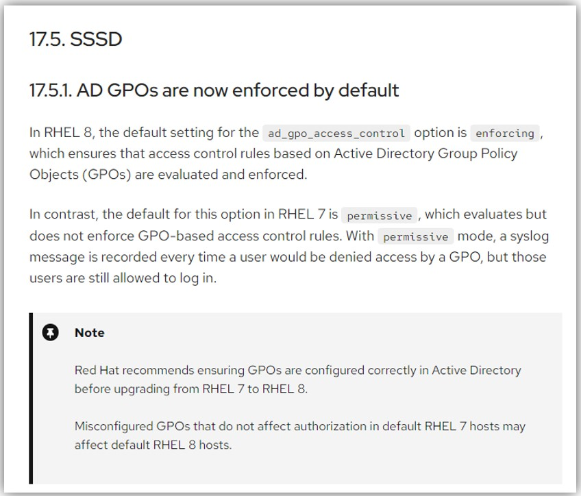

- 参考URL
  - https://tech-mmmm.blogspot.com/2022/02/rhel-8sssdactive-directory.html
  - https://access.redhat.com/documentation/ja-jp/red_hat_enterprise_linux/8/html-single/integrating_rhel_systems_directly_with_windows_active_directory/index

### ■ SSSDの設定
- RHEL8では`realm`コマンドでドメイン参加後`/etc/sssd/sssd.conf`の`[domain/<ドメイン名>]`ブロックの下に以下を追加する必要がある
  - `ad_gpo_access_control=permissive`
- 上記の設定がないと以下それぞれのログから下記のようなエラーが出る
  - `/var/log/sssd/sssd_<ドメイン名>.log`
    ~~~
    GPO-based access control failed.
    ~~~
  - `/var/log/secure`
    ~~~
    sshd[3497]: pam_sss(sshd:auth): authentication success; logname= uid=0 euid=0 tty=ssh ruser= rhost=10.10.10.10 user=ADUSER@ad.domain
    sshd[3497]: pam_sss(sshd:account): Access denied for user ADUSER@ad.domain: 4 (System error)
    sshd[3497]: Failed password for ADUSER@ad.domain from 10.10.10.10 port 57949 ssh2
    sshd[3497]: fatal: Access denied for user ADUSER@ad.domain by PAM account configuration [preauth]
    ~~~
- `ad_gpo_access_control`のdefault値がRHEL7では`permissive`からRHEL8では`enforcing`に変わった
  

### ■ `GPO-based access control failed`エラーについて
- 以下Chat-GPTからの回答
  > 「GPO-based access control failed」というエラーメッセージは、Active Directory (AD) のグループポリシーオブジェクト (GPO) ベースのアクセス制御が失敗したことを示しています。
  > 
  > Active Directoryにはグループポリシーオブジェクト（GPO）という機能があり、これによりネットワーク内のユーザーやコンピューターに対するポリシーを一元管理することが可能です。SSSD (System Security Services Daemon)は、GPOの情報を使用して、Active DirectoryユーザーのLinuxシステムへのアクセス制御を行います。
  >
  > エラーメッセージが示しているのは、GPOに基づいてSSSDがこのアクセス制御を試みたものの、何らかの理由で失敗したことです。この原因は多岐にわたる可能性があり、ネットワーク接続の問題、Active Directoryとの同期の問題、GPOの設定自体の問題などが考えられます。
  > 
  > エラーメッセージから判断すると、SSSDがGPOベースのアクセス制御を行おうとしたが失敗したようです。したがって、その原因を解明するためには、まずネットワーク接続とActive DirectoryのGPO設定を確認することをお勧めします。また、sssd.confのad_gpo_access_controlがenforcingに設定されている場合、それをpermissiveに変更してエラーが続くかどうか確認することも考慮すると良いでしょう。ただし、これは一時的な対策であり、本来はGPOの問題を修正する必要があります。

### ■ `/etc/sssd/sssd.conf`内の`ad_gpo_access_control`オプションについて
- 以下Chat-GPTからの回答
  > `ad_gpo_access_control`オプションは、SSSDがAD GPOをどのように解釈するかを制御します。以下に設定値の一覧とその説明を示します：
  > - `disabled`
  >   - GPOベースのアクセス制御は無効化されます。つまり、GPOは無視されます。
  > - `enforcing`
  >   - GPOベースのアクセス制御が強制されます。この設定の場合、GPOの評価が失敗するとユーザーはアクセスを拒否されます。
  > - `permissive`
  >   - GPOベースのアクセス制御は有効化されますが、評価が失敗してもユーザーのアクセスは許可されます。失敗はログに記録されます。

