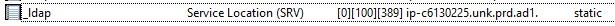
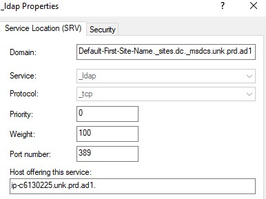

- https://blogs.manageengine.jp/about_activedirectory/
- https://blogs.manageengine.jp/needs_of_ad/

- **ADの認証先はSRVレコードで決まる**
  > Active Directory の認証先は、SRV レコードによって決まります。SRV レコードは、サービスロケーションレコードの略で、ドメインネームサービス (DNS) に登録されているレコードです。SRV レコードには、サービスの種類、名前、優先度、重みなどの情報が含まれています。
  > 
  > Active Directory では、クライアントがドメインコントローラーに接続する際に、SRV レコードを使用してドメインコントローラーの場所を検索します。SRV レコードには、ドメインコントローラーのホスト名、ポート番号、優先度、重みなどの情報が含まれています。クライアントは、優先度の高いドメインコントローラーから順に接続を試みます。
  >
  > SRV レコードが正しく設定されていないと、クライアントはドメインコントローラーに接続できず、Active Directory にログオンできません。

## LinuxサーバでのAD認証の流れ
> 1. **DNS SRV レコードの問い合わせ**
> Linux サーバーが Active Directory への参加を試みる際には、まず Active Directory Domain Controllers (AD DC) を見つけるために DNS SRV レコードを問い合わせます。これは、"_ldap._tcp.dc._msdcs.ドメイン名" という形式の SRV レコードに対する問い合わせを行い、対応する AD DC のアドレスを得る操作です。
>
> 2. **LDAP 接続**
> 次に、Linux サーバーは得られた AD DC のアドレスに対して LDAP (Lightweight Directory Access Protocol) 経由で接続を試みます。これにより、AD DC との通信が確立されます。
> 
> 3. **Kerberos 認証**
> 通信が確立されると、次に Kerberos 認証が行われます。Linux サーバーは自身の資格情報（ユーザー名とパスワード）を使って、AD DC に対して認証トークンを要求します。これは、AS-REQ（Authentication Service Request）と呼ばれる要求で、Linux サーバーが「クライアント」と、AD DC が「認証サーバー」の役割を担います。
> 
> 4. **TGT 受信**
> AD DC（認証サーバー）は、AS-REQ を受け取ると、ユーザーの資格情報を検証します。これが正当であれば、TGT（Ticket-Granting Ticket）と呼ばれるチケットを生成し、クライアントに対してこれを返します。このチケットには、クライアントの ID、チケットの有効期間、そして一意のセッションキーが含まれます。
> 
> 5. **サービスチケットの要求**
> TGT を受け取ったクライアントは、このチケットを使って、AD DC からサービスチケットを要求します。これは、TGS-REQ（Ticket-Granting Service Request）と呼ばれる要求で、クライアントは TGT とともに、アクセスを試みるサービス（リソース）の ID を AD DC に送信します。
> 
> 6. **サービスチケットの受信と使用**
> AD DC は TGS-REQ を受け取り、クライアントがアクセスを試みているサービスの ID を確認します。リソースへのアクセスが許可されると、AD DC はサービスチケットを生成し、クライアントに対してこれを返します。クライアントはこのサービスチケットを使ってリソースにアクセスします。
> 
> この流れは、Kerberos 認証の基本的な概念であり、Windows AD を使ったシステムの認証プロセスの中核をなしています。このプロセスにより、Linux サーバーは AD の一部となり、ユーザーの資格情報の管理やリソースへのアクセス制御が一元化されます。

## `_ldap._tcp.dc._msdcs.ドメイン名`と`_ldap._tcp.ドメイン名`の違いについて
> - **"_ldap._tcp.dc._msdcs.ドメイン名"**:
この SRV レコードは、LDAP (Lightweight Directory Access Protocol) を使用して通信する Domain Controller を見つけるために使用されます。"dc" は Domain Controller を指し、"msdcs" は Microsoft's implementation of Service Location records in DNS を指します。つまり、このレコードは、ドメインコントローラーへの接続情報を提供します。
> 
> - **"_ldap._tcp.ドメイン名"**:
この SRV レコードは、LDAP サービスが提供されている場所を見つけるために一般的に使用されます。具体的な役割や使用するサーバーは特定されていません。ドメイン内のどのサーバーでも、LDAP サービスを提供していれば応答することが可能です。
> 
> したがって、"_ldap._tcp.dc._msdcs.ドメイン名"はActive Directoryの環境では特に重要で、Active Directoryのドメインコントローラーを特定し、接続情報を提供する役割を持っています。一方、"_ldap._tcp.ドメイン名"はより一般的なLDAPサービスの位置を指定するために使用されます。

- 実際のSRVレコードの例
  
  