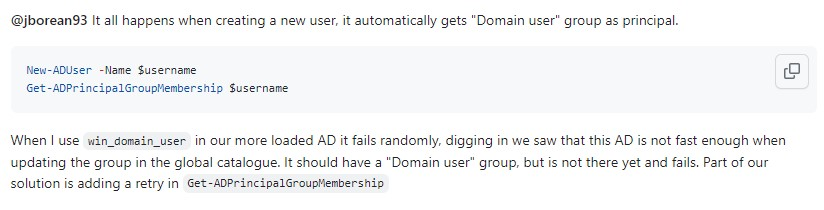

## `win_domain_user`でADドメインユーザ作成時にランダムに(一部のユーザ)が`Directory object not found`エラーになる
- ADドメインユーザ作成時に`Domain user`グループにユーザを追加するが、ユーザ追加後ADがユーザの追加を認識する前にグループにユーザを追加しようとしてエラーになるっぽい
- 対策として以下のようにユーザ追加の`failed_when: false`にして、エラーになる場合はリトライするようにする
  ~~~
  - name: Create user({{ item }})
    win_domain_user:
      name: "{{ item }}"
      password: "初期パスワード"
      password_expired: yes
      state: present
      path: "{{ AD_DOMAIN_PATH }}"
      domain_username: "{{ AD_ADMIN }}"
      domain_password: "{{ DOMAIN_PW }}"
      domain_server: "{{ AD_SERVER }}"
    failed_when: false
    register: create_ad_user_result

  - name: Sleep 5s before retry creating AD user
    pause:
      seconds: 5
    when: "'Directory object not found' in create_ad_user_result.msg"

  - name: Retry Creating user({{ item }})
    win_domain_user:
      name: "{{ item }}"
      password: "初期パスワード"
      password_expired: yes
      state: present
      path: "{{ AD_DOMAIN_PATH }}"
      domain_username: "{{ AD_ADMIN }}"
      domain_password: "{{ DOMAIN_PW }}"
      domain_server: "{{ AD_SERVER }}"
    when: "'Directory object not found' in create_ad_user_result.msg"
  ~~~
- エラーメッセージ (一部)
  - `+ CategoryInfo : ObjectNotFound: (P182708:ADPrincipal) [Get-ADPrincipalGroupMembership], ADIdentityNotFoundException`
  - `+ FullyQualifiedErrorId : ActiveDirectoryCmdlet:Microsoft.ActiveDirectory.Management.ADIdentityNotFoundException,Microsoft.ActiveDirectory.Management.Commands.GetADPrincipalGroupMembership`
- 参考URL
  - https://github.com/ansible/ansible/pull/54334  
    