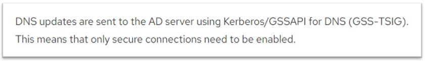
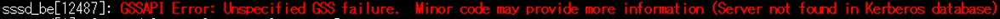
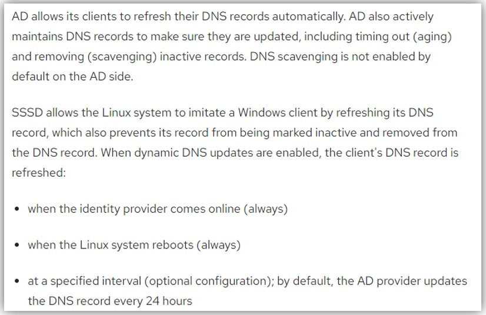
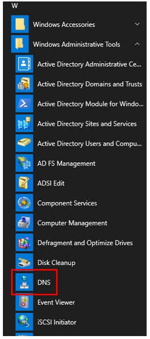
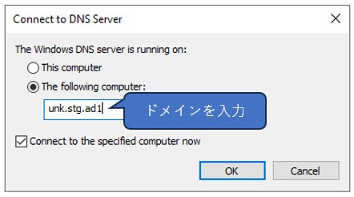
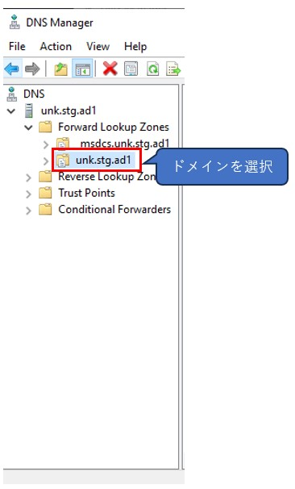
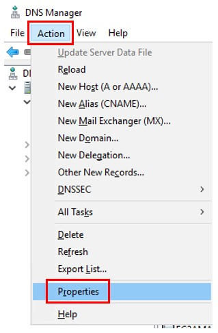
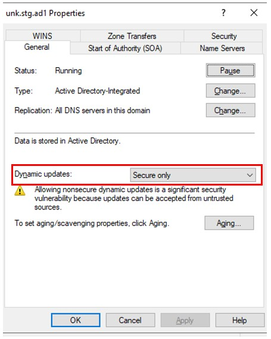
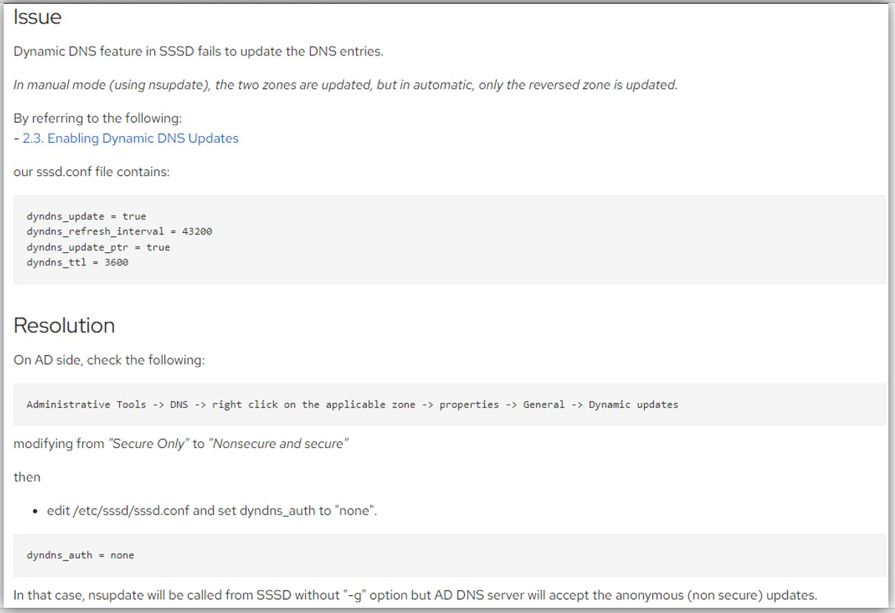

## ■ SSSDの`tkey query failed: GSSAPI error: Major = Unspecified GSS failure.  Minor code may provide more information, Minor = Server not found in Kerberos database.`エラーについて
### 事象
- ADドメインユーザで問題なくLinuxサーバにログイン/rootへスイッチはできているけど、sssdのjournalから以下のエラーが出ていた
  ~~~
  sssd[770030]:tkey query failed: GSSAPI error: Major = Unspecified GSS failure.  Minor code may provide more information, Minor = Server not found in Kerberos database.
  ~~~
- `/var/log/sssd/sssd_<ドメイン名>.log`に以下のDynamic DNS失敗にログも出ていた
  ~~~
  [be_nsupdate_done] (0x0040): nsupdate child execution failed [1432158240]: Dynamic DNS update failed
  [ad_dyndns_sdap_update_done] (0x0040): Dynamic DNS update failed [1432158240]: Dynamic DNS update failed
  [be_ptask_done] (0x0040): Task [Dyndns update]: failed with [1432158240]: Dynamic DNS update failed
  ~~~
- sssdのjournalは`journalctl [-f] -u sssd`で確認できる

### 原因
- Dynamic DNSでDNS UpdateがGSSAPIを使ってADに送られ、何らかの理由(対象クライアントサーバがADのKerberosデータベースにない？)でDNS更新に失敗したため  
  
- 認証でエラーが出ているわけではなく、DNS Upateで出ているので認証は問題なくできていると思われる
  - 認証ができない時のSSSDのメッセージは出方が若干違う  
    
- DNS update failedエラーと同じタイミングでGSSAPI errorエラーも出た
- 参考URL
  - https://access.redhat.com/documentation/en-us/red_hat_enterprise_linux/7/html/windows_integration_guide/sssd-dyndns

### 対策
- 認証でエラーが出ているわけではなく、DNS Upateで出ている(+ADドメインユーザで認証もできている)ため、エラーを無視するか、`/etc/sssd/sssd.conf`の`[domain/<ドメイン名>]`ブロックで`dyndns_update = false`設定を追加する(SSSDの再起動が必要)
  - サーバ構築後IPアドレスやホスト名が変わることは基本ないと思うけど、もし変わった場合は一度ドメインを抜けて、再度ドメイン参加すれば問題ないはず
- 参考URL
  - https://access.redhat.com/solutions/5529661
  - https://learn.microsoft.com/en-us/archive/blogs/jeffbutte/265
  - https://access.redhat.com/documentation/en-us/red_hat_enterprise_linux/8/html/integrating_rhel_systems_directly_with_windows_active_directory/connecting-rhel-systems-directly-to-ad-using-sssd_integrating-rhel-systems-directly-with-active-directory#proc_modifying-dynamic-dns-settings-for-the-ad-provider_connecting-rhel-systems-directly-to-ad-using-sssd
  - https://access.redhat.com/solutions/3905181
  - https://access.redhat.com/discussions/1355693
  - https://access.redhat.com/documentation/en-us/red_hat_enterprise_linux/7/html/windows_integration_guide/sssd-dyndns

#### ■ Dynamic DNSとは
- ADドメインに参加しているクライアントが自分自身のDNSレコードを更新できるようにする仕組み  
  
- defaultではAD側でDnyamic DNS Updateは`Secure only`で設定されている
- ADのDNSでの確認方法  
    
    
    
    
    
- AD側で`Secure only`を`Nonsecure and secure`に変えて、SSSD側`/etc/sssd/sssd.conf`で`dyndns_auth = none`に設定すればDynamic DNS Upateできる？  
  
- 参考URL
  - https://access.redhat.com/documentation/en-us/red_hat_enterprise_linux/7/html/windows_integration_guide/sssd-dyndns

#### ■ GSSAPIとは
- 以下Chat-GPTからの回答
  > GSS（Generic Security Services API）は、セキュリティサービスを提供するためのAPIの一般的なインターフェースを定義するものです。GSS-APIは、アプリケーションがセキュリティメカニズムの詳細を知らずに認証、完全性保証、および機密性保証を実現できるようにすることを目的としています。
  >
  >主な特徴として：
  >
  >1. **メカニズムに依存しない**: GSS-APIはセキュリティメカニズムに中立なインターフェースを提供します。これにより、アプリケーションは具体的なセキュリティメカニズムの詳細を気にせずに動作することができます。
  >
  >2. **柔軟性**: 新しいセキュリティメカニズムが開発された場合、それをサポートするGSS-APIの実装を追加するだけで、既存のアプリケーションがそのメカニズムを使用できるようになります。
  >
  >3. **多機能**: GSS-APIは、認証、データの完全性、および機密性のサービスをサポートしています。
  >
  >Kerberosは、GSS-APIを通じて利用される多くのセキュリティメカニズムの1つです。実際、多くのアプリケーションやプロトコル（例：NFS、SSH）は、Kerberos認証をGSS-API経由で実装しています。
  >
  >簡潔に言えば、GSS-APIは、異なるセキュリティメカニズムを使用してアプリケーションをセキュアにするための標準化されたインターフェースを提供するものです。