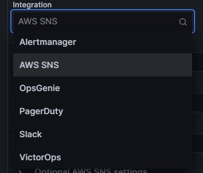

- Organizationは使えない（メニューから表示されない）
- AlertのIntegration種類もOSSより少ない（その代わりにOSSにはないSNSが使える）  
  
- Managed GrafanaをVPCとつなげるとCloudWatchやX-RayなどAWSマネージドサービスにVPC EndPointからのアクセス
  - `*.monitoring`
  - `*.logs`
  - `*.x-rays`
- Managed Grafana Workspaceを作成すると`AmazonGrafanaServiceRole-***`のIAM Roleが作成されるので、クロスアカウント

## Amazon Managed Grafanaの制限
- Editorユーザを定義する`エディタロール値`には(カンマ区切りで)20個までしか定義できない
  - つまりEditorユーザは20個までしか作れない
- Alertは100個までしか設定できない（Hard Limit）
- 一部使えないPluginがある（そもそもPluginsページで「State: All」を選べない）
  - 以下確認済みの使えないPluginsリスト
    - ploystat
    - OnCall