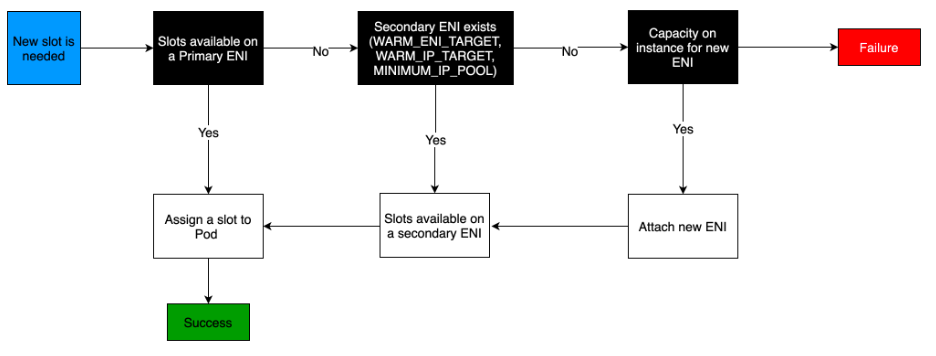

- **https://docs.aws.amazon.com/eks/latest/best-practices/vpc-cni.html**



- **https://aws.amazon.com/jp/blogs/containers/amazon-vpc-cni-increases-pods-per-node-limits/**
- https://www.eksworkshop.com/docs/networking/vpc-cni/
- `aws-node`というDaemonSet PodがVPC CNIプラグイン
- VPC CNIは**Underlay Network**を使用
- VPC CNIのGithub(**定期的に読むこと！**)
  - **https://github.com/aws/amazon-vpc-cni-k8s/blob/master/docs/cni-proposal.md**

## VPC CNIの特徴
- 各Podに対して、VPC内のセカンダリIPアドレスが直接割り当てられる。
- PodはVPC内で他のリソースと直接通信できる。
- PodはVPCのルーティングテーブルに従ってトラフィックをルーティングする。

## VPC CNIプラグインの動作の流れ
1. ワーカーノードごとにElastic Network Interface (ENI) を割り当てます。各ENIには、VPC内のセカンダリIPアドレスの範囲が割り当てられる。
2. 新しいPodが作成されると、VPC CNIプラグインはそのPodに対して、割り当て済みのENIからセカンダリIPアドレスを割り当てる。つまり、PodごとにENIを割り当てるのではなく、ENIに割り当てられたセカンダリIPアドレスの中からPodにIPアドレスを割り当てる。
3. Podが削除されると、割り当てられていたセカンダリIPアドレスが解放され、他のPodで再利用可能になる。
4. 割り当て可能なセカンダリIPアドレスが不足してきた場合、VPC CNIプラグインは自動的に新しいENIをワーカーノードに割り当て、セカンダリIPアドレスのプールを拡張する。
#### 1つのENIに割り当てることができるセカンダリIPの数
- ENIに割り当てることができるプライマリIPアドレスは1つだけだが、**追加のセカンダリIPアドレスは複数割り当てることが可能**。
- 1つのENIに割り当て可能なセカンダリIPアドレス数は、ENIが属するインスタンスのタイプによって決まる(異なる)。

## EKSでPodが作成される時にVPC CNIによって実施される処理の流れ
- https://github.com/aws/amazon-vpc-cni-k8s/blob/master/docs/cni-proposal.md#cni-plugin-sequence
1. (ワーカーノード上に)新しいnetwork namespaceを作成する
2. Get a Secondary IP address assigned to the instance by L-IPAMD
3. Create a veth pair and have one veth on host namespace and one veth on Pod's namespace
  ```
  ip link add veth-1 type veth peer name veth-1c  /* on host namespace */
  ip link set veth-1c netns ns1  /* move veth-1c to Pod's namespace ns1 */
  ip link set veth-1 up /* bring up veth-1 */
  ip netns exec ns1 ip link set veth-1c up /* bring up veth-1c */
  ```
4. Perform following inside Pod's name space
   - Assign the IP address to Pod's eth0
   - Add default gateway and default route to Pod's route table
   - Add a static ARP entry for default gateway
   ```
    /* To assign IP address 20.0.49.215 to Pod's namespace ns1 */
    ip netns exec ns1 ip addr add 20.0.49.215/32 dev veth-1c /* assign a IP address to veth-1c */
    ip netns exec ns1 ip route add 169.254.1.1 dev veth-1c /* add default gateway */ 
    ip netns exec ns1 ip route add default via 169.254.1.1 dev veth-1c /* add default route */

    ip netns exec ns1 arp -i veth-1c -s 169.254.1.1 <veth-1's mac> /* add static ARP entry for default gateway */
   ```
5. On host side, add host route and routing rule so that incoming Pod's traffic can be routed to Pod.

## podからExternalへの通信でパケットをSNATさせるiptablesルールの確認方法
1. 以下コマンドでnatテーブルのPOSTROUTINGチェーンのルールを確認
   - `iptables -t nat -L POSTROUTING -nv --line-numbers`
   - 出力例
     ```
     Chain POSTROUTING (policy ACCEPT 226 packets, 14449 bytes)
     num   pkts bytes target            prot opt in     out     source               destination
     1    66643 4206K KUBE-POSTROUTING  all  --  *      *       0.0.0.0/0            0.0.0.0/0            /* kubernetes postrouting rules */
     2    66558 4199K AWS-SNAT-CHAIN-0  all  --  *      *       0.0.0.0/0            0.0.0.0/0            /* AWS SNAT CHAIN */
     ```
      - `num`: ルール番号
      - `pkts`: このルールにマッチしたパケットの数
      - `bytes`: このルールにマッチしたパケットのサイズの合計
      - `prot`: プロトコル。`all`はすべてのプロトコル
      - `opt`: オプション。`--`は指定されたオプションがないということ
      - `in`: 入力インタフェース。`*`はすべてのインタフェースが対象であることを意味する。
      - `out`: 出力インタフェース。`*`はすべてのインタフェースが対象であることを意味する。
      - `source`: 送信元IPアドレス。`0.0.0.0/0`はすべてのIPアドレス(送信元)が対象であることを意味する。
      - `destination`: 宛先IPアドレス。`0.0.0.0/0`はすべてのIPアドレス(宛先)が対象であることを意味する。
2. 1.で出力された`AWS-SNAT-CHAIN-*`チェーンのルールを確認する
   - `iptables -t nat -L AWS-SNAT-CHAIN-0 -nv --line-numbers` 
   - 出力例
     ```
     Chain AWS-SNAT-CHAIN-0 (1 references)
     num   pkts bytes target            prot opt in     out     source               destination
     1    64059 3960K AWS-SNAT-CHAIN-1  all  --  *      *       0.0.0.0/0           !10.111.0.0/16        /* AWS SNAT CHAIN */
     ```
3. さらに2.で出力された`AWS-SNAT-CHAIN-*`チェーンのルールを確認する
   - `iptables -t nat -L AWS-SNAT-CHAIN-1 -nv --line-numbers`
   - 出力例
     ```
     Chain AWS-SNAT-CHAIN-1 (1 references)
     num   pkts bytes target     prot opt in     out     source               destination
     1    42159 2646K SNAT       all  --  *      !vlan+  0.0.0.0/0            0.0.0.0/0            /* AWS, SNAT */ ADDRTYPE match dst-type !LOCAL to:10.111.0.249 random-fully
     ```
     - `ADDRTYPE match dst-type !LOCAL`: 宛先アドレスタイプがLOCALでないパケットにマッチ
     - `to:10.111.0.249`: マッチしたパケットの送信元IPアドレスを10.111.0.249に変換(SNAT)する
     - `random-fully`: 各パケットに対して独立したランダムなポートマッピングを使用することを意味する

## Pod間通信、PodからExternalへの通信フロー
- Pod間通信
  - https://github.com/aws/amazon-vpc-cni-k8s/blob/master/docs/cni-proposal.md#pod-to-pod-communication
  
    - **ワーカーノード側のvethとワーカーノード上のethは同じNetwork namespace(root namespace)上に存在するため、同じルーティングテーブルに戻づいてパケットの転送が行われる**
  - https://github.com/aws/amazon-vpc-cni-k8s/blob/master/docs/cni-proposal.md#life-of-a-pod-to-pod-ping-packet
  
- PodからExternalへの通信
  - https://github.com/aws/amazon-vpc-cni-k8s/blob/master/docs/cni-proposal.md#pod-to-external-communications
  