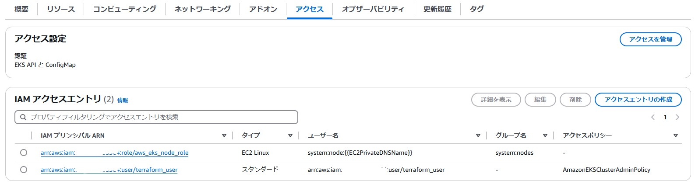
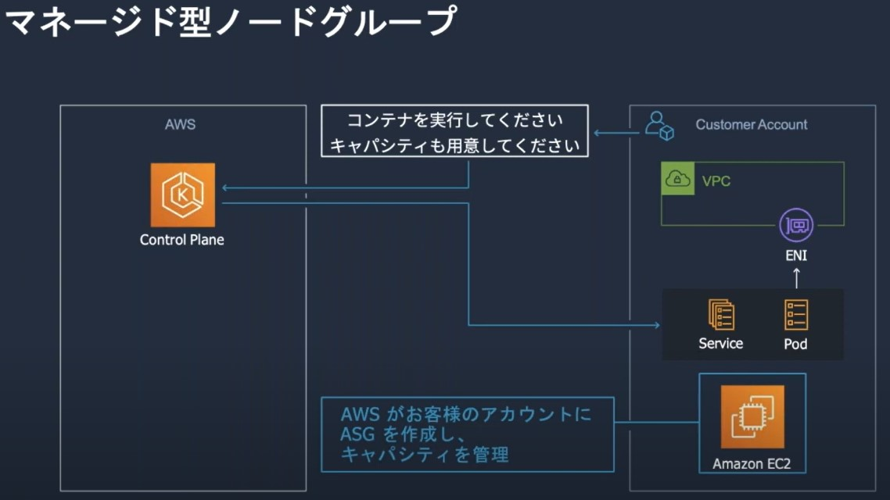

- Terraformで指定するAMIリリースバージョンは以下のサイトから確認できる
  - https://github.com/awslabs/amazon-eks-ami/blob/master/CHANGELOG.md

# TerraformでクロスアカウントのEKSクラスターを作成した時、kubectlを打てるようにする方法

## *Update!* EKS APIでの設定方法
- https://dev.classmethod.jp/articles/eks-access-management-with-iam-access-entry/
- `aws eks list-access-entries --cluster-name <EKS Cluster名>`でEKSクラスターを操作できるIAMプリンシパルを確認できる
  - EKS Clusterのauthentication modeが`API`か`API_AND_CONFIG_MAP`になっている必要がある
    - Terraformでは`aws_eks_cluster`リソースの`access_config`でブロックで設定できる
      - https://registry.terraform.io/providers/hashicorp/aws/latest/docs/resources/eks_cluster#access_config
- マネコンからも「アクセス」タブの「IAM アクセスエントリ」でEKS操作権限とマッピングされているIAMプリンシパルを確認できる  
  
  - 「アクセスエントリの作成」からIAMプリンシパルを追加できる
    - Terraformでは`aws_eks_access_entry`と`aws_eks_access_policy_association`リソースで追加できる
      - https://registry.terraform.io/providers/hashicorp/aws/latest/docs/data-sources/eks_access_entry
      - https://registry.terraform.io/providers/hashicorp/aws/latest/docs/resources/eks_access_policy_association

## ConfigMap（aws-auth）での設定方法
- EKSクラスターはデフォルトでは作成したIAMエンティティしかkubectlで操作できない
  - https://docs.aws.amazon.com/ja_jp/eks/latest/userguide/security-iam-id-based-policy-examples.html
- `kube-system`ネームスペースの`aws-auth`という`ConfigMap`にて`mapRoles`でEKSクラスターを作成したIAMプリンシパルが設定されている
- `kubectl`がインストールされているサーバで以下コマンドを実行し新しいクラスターを登録する（`~/.kube/config`が更新される）
  ~~~
  aws eks update-kubeconfig --region ap-northeast-1 --name <EKSクラスター名>
  ~~~
- aws cliでEKSクラスターを構築した(EKSクラスター所有者)で一時的な認証情報を取得する
  ~~~
  aws sts assume-role --role-arn "arn:aws:iam::<EKSクラスターがあるAWSアカウントID>:role/<EKSクラスター所有者Role>" --role-session-name EKS-session
  ~~~
  **※`arn:aws:iam::<EKSクラスターがあるAWSアカウントID>:role/<EKSクラスター所有者Role>`はTerraformでST環境のEKSを作成する時に使用したIAMロール**
- 表示される「**AccessKeyId**」と「**SecretAccessKey**」と「**SessionToken**」の値を以下の環境変数として設定する  
※これでkube-apiserverへの認証が通るようになる
  ~~~
  export AWS_ACCESS_KEY_ID=<AccessKeyIdの値>
  export AWS_SECRET_ACCESS_KEY=<SecretAccessKeyの値>
  export AWS_SESSION_TOKEN=<SessionTokenの値>
  ~~~
- `kubectl edit cm -n kube-system aws-auth`コマンドで`mapRoles: |`の下に以下内容を追加
  ~~~yaml
  - groups:
    - system:masters
    rolearn: arn:aws:iam::<EKSクラスターがあるAWSアカウントID>:role/<kubectlを実行しているEC2にアタッチされているIAMロール名>
    username: masteruser
  ~~~

# Worker Node（Data Plane）について
- **https://www.youtube.com/watch?v=WzCxHW0wNBo**
  - https://pages.awscloud.com/rs/112-TZM-766/images/202110_AWS_Black_Belt_Containers222_EKS_DataPlane.pdf
- EC2インスタンスを使うタイプとして「セルフマネージド型ノード」、「マネージドノードグループ」、「Auto Mode」の3つのタイプがある

  - https://www.youtube.com/watch?v=JT9aV27FixI&t=1288s
- AMIはEKS Optimized(最適化) AMIを利用
  - https://docs.aws.amazon.com/ja_jp/eks/latest/userguide/eks-optimized-ami.html

## セルフマネージド型ノード
- 利用者がAuto Scaling Group（EC2インスタンス）を作成/管理する
  - EC2作成後、Controll Plane（Master Node）への登録作業も必要
- kubeletの更新方法を細かく制御できる
- ノード追加/終了時のPodの退避などのライフサイクルフックも利用者側で設定する必要がある
  - https://note.jpn.pioneer/n/n29ae2990c1eb

## マネージド型ノードグループ
- EKSがAuto Scaling Group（EC2インスタンス）を作成して管理してくれる
  - ASGの設定にはライフサイクルフックが標準設定されている
- 基本的にはマネージド型ノードグループを使うこと
- Terraformの`aws_eks_node_group`リソースで作成

## Auto Mode
- 2024年12月に発表された新機能
- https://aws.amazon.com/jp/blogs/news/getting-started-with-amazon-eks-auto-mode/  
  > Amazon EKS Auto Mode は、インフラストラクチャの自動プロビジョニング、最適なコンピューティングインスタンスの選択、リソースの動的スケーリング、コスト最適化のために継続的なコンピューティングの最適化、オペレーティングシステム (OS) のパッチ適用、AWS セキュリティサービスとの統合により、Kubernetes クラスター管理を効率化します。有効にすると、EKS Auto Mode は AWS のベストプラクティスに基づいてクラスター機能を設定し、アプリケーションのデプロイに最適な状態でクラスターを準備します。
- Terraform構築時の注意点
  - https://registry.terraform.io/providers/hashicorp/aws/latest/docs/resources/eks_cluster#eks-cluster-with-eks-auto-mode