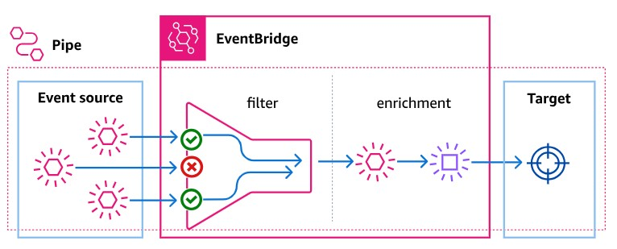

# EventBridge Pipeとは
- https://docs.aws.amazon.com/ja_jp/eventbridge/latest/userguide/eb-pipes.html  
  
- Source、Filtering、Enrichment、Targetの4つのコンポーネントから構成される
- イベントを受信し、フィルタリングや変換を行い、最終的なターゲットに送信する
- SourceにはSQSやKinesis、Kafkaなどを指定できる
- TargetにはAPI GatewayやLambda、Step Functionsなどを指定できる
- **EventBridge PipesはTargetに指定したサービスの呼び出しに成功したらSourceからのイベント（e.g. SQSメッセージ）を削除する。そのため、Targetより先の処理に失敗した場合のリトライは行われない**
  - 例えば、TargetにECSを指定した場合、ECSの呼び出しに成功したら、その時点でEventBridge Pipesは成功として見なされ、ECS Taskの結果は確認せず、SQSからメッセージを削除する
  - そのため、Targetの呼び出し先の実行結果に応じて処理を分岐させたい場合は、TargetにStep Functionsを指定して、Step Functions側で処理の結果に応じた分岐を行う必要がある

---

# SourceにSQSを指定した場合の挙動
- https://docs.aws.amazon.com/ja_jp/eventbridge/latest/userguide/eb-pipes-sqs.html  
> パイプがメッセージの処理に何回も失敗する場合、Amazon SQS はこのメッセージをデッドレターキューに送信できます。パイプがエラーを返すと、EventBridge はそのメッセージをキューで保持します。可視性タイムアウトが発生すると、EventBridge はメッセージをもう一度受信します。多数の受信後に 2 番目のキューにメッセージを送信するには、ソースキューにデッドレターキューを設定します。  

> [!NOTE]  
> **パイプではなく、ソースキューのデッドレターキューを設定するようにしてください。** パイプで設定したデッドレターキューは、ソースキューではなく、パイプの非同期呼び出しキューに使用されます。

---

# SourceにSQSを指定する場合の注意点
##### ■ SQSのメッセージをKMSで暗号化している場合、PipeのIAM RoleにKMSの権限も付与する必要がある
- `kms:Decrypt`と`kms:GenerateDataKey`の権限が必要

---

# Step FunctionsからECS Run Taskするときの注意点
### 1. NetworkConfigurationの指定
- https://zenn.dev/mn87/articles/982434a01190f4
- 以下のようなエラーが出る  
  ```shell
  Network Configuration must be provided when networkMode 'awsvpc' is specified.
  ```
- **ECSのTask Definitionで`networkMode`を`awsvpc`に設定している場合、Step FunctionsのState MachineでECS Taskを起動する際に、`NetworkConfiguration`を指定する必要がある**
---

### 2. ECS Task処理失敗時のリトライ
- Step FunctionsのState Machineの定義で、`States`の中の`Resource`に `arn:aws:states:::ecs:runTask`を指定している場合、`Retry`で `ErrorEquals: States.TaskFailed`が指定されていても、 ECS Taskが異常終了したとき、Step Functionsのタスクは正常終了扱いになり、リトライされない
- ECS Task異常終了時、リトライさせたい場合は、**`States`の中の`Resource`に `arn:aws:states:::ecs:runTask.sync`を指定する必要がある**
- 例  
  ```json
  {
    "Comment": "A description of my state machine",
    "StartAt": "Run ECS Task and wait for it to complete",
    "States": {
      "Run ECS Task and wait for it to complete": {
        "Type": "Task",
        "Resource": "arn:aws:states:::ecs:runTask.sync", ★-→ ここ！
        "Parameters": {
          "LaunchType": "FARGATE",
          "Cluster": "arn:aws:ecs:ap-northeast-1:xxxxxx:cluster/dev-cluster",
          "TaskDefinition": "arn:aws:ecs:ap-northeast-1:xxxxxx:task-definition/dev-task-definition",
          "NetworkConfiguration": {
            "AwsvpcConfiguration": {
              "AssignPublicIp": "DISABLED",
              "SecurityGroups": [
                "sg-xxxxxxxxxxxxxx"
              ],
              "Subnets": [
                "subnet-xxxxxxxxxxxxxx",
                "subnet-xxxxxxxxxxxxxx"
              ]
            }
          },
          "Overrides": {
            "ContainerOverrides": [
              {
                "Name": "test",
                "Environment": [
                  {
                    "Name": "STEP_FUNCTIONS_INPUT",
                    "Value.$": "States.JsonToString($)"
                  }
                ]
              }
            ]
          },
          "PlatformVersion": "LATEST"
        },
        "Comment": "TestのためのECS Taskを実行",
        "Retry": [
          {
            "ErrorEquals": [
              "States.TaskFailed"
            ],
            "BackoffRate": 2,
            "IntervalSeconds": 60,
            "MaxAttempts": 3
          }
        ],
        "End": true
      }
    }
  }
  ```

# SQS → EventBridge Pipes → Step Functions → ECS Taskの例
- SQSメッセージごとに独立した(隔離された)ECS Taskを起動するためには、EventBridge PipeのSourceの設定で "**Batch size**"を `1`に設定する必要がある
- EventBridge PipeとECS Taskの間にStep Functionsを挟むことで、ECS Taskの起動や管理を柔軟に行うことができる
  - 例えば、ECS Task起動に失敗した場合のリトライや、ECS Taskの実行結果に応じた処理を追加することが可能
  - https://techblog.dt-dynamics.com/entry/2025/04/30/090734
- TargetにStep Functionsを指定する場合、**Standard Workflow**を**非同期的**に呼び出す必要がある
> [!NOTE]  
> For Step Functions state machines, Standard workflows must be invoked asynchronously.

## SQSメッセージをECS Taskに渡す方法
### 1. SQSメッセージをStep Functionsの入力として渡す
- Step FunctionsのState Machineを定義し、SQSメッセージをその入力として受け取る
- Step FunctionsのState Machine内でECS Taskを起動するステップで、`Parameters`の`Overrides`を使用して、SQSメッセージをECS Taskの環境変数として渡す
- 例えば、以下のようなState Machineを定義する  
  ```json
  {
    "Comment": "A description of my state machine",
    "StartAt": "Run AI Agent ECS Task",
    "States": {
      "Run AI Agent ECS Task": {
        "Type": "Task",
        "Resource": "arn:aws:states:::ecs:runTask",
        "Parameters": {
          "LaunchType": "FARGATE",
          "Cluster": "arn:aws:ecs:ap-northeast-1:xxxxxx:cluster/ecs-for-ai-agent",
          "TaskDefinition": "arn:aws:ecs:ap-northeast-1:xxxxxx:task-definition/ai-agent-task-definition:7",
          "NetworkConfiguration": {
            "AwsvpcConfiguration": {
              "AssignPublicIp": "DISABLED",
              "SecurityGroups": [
                "sg-xxxxxxx"
              ],
              "Subnets": [
                "subnet-xxxxxxx",
                "subnet-xxxxxxx"
              ]
            }
          },
          "Overrides": {
            "ContainerOverrides": [
              {
                "Name": "ai-agent-container", # Task Definitionで指定しているコンテナ名
                "Environment": [
                  {
                    "Name": "STEP_FUNCTIONS_INPUT",
                    "Value.$": "States.JsonToString($)" # States.JsonToStringを使用して、SQSメッセージを文字列に変換(これがないとエラーになる)
                  }
                ]
              }
            ]
          },
          "PlatformVersion": "LATEST"
        },
        "End": true,
        "Comment": "AI AgentのためのECS Taskを実行"
      }
    }
  }
  ```
  - 上記を利用するPythonコード例  
    ```python
    def main():

        step_functions_input = os.getenv('STEP_FUNCTIONS_INPUT') ## ★Step FunctionsのEnvironment.Nameで指定した値
        print(f"Step Functions Input: {step_functions_input}")
        input_data = json.loads(step_functions_input)

        # メッセージ本文を取得
        message_body = input_data[0]['body']
        # MessageAttributesを取得
        message_attributes = input_data[0].get('messageAttributes', {})

        # SQSメッセージから属性の取り出し
        system = message_attributes.get('system', {}).get('stringValue', None)
        environment = message_attributes.get('environment', {}).get('stringValue', None)
    ```
### 2. Step FunctionsのPassを使用する方法
- https://zenn.dev/hisamitsu/articles/1866a34c1314e8
- まだ、検証してないので、要確認