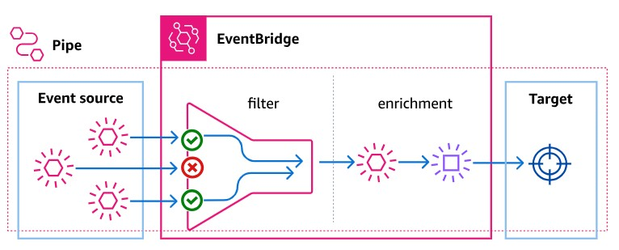

# EventBridge Pipeとは
- https://docs.aws.amazon.com/ja_jp/eventbridge/latest/userguide/eb-pipes.html  
  
- Source、Filtering、Enrichment、Targetの4つのコンポーネントから構成される
- イベントを受信し、フィルタリングや変換を行い、最終的なターゲットに送信する
- SourceにはSQSやKinesis、Kafkaなどを指定できる
- TargetにはAPI GatewayやLambda、Step Functionsなどを指定できる

---

# SourceにSQSを指定する場合の注意点
- SQSのメッセージをKMSで暗号化している場合、PipeのIAM RoleにKMSの権限も付与する必要がある
  - `kms:Decrypt`と`kms:GenerateDataKey`の権限が必要

---

# SQS → EventBridge Pipe → Step Functions → ECS Taskの例
- SQSメッセージごとに独立した(隔離された)ECS Taskを起動するためには、EventBridge PipeのSourceの設定で "**Batch size**"を `1`に設定する必要がある
- EventBridge PipeとECS Taskの間にStep Functionsを挟むことで、ECS Taskの起動や管理を柔軟に行うことができる
  - 例えば、ECS Task起動に失敗した場合のリトライや、ECS Taskの実行結果に応じた処理を追加することが可能
  - https://techblog.dt-dynamics.com/entry/2025/04/30/090734

## SQSメッセージをECS Taskに渡す方法
### 1. SQSメッセージをStep Functionsの入力として渡す
- Step FunctionsのState Machineを定義し、SQSメッセージをその入力として受け取る
- Step FunctionsのState Machine内でECS Taskを起動するステップで、`Parameters`の`Overrides`を使用して、SQSメッセージをECS Taskの環境変数として渡す
- 例えば、以下のようなState Machineを定義する  
  ```json
  {
    "Comment": "A description of my state machine",
    "StartAt": "Run AI Agent ECS Task",
    "States": {
      "Run AI Agent ECS Task": {
        "Type": "Task",
        "Resource": "arn:aws:states:::ecs:runTask",
        "Parameters": {
          "LaunchType": "FARGATE",
          "Cluster": "arn:aws:ecs:ap-northeast-1:xxxxxx:cluster/ecs-for-ai-agent",
          "TaskDefinition": "arn:aws:ecs:ap-northeast-1:xxxxxx:task-definition/ai-agent-task-definition:7",
          "NetworkConfiguration": {
            "AwsvpcConfiguration": {
              "AssignPublicIp": "DISABLED",
              "SecurityGroups": [
                "sg-xxxxxxx"
              ],
              "Subnets": [
                "subnet-xxxxxxx",
                "subnet-xxxxxxx"
              ]
            }
          },
          "Overrides": {
            "ContainerOverrides": [
              {
                "Name": "ai-agent-container", # Task Definitionで指定しているコンテナ名
                "Environment": [
                  {
                    "Name": "STEP_FUNCTIONS_INPUT",
                    "Value.$": "States.JsonToString($)" # States.JsonToStringを使用して、SQSメッセージを文字列に変換(これがないとエラーになる)
                  }
                ]
              }
            ]
          },
          "PlatformVersion": "LATEST"
        },
        "End": true,
        "Comment": "AI AgentのためのECS Taskを実行"
      }
    }
  }
  ```
  - 上記を利用するPythonコード例  
    ```python
    def main():

        step_functions_input = os.getenv('STEP_FUNCTIONS_INPUT') ## ★Step FunctionsのEnvironment.Nameで指定した値
        print(f"Step Functions Input: {step_functions_input}")
        input_data = json.loads(step_functions_input)

        # メッセージ本文を取得
        message_body = input_data[0]['body']
        # MessageAttributesを取得
        message_attributes = input_data[0].get('messageAttributes', {})

        # SQSメッセージから属性の取り出し
        system = message_attributes.get('system', {}).get('stringValue', None)
        environment = message_attributes.get('environment', {}).get('stringValue', None)
    ```