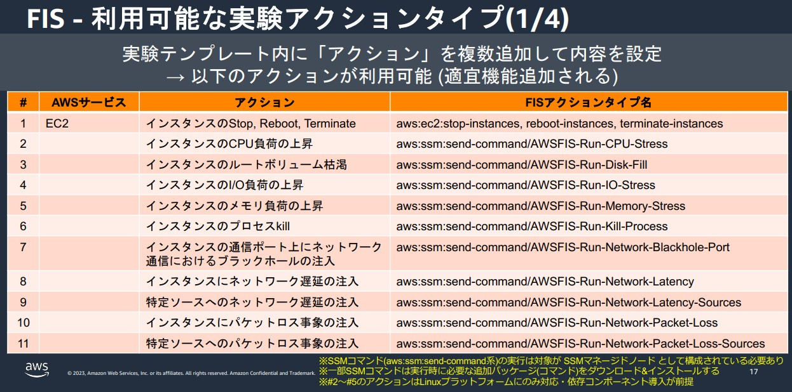
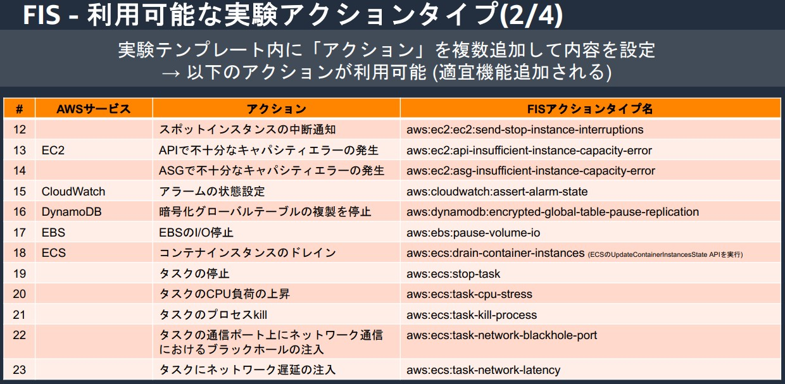
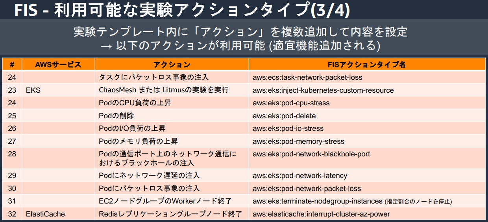
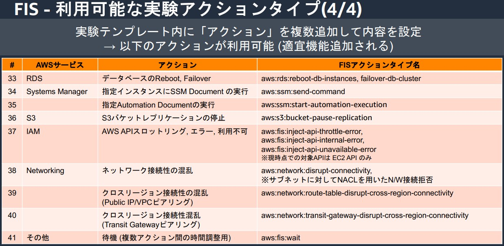

# 概要
- AWSのマネージド型Chaos Engineeringサービス
- 意図的に障害を発生させ、システムの回復力（リカバリ能力）やボトルネックの特定を行う
- 参考URL
  - https://pages.awscloud.com/rs/112-TZM-766/images/20231221_37th_ISV_DiveDeepSeminar_FIS.pdf

---

## 🎯 **FISの主な特徴**
1. **AWS リソースに対する障害試験の自動化**
   - Amazon EC2、ECS、RDS (Aurora)、EKS、S3 などの AWS サービスに対して **障害をシミュレート** できる。
   - 例: EC2 インスタンスの停止、CPU負荷増加、ECSタスクの停止など。

2. **事前定義されたテンプレートを活用**
   - 障害を起こすシナリオ（Experiment Template）を事前に設定し、**再現性のあるテスト** を実施可能。

3. **安全な実験**
   - **ストップ条件（Stop Condition）** を設定できるため、障害試験がシステム全体に影響を与えすぎないよう制御可能。
     - Amazon CloudWatchアラームとして定義したしきい値に達した場合に実験を停止する仕組み

4. **可視化とモニタリング**
   - **Amazon CloudWatchやAWS X-Rayとの統合** により、試験中のシステムの挙動を可視化可能。

---

## 🔧 **FISで実施できる障害試験**

---

## 🛠 **FISの利用方法**
### **1. Experiment Template（実験テンプレート）の作成**
- **どのリソースに対してどの障害を起こすか** を定義。

### **2. Stop Condition（ストップ条件）の設定**
- https://docs.aws.amazon.com/ja_jp/fis/latest/userguide/stop-conditions.html

### **3. 実験の実行**
- 設定したテンプレートをもとに障害試験を実施。
- CloudWatch などを活用しながら、システムの影響を監視。

### **4. システムの回復性を評価**
- **エラーハンドリングやオートスケーリングの挙動を確認**。
- 問題点を特定し、改善策を検討。
