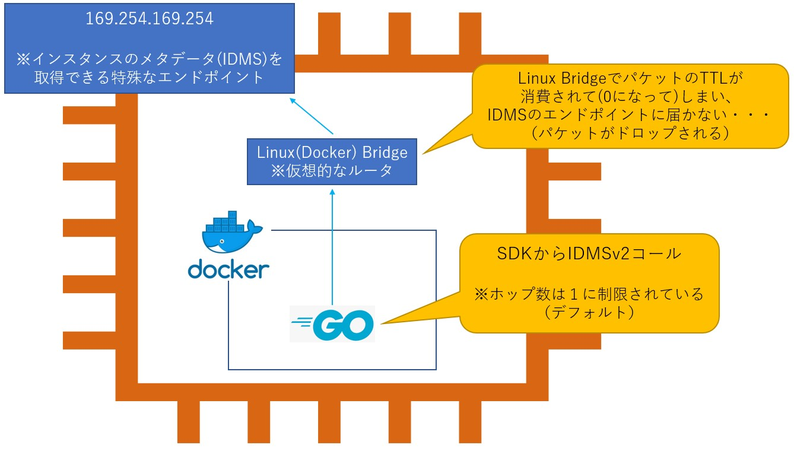
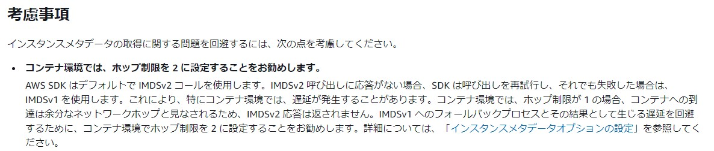

## IMDSとは
- Instance MetaData Serviceの略
- `169.254.169.254`のエンドポイントを持ち、AWSインスタンス内部からアクセス可能な特殊なエンドポイントで、インスタンスに関する情報(メタデータ)を取得できる
  - インスタンスID、AMI ID、IAMロール情報、ネットワーク設定など
- IMDSはv1とv2がある
- AWS SDKはデフォルトでv2が使われる
  - https://docs.aws.amazon.com/ja_jp/AWSEC2/latest/UserGuide/instancedata-data-retrieval.html
- **IMDSv2ではIMDSリクエストのHop数をデフォルトでは１に制限している。**
  - コンテナ(Docker単体/k8s Pod)からAWS SDKを使ってEC2にアタッチされているIAMロール(EC2 Metadata)から一時的な権限を取得して、AWSリソースを操作する時は、Linux BridgeでTTLが減らされてIMDSエンドポイントまでパケットが届かない  
    
  - 解決策としては以下２つくらい？
    1. Dockerコンテナ/k8s podがホストのネットワークを使うようにする
    2. インスタンスメタデータオプションでホップ数を引き上げる  
      
  - https://github.com/aws/aws-sdk-go/issues/2972