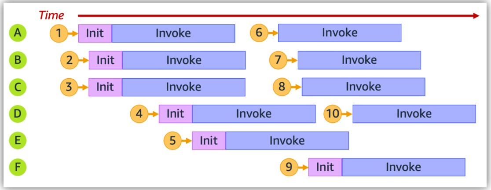
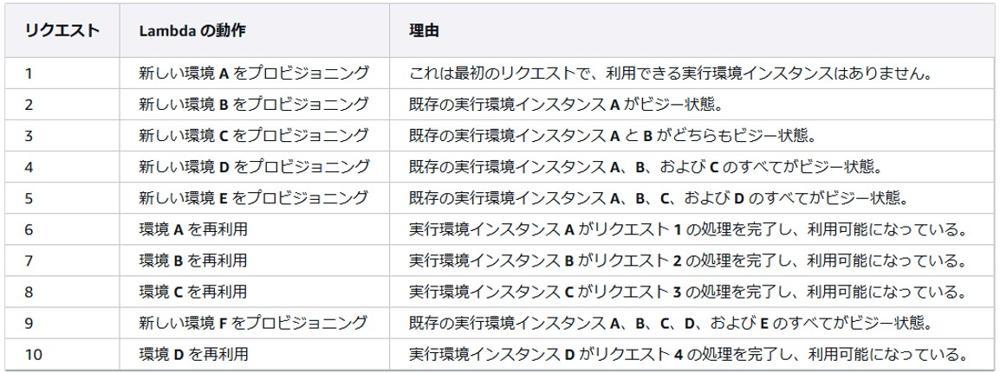

## VPC Lambda
- LambdaをVPC内に作成する時Lambda関数にアタッチするセキュリティグループはLambdaがVPC内のリソースと連携する時に経由するもの
  - 例
    - ALB → Lambda → (Lambdaのセキュリティグループ) → VPC内リソース

## ALBのターゲットとしてLambda設定
- ALBのターゲットでLambdaが設定されている場合、ALBがLambdaを実行できるようにするためにはLambdaの`設定`-`アクセス権限`タブの`リソースベースのポリシーステートメント`で許可する必要がある

## DockerコンテナimageでLambda関数をデプロイ（Pythonの場合）
- defaultでインストールされてないパッケージをLambdaに上げる方法として有用
- https://docs.aws.amazon.com/ja_jp/lambda/latest/dg/python-image.html
- 同ディレクトリ内に`Dockerfile`とpipでインストールするパッケージを記載した`requirements.txt`と、実際のロジック(コード)を書いた`lambda_function.py`を置いてビルド後、イメージをECRにアップする
  - `public.ecr.aws/lambda/python:3.11`など、言語ごとのAWSベースimageがある
    - PythonのAWSベースimage
      - https://gallery.ecr.aws/lambda/python/
  - Dockerfile例
    - `${LAMBDA_TASK_ROOT}`は決まり文句
      ~~~
      FROM public.ecr.aws/lambda/python:3.11

      # Copy requirements.txt
      COPY requirements.txt ${LAMBDA_TASK_ROOT}

      # Install the specified packages
      RUN pip install -r requirements.txt

      # Copy function code
      COPY lambda_function.py ${LAMBDA_TASK_ROOT}

      # Set the CMD to your handler (could also be done as a parameter override outside of the Dockerfile)
      CMD [ "lambda_function.handler" ]
      ~~~
- 以下のAWS CLIでLambda関数を作成する  
  - https://docs.aws.amazon.com/cli/latest/reference/lambda/create-function.html
    ~~~
    aws lambda create-function --function-name <作成するLambda関数名> --package-type Image --code ImageUri=＜<AWSアカウントID>.dkr.ecr.<リージョン識別子>.amazonaws.com/<ECRリポジトリ名>:<image名>＞ --role <LambdaにアタッチするIAMロール> --region <AWSリージョン>
    ~~~

## Lambdaの並列実行について
- **https://docs.aws.amazon.com/ja_jp/lambda/latest/dg/lambda-concurrency.html**
- Lambdaは、１つのインスタンス(実行環境)で同時に複数のリクエストが処理されることはない
- 各インスタンスは一度に１つのリクエストを処理し、処理が終了した後に次のリクエストがあれば再利用される
- 並行して複数のリクエストが来た場合、新しいインスタンスが起動されて、新しいインスタンスで処理される

