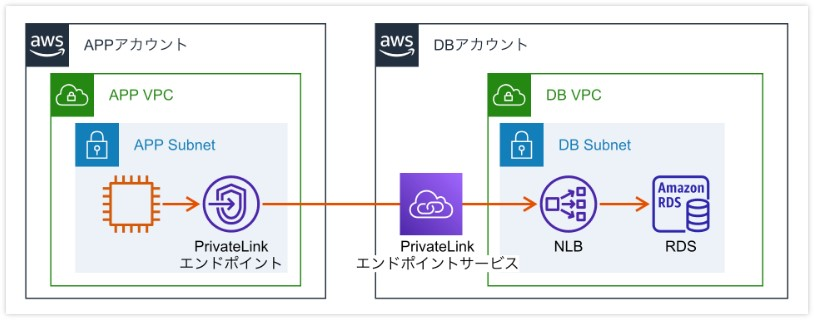
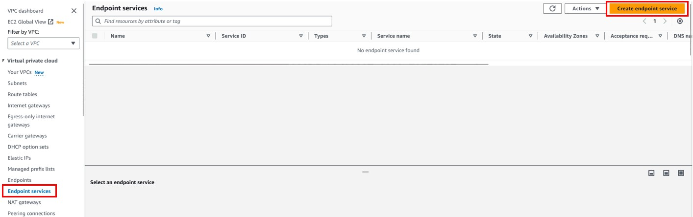
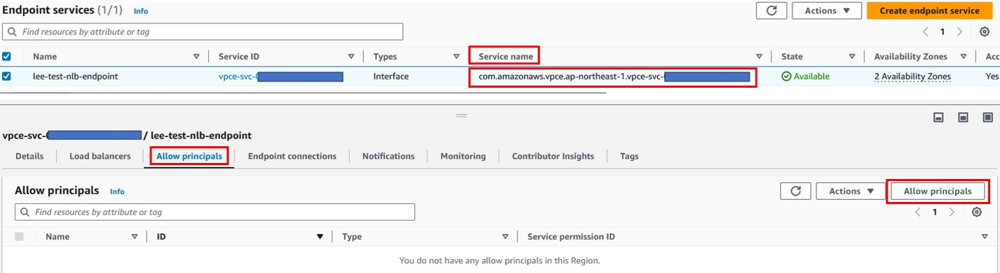
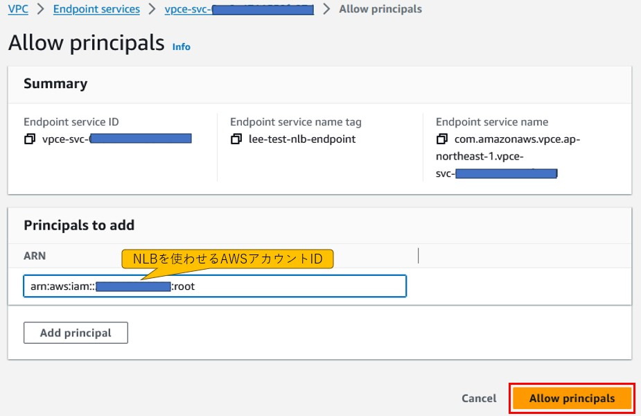
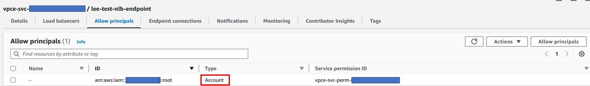
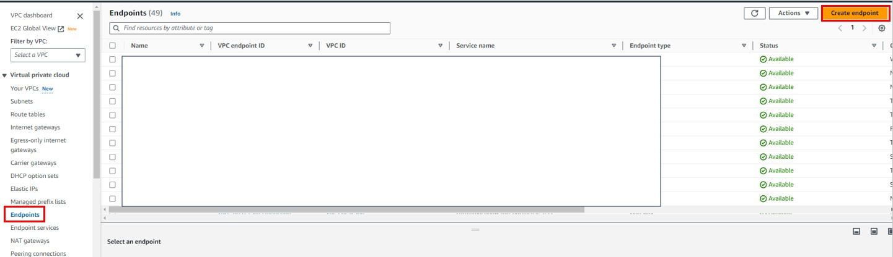
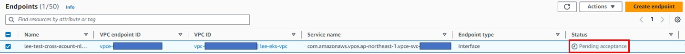
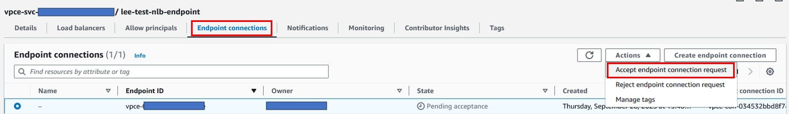
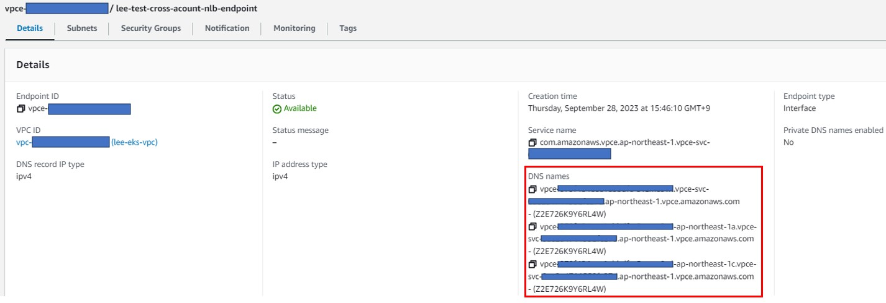

## VPC Endpoint ServicesとNLBを使って(クロスアカウントの)異なるVPC上のリソースにアクセスする方法
- VPC PeeringなどでVPC間がNW的につながってない状態でアクセスできる
  - VPCのIPレンジが重複したりしてVPC Peering/Transit Gatewayによる繋ぎができない場合有用
  - 他にも **_VPC Lattice_** を使ってVPCのIPレンジ重複問題を回避できる

### ■ クロスアカウントでの設定方法
- 構成のイメージ ( 出典：https://www.yamamanx.com/aws-privatelink-nlb/ )  
  
#### 手順
##### Endpoint services, NLB (DBアカウント)側
1. **Endpoint services**からendpoint serviceを作成
   
2. Load balancer typeはNetworkを選択し、Nameを記入し、繋げたいNLBを選択してCreateを押下。  
   Availableになったことを確認し、APPアカウント側で必要なので**Service name**を押さえておく。  
   **Allow principals**タブの「Allow principals」を押下。
   
3. `arn:aws:iam::<相手側AWSアカウントID>:root`を記入し、Allow principalsを押下  
     
     
##### Endpoint (APPアカウント)側
4. **Endpoints**でCreate endpointを押下  
   
5. Service categoryは**Other endpoint serices**を選択、Service nameにNLBアカウント側のEndpoint servicesの**Service name**を記入し「Verify service」を押下して*Service name verified*が出ることを確認。  
   endpointを使うVPCとSubnet、Security Groupを選択し、「Create endpoint」を押下  
   
6. StatusがPending acceptanceになっていることを確認  
   
##### Endpoint services, NLB (DBアカウント)側
7. **Endpoint connections**タブでPendingとなっているEndpoint connectionsを選択し、「Accept endpoint connection request」を押下。しばらくしてAvailableになることを確認。  
   
##### Endpoint (APPアカウント)側
8. EndpointのDNS namesでクロスアカウントのNLBとその奥のリソース(e.g. RDS)にアクセスする  
   
- 参考URL
  - https://www.yamamanx.com/aws-privatelink-nlb/
  - https://docs.aws.amazon.com/ja_jp/vpc/latest/privatelink/privatelink-share-your-services.html
  - https://dev.classmethod.jp/articles/cross-account-rds-access-vial-privatelink-nlb/
