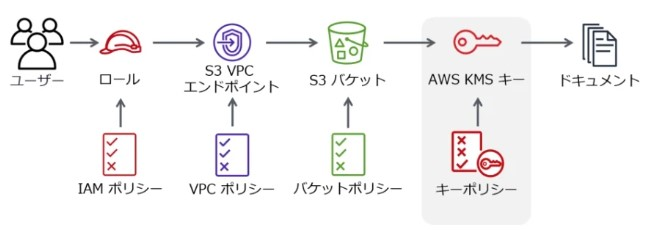

- defaultの暗号化は**SSE-S3**であり、S3に格納される時に自動的に暗号化されて、S3からダウンロードされる時に自動的に複合化される。
  - 自動的に複合化されるため、S3にアクセスできる人はすべてオブジェクトを参照できる。
- S3の暗号化で`SSE-KMS`を使うことでS3だけではなく、KMSにもアクセスできる人だけオブジェクトを参照(ダウンロード)可能にすることができる  
  