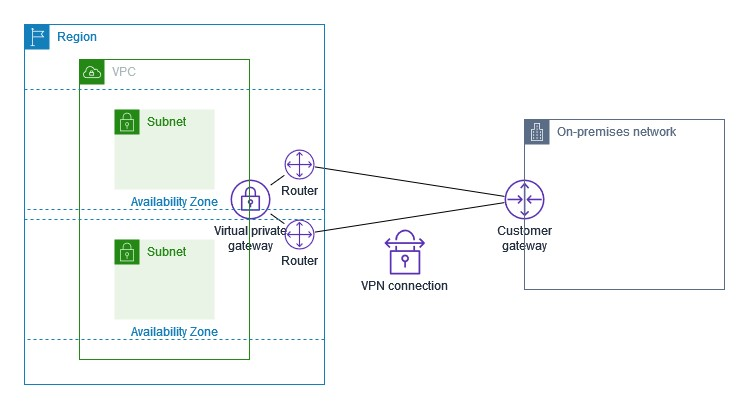
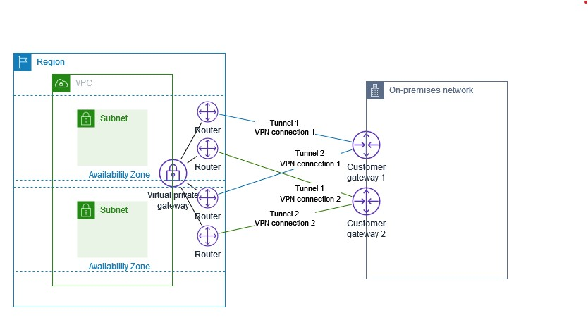

#### Customer Gatewayが１つの場合（オンプレ側がシングル構成）
- https://docs.aws.amazon.com/ja_jp/vpn/latest/s2svpn/VPNTunnels.html
  
  > オンプレミスネットワークから AWS へのトラフィックは、両方のトンネルを使用します。AWS からオンプレミスネットワークへのトラフィックは一方のトンネルを優先しますが、AWS 側で障害が発生した場合、もう一方のトンネルに自動的にフェールオーバーできます。
#### Customer Gatewayが２つの場合（AWS側もオンプレ側も冗長化）
- https://docs.aws.amazon.com/ja_jp/vpn/latest/s2svpn/vpn-redundant-connection.html
  
  > カスタマーゲートウェイデバイスが使用できなくなった場合に接続が失われるのを防ぐために、2 番目のカスタマーゲートウェイデバイスを追加して、VPC および仮想プライベートゲートウェイへの 2 番目の Site-to-Site VPN 接続を設定できます。冗長な VPN 接続とカスタマーゲートウェイデバイスを使用すれば、1 つのデバイスでメンテナンスを実行しながら、2 番目の VPN 接続を通してトラフィックの送信を継続することができます。