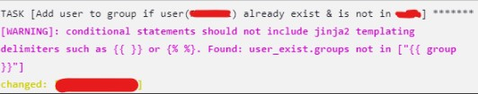

- `when`で`{{ }}`で変数を使おうとすると以下のような警告が出る
  ~~~
  when: 
    - user_exist.state == "present"
    - "{{ group }}" not in user_exist.groups
  ~~~  
  
- `()`で囲むか、何も囲まなければOK  
  ~~~
  when: 
    - user_exist.state == "present"
    - (group) not in user_exist.groups
  ~~~
  ~~~
  when: 
    - user_exist.state == "present"
    - group not in user_exist.groups
  ~~~  