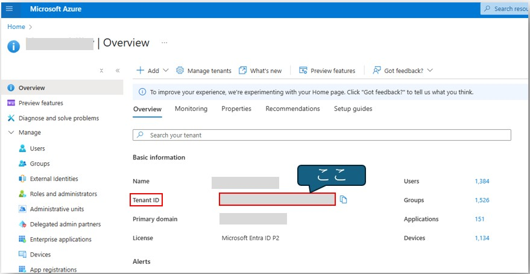
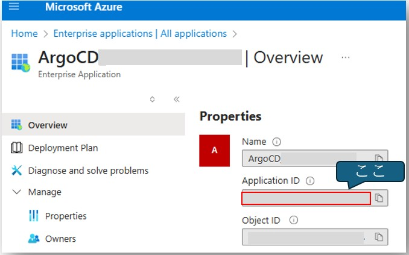
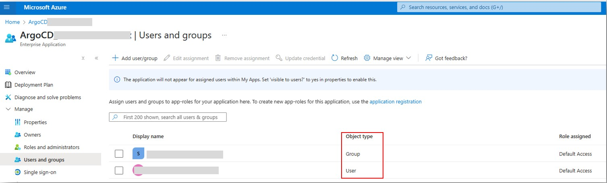
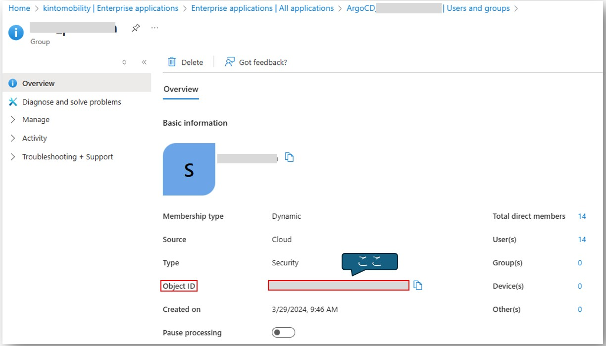

- https://argo-cd.readthedocs.io/en/stable/operator-manual/user-management/microsoft/
- やり方が3つある

## Entra ID App Registration Auth using OIDCの方法
- Azure EntraIDのトップページにあるTenant IDを確認する  
    
  - Tenant IDは`ConfigMap`の`argocd-cm`の`issuer`で指定する
- Azure EntraIDの該当Enterprise applicationsの「Overview」にて「Application ID」(=Client ID)を確認する  
    
  - Client IDは`ConfigMap`の`argocd-cm`の`clientID`で指定する
- Azure EntraIDの該当Enterprise applicationsの中で、「Manage」→「Users and groups」で、Object typeを確認し、権限を付与したいGroupやUserをクリックし、Object IDを確認する  
    
  
  - このObject IDを`ConfigMap`の`argocd-rbac-cm`で指定する
    - Groupの場合は`argocd-rbac-cm`の第1フィールドは`g`