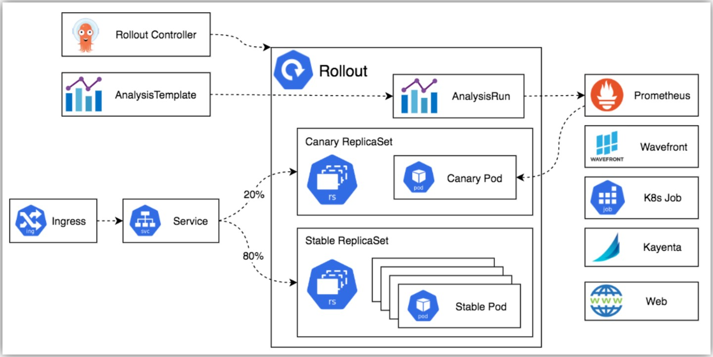

- https://argo-rollouts.readthedocs.io/en/stable/

## Argo Rolloutsインストール
- https://argoproj.github.io/argo-rollouts/installation/

## Argo Rolloutsアーキテクチャ
- https://argoproj.github.io/argo-rollouts/architecture/

### Argo Rollouts controller
- `Rollout`リソースを監視し、`Rollout`を定義した状態に収束させるコアコンポーネント

### `Rollout`リソース
- 基本的には`Deployment`リソースと同じように、配下に`ReplicaSet`リソースを管理するリソースだが、
- `Rollout`リソースで利用できるすべてのフィールド
  - https://argoproj.github.io/argo-rollouts/features/specification/