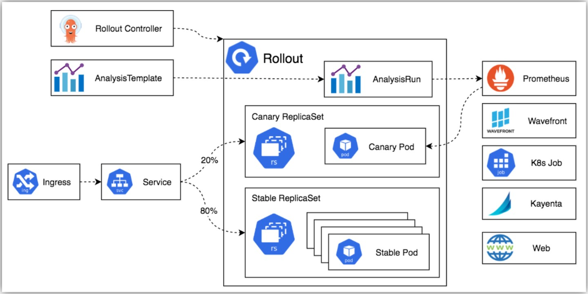
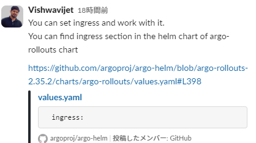

- https://argo-rollouts.readthedocs.io/en/stable/

## Argo Rolloutsインストール
- **Openshiftには`Red Hat OpenShift GitOps`にArgo Rolloutsも含まれている**
  - https://docs.openshift.com/gitops/1.12/argo_rollouts/using-argo-rollouts-for-progressive-deployment-delivery.html
- https://argoproj.github.io/argo-rollouts/installation/
- デフォルトでは`argo-rollouts`namespaceにインストールされる
```shell
kubectl create namespace argo-rollouts
kubectl apply -n argo-rollouts -f https://github.com/argoproj/argo-rollouts/releases/latest/download/install.yaml
```
- kubectl pluginもあり、必須ではないけどargo rolloutsをCLIで管理できるのでインストールしておく  
  ```shell
  curl -LO https://github.com/argoproj/argo-rollouts/releases/latest/download/kubectl-argo-rollouts-linux-amd64
  chmod +x ./kubectl-argo-rollouts-linux-amd64
  sudo mv ./kubectl-argo-rollouts-linux-amd64 /usr/local/bin/kubectl-argo-rollouts
  ```
  - `kubectl argo rollouts <サブコマンド>`の形式で使える
    - 例： `kubectl argo rollouts version`
  - `oc`コマンドでも使える

## Argo Rolloutsアーキテクチャ
- https://argoproj.github.io/argo-rollouts/architecture/


### Argo Rollouts controller
- `Rollout`リソースを監視し、`Rollout`を定義した状態に収束させるコアコンポーネント

## `Rollout`リソース
- `Deployment`リソースを拡張したもので、`Deployment`リソースと同様に配下に`ReplicaSet`リソースを管理する。  
  `spec.strategy.canary`など`Rollout`リソース独自のフィールド(機能)を持っている
- `Rollout`リソースで利用できるすべてのフィールド
  - https://argoproj.github.io/argo-rollouts/features/specification/

## Canaryリリース
- `spec.strategy`に`canary`を設定し、その下に`step`フィールドの`setWeight`に新しいバージョンのPodにルーティングする割合を指定し、`pause`に次のstepに移るまで待機する時間を設定する
- `pause`に`duration`を省略した場合(`- pause: {}`)、手動で以下のコマンドを実行するまで次のstepに移らない
  - `kubectl/oc argo rollouts promote <rollout名>`
    - `--full`オプションを付けると最後のstepまで一気に進む
- サンプルマニフェストファイル  
  - 以下の例だとimageなどを更新した場合、最初に1つのPodだけ新しいバージョンにupdateして60秒間待機後、2つ目のpodを新しいバージョンにupdateして10分間待って、3つ目のPodを新しいバージョンにupdateして1時間待って、4つ目のPodを新しいバージョンにupdateして5時間後に最後のPodの新しいバージョンにupdateする
    ```yaml
    apiVersion: argoproj.io/v1alpha1
    kind: Rollout
    metadata:
      name: example-rollout
    spec:
      replicas: 5
      selector:
        matchLabels:
          app: example
      template:
        metadata:
          labels:
            app: example
        spec:
          containers:
          - name: rollouts-demo
            image: argoproj/rollouts-demo:blue
            ports:
            - containerPort: 8080
      strategy:
        canary:
          steps:
          - setWeight: 20
          - pause: {duration: 60s}
          - setWeight: 40
          - pause: {duration: 10m}
          - setWeight: 60
          - pause: {duration: 1h}
          - setWeight: 80
          - pause: {duration: 5h}
    ```
> [!IMPORTANT]
> Istioなどのツールと組み合わせて使わない場合、`setWeight`はPod数で割合を合わせる（以下公式ドキュメントから）
> 
> If the canary Rollout does not use [traffic management](https://argoproj.github.io/argo-rollouts/features/traffic-management/), the Rollout makes a best effort attempt to achieve the percentage listed in the last `setWeight` step between the new and old version. For example, if a Rollout has 10 Replicas and 10% for the first `setWeight` step, the controller will scale the new desired ReplicaSet to 1 replicas and the old stable ReplicaSet to 9. In the case where the setWeight is 41%, the Rollout attempts to get there by finding the whole number with the smallest delta, rounding up the calculation if the deltas are equals (i.e. the new ReplicaSet has 4 pods since 41% of 10 is closer to 4/10 than 5/10, and the old ReplicaSet has 6 pods). If a user wants to have more fine-grained control of the percentages without a large number of Replicas, that user should use the [traffic management](https://argoproj.github.io/argo-rollouts/features/traffic-management/) functionality.

- Canaryリリース途中で前のrevisionに戻す(abort)することもできる  
  ```shell
  kubectl/oc argo rollouts abort <rollout名>
  ```

## Argo Rollouts CLIチートシート
- rollouts一覧確認  
  ```shell
  kubectl/oc argo rollouts list rollouts
  ```
- 特定のrolloutの状態確認  
  ```shell
  kubectl/oc argo rollouts get rollouts <rollouts名>
  ```

## Argo Rollouts Dashboard
- 以下のCLIでport forwardingが必要  
  ```shell
  kubectl argo rollouts dashboard
  ```
  **※defaultではlocalhostからしかアクセスできなくて、外部からアクセスするためには追加の設定が必要**
    
  - https://github.com/argoproj/argo-helm/blob/argo-rollouts-2.35.2/charts/argo-rollouts/values.yaml#L398