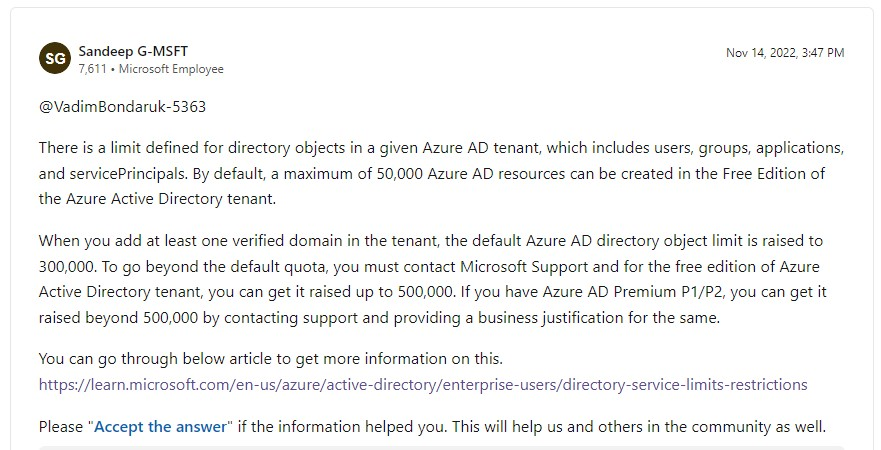

## Azure AD Free Edition
- 参考URL
  - https://learn.microsoft.com/en-us/azure/active-directory/enterprise-users/directory-service-limits-restrictions
  - https://learn.microsoft.com/en-us/answers/questions/1086795/azure-ad-limitations?orderby=newest
- Free EditionでもUser,Group,ApplicationなどのObjectを50,000個まで作れる。
  - また、Free EditionでもMicrosoft SupportにContactすれば500,000までは上げてもらうこともできるみたい。  
