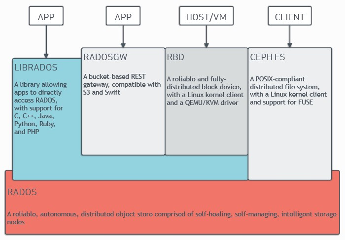
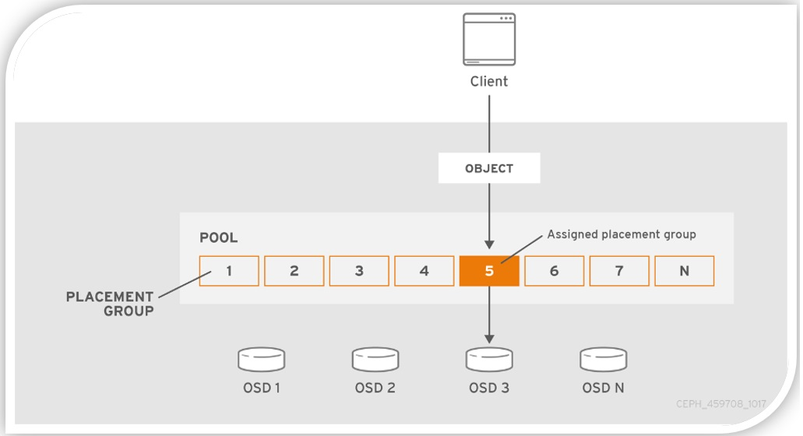

## Cephとは
- オープンソースの分散ストレージシステム
- **オブジェクトストレージ**、**ブロックストレージ**、**ファイルシステム**の3つの主要なストレージインターフェイスを提供している
- **Ceph stores data as objects within logical storage pools. Using the CRUSH algorithm, Ceph calculates which placement group (PG) should contain the object, and which OSD should store the placement group. The CRUSH algorithm enables the Ceph Storage Cluster to scale, rebalance, and recover dynamically.  
  A Ceph Storage Cluster requires the following: at least one Ceph Monitor and at least one Ceph Manager, and at least as many Ceph Object Storage Daemons (OSDs) as there are copies of a given object stored in the Ceph cluster (for example, if three copies of a given object are stored in the Ceph cluster, then at least three OSDs must exist in that Ceph cluster).  
  The Ceph Metadata Server is necessary to run Ceph File System clients.**
  - https://docs.ceph.com/en/reef/start/intro/

## Cephのアーキテクチャ
- https://docs.ceph.com/en/latest/architecture/
  

### RADOS（Reliable Autonomous Distributed Object Store）
- The core storage layer in Ceph
- Cephの基盤となるObject Storageシステム。データの分散、レプリケーション、回復を自動的に行う。
- 複数の`OSDs（object storage daemons）`で構成されている
  - **各`OSD`は独立していて、各`OSD`は一般的に１つのディスクと１対１でマッピングされている**

### Librados
- Ceph Storage Clusterと通信するためのライブラリ
- RADOS Gateway、RBD、CephFSなどの上位レイヤーのサービスで使用される
- プログラミング言語でライブラリを使って直接RADOSと通信することもできる

### RADOS Gateway
- Object Storageのインターフェースを提供し、S3やOpenStack Swift互換のAPIを通じてアクセスできる

### RDB（RADOS Block Device）
- ブロックストレージインターフェースを提供
- 仮想マシン、コンテナ、ベアメタルサーバーなどにブロックデバイスを提供

### CephFS
- 分散ファイルシステムで、POSIX互換のインターフェースを提供
- ファイルやディレクトリの階層構造を持ち、複数のクライアントが同時にアクセスできる

## Ceph Storage Cluster
- https://docs.ceph.com/en/latest/glossary/#term-Ceph-Storage-Cluster
  > The collection of **Ceph Monitors**, **Ceph Managers**, **Ceph Metadata Servers**, and **OSDs** that work together to store and replicate data for use by applications, Ceph Users, and **Ceph Clients**. Ceph Storage Clusters receive data from Ceph Clients.
- Ceph Storage Clusterは以下のデーモンで構成されている
  - **`OSD（Object Storage Daemon）`**
    - データの格納と複製を担当するデーモン
    - データの分散、レプリケーション、リカバリを自動的に処理
    > An Object Storage Daemon (Ceph OSD, ceph-osd) stores data, handles data replication, recovery, rebalancing, and provides some monitoring information to Ceph Monitors and Managers by checking other Ceph OSD Daemons for a heartbeat. At least three Ceph OSDs are normally required for redundancy and high availability.
  - **`Ceph Monitor（MON）`**
    - クラスタの状態を監視し、管理する役割を担う
    - Cluster Mapの管理、状態変更の検知、クライアントへの認証を行う
    - 通常は奇数個（3、5、7など）で構成し、高可用性を確保
    > A Ceph Monitor (ceph-mon) maintains maps of the cluster state, including the monitor map, manager map, the OSD map, the MDS map, and the CRUSH map. These maps are critical cluster state required for Ceph daemons to coordinate with each other. Monitors are also responsible for managing authentication between daemons and clients. At least three monitors are normally required for redundancy and high availability.
  - **`Ceph Manager（ceph-mgr）`**
    - クラスタの監視とレポート生成を行う
    - ダッシュボード、REST API、CLIなどの管理インターフェースを提供
    > A Ceph Manager daemon (ceph-mgr) is responsible for keeping track of runtime metrics and the current state of the Ceph cluster, including storage utilization, current performance metrics, and system load. The Ceph Manager daemons also host python-based modules to manage and expose Ceph cluster information, including a web-based Ceph Dashboard and REST API. At least two managers are normally required for high availability.
  - **`Ceph Metadata Server`**
    - CephFSを使う時のみ必要なコンポーネント
    - ファイルシステムのメタデータ（例: ファイル名、ディレクトリ構造、アクセス許可等）を管理
    - メタデータを高速にアクセスできるようにメモリ内にキャッシュし、必要に応じてディスクに保存
    > A Ceph Metadata Server (MDS, ceph-mds) stores metadata for the Ceph File System. Ceph Metadata Servers allow CephFS users to run basic commands (like ls, find, etc.) without placing a burden on the Ceph Storage Cluster.

### CRUSH（Controlled Replication Under Scalable Hashing）
- Cephの分散ストレージアーキテクチャにおいて、データの配置を決定するアルゴリズム
- Cephクラスタ内でデータの複製とストライピングを効率的に管理し、スケーラビリティ、パフォーマンス、および耐障害性を提供
- 従来のデータセンターのストレージソリューションでは、データの配置を中央の管理ノードが決定していたが、CRUSHは分散型のアプローチを採用している

### CRUSH map
- https://docs.ceph.com/en/reef/rados/operations/crush-map/
> The CRUSH algorithm computes storage locations in order to determine how to store and retrieve data. CRUSH allows Ceph clients to communicate with OSDs directly rather than through a centralized server or broker. By using an algorithmically-determined method of storing and retrieving data, Ceph avoids a single point of failure, a performance bottleneck, and a physical limit to its scalability.
>
> CRUSH uses a map of the cluster (the CRUSH map) to map data to OSDs, distributing the data across the cluster in accordance with configured replication policy and failure domains. For a detailed discussion of CRUSH, see CRUSH - Controlled, Scalable, Decentralized Placement of Replicated Data
>
> CRUSH maps contain a list of OSDs and a hierarchy of “buckets” (hosts, racks) and rules that govern how CRUSH replicates data within the cluster’s pools. By reflecting the underlying physical organization of the installation, CRUSH can model (and thereby address) the potential for correlated device failures. Some factors relevant to the CRUSH hierarchy include chassis, racks, physical proximity, a shared power source, shared networking, and failure domains. By encoding this information into the CRUSH map, CRUSH placement policies distribute object replicas across failure domains while maintaining the desired distribution. For example, to address the possibility of concurrent failures, it might be desirable to ensure that data replicas are on devices that reside in or rely upon different shelves, racks, power supplies, controllers, or physical locations.
>
> When OSDs are deployed, they are automatically added to the CRUSH map under a host bucket that is named for the node on which the OSDs run. This behavior, combined with the configured CRUSH failure domain, ensures that replicas or erasure-code shards are distributed across hosts and that the failure of a single host or other kinds of failures will not affect availability. For larger clusters, administrators must carefully consider their choice of failure domain. For example, distributing replicas across racks is typical for mid- to large-sized clusters.

### PG (placement group)
- https://access.redhat.com/documentation/en-us/red_hat_ceph_storage/5/html/storage_strategies_guide/placement_groups_pgs
  
- https://docs.ceph.com/en/reef/dev/placement-group/
> When placing data in the cluster, objects are mapped into PGs, and those PGs are mapped onto OSDs. We use the indirection so that we can group objects, which reduces the amount of per-object metadata we need to keep track of and processes we need to run (it would be prohibitively expensive to track eg the placement history on a per-object basis). Increasing the number of PGs can reduce the variance in per-OSD load across your cluster, but each PG requires a bit more CPU and memory on the OSDs that are storing it. We try and ballpark it at 100 PGs/OSD, although it can vary widely without ill effects depending on your cluster. You hit a bug in how we calculate the initial PG number from a cluster description.
>
> There are a couple of different categories of PGs; the 6 that exist (in the original emailer’s ceph -s output) are “local” PGs which are tied to a specific OSD. However, those aren’t actually used in a standard Ceph configuration.

### Cephのインストール
- https://docs.ceph.com/en/latest/install/
- 普通のサーバにデプロイする時は`Cephadm`で、Kubernetes上にデプロイする時は`Rook`を使うのが一般的？

### CephのリリースとEOL
- https://docs.ceph.com/en/latest/releases/index.html