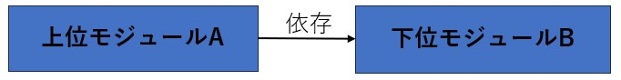
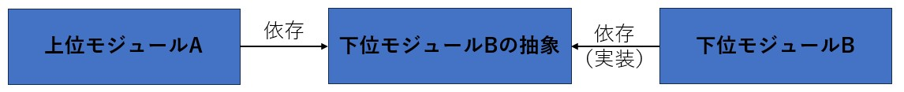

## SOLID原則とは
- オブジェクト指向プログラミングにおける設計原則の集合
- 以下の5つの原則から構成される
  - 単一責任の原則（Single Responsibility Principle, SRP）
  - オープン・クローズドの原則（Open/Closed Principle, OCP）
  - リスコフの置換原則（Liskov Substitution Principle, LSP）
  - インターフェース分離の原則（Interface Segregation Principle, ISP）
  - 依存関係逆転の原則（Dependency Inversion Principle, DIP）

### 依存関係逆転の原則（Dependency Inversion Principle, DIP）
1. 上位モジュールは下位モジュールに依存してはならない。両者とも抽象に依存すべき
2. 抽象は実装の詳細に依存してはならない。実装の詳細が抽象に依存すべき
   - NG  
     
   - OK  
     