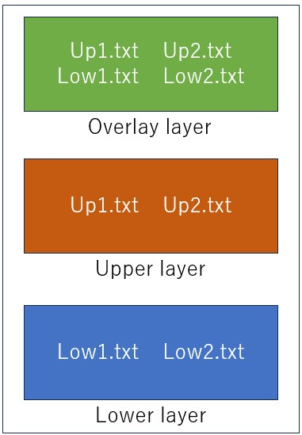

## OverlayFS
- https://docs.docker.jp/storage/storagedriver/overlayfs-driver.html
- *Union Filesystem*とも呼ばれる
- **Overlay Filesystemは Lower layer、Upper layer、Overlay layer の３つのLayerで構成されている**
- **Lower layerとUpper layerのディレクトリ/データを合わせて（マージして）Overlay layerのディレクトリ/データが構成される**  
    
  - **Lower layerとUpper layerに同じパスのファイルやディレクトリが存在する場合、Upper layerの内容が優先され、Overlay layer（マージされたファイルシステム）に反映される**
- **OverlayFSは変更をUpper layerに記録し、Lower layerを不変の基盤として扱う設計になっている**
- **Upper layerは通常、読み書き可能であり、Lower layerは読み取り専用として扱われる**
  - **その結果、ファイルの追加、更新、削除はすべてUpper layerで行われ、同じパスのLower layerのファイルやディレクトリは隠蔽される**
  - **Overlay layer上にあるLower layerからのファイルを更新/削除しても、Lower layer上のファイルをそのままで、Upper layer上で反映される**

#### Layerとは
- それぞれのLayerはrootファイルシステムとデータを持っている
