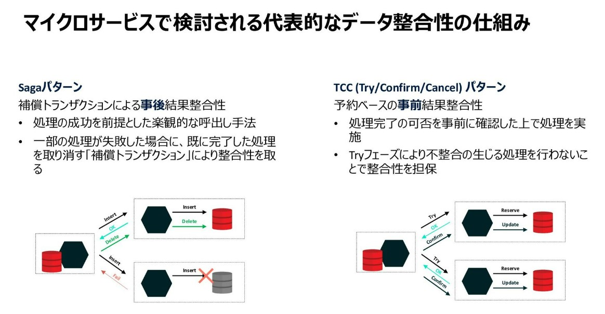
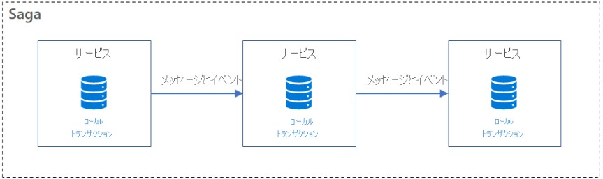
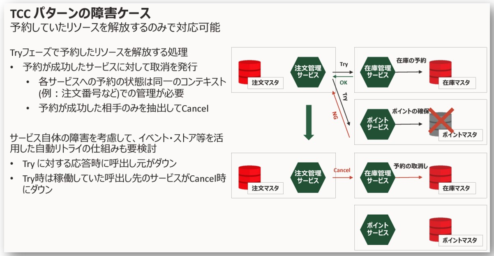
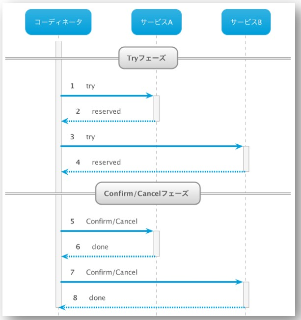

## 前提
- MSAでは以下のメリットのため、機能(サービス)ごとに独立したDBを持つデザインパターンが多い。
  - データスキーマは、他のサービスに直接影響することなく進化できる
  - 各データストアは独立してスケーリングできる
  - あるサービスのデータ ストアの障害は、他のサービスには直接影響しない
- しかし、サービスごとにDBを持つ場合、障害発生時に各サービスDB間データ整合性を保つため、  
  各サービス間の処理をロールバックするために補償(補正)トランザクションが必要になり、  
  複雑なトランザクション制御管理が必要となってくる
- その各サービスDB間の整合性を担保する手法として**sagaパターン**と**TCCパターン**がある
- **sagaパターン**と**TCCパターン**両方とも**結果整合性**で全体の一貫性を保つ
  - Dirty Read等が発生する可能性がある
- サービスごとにDBを持つ理由
  - https://learn.microsoft.com/ja-jp/dotnet/architecture/cloud-native/distributed-data#database-per-microservice-why

  #### 両パターンの比較
  - 出典：https://speakerdeck.com/oracle4engineer/transaction-for-microservices-with-microprofile-lra 
  

## sagaパターン
- sagaはトランザクションのシーケンスで、このsagaによって各サービスが**ローカルトランザクション**によってが更新され、  
  次のトランザクションステップをトリガーするメッセージまたはイベントが発行される。  
  また、ステップが失敗すると、その前のトランザクションを無効にする補正トランザクションを実行される。
  
- 出典
  - https://learn.microsoft.com/ja-jp/azure/architecture/reference-architectures/saga/saga
  - https://www.oracle.com/a/otn/docs/jp-dev-days-microservices.pdf

## TCCパターン (Try, Confirm, Cancel)
- Tryフェーズで仮登録(予約)を行い、すべてのサービス(DB)で正常に仮登録できたらConfirmし、  
  1つでも失敗したらすべての仮登録(予約)をCancelする（2フェーズ・コミット）
  
  
- 出典
  - https://www.oracle.com/a/otn/docs/jp-dev-days-microservices.pdf
  - https://atmarkit.itmedia.co.jp/ait/articles/2302/20/news001.html
  - https://wakatchi.dev/microservices-tx-pattern-saga-tcc/
  - https://www.ibm.com/blogs/think/jp-ja/microservices-applications-enabled-by-ibmcloud-managed-services/

  #### Two-phase commit (2PC)
  - トランザクションのコミットを確実に行うためのアルゴリズム
  - **準備Phase** ですべてのサービス(DB)にコミットが可能か確認し、  
    **解決Phase**で準備Phaseの確認結果によってコミットもしくはロールバックを行う
  - 参考URL
    - https://itmanabi.com/2phase-commit/