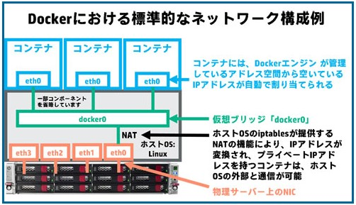
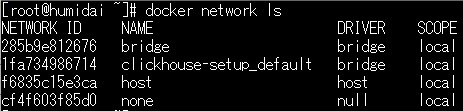

- 参考URL
  - https://docs.docker.com/network/
  - https://docs.docker.com/network/bridge/
  - https://y-ohgi.com/introduction-docker/2_component/network/
  - **https://www.itmedia.co.jp/enterprise/articles/1609/21/news001.html**

## DockerのNetwork
- 全体像
  
  https://www.itmedia.co.jp/enterprise/articles/1609/21/news001.html
- DockerはNetwork driversを使ってコンテナ間やコンテナ↔Dockerホスト外部のNetwork通信を実現する
- 複数のDriversがあるが、デフォルトでは`bridge`が使用される
  - https://docs.docker.com/network/#network-drivers
  - **Linuxカーネルのbridgeネットワークを使用するための機能**
  - デフォルトで`bridge`という名前の`bridge` driverが作成されていて、デフォルトではこれが使われる
    
- KubernetesのNetworkで使用される`overlay` networkを使うこともできる
- コンテナには所属するbridgeのIPレンジからIPアドレスが払い出される
- コンテナ間通信はNATされず、bridge経由で行われる
- コンテナ↔Dockerホスト外部の通信ではDockerホストのiptablesで(コンテナIPからDockerホストのIPへ)NATされる
  - `iptables -L -t nat`でNAT(IPマスカレード)の設定を確認できる

#### Linux Bridge
> A Linux bridge is a kernel module that behaves like a network switch, forwarding packets between interfaces that are connected to it. It's usually used for forwarding packets on routers, on gateways, or between VMs and network namespaces on a host.
>
> The Linux bridge has included basic support for the Spanning Tree Protocol (STP), multicast, and Netfilter since the 2.4 and 2.6 kernel series. Features that have been added in more recent releases include:
>
>・Configuration via Netlink
>・VLAN filter
>・VxLAN tunnel mapping
>・Internet Group Management Protocol version 3 (IGMPv3) and Multicast Listener Discovery version 2 (MLDv2)
>・Switchdev
- 参考URL
  - https://developers.redhat.com/articles/2022/04/06/introduction-linux-bridging-commands-and-features

#### NATとIPマスカレード(NAPT)の違い
- **NAT** (Network Address Translation)
  - Private IPとGlobal IPを１対１に変換する
- **NAPT(IPマスカレード)** (Network Address Port Translation)
  - 多数のPrivate IPと１つのGlobal IPをマッピング
  - Port番号で戻り先を識別
  - 一方向通信しかできない