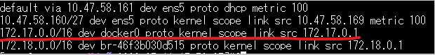

- 参考URL
  - https://docs.docker.com/network/
  - https://docs.docker.com/network/bridge/
  - https://y-ohgi.com/introduction-docker/2_component/network/
  - **https://www.itmedia.co.jp/enterprise/articles/1609/21/news001.html**

## DockerのNetwork
- 全体像  
  
  https://www.itmedia.co.jp/enterprise/articles/1609/21/news001.html
- DockerはNetwork driversを使ってコンテナ間やコンテナ↔Dockerホスト外部のNetwork通信を実現する
- 複数のDriversがあるが、デフォルトでは`bridge`が使用される
  - https://docs.docker.com/network/#network-drivers
  - **Linuxカーネルのbridgeネットワークを使用するための機能**
  - デフォルトで`bridge`という名前の`bridge` driverが作成されていて、デフォルトではこれが使われる
    
- `bridge`のIPレンジはdefaultでは「172.17.0.0/16」で作成される。変更することも可能。
- OSのルートテーブルに`bridge`用のルーティングも追加される
  
- KubernetesのNetworkで使用される`overlay` networkを使うこともできる
- コンテナには所属するbridgeのIPレンジからIPアドレスが払い出される
- コンテナ間通信はNATされず、bridge経由で行われる
- コンテナ↔Dockerホスト外部の通信ではDockerホストのiptablesで(コンテナIPからDockerホストのIPへ)NATされる
  - `iptables -L -t nat`でNAT(IPマスカレード)の設定を確認できる

#### bridgeのIPレンジを変える方法
- `/etc/docker/daemon.json`を開く（ない場合は作成）
- 以下のように変えるIPレンジのGatewayのIPを記載する
  - **Networkアドレスではないことに注意！`192.168.1.0/24`のようなNetworkアドレスではエラーになる**
  ~~~json
  {
    "bip": "192.168.1.5/24"
  }
  ~~~
- `systemctl restart docker`でdockerを再起動する
- `docker network inspect bridge`でIPレンジが変わっていることを確認

#### Linux Bridge
> A Linux bridge is a kernel module that behaves like a network switch, forwarding packets between interfaces that are connected to it. It's usually used for forwarding packets on routers, on gateways, or between VMs and network namespaces on a host.
>
> The Linux bridge has included basic support for the Spanning Tree Protocol (STP), multicast, and Netfilter since the 2.4 and 2.6 kernel series. Features that have been added in more recent releases include:
>
>・Configuration via Netlink
>・VLAN filter
>・VxLAN tunnel mapping
>・Internet Group Management Protocol version 3 (IGMPv3) and Multicast Listener Discovery version 2 (MLDv2)
>・Switchdev
- 参考URL
  - https://developers.redhat.com/articles/2022/04/06/introduction-linux-bridging-commands-and-features

#### dockerdの通信
- defaultではdockerdは`/var/run/docker.sock`を使ってUnix Socket通信 (IPC(Inter Process Communiaction): 同一ホスト上のProcess間の通信) を行う
  - つまり、Dockerホスト外部からdockerとの通信(docker操作)はできない
  - dockerコマンド(Docker CLI)は`/var/run/docker.sock`を通じてdockerdと通信を行う
- ただ、docker実行時`--host`オプションを使うことでTCP通信でDockerホスト外部からもアクセスできるように設定できる
  - e.g. `docker --host=tcp://<dockerホストIP>:2375`
  - **デフォルトではauthenticationや暗号化がされないので使う際は要注意！**
  - `2735`ポート
    - 通信が暗号化されない
  - `2736`ポート
    - TLSを使って通信が暗号化される
      - `--tls=true`、`--tlscert=<サーバ証明書>`、`--tlskey=<PrivateKey>`オプションが必要
  - dockerdコマンドオプションではなく、`/etc/docker/daemon.json`で定義することも可能  
    ~~~json
    {
      "hosts": ["tcp://<DockerホストIP>:2375(または2376)"],
      "tls": true,
      "tlscert": "<サーバ証明書>",
      "tlskey": "<PrivateKey>"
    }
    ~~~
  - Dockerホスト外部のDocker CLIを実行するホストでは`DOCKER_HOST`環境変数でDockerホストの指定が必要
    - `export DOCKER_HOST="tcp://<DockerホストIP>:2375(または2376)"`

#### NATとIPマスカレード(NAPT)の違い
- **NAT** (Network Address Translation)
  - Private IPとGlobal IPを１対１に変換する
- **NAPT(IPマスカレード)** (Network Address Port Translation)
  - 多数のPrivate IPと１つのGlobal IPをマッピング
  - Port番号で戻り先を識別
  - 一方向通信しかできない