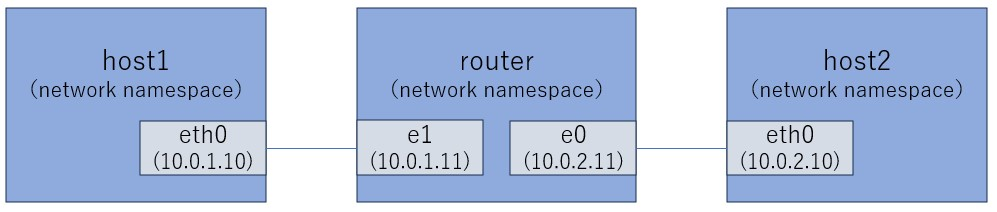

## namespace
- ProcessやNetworkスタックなど、リソースを隔離(分離)するためのLinuxの機能
- namespaceにはいくつか種類がある

### Network namespace
- Linuxのネットワークスタックを隔離するための機能
  - これにより、1つの物理的または仮想的なマシン上で複数の独立したネットワークインターフェイス、IPアドレス、ルーティングテーブル、ファイアウォールのルール、その他のネットワーク関連の状態を持つことができる。各network namespaceは他から独立しており、それぞれが独自のネットワーク環境を持つことができる。
- Network namespaceの確認
  - `ip netns list`
- Network namespaceの作成
  - `ip netns add <namespace名>`
- 特定のNetwork namespace内でのコマンド実行
  - `ip netns exec <namespace名> <コマンド>`
  - 例
    - `ip netns exec <namespace名> arp -a`
    - `ip netns exec <namespace名> ip route`
- **Network namespaceを経由する時、パケットのTTLは減少する**
  - https://zenn.dev/takai404/articles/52e75a953efe9e

#### vethについて
- veth(Virtual Ethernet Device)はVNICのこと
- vethは必ずペアで作成され、2つのnetwork namespace同士にそれぞれを片方ずつvethを配置することで、２つのnetwork間で通信することができるようになる。
- ２つのNICをそれぞれ２つの異なる端末に取り付けて、LANケーブルでそれぞれの端子を接続して直接通信しているような感じ

#### 異なるnetwork namespace同士でvethのペアを作ってpingを試してみる
- テストの構成図
  
- 設定/テスト手順
  ```
  ip netns add router
  ip netns add host1
  ip netns add host2

  ip link add eth0 netns host1 type veth peer name e1 netns router
  ip link add eth0 netns host2 type veth peer name e0 netns router

  ip netns exec host1 ip addr add 10.0.1.10/24 dev eth0
  ip netns exec host2 ip addr add 10.0.2.10/24 dev eth0
  ip netns exec router ip addr add 10.0.2.11/24 dev e0
  ip netns exec router ip addr add 10.0.1.11/24 dev e1
  ip netns exec router sysctl -w net.ipv4.ip_forward=1

  ip netns exec host1 ip link set lo up
  ip netns exec host1 ip link set eth0 up
  ip netns exec host2 ip link set lo up
  ip netns exec host2 ip link set eth0 up
  ip netns exec router ip link set lo up
  ip netns exec router ip link set e0 up
  ip netns exec router ip link set e1 up

  ip netns exec host1 ip route add default via 10.0.1.11
  ip netns exec host2 ip route add default via 10.0.2.11

  ip netns exec host1 ping 10.0.2.10
  ip netns exec host2 ping 10.0.1.10
  ```

### PID namespace
- Process(群)を隔離し、同じnamespaceに存在するProcess間だけお互いが見えて(疎通できて)、  
  他のnamespaceにあるProcessは見えない(干渉できない)ようにする

- `/proc`ディレクトリ


## cgroup


## overlayfs