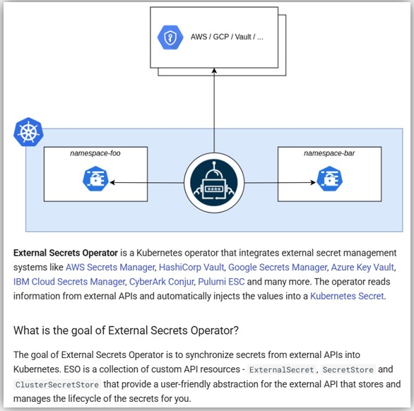
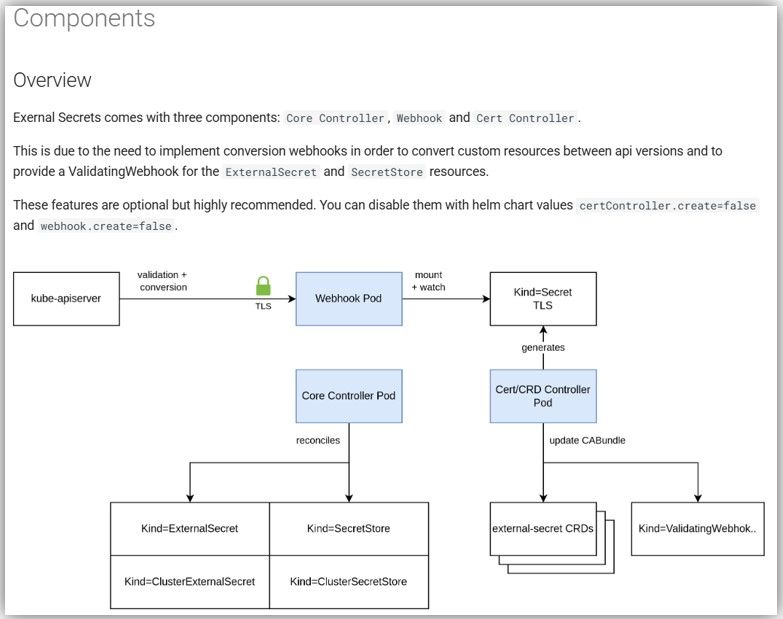

## External Secrets Operatorとは
- https://external-secrets.io/latest/  
  

## install
- https://external-secrets.io/latest/introduction/getting-started/

### Helmで`values.yml`を用いてデプロイする場合
- `values.yml`の全量
  - https://github.com/external-secrets/external-secrets/blob/main/deploy/charts/external-secrets/values.yaml
- `values.yml`の例  
  ```yaml
  global:
    nodeSelector:
      karpenter.sh/nodepool: arm64-nodepool
      karpenter.sh/capacity-type: on-demand
  serviceAccount:
    create: true
    name: "eso-service-account"
  ```
- インストール  
  ```shell
  helm install external-secrets --values=values.yml external-secrets/external-secrets -n external-secrets --create-namespace
  ```

## Components
- https://external-secrets.io/latest/api/components/  
  

## CRD
- 以下の３つのCRDが作成される
  - `ExternalSecret`
    - 外部のシークレットストアから特定のシークレットを取得し、Kubernetesの`Secret`リソースとして同期するための設定を定義
    - `ExternalSecret`リソースを作成すると、`Secret`リソースが作成される
  - `SecretStore`
    - 外部シークレットストアの接続情報を定義
    - 特定の`namespace`でのみ使用可能
  - `ClusterSecretStore`
    - 外部シークレットストアの接続情報を定義
    - クラスタ全体で使用可能

## AWS Secrets Managerとの連携例
- 参照URL
  - https://aws.amazon.com/jp/blogs/news/leverage-aws-secrets-stores-from-eks-fargate-with-external-secrets-operator/
    - IRSAでの設定例
  - https://external-secrets.io/latest/provider/aws-secrets-manager/
  - https://techstep.hatenablog.com/entry/2023/02/02/182127

### `SecretStore`
- EKS WorkerNodeのIAMロールでSecrets Managerからシークレットを取得する例（IRSAやシークレットキーで取得する場合は追加の設定が必要）  

```yaml
apiVersion: external-secrets.io/v1beta1
kind: SecretStore
metadata:
  name: aws-secrets-manager
  namespace: monitoring
spec:
  provider:
    aws:
      service: SecretsManager
      region: ap-northeast-1
```

### `ExternalSecret`
```yaml
apiVersion: external-secrets.io/v1beta1
kind: ExternalSecret
metadata:
  name: rds-auth
spec:
  refreshInterval: 1h # SecretStoreプロバイダーから再度値を読み込む間隔を指定
  secretStoreRef: # 参照する SecretStore を指定
    name: aws-secrets-manager
    kind: SecretStore
  target: # ExternalSecret から作成されるKubernetes Secretを指定する
    name: rdsauth # 作成されるSecretリソース名
    creationPolicy: Owner
  data: # 取得する秘匿情報を指定する
  - secretKey: senaki-rds-host # 作成するSecretのkey名. PodやDeployment側で指定する
    remoteRef:
      key: senaki-rds-auth # AWS Secrets Managerに登録したシークレット名
      property: host # AWS Secrets Managerに登録したシークレットキー名
  - secretKey: senaki-rds-engine
    remoteRef:
      key: senaki-rds-auth
      property: engine
  - secretKey: senaki-rds-username
    remoteRef:
      key: senaki-rds-auth
      property: username
  - secretKey: senaki-rds-password
    remoteRef:
      key: senaki-rds-auth
      property: password
```

### Secretを使う側（`Deployment`）
```yaml
apiVersion: apps/v1
kind: Deployment
metadata:
  name: grafana
  labels:
    app: grafana
  namespace: monitoring
spec:
  replicas: 1
  selector:
    matchLabels:
      app: grafana
  template:
    metadata:
      labels:
        app: grafana
    spec:
      containers:
        - name: grafana
          image: grafana/grafana:11.4.0
          imagePullPolicy: IfNotPresent
          env:
            - name: GF_DATABASE_TYPE
              valueFrom:
                secretKeyRef:
                  name: rdsauth
                  key: senaki-rds-engine
            - name: GF_DATABASE_HOST
              valueFrom:
                secretKeyRef:
                  name: rdsauth
                  key: senaki-rds-host
            - name: GF_DATABASE_NAME
              value: "grafana_sk"
            - name: GF_DATABASE_USER
              valueFrom:
                secretKeyRef:
                  name: rdsauth
                  key: senaki-rds-username
            - name: GF_DATABASE_PASSWORD
              valueFrom:
                secretKeyRef:
                  name: rdsauth
                  key: senaki-rds-password
            - name: AWS_DEFAULT_REGION
              value: "ap-northeast-1"
          ports:
            - containerPort: 3000
              name: http-grafana
              protocol: TCP
```