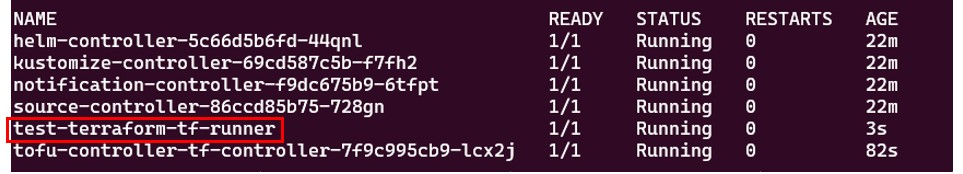

# Install
## Flux CLI install
- https://fluxcd.io/flux/installation/#install-the-flux-cli

```shell
curl -s https://fluxcd.io/install.sh | sudo bash
```

## Flux install
- https://fluxcd.io/flux/get-started/

```shell
export GITHUB_TOKEN=<your-token>
export GITHUB_USER=<your-username> # https://github.com/<ここに入るもの>

flux bootstrap github \
  --owner=$GITHUB_USER \
  --repository=<fluxマニフェストファイルを置くGitリポジトリ> \
  --branch=main \
  --path=./<fluxマニフェストファイルを置くディレクトリ> \
  --personal --token-auth --verbose
```
- **`--repository`で指定したGitリポジトリの`--path`で指定したディレクトリに`flux-system`というディレクトリが作成され、その配下に以下のファイルが生成される**
  - `gotk-components.yaml`
  - `gotk-sync.yaml`
  - `kustomization.yaml`

- 例  
  ```shell
  flux bootstrap github --owner=$GITHUB_USER \
  --repository=IaC --branch=main \
  --path=./AWS/k8s/flux --personal --token-auth --verbose
  ```

- 以下のDeployment（Pod）が`flux-system` namespace上に作成される
  - `helm-controller`
  - `kustomize-controller`
  - `notification-controller`
  - `source-controller`

> [!NOTE]
> Github token情報は`flux-system` namespace上に`flux-system`という名前で作成される

### Flux uninstall
```
flux uninstall
```

## `GitRepository`リソース
- https://fluxcd.io/flux/components/source/gitrepositories/
- Gitリポジトリの接続に使うTokenは`spec.secretRef.name`で明示的にSecretリソースを指定できる
  ```yaml
  apiVersion: source.toolkit.fluxcd.io/v1
  kind: GitRepository
  metadata:
    name: pack-local-test
    namespace: flux-system
  spec:
    interval: 30s
    url: https://github.com/xxx/xxx.git
    secretRef:
      name: flux-system # ここ
    ref:
      branch: lee-flux-test
  ```

## Terraform / Open Tofu Controller for Flux install
- https://flux-iac.github.io/tofu-controller/getting_started/

```shell
kubectl apply -f https://raw.githubusercontent.com/flux-iac/tofu-controller/main/docs/release.yaml
```
- Branch Plannerを有効にしてインストールする場合  
  ```shell
  kubectl apply -f https://raw.githubusercontent.com/flux-iac/tofu-controller/main/docs/branch-planner/release.yaml
  ```

> [!CAUTION]
> 2025/03/18 k8s 1.31 ver
> 上記のマニフェストファイルは、リソースのAPI versionが古くて警告が出るし、デプロイしても`flux-system` namespaceにtofu-controller PODは起動しない。
> [Getting Started](https://flux-iac.github.io/tofu-controller/getting_started/)の「Manual installation」のHelmでのインストール手順と https://github.com/flux-iac/tofu-controller/tree/main/charts/tofu-controller の手順も、`helm repo add tofu-controller https://flux-iac.github.io/tofu-controller`は合ってるけど、Chart名が`tofu-controller/tofu-controller`ではなく、**`tofu-controller/tf-controller`が正しい**  
> - 以下でインストールした
> ```shell
> helm repo add tofu-controller https://flux-iac.github.io/tofu-controller
> helm repo update
> helm install tofu-controller tofu-controller/tf-controller --namespace flux-system
> ```

- **Tofu ControllerのHelm用の`values.yaml`**
  - https://github.com/flux-iac/tofu-controller/blob/main/charts/tofu-controller/values.yaml

> [!IMPORTANT]
> Terraformコードがデカいとtf-runnerのGRPC message limitに引っかかってエラーが出る。  
> https://github.com/flux-iac/tofu-controller/issues/511  
> 回避策として以下`values.yml`の`runner.grpc.maxMessageSize`を増やすことで解決可能  
> https://github.com/flux-iac/tofu-controller/blob/main/charts/tofu-controller/values.yaml

### TF Controllerの各種CR(Custom Resource)と各CRのConfiguration項目
- https://github.com/flux-iac/tofu-controller/blob/main/docs/References/terraform.md

## `Terraform`リソース
- https://github.com/flux-iac/tofu-controller/blob/main/docs/References/terraform.md#terraform
- `Terraform`リソースをデプロイするとrunnerのPodが起動されて、Plan/Applyを実行し、完了したらPodも削除される。  
  
  - Plan/Applyの結果はSecretとして保存される

### `Terraform`リソース References
- https://flux-iac.github.io/tofu-controller/References/terraform/

#### `backendConfig`
- tfstateはデフォルトでは`tfstate-${workspace}-${secretSuffix}`という名前の`Secret`に保存されるけど、S3などに保存するように指定することができる
- https://flux-iac.github.io/tofu-controller/use-tf-controller/with-a-custom-backend/  
  ```yaml
  apiVersion: v1
  kind: Secret
  metadata:
    name: terraform-s3-backend
    namespace: flux-system
  type: Opaque
  data:
    access_key: <base64 encoded key>
    secret_key: <base64 encoded key>
  ---
  apiVersion: infra.contrib.fluxcd.io/v1alpha2
  kind: Terraform
  metadata:
    name: helloworld
    namespace: flux-system
  spec:
    approvePlan: auto
    backendConfig:
      customConfiguration: |
        backend "s3" {
          bucket                      = "s3-terraform-state1"
          key                         = "dev/terraform.tfstate"
          region                      = "us-east-1"
          endpoint                    = "http://localhost:4566"
          skip_credentials_validation = true
          skip_metadata_api_check     = true
          force_path_style            = true
          dynamodb_table              = "terraformlock"
          dynamodb_endpoint           = "http://localhost:4566"
          encrypt                     = true
        }
    backendConfigsFrom:
      - kind: Secret
        name: terraform-s3-backend
        keys:
        - access_key
        - secret_key
        optional: false
    interval: 1m
    path: ./
    sourceRef:
      kind: GitRepository
      name: helloworld
      namespace: flux-system
    runnerPodTemplate:
      spec:
        image: registry.io/tf-runner:xyz
  ```

#### `storeReadablePlan`
- **`storeReadablePlan:`を`human`に設定することで、Planの結果が`Secret`だけではなく、`ConfigMap`としても作成され、`ConfigMap`からプレーンテキストとしてplan結果が確認できる**
  - `tfplan-${workspace}-${secretSuffix}`という名前の`Secret`と`ConfigMap`にplan結果が格納される
    - `data.tfplan`に格納されてて、以下のコマンドで確認できる  
      ```shell
      kubectl get cm tfplan-${workspace}-${secretSuffix} -n flux-system -o jsonpath='{.data.tfplan}'
      ```
- **`storeReadablePlan:`を指定しなかったり、`json`を指定したりすると、`ConfigMap`は生成されず、`Secret`だけ生成されてプレーンテキストとして確認することはできない**

#### `RunnerPodTemplate`
- `RunnerPodTemplate`フィールドで`tf-runner` Podの`nodeSelector`などの設定ができる  
  ```yaml
  apiVersion: infra.contrib.fluxcd.io/v1alpha2
  kind: Terraform
  metadata:
    name: test-terraform
    namespace: flux-system
  spec:
    interval: 1m
    approvePlan: ""
    storeReadablePlan: human # plan結果を人間が読める形にする
    path: ./iac/terraform/platform-group/sandbox/lee
    sourceRef:
      kind: GitRepository
      name: pack-local-test
      namespace: flux-system
    runnerPodTemplate:
      spec:
        nodeSelector:
          kubernetes.io/os: linux
          kubernetes.io/arch: amd64
  ```

### Planだけ自動に実行してApplyは手動で実行する方法
- https://flux-iac.github.io/tofu-controller/use-tf-controller/plan-and-manually-apply-terraform-resources/
- `Terraform`リソースの`spec.approvePlan`を`""`にするか`spec.approvePlan`フィールド自体を省略する  
  ```yaml
  apiVersion: infra.contrib.fluxcd.io/v1alpha2
  kind: Terraform
  metadata:
    name: helloworld
    namespace: flux-system
  spec:
    approvePlan: "" # or you can omit this field
    interval: 1m
    path: ./
    sourceRef:
      kind: GitRepository
      name: helloworld
      namespace: flux-system
  ```
- Terraformコードの更新などでPlanが自動で実行されたら`kubectl get terraform -n flux-system` で以下のように出力される。その中で`STATUS`の部分の`""`の中の値を`Terraform`リソースの空欄にしていた`spec.approvePlan`に入れてapplyするとTerraform Applyが実行される  
  ```shell
  NAME             READY     STATUS                                                                                   AGE
  test-terraform   Unknown   Plan generated: set approvePlan: "plan-lee-flux-test-cf785c754e" to approve this plan.   36m
  ```
- Planの結果は`Secret`として保存される

### Terraform Plan/Apply実行元
> [!IMPORTANT]
> ESK Auto Modeを使うときは`flux-system` namespace上の `tf-runner` ServiceAccountに Pod IdentityでTerraformが管理するAWSリソースの権限を付与する必要がある

### `Terraform`リソースを強制削除する方法
- https://flux-iac.github.io/tofu-controller/use-tf-controller/resource-deletion/
- コマンド例  
  ```shell
  kubectl patch terraforms.infra.contrib.fluxcd.io \
  -n stk helloworld \
  -p '{"metadata":{"finalizers":null}}' \
  --type=merge
  ```

## `flux-system` namespace削除方法
- https://github.com/fluxcd/terraform-provider-flux/issues/67
### 手順
- Dump the descriptor as JSON to a file  
  ```shell
  kubectl get namespace flux-system -o json > flux-system.json
  ```

- Edit flux-system.json and remove kubernetes from the finalizers array 
  - 修正前
    ```
          ・
          ・

    "spec": {
            "finalizers": [
                "kubernetes"
            ]
        },
          ・
          ・

    ```
  - 修正後
    ```
          ・
          ・

    "spec": {
            "finalizers": []
        },
          ・
          ・

    ```
- Executing our cleanup command  
  ```shell
  kubectl replace --raw "/api/v1/namespaces/flux-system/finalize" -f ./flux-system.json
  ```