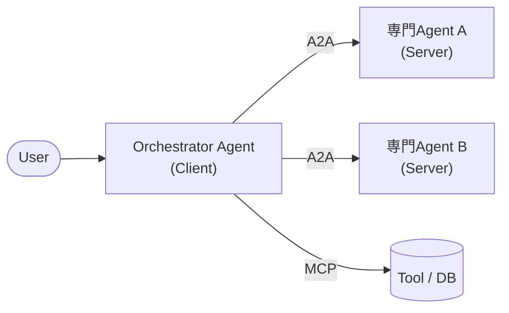
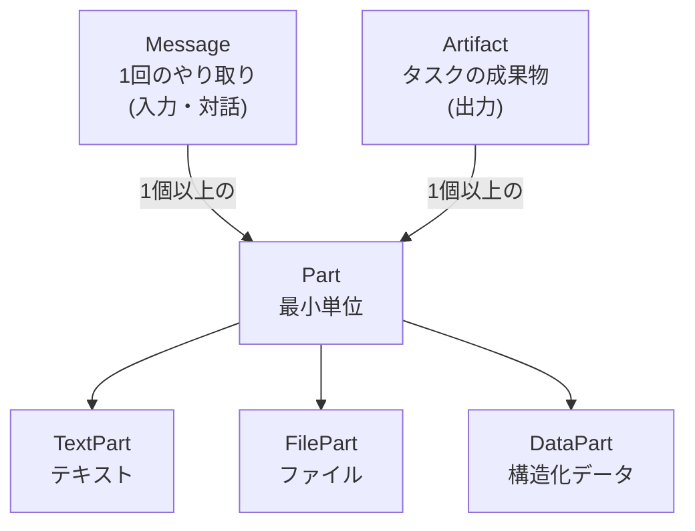
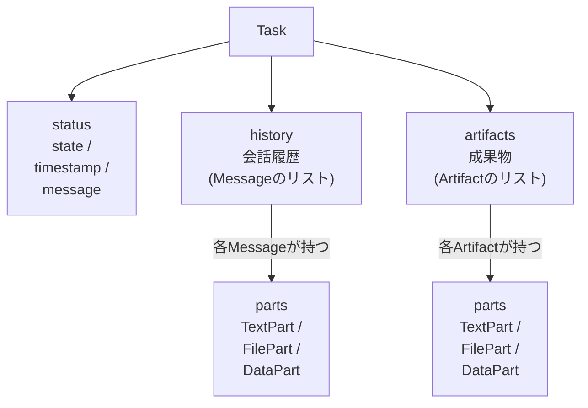
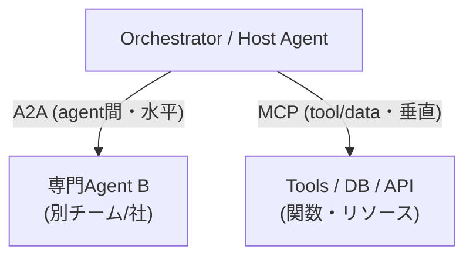

# 概要

**A2A (Agent2Agent) Protocol** は、異なるフレームワーク・ベンダー・組織で作られた **AIエージェント同士を相互接続 (interoperability) するためのオープンプロトコル**。

- **2025年4月9日** (Google Cloud Next) に Google が発表。50社以上のパートナー (Atlassian, Salesforce, SAP, ServiceNow, MongoDB, LangChain, Cohere 等) が参加。
- **2025年6月23日** (Open Source Summit North America) に **Linux Foundation** へ寄贈され、ベンダー中立のオープンガバナンスに移行。創設メンバーは **AWS, Cisco, Google, Microsoft, Salesforce, SAP, ServiceNow**。以降も参加企業は増加 (発表1年で150社超)。
- 位置づけとしては **「エージェント間 (agent ↔ agent) の水平連携」** のための標準。MCP が「エージェント ↔ ツール/データ (垂直方向)」を担うのに対し、A2A は「エージェント ↔ エージェント (水平方向)」を担う (詳細は本ノート下部の「MCP との関係・使い分け」セクションを参照)。

> 一言でいうと: **「エージェント版のHTTP/REST」**。異なる中身のエージェントを、共通の話し方 (JSON-RPC over HTTP) でつなぐ。

---

# なぜ必要か (背景)

現実の業務は複数の専門エージェントの協調で成り立つが、以下の課題があった。

- エージェントごとに **フレームワークがバラバラ** (LangGraph, CrewAI, ADK, AutoGen, Semantic Kernel...)
- ベンダー・クラウド・社内/社外の **境界を越えた連携が困難**
- 各社が独自プロトコルを作ると **N×Nの組み合わせ爆発** が起きる

A2A は共通の「話し方」を決めることで、**エージェントを内部実装を晒さずにブラックボックスのまま連携** させられる。

## 設計原則 (Design Principles)

| 原則 | 内容 |
|------|------|
| **Agentic-first** | エージェントを「ツール」ではなく、状態・記憶・自律性を持つ対等な存在として扱う。共有メモリやツールを前提としない。 |
| **Build on existing standards** | HTTP, JSON-RPC 2.0, Server-Sent Events (SSE) など既存Web標準の上に構築 |
| **Secure by default** | エンタープライズ級の認証・認可 (OpenAPI Auth 相当) を前提に設計 |
| **Support long-running tasks** | 数秒〜数時間・数日かかる非同期タスク、human-in-the-loop に対応 |
| **Modality agnostic** | テキストだけでなく、音声・映像・ファイル・構造化データ (フォーム等) を扱える |
| **Opaque execution** | エージェントは内部の思考・プラン・ツールを公開せず、宣言した能力ベースで協調する |

---

# 主要な登場人物 (Core Concepts)

## Client Agent と Remote Agent (A2A Server)

- **Client Agent (Client)**: タスクを依頼する側。ユーザーの代理として動く。
- **Remote Agent / A2A Server**: 依頼を受けて処理する側。A2Aの HTTP エンドポイントを公開する。

同じエージェントが状況によって Client にも Server にもなり得る (役割は固定ではない)。



## Agent Card (エージェントの「名刺」)

エージェントの能力・接続情報を記述した **JSON メタデータ**。A2A連携の出発点。

- 慣例的な公開場所: **`https://<host>/.well-known/agent-card.json`** (Well-Known URI 方式)
  - ※初期仕様では `/.well-known/agent.json` だったが、後に `agent-card.json` に変更された。
- 記載される主な内容:
  - `name`, `description`, `version`, `provider`
  - `url` (A2Aエンドポイント), `preferredTransport`
  - **`capabilities`**: `streaming` (SSE対応), `pushNotifications` (webhook対応) 等の対応可否
  - **`skills`**: このエージェントが提供する能力の一覧 (id, name, description, tags, examples, 入出力modality)
  - **`securitySchemes` / `security`**: 認証方式 (OAuth2, API Key, OpenID Connect 等)
  - `defaultInputModes` / `defaultOutputModes`: 対応する入出力形式 (text/plain, application/json 等)
  - `supportsAuthenticatedExtendedCard`: 認証後に詳細版カードを返せるか

```json
{
  "name": "Weather Agent",
  "description": "天気予報を提供するエージェント",
  "url": "https://weather.example.com/a2a",
  "preferredTransport": "JSONRPC",
  "version": "1.0.0",
  "capabilities": { "streaming": true, "pushNotifications": true },
  "supportsAuthenticatedExtendedCard": true,
  "defaultInputModes": ["text/plain"],
  "defaultOutputModes": ["text/plain", "application/json"],
  "securitySchemes": {
    "oauth": { "type": "oauth2", "flows": { /* ... */ } }
  },
  "security": [{ "oauth": ["weather.read"] }],
  "skills": [
    {
      "id": "get_forecast",
      "name": "天気予報取得",
      "description": "指定地域の天気予報を返す",
      "tags": ["weather", "forecast"],
      "examples": ["東京の明日の天気は？"]
    }
  ]
}
```

> **Agent Discovery (発見)** の方式は複数ある:
> - **Well-Known URI**: `/.well-known/agent-card.json` を直接叩く (最も一般的)
> - **Curated Registry / Catalog**: エンタープライズで社内エージェントを一元管理するカタログ
> - **Direct Configuration**: URLを直接設定で渡す

## Task (タスク) ― 状態を持つ作業単位

A2Aのやり取りの中心。**一意の `id` を持ち、ライフサイクル (状態機械) を持つ**。

主なステータス (`TaskState`):

| 状態 | 意味 |
|------|------|
| `submitted` | 受付済み、未着手 |
| `working` | 処理中 |
| `input-required` | 追加入力待ち (human-in-the-loop / clarification) |
| `auth-required` | 認証が必要 |
| `completed` | 正常完了 (**終端状態**) |
| `canceled` | キャンセル (**終端**) |
| `failed` | 失敗 (**終端**) |
| `rejected` | 拒否 (**終端**) |
| `unknown` | 不明 |

- 長時間タスク・非同期タスクを表現でき、`input-required` を経由して人間や別エージェントとの往復ができる。
- 同一タスク内で会話を継続する場合は `contextId` でセッション/文脈をグルーピングする。

## Message / Part / Artifact

まず **Part が「中身の最小単位」** であり、**Message と Artifact はどちらも「1つ以上の Part の集まり」** として作られる、という包含関係。

- **Part**: コンテンツの最小単位。**マルチモーダル対応の要**。JSON表現では `kind` フィールドで以下の3種類に判別される (proto上は1つの `Part` の `oneof` で text/file/data を表す)。
  - `TextPart` (`kind: "text"`, テキスト)
  - `FilePart` (`kind: "file"`, ファイル: bytes(base64)またはURI)
  - `DataPart` (`kind: "data"`, 構造化JSONデータ。フォーム入力・構造化出力など)
- **Message**: Client と Agent の間の**1回のやり取り (1通のメッセージ)**。`role` は `user` または `agent`。中身は Part の集まり (テキスト＋ファイル等を混在可能)。
- **Artifact**: タスクの**成果物** (生成されたファイル・レポート・構造化結果など)。こちらも中身は Part の集まり。

> つまり **Part は Message と Artifact に共通の「部品」**。「Artifactの一部がPart」であると同時に「Messageの一部もPart」。



これを Task 全体の構造で見ると次のようになる。



---

# 通信の仕組み (Transport & Protocol)

## トランスポート

A2A は **JSON-RPC 2.0 over HTTP(S)** をベースとする。v0.3 以降、公式トランスポートは以下の **3種類** (仕様上の値は `JSONRPC` / `GRPC` / `HTTP+JSON`):

| トランスポート (値) | 用途 |
|-------------|------|
| **JSON-RPC 2.0** (`JSONRPC`, HTTP POST) | 標準・最も一般的。1リクエスト=1メソッド呼び出し |
| **gRPC** (`GRPC`) | 高性能・型付き。Protocol Buffers |
| **HTTP+JSON / REST** (`HTTP+JSON`) | REST風のインターフェース |

- Agent Card は `preferredTransport` (単一の推奨) と `additionalInterfaces` / `supportedInterfaces` (URL+transportの組の一覧) で対応方式を宣言する。**先頭が優先**。
- **SSE (Server-Sent Events)** はトランスポートの一種ではなく、上記トランスポート上で **ストリーミング応答を配送する仕組み** (`message/stream` 等で使用。後述)。

## 主要メソッド (RPC Methods)

以下はすべて **A2A Server (Remote Agent) が公開し、Client が呼び出す (＝サーバが受信する) メソッド** で、方向は一貫して **Client → Server**。

> [!NOTE]
> 例外的に **実際のPush通知 (webhookへのHTTP POST) だけは Server → Client** で、これはメソッドではないためこの表には含まれない (`tasks/pushNotificationConfig/set` は「通知先の登録」なのでサーバ受信)。

| メソッド | 役割 |
|---------|------|
| `message/send` | メッセージを送りタスクを作成/継続 (同期・単発レスポンス) |
| `message/stream` | メッセージ送信 + **SSEでストリーミング**受信 (要 `streaming` capability) |
| `tasks/get` | タスクの現在状態・結果をポーリング取得 |
| `tasks/cancel` | タスクのキャンセル要求 |
| `tasks/resubscribe` | 切断後にSSEストリームへ再購読 |
| `tasks/pushNotificationConfig/set` | Push通知 (webhook) の設定 (登録/更新) |
| `tasks/pushNotificationConfig/get` | Push通知設定の取得 |
| `tasks/pushNotificationConfig/list` | Push通知設定の一覧取得 |
| `tasks/pushNotificationConfig/delete` | Push通知設定の削除 |
| `agent/getAuthenticatedExtendedCard` | 認証後の拡張Agent Card取得 |

## 3つのインタラクションパターン

### 1. Request/Response (同期・ポーリング)
`message/send` で送信し、短時間タスクなら即結果が返る。長時間なら `tasks/get` で状態をポーリング。

### 2. Streaming (SSE)
`message/stream` を使い、**Server-Sent Events** で進捗を逐次push。
- `Task` / `Message` イベント
- `TaskStatusUpdateEvent` (状態変化)
- `TaskArtifactUpdateEvent` (成果物の逐次生成。`append` で追記も可能)
- 生成中のトークンや中間結果をリアルタイムに流せる。

### 3. Push Notifications (Webhook / 非同期・切断耐性)
数時間〜数日かかるタスク向け。クライアントが常時接続を保てない場合に使う。
- クライアントが webhook URL を登録 (`tasks/pushNotificationConfig/set`)
- タスク完了/状態変化時に、サーバーがその URL へ HTTP POST で通知
- webhook 側は署名検証等でなりすましを防ぐ (後述のセキュリティ参照)

---

# セキュリティ (認証・認可)

A2A は **"Secure by default"** を掲げ、エンタープライズ利用を想定した認証を前提とする。詳細は MCP・Agentの認証認可 と共通の考え方。

- **トランスポートは HTTPS 必須** (本番)。
- 認証は **Agent Card の `securitySchemes`** で宣言。OpenAPI の Security Scheme 準拠:
  - OAuth 2.0 / OAuth 2.1
  - OpenID Connect (OIDC)
  - API Key
  - HTTP Bearer / Basic
- **認証はプロトコル本体の外 (out-of-band)** で行う。A2Aリクエストは標準HTTPヘッダー (`Authorization: Bearer ...`) にトークンを載せる。
- エージェントは互いを **"opaque" (中身を晒さない)** に扱うため、認証情報もペイロードではなくHTTP層で扱うのが基本。
- **Push通知のセキュリティ**: webhook URLの検証、通知の署名 (JWT署名等)、リプレイ防止が重要。

## 認可 (Authorization) の詳細

認可は **最小権限 (least privilege)・スコープベース** が基本。A2Aでは **OpenAPI 3.x とほぼ同じ「Security Scheme + Security Requirement」モデル** を Agent Card で宣言する。仕様上の正体は以下の3要素 (フィールド名は JSON 表現 = `.well-known/agent-card.json` でのもの)。

### 1. `securitySchemes` — 「どんな認証方式があるか」の定義

Agent Card トップレベルの **map (名前 → スキーム定義)**。使える方式は以下の5種類 (OpenAPI準拠)。

| スキーム (`type`) | 内容 |
|------|------|
| `apiKey` | APIキー (ヘッダー/クエリ/クッキー) |
| `http` | HTTP認証。`scheme: bearer` (JWT等) / `basic` |
| `oauth2` | OAuth 2.0 / 2.1。`flows` 内でフロー(authorizationCode/clientCredentials等)と **利用可能な `scopes` (スコープ名→説明のmap)** を定義 |
| `openIdConnect` | OIDC。`openIdConnectUrl` でdiscovery |
| `mutualTLS` | mTLS (クライアント証明書) |

### 2. `security` — 「実際に何を要求するか」(Security Requirement)

**「どのスキームで、どのスコープが必要か」を表す要件のリスト**。各要素は **`{ スキーム名: [必要スコープ...] }`** というmap。

- **配列の要素間は OR** (どれか1つを満たせばOK)
- **1つのmap内に複数スキームを書くと AND** (全部必要)
- スコープ文字列は `securitySchemes` の `oauth2.flows.*.scopes` で定義した名前を参照する

### 3. スキル単位のスコープ (`AgentSkill.security`)

**AgentCard 全体だけでなく、個々の `skill` にも `security` を付けられる** (proto上は `security_requirements`。「このスキルに必要な認証要件」)。
→ これにより **「エージェント全体はログインすれば触れるが、`refund` スキルだけは `payments.write` スコープが要る」** といった **スキル単位の最小権限** を表現できる。

```jsonc
{
  "name": "Payments Agent",
  "securitySchemes": {
    "oauth": {
      "type": "oauth2",
      "flows": {
        "authorizationCode": {
          "authorizationUrl": "https://idp.example.com/authorize",
          "tokenUrl": "https://idp.example.com/token",
          "scopes": {                         // ← 利用可能なスコープの定義(名前→説明)
            "payments.read":  "残高・履歴の参照",
            "payments.write": "送金・返金の実行"
          }
        }
      }
    }
  },
  "security": [                                // ← エージェント全体の要件 (OR)
    { "oauth": ["payments.read"] }             //   最低でも read スコープが必要
  ],
  "skills": [
    {
      "id": "get_balance", "name": "残高照会",
      "description": "口座残高を返す", "tags": ["read"],
      "security": [{ "oauth": ["payments.read"] }]
    },
    {
      "id": "refund", "name": "返金実行",
      "description": "指定取引を返金する", "tags": ["write"],
      "security": [{ "oauth": ["payments.write"] }]   // ← このスキルだけ write が必要
    }
  ]
}
```

> [!IMPORTANT]
> Agent Card はあくまで **「必要な認証を*宣言*する」だけ**。実際の **検証・拒否 (enforcement) はサーバ側の責務** で、A2Aプロトコルは認可判断そのものを規定しない。トークンは HTTP ヘッダー (`Authorization: Bearer ...`) で out-of-band に送られ、サーバは受け取ったトークンの scope/claim を見て、RBAC/ABAC やPolicy Engine (OPA/OpenFGA等) で許可判断する。→ この判断ロジックの実装は MCP・Agentの認証認可 と共通。

## エンタープライズでの考慮

- **アイデンティティ伝播**: マルチエージェントのチェーンで「誰の権限で動いているか」を保つ (Confused Deputy 問題に注意)。
- **監査 (Audit)**: どのエージェントがどのタスクを実行したかのトレーサビリティ。
- **Observability**: OpenTelemetry 等でタスク/メッセージをトレース。→ Agentのevaluation（評価）について や Langfuse 連携も検討。

---

# MCP との関係・使い分け

**A2A と MCP は競合ではなく補完関係**。両方を組み合わせるのが王道。

| 観点 | **MCP (Model Context Protocol)** | **A2A (Agent2Agent)** |
|------|----------------------------------|------------------------|
| つなぐ相手 | エージェント ↔ **ツール / データ / リソース** | エージェント ↔ **エージェント** |
| 方向 | 垂直 (agent → capabilities) | 水平 (agent ↔ agent) |
| 相手の抽象 | 構造化された関数/ツール (入出力スキーマ明確) | 自律的で opaque な対話相手 |
| 主な発案 | Anthropic | Google → Linux Foundation |
| 典型 | 「LLMにDBやAPIを触らせる」 | 「専門エージェント同士を協調させる」 |



**使い分けの指針**:
- 相手が「決まった入出力の道具」→ **MCP**
- 相手が「自分で考えて動く別のエージェント (実装・所有者が別)」→ **A2A**

---

# エコシステム / SDK / 対応フレームワーク

- **公式サイト / 仕様**: https://a2a-protocol.org/ (Linux Foundation)
- **SDK (公式・コミュニティ)**: Python (`a2a-sdk`), JavaScript/TypeScript, Java, .NET, Go 等
- **対応・連携フレームワーク**:
  - Google **ADK (Agent Development Kit)**
  - **LangChain**
  - **LangGraph**
  - **CrewAI**
  - **AutoGen**
  - **Semantic Kernel**
  - **LlamaIndex**
  - Microsoft (Azure AI Foundry / Copilot Studio) が A2A サポートを表明
- **AWS**: Bedrock AgentCore 等でエージェント間連携に A2A を採用する動き。

## 最小的な利用イメージ (Python, `a2a-sdk`)

> [!NOTE]
> 以下は **公式サンプル (`a2aproject/a2a-samples` の helloworld / langgraph) の API に合わせて検証済み** (2026-07時点)。ただし `a2a-sdk` は破壊的変更が入るため、実装時は必ず対象バージョンの公式サンプルで確認すること。特に **Client側APIは版によって差** があり、新しい版では `create_client()` + `ClientConfig` を使う書き方もある (後述)。

```python
# --- Server側: Agent Executor を実装 ---
from a2a.server.agent_execution import AgentExecutor, RequestContext
from a2a.server.events import EventQueue
from a2a.utils import new_agent_text_message

class MyExecutor(AgentExecutor):
    async def execute(self, context: RequestContext, event_queue: EventQueue) -> None:
        text = context.get_user_input()
        # ... エージェントの処理 ...
        await event_queue.enqueue_event(new_agent_text_message("結果です"))

    async def cancel(self, context: RequestContext, event_queue: EventQueue) -> None:
        raise NotImplementedError

# サーバ化 (A2AStarletteApplication) の全体像は下の LangGraph/LangChain 例を参照。
# Agent Card は /.well-known/agent-card.json で自動公開される。

# --- Client側: 相手のAgent Cardを取得して呼び出す ---
from uuid import uuid4
import httpx
from a2a.client import A2ACardResolver, A2AClient
from a2a.types import SendMessageRequest, MessageSendParams

async with httpx.AsyncClient() as httpx_client:
    resolver = A2ACardResolver(httpx_client=httpx_client, base_url="https://remote.example.com")
    card = await resolver.get_agent_card()          # /.well-known/agent-card.json を取得
    client = A2AClient(httpx_client=httpx_client, agent_card=card)

    payload = {
        "message": {
            "role": "user",                          # role は文字列 'user'/'agent'
            "parts": [{"kind": "text", "text": "東京の天気を教えて"}],
            "message_id": uuid4().hex,
        }
    }
    request = SendMessageRequest(id=str(uuid4()), params=MessageSendParams(**payload))
    response = await client.send_message(request)
    print(response.model_dump(mode="json", exclude_none=True))   # 中身を確認
    # streaming は SendStreamingMessageRequest + client.send_message_streaming(...)
```

## LangGraph エージェントを A2A Server として公開する (概念コード)

ポイントは **A2Aの `AgentExecutor` の中で LangGraph のグラフを呼ぶだけ**。グラフ本体は普段どおり作り、A2A はその「ラッパー (公開層)」として被せる。

```python
from langgraph.prebuilt import create_react_agent
from langchain_anthropic import ChatAnthropic

from a2a.server.apps import A2AStarletteApplication
from a2a.server.request_handlers import DefaultRequestHandler
from a2a.server.tasks import InMemoryTaskStore
from a2a.server.agent_execution import AgentExecutor
from a2a.utils import new_agent_text_message
from a2a.types import AgentCard, AgentCapabilities, AgentSkill

# 1) 中身は普通の LangGraph エージェント
graph = create_react_agent(
    ChatAnthropic(model="claude-opus-4-8"),
    tools=[get_weather],          # 任意のツール
    prompt="あなたは天気アシスタントです",
)

# 2) A2A の AgentExecutor でグラフを包む
class WeatherExecutor(AgentExecutor):
    async def execute(self, context, event_queue):
        user_text = context.get_user_input()
        # LangGraph を実行
        result = await graph.ainvoke(
            {"messages": [{"role": "user", "content": user_text}]}
        )
        answer = result["messages"][-1].content
        # A2A のメッセージとして返す (streaming なら逐次 enqueue)
        await event_queue.enqueue_event(new_agent_text_message(answer))

    async def cancel(self, context, event_queue):
        raise NotImplementedError

# 3) Agent Card を定義してサーバ化
agent_card = AgentCard(
    name="Weather Agent (LangGraph)",
    description="LangGraphで実装した天気エージェント",
    url="http://localhost:9999/",
    version="1.0.0",
    capabilities=AgentCapabilities(streaming=True),
    default_input_modes=["text/plain"],
    default_output_modes=["text/plain"],
    skills=[AgentSkill(
        id="get_forecast", name="天気予報取得",
        description="指定地域の天気予報を返す",
        tags=["weather"], examples=["東京の天気は？"],
    )],
)

handler = DefaultRequestHandler(
    agent_executor=WeatherExecutor(),
    task_store=InMemoryTaskStore(),
)
app = A2AStarletteApplication(agent_card=agent_card, http_handler=handler).build()
# uvicorn app:app で起動 → /.well-known/agent-card.json が公開される
```

## LangChain エージェント (AgentExecutor) を A2A Server として公開する (概念コード)

LangGraph を使わず、**LangChain 純正の `AgentExecutor`** (`create_tool_calling_agent` で作るクラシックなエージェント) を公開する場合も考え方は同じ。A2A の `AgentExecutor` の中で LangChain の実行 (`ainvoke`) を呼ぶだけ。

> [!NOTE]
> **名前の衝突に注意**。`AgentExecutor` という名前は **LangChain (`langchain.agents.AgentExecutor`＝エージェント実行ループ)** と **A2A (`a2a.server.agent_execution.AgentExecutor`＝A2Aの公開層)** の両方に存在する。下では A2A 側を `A2AAgentExecutor` に別名importして区別している。

```python
from langchain.agents import create_tool_calling_agent, AgentExecutor
from langchain_anthropic import ChatAnthropic
from langchain_core.prompts import ChatPromptTemplate

from a2a.server.apps import A2AStarletteApplication
from a2a.server.request_handlers import DefaultRequestHandler
from a2a.server.tasks import InMemoryTaskStore
# ↓ A2A側の AgentExecutor は別名にして LangChain のものと区別
from a2a.server.agent_execution import AgentExecutor as A2AAgentExecutor
from a2a.utils import new_agent_text_message
from a2a.types import AgentCard, AgentCapabilities, AgentSkill

# 1) 中身は普通の LangChain エージェント (AgentExecutor)
prompt = ChatPromptTemplate.from_messages([
    ("system", "あなたは天気アシスタントです"),
    ("human", "{input}"),
    ("placeholder", "{agent_scratchpad}"),
])
llm = ChatAnthropic(model="claude-opus-4-8")
agent = create_tool_calling_agent(llm, tools=[get_weather], prompt=prompt)
lc_executor = AgentExecutor(agent=agent, tools=[get_weather])   # ← LangChain の実行ループ

# 2) A2A の AgentExecutor で LangChain エージェントを包む
class WeatherExecutor(A2AAgentExecutor):
    async def execute(self, context, event_queue):
        user_text = context.get_user_input()
        result = await lc_executor.ainvoke({"input": user_text})   # LangChain を実行
        await event_queue.enqueue_event(new_agent_text_message(result["output"]))

    async def cancel(self, context, event_queue):
        raise NotImplementedError

# 3) Agent Card を定義してサーバ化 (LangGraph版と同一)
agent_card = AgentCard(
    name="Weather Agent (LangChain)",
    description="LangChainのAgentExecutorで実装した天気エージェント",
    url="http://localhost:9999/",
    version="1.0.0",
    capabilities=AgentCapabilities(streaming=True),
    default_input_modes=["text/plain"],
    default_output_modes=["text/plain"],
    skills=[AgentSkill(
        id="get_forecast", name="天気予報取得",
        description="指定地域の天気予報を返す",
        tags=["weather"], examples=["東京の天気は？"],
    )],
)

handler = DefaultRequestHandler(
    agent_executor=WeatherExecutor(),
    task_store=InMemoryTaskStore(),
)
app = A2AStarletteApplication(agent_card=agent_card, http_handler=handler).build()
# uvicorn app:app で起動 → /.well-known/agent-card.json が公開される
```

LangGraph版との違いは **「A2Aの `execute` の中で何を呼ぶか」だけ** (LangGraphなら `graph.ainvoke`、LangChainなら `AgentExecutor.ainvoke`)。Agent Card・サーバ起動まわりは共通。

## LangChain / LangGraph から他のA2Aエージェントを呼ぶ (Client 側)

**呼ぶ側**は、リモートエージェントを **LangChain の Tool として包む** と、LangGraph の ReAct ループから自然に使える。

```python
from uuid import uuid4
import httpx
from a2a.client import A2ACardResolver, A2AClient
from a2a.types import SendMessageRequest, MessageSendParams
from langchain_core.tools import tool
from langgraph.prebuilt import create_react_agent

async def call_remote_agent(text: str) -> str:
    async with httpx.AsyncClient() as httpx_client:
        # 1) 相手の Agent Card を取得してクライアント生成
        resolver = A2ACardResolver(httpx_client=httpx_client, base_url="https://remote.example.com")
        card = await resolver.get_agent_card()
        client = A2AClient(httpx_client=httpx_client, agent_card=card)
        # 2) message/send で問い合わせ (payload は dict、role は文字列 'user')
        payload = {"message": {
            "role": "user",
            "parts": [{"kind": "text", "text": text}],
            "message_id": uuid4().hex,
        }}
        request = SendMessageRequest(id=str(uuid4()), params=MessageSendParams(**payload))
        response = await client.send_message(request)
        # 返信の取り出し。構造は版依存なので実際は model_dump で確認するのが安全:
        #   data = response.model_dump(mode="json", exclude_none=True)
        return response.root.result.parts[0].root.text

# 3) それを LangChain Tool にして、オーケストレータのLangGraphに渡す
@tool
async def weather_agent(query: str) -> str:
    """リモートの天気エージェント(A2A)に問い合わせる"""
    return await call_remote_agent(query)

orchestrator = create_react_agent(
    ChatAnthropic(model="claude-opus-4-8"),
    tools=[weather_agent],       # A2Aエージェントを「ツール」として合成
)
```

> [!NOTE]
> **LangChainとLangGraphの役割**: **LangGraph** は「グラフ本体の実装」、**LangChain** は「Tool 化やモデル/メッセージの取り回し」を担う層で、上のコードは両者を併用している。どちらか一方だけでも実装可能。
>
> **コードの検証状況 (2026-07時点)**: 上記のServer側 (`AgentExecutor` / `A2AStarletteApplication` / `DefaultRequestHandler`)・Client側 (`A2ACardResolver` / `A2AClient` / `SendMessageRequest`+`MessageSendParams`) の API は、公式サンプル `a2aproject/a2a-samples` (helloworld / langgraph) に照合済み。ただし以下に注意:
> - **本番のExecutorは `TaskUpdater` を使うのが定石**。実サンプルの `execute()` は `new_agent_text_message` を単純にenqueueするだけでなく、`updater = TaskUpdater(event_queue, task.id, task.context_id)` を作り `updater.update_status(...)` → `updater.add_artifact(...)` → `updater.complete()` でタスクのライフサイクル (working→completed) と成果物(Artifact)を明示的に管理する。上のコードは説明用に簡略化している。
> - **Client APIは版差が大きい**。新しい `a2a-sdk` では `A2AClient(...)` の代わりに `from a2a.client import create_client, ClientConfig` → `client = await create_client(agent=card, client_config=ClientConfig(streaming=False))` を使い、`send_message` が **async iterator (chunkを逐次yield)** を返す書き方もある。使用バージョンのサンプルで必ず確認すること。
> - `send_message` の戻り値構造 (`response.root.result...`) は壊れやすいので、実際は `response.model_dump(mode="json", exclude_none=True)` で中身を確認してから取り出すのが安全。

---

# 実務上の注意点・ハマりどころ

- **Agent Card のパス変更**: 旧 `/.well-known/agent.json` → 新 `/.well-known/agent-card.json`。古い記事・実装と食い違うことがある。
- **バージョン差異**: 仕様は活発に更新中 (v0.x 系)。メソッド名やフィールド名が変わることがある。実装時は対象バージョンを固定して確認する。
- **タスクの終端状態を正しく扱う**: `completed`/`failed`/`canceled`/`rejected` は終端。`input-required` で止まったまま放置しない (タイムアウト設計)。
- **長時間タスクは Push通知 or resubscribe 前提で設計** する。SSE接続の切断に耐えられるように。
- **セキュリティを後回しにしない**: 社外エージェント連携では認証・スコープ・監査を最初から。→ MCP・Agentの認証認可
- **MCPと役割を混同しない**: 「ツールならMCP、自律エージェントならA2A」を判断軸に。

---

# 参考リンク・出典

## 公式・仕様
- 公式サイト: https://a2a-protocol.org/
- GitHub (Linux Foundation `a2aproject`): https://github.com/a2aproject/A2A
- 仕様書 (Specification): https://a2a-protocol.org/latest/specification/
- **正式な型定義 (normative)** `specification/a2a.proto`: https://github.com/a2aproject/A2A/blob/main/specification/a2a.proto
  - ↑ AgentCard / AgentSkill / SecurityScheme / SecurityRequirement の権威ある定義。本ノートの「認可の詳細」「Agent Card」節はこれに照合済み。
- Google 発表ブログ (2025/04): "Announcing the Agent2Agent Protocol (A2A)"
- Linux Foundation 移管発表 (2025/06)

## サンプルコード (本ノートのPythonコードの照合先)
- サンプル集リポジトリ: https://github.com/a2aproject/a2a-samples
- helloworld エージェント (`AgentExecutor` の最小実装): https://github.com/a2aproject/a2a-samples/tree/main/samples/python/agents/helloworld
- **LangGraph エージェント** (`AgentExecutor`/`TaskUpdater`/サーバ化/クライアント): https://github.com/a2aproject/a2a-samples/tree/main/samples/python/agents/langgraph

## チュートリアル (公式)
- Agent Executor (Server側): https://a2a-protocol.org/latest/tutorials/python/4-agent-executor/
- Interact with Server (Client側): https://a2a-protocol.org/latest/tutorials/python/6-interact-with-server/

> [!NOTE]
> 本ノートのコード・認可仕様は **2026-07時点** で上記の公式ソースに照合済み。ただし `a2a-sdk` / 仕様 (v0.x系) は破壊的変更が入るため、実装時は対象バージョンの上記リンクで再確認すること。

---

## 関連ノート
- MCP・Agentの認証認可
- AIアプリ(Agent含む)を開発する前の考慮すべき点
- Agentのevaluation（評価）について
