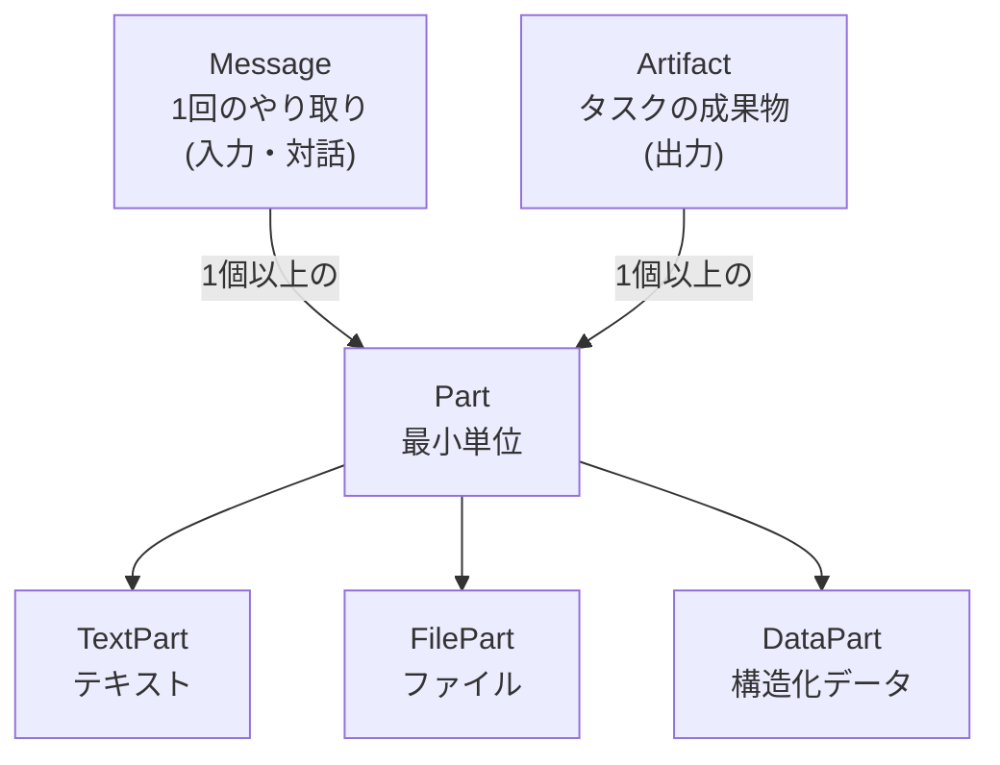
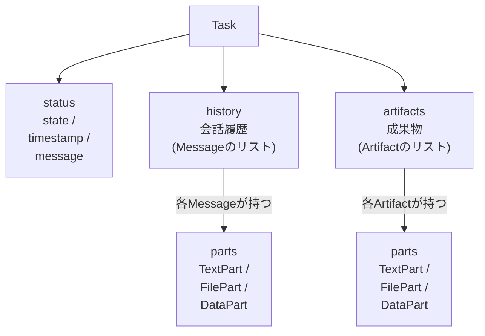
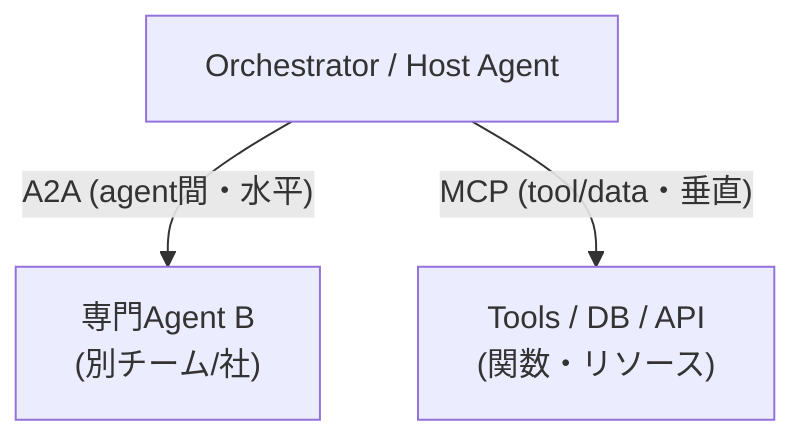

# 概要

**A2A (Agent2Agent) Protocol** は、異なるフレームワーク・ベンダー・組織で作られた **AIエージェント同士を相互接続 (interoperability) するためのオープンプロトコル**。

- **2025年4月9日** (Google Cloud Next) に Google が発表。50社以上のパートナー (Atlassian, Salesforce, SAP, ServiceNow, MongoDB, LangChain, Cohere 等) が参加。
- **2025年6月23日** (Open Source Summit North America) に **Linux Foundation** へ寄贈され、ベンダー中立のオープンガバナンスに移行。創設メンバーは **AWS, Cisco, Google, Microsoft, Salesforce, SAP, ServiceNow**。以降も参加企業は増加 (発表1年で150社超)。
- **2026年3月10日に v1.0 が公開** (現行の安定版)。コアデータモデル/プロトコルバインディングが安定化。**v0.3 → v1.0 で wire フォーマットに破壊的変更**あり (メソッド名・Partのエンコード・AgentCardのインターフェース宣言など。詳細は後述の「バージョン (v0.3 → v1.0)」)。ただし **AgentCard は後方互換**に進化し、`protocolVersions` で v0.3/v1.0 両対応を宣言できるため、段階移行が可能。
- 位置としては **「エージェント間 (agent ↔ agent) の水平連携」** のための標準。MCP が「エージェント ↔ ツール/データ (垂直方向)」を担うのに対し、A2A は「エージェント ↔ エージェント (水平方向)」を担う (詳細は本ノート下部の「MCP との関係・使い分け」セクションを参照)。

> 一言でいうと: **「エージェント版のHTTP/REST」**。異なる中身のエージェントを、共通の話し方 (JSON-RPC / gRPC / REST) でつなぐ。

> [!IMPORTANT]
> **本ノートの表記方針**: 概念説明は **v1.0 を基準**に、随所で **v0.3 (legacy) の名称も併記**する。Python の `a2a-sdk` サンプルコードは **最新の 1.x 系 (1.1.0) の API** で記載 (`create_client` / `Message`+`Part` / `TaskUpdater` 等)。v0.3スタイル (`A2AClient` / `MessageSendParams` / `{"kind":"text"}`) は現在 `a2a.compat.v0_3` 配下の後方互換。実装時は使用する `a2a-sdk` / 対象エージェントの `protocolVersions` を必ず確認すること。

---

# バージョンと互換性 (v0.3 → v1.0)

v1.0 (2026-03-10) で **JSON表現 (wire フォーマット) に破壊的変更**が入った。仕様は3層構造 (**Layer 1**: Protocol Buffers によるコアデータ定義 / **Layer 2**: 能力・振る舞い / **Layer 3**: 具体的バインディング = JSON-RPC・gRPC・HTTP+JSON) で整理され、JSON-RPCのメソッド名などが Layer 1 の proto 定義に揃えられた。

主な変更点:

| 項目 | v0.3 (legacy) | v1.0 (current) |
|------|--------------|----------------|
| JSON-RPCメソッド名 | `message/send`, `tasks/get`, `tasks/cancel` … | `SendMessage`, `GetTask`, `CancelTask` … (PascalCase, proto準拠) |
| リクエスト型名 | `MessageSendParams` | `SendMessageRequest` |
| TextPart | `{"kind":"text","text":"..."}` | `{"text":"..."}` (メンバの有無で判別) |
| FilePart | `{"kind":"file","file":{...}}` | `{"raw":"...", "filename":"...", "mediaType":"..."}` (or `url`) |
| DataPart | `{"kind":"data","data":{...}}` | `{"data":{...}, "mediaType":"application/json"}` |
| ストリームイベント | `{"kind":"status-update", ...}` | `{"statusUpdate":{...}}` / `{"artifactUpdate":{...}}` |
| AgentCardのインターフェース宣言 | `url` + `preferredTransport` + `additionalInterfaces` | `supportedInterfaces` 配列 (先頭が優先。各要素に `protocolBinding`/`protocolVersion`) |
| 拡張カードの対応可否 | top-level `supportsAuthenticatedExtendedCard` | `capabilities.extendedAgentCard` |
| 拡張カード取得メソッド | `agent/getAuthenticatedExtendedCard` | `GetExtendedAgentCard` |

> [!NOTE]
> - legacy名は **少なくとも 0.5.0 までは解決可能 (残す)** と仕様の移行付録に明記されている。現行 `a2a-sdk` / サンプルもまだ v0.3スタイルを受け付ける。
> - 互換は **AgentCard の `protocolVersions`** で宣言し、クライアントは `A2A-Version` ヘッダ等でネゴシエートする。
> - 以降の各節では、まず概念を述べ、必要な箇所で「v0.3では〜」と注記する。

---

# なぜ必要か (背景)

現実の業務は複数の専門エージェントの協調で成り立つが、以下の課題があった。

- エージェントごとに **フレームワークがバラバラ** (LangGraph, CrewAI, ADK, AutoGen, Semantic Kernel...)
- ベンダー・クラウド・社内/社外の **境界を越えた連携が困難**
- 各社が独自プロトコルを作ると **N×Nの組み合わせ爆発** が起きる

A2A は共通の「話し方」を決めることで、**エージェントを内部実装を晒さずにブラックボックスのまま連携** させられる。

## 設計原則 (Design Principles)

| 原則 | 内容 |
|------|------|
| **Agentic-first** | エージェントを「ツール」ではなく、状態・記憶・自律性を持つ対等な存在として扱う。共有メモリやツールを前提としない。 |
| **Build on existing standards** | HTTP, JSON-RPC 2.0, Server-Sent Events (SSE) など既存Web標準の上に構築 |
| **Secure by default** | エンタープライズ級の認証・認可 (OpenAPI Auth 相当) を前提に設計 |
| **Support long-running tasks** | 数秒〜数時間・数日かかる非同期タスク、human-in-the-loop に対応 |
| **Modality agnostic** | テキストだけでなく、音声・映像・ファイル・構造化データ (フォーム等) を扱える |
| **Opaque execution** | エージェントは内部の思考・プラン・ツールを公開せず、宣言した能力ベースで協調する |

---

# 主要な登場人物 (Core Concepts)

## Client Agent と Remote Agent (A2A Server)

- **Client Agent (Client)**: タスクを依頼する側。ユーザーの代理として動く。
- **Remote Agent / A2A Server**: 依頼を受けて処理する側。A2Aの HTTP エンドポイントを公開する。

同じエージェントが状況によって Client にも Server にもなり得る (役割は固定ではない)。


## Agent Card (エージェントの「名刺」)

エージェントの能力・接続情報を記述した **JSON メタデータ**。A2A連携の出発点。

- 慣例的な公開場所: **`https://<host>/.well-known/agent-card.json`** (Well-Known URI 方式)
  - ※初期仕様では `/.well-known/agent.json` だったが、後に `agent-card.json` に変更された。
- 記載される主な内容:
  - `name`, `description`, `version`, `provider`
  - `supportedInterfaces` (v1.0。URL+transportの組の一覧、先頭が優先) ／ v0.3では `url` + `preferredTransport`
  - **`capabilities`**: `streaming` (SSE対応), `pushNotifications` (webhook対応), `extendedAgentCard` (認証後に詳細版カードを返せるか) 等の対応可否
  - **`skills`**: このエージェントが提供する能力の一覧 (id, name, description, tags, examples, 入出力modality, スキル単位の `security`)
  - **`securitySchemes` / `security`**: 認証方式 (OAuth2, API Key, OpenID Connect 等)
  - `defaultInputModes` / `defaultOutputModes`: 対応する入出力形式 (text/plain, application/json 等)
  - `protocolVersions`: 対応するA2Aバージョン (v0.3/v1.0 両対応の宣言に使う)

**v1.0 スタイル** (`supportedInterfaces` + `capabilities.extendedAgentCard`):

```json
{
  "name": "Weather Agent",
  "description": "天気予報を提供するエージェント",
  "version": "1.0.0",
  "supportedInterfaces": [
    { "url": "https://weather.example.com/a2a/v1", "protocolBinding": "JSONRPC", "protocolVersion": "1.0" }
  ],
  "capabilities": {
    "streaming": true,
    "pushNotifications": true,
    "extendedAgentCard": true
  },
  "defaultInputModes": ["text/plain"],
  "defaultOutputModes": ["text/plain", "application/json"],
  "securitySchemes": {
    "oauth": { "type": "oauth2", "flows": { /* ... */ } }
  },
  "security": [{ "oauth": ["weather.read"] }],
  "skills": [
    {
      "id": "get_forecast",
      "name": "天気予報取得",
      "description": "指定地域の天気予報を返す",
      "tags": ["weather", "forecast"],
      "examples": ["東京の明日の天気は？"]
    }
  ]
}
```

> [!NOTE]
> **v0.3 (legacy) との差**: v0.3では `supportedInterfaces` の代わりに top-level `"url"` + `"preferredTransport": "JSONRPC"`、`extendedAgentCard` の代わりに top-level `"supportsAuthenticatedExtendedCard": true` を書いていた。後方互換のため当面は旧フィールドも解決可能。

> **Agent Discovery (発見)** の方式は複数ある:
> - **Well-Known URI**: `/.well-known/agent-card.json` を直接叩く (最も一般的)
> - **Curated Registry / Catalog**: エンタープライズで社内エージェントを一元管理するカタログ
> - **Direct Configuration**: URLを直接設定で渡す

## Task (タスク) ― 状態を持つ作業単位
https://a2a-protocol.org/latest/topics/life-of-a-task/

A2Aのやり取りの中心。**一意の `id` を持ち、ライフサイクル (状態機械) を持つ**。

主なステータス (`TaskState`):

| 状態 | 意味 |
|------|------|
| `submitted` | 受付済み、未着手 |
| `working` | 処理中 |
| `input-required` | 追加入力待ち (human-in-the-loop / clarification) |
| `auth-required` | 認証が必要 |
| `completed` | 正常完了 (**終端状態**) |
| `canceled` | キャンセル (**終端**) |
| `failed` | 失敗 (**終端**) |
| `rejected` | 拒否 (**終端**) |
| `unknown` | 不明 |

- 長時間タスク・非同期タスクを表現でき、`input-required` を経由して人間や別エージェントとの往復ができる。
- 同一タスク内で会話を継続する場合は `contextId` でセッション/文脈をグルーピングする。

## Message / Part / Artifact

まず **Part が「中身の最小単位」** であり、**Message と Artifact はどちらも「1つ以上の Part の集まり」** として作られる、という包含関係。

- **Part**: コンテンツの最小単位。**マルチモーダル対応の要**。以下の3種類 (proto上は1つの `Part` の `oneof` で text/file/data を表す)。**v1.0ではメンバの有無で種別を判別**し、**v0.3では `kind` フィールドで判別**していた。
  - `TextPart` (テキスト) — v1.0: `{"text":"..."}` / v0.3: `{"kind":"text","text":"..."}`
  - `FilePart` (ファイル: bytes(base64)またはURI) — v1.0: `{"raw":"...", "filename":"...", "mediaType":"..."}` (or `url`) / v0.3: `{"kind":"file","file":{...}}`
  - `DataPart` (構造化JSONデータ。フォーム入力・構造化出力など) — v1.0: `{"data":{...}, "mediaType":"application/json"}` / v0.3: `{"kind":"data","data":{...}}`
- **Message**: Client と Agent の間の**1回のやり取り (1通のメッセージ)**。`role` は `user` または `agent`。中身は Part の集まり (テキスト＋ファイル等を混在可能)。
- **Artifact**: タスクの**成果物** (生成されたファイル・レポート・構造化結果など)。こちらも中身は Part の集まり。

> つまり **Part は Message と Artifact に共通の「部品」**。「Artifactの一部がPart」であると同時に「Messageの一部もPart」。



これを Task 全体の構造で見ると次のようになる。



---

# 通信の仕組み (Transport & Protocol)

## トランスポート

A2A の公式トランスポート (protocol binding) は以下の **3種類** (仕様上の値は `JSONRPC` / `GRPC` / `HTTP+JSON`):

| トランスポート (値) | 用途 |
|-------------|------|
| **JSON-RPC 2.0** (`JSONRPC`, HTTP POST) | 標準・最も一般的。1リクエスト=1メソッド呼び出し |
| **gRPC** (`GRPC`) | 高性能・型付き。Protocol Buffers |
| **HTTP+JSON / REST** (`HTTP+JSON`) | REST風のインターフェース |

- **v1.0**: Agent Card は **`supportedInterfaces`** 配列で対応方式を宣言する。各要素は `{ url, protocolBinding, protocolVersion }` で、**先頭が優先**。
  - **v0.3 (legacy)**: `url` + `preferredTransport` (単一の推奨) + `additionalInterfaces` (追加の組) という別々のフィールドだった。
- **SSE (Server-Sent Events)** はトランスポートの一種ではなく、上記トランスポート上で **ストリーミング応答を配送する仕組み** (`SendStreamingMessage` / 旧 `message/stream` 等で使用。後述)。

## 主要メソッド (RPC Methods)

以下はすべて **A2A Server (Remote Agent) が公開し、Client が呼び出す (＝サーバが受信する) メソッド** で、方向は一貫して **Client → Server**。**メソッド名は v1.0 (PascalCase) を主に、括弧内に v0.3 (legacy) 名を併記**。

> [!NOTE]
> 例外的に **実際のPush通知 (webhookへのHTTP POST) だけは Server → Client** で、これはメソッドではないためこの表には含まれない (`CreateTaskPushNotificationConfig` は「通知先の登録」なのでサーバ受信)。

| メソッド (v1.0 / v0.3) | 役割 |
|---------|------|
| `SendMessage` (旧 `message/send`) | メッセージを送りタスクを作成/継続 (同期・単発レスポンス) |
| `SendStreamingMessage` (旧 `message/stream`) | メッセージ送信 + **SSEでストリーミング**受信 (要 `streaming` capability) |
| `GetTask` (旧 `tasks/get`) | タスクの現在状態・結果をポーリング取得 |
| `ListTasks` | タスク一覧の取得 |
| `CancelTask` (旧 `tasks/cancel`) | タスクのキャンセル要求 |
| `SubscribeToTask` (旧 `tasks/resubscribe`) | 切断後にSSEストリームへ再購読 |
| `CreateTaskPushNotificationConfig` (旧 `tasks/pushNotificationConfig/set`) | Push通知 (webhook) の設定 (登録/更新) |
| `GetTaskPushNotificationConfig` (旧 `tasks/pushNotificationConfig/get`) | Push通知設定の取得 |
| `ListTaskPushNotificationConfigs` (旧 `tasks/pushNotificationConfig/list`) | Push通知設定の一覧取得 |
| `DeleteTaskPushNotificationConfig` (旧 `tasks/pushNotificationConfig/delete`) | Push通知設定の削除 |
| `GetExtendedAgentCard` (旧 `agent/getAuthenticatedExtendedCard`) | 認証後の拡張Agent Card取得 |

> [!IMPORTANT]
> ### ■ 「メソッドごとに別エンドポイント」ではない (トランスポート次第)
> - **JSON-RPC** (最も一般的): 
>    - **単一エンドポイント** (例 `POST /`)。どのメソッドかは **body の `"method": "SendMessage"`** で指定し、サーバ側でディスパッチする。URLはメソッドごとに分けない。ストリーミングも同じ口でSSE。
> - **gRPC**: 
>    - 1つのgRPCサービスのメソッドとして呼ぶ。
> - **HTTP+JSON / REST**:
>    - **操作ごとに別パス** (`POST /message:send`, `GET /tasks/{id}`, `POST /tasks/{id}:cancel`, `GET /extendedAgentCard` …)。
>    - **RESTだけは「メソッド≒パス」**。
>
> ### ■ どのバインディングで公開するかも a2a-sdk で選べる(JSON-RPCが既定・最も一般的)
> - `create_jsonrpc_routes(...)` → **JSON-RPC** (単一エンドポイント)
> - `create_rest_routes(...)` → **REST (HTTP+JSON)** (操作ごとの別パス)
> - `create_agent_card_routes(...)` → Agent Card 配信 / `add_a2a_routes_to_fastapi(...)` → FastAPIに載せる補助
>
> ### ■ 実装の手間
> - **a2a-sdk を使う場合**: 
>   - 上記の `create_*_routes` が**ルーティングを自動生成**。さらに `DefaultRequestHandler` が `GetTask`/`CancelTask`/`ListTasks` などを **`TaskStore` で既定実装**し、`SendMessage`/streaming だけを **あなたの `AgentExecutor.execute()`** に委譲する。→ **実質 `execute()` と `cancel()` を書くだけ**。
> - **SDKを使わず自前でラップする場合** (素のLangChain/LangGraphを公開): 
>    - JSON-RPCなら **エンドポイントは1つでよく**、body の `method` を見て自分でディスパッチする。ただし **Agent Card配信 + 宣言した `capabilities` の各メソッドの中身** (レスポンス型の整形・SSE・エラーコード等) は全部自前で実装が必要。全メソッド必須ではなく **`capabilities` で宣言した範囲だけ**でよいが、手間が大きいので **a2a-sdk でのラップが実務上おすすめ**。

## 3つのインタラクションパターン

### 1. Request/Response (同期・ポーリング)
`SendMessage` (旧 `message/send`) で送信し、短時間タスクなら即結果が返る。長時間なら `GetTask` (旧 `tasks/get`) で状態をポーリング。

### 2. Streaming (SSE)
`SendStreamingMessage` (旧 `message/stream`) を使い、**Server-Sent Events** で進捗を逐次push。
- `Task` / `Message` イベント
- `TaskStatusUpdateEvent` (状態変化。v1.0 wireは `{"statusUpdate":{...}}`)
- `TaskArtifactUpdateEvent` (成果物の逐次生成。`append` で追記も可能。v1.0 wireは `{"artifactUpdate":{...}}`)
- 生成中のトークンや中間結果をリアルタイムに流せる。

### 3. Push Notifications (Webhook / 非同期・切断耐性)
数時間〜数日かかるタスク向け。クライアントが常時接続を保てない場合に使う。
- クライアントが webhook URL を登録 (`CreateTaskPushNotificationConfig` / 旧 `tasks/pushNotificationConfig/set`)
- タスク完了/状態変化時に、サーバーがその URL へ HTTP POST で通知
- webhook 側は署名検証等でなりすましを防ぐ (後述のセキュリティ参照)

---

# セキュリティ (認証・認可)

A2A は **"Secure by default"** を掲げ、エンタープライズ利用を想定した認証を前提とする。詳細は MCP・Agentの認証認可 と共通の考え方。

- **トランスポートは HTTPS 必須** (本番)。
- 認証は **Agent Card の `securitySchemes`** で宣言。OpenAPI の Security Scheme 準拠:
  - OAuth 2.0 / OAuth 2.1
  - OpenID Connect (OIDC)
  - API Key
  - HTTP Bearer / Basic
- **認証はプロトコル本体の外 (out-of-band)** で行う。A2Aリクエストは標準HTTPヘッダー (`Authorization: Bearer ...`) にトークンを載せる。
- エージェントは互いを **"opaque" (中身を晒さない)** に扱うため、認証情報もペイロードではなくHTTP層で扱うのが基本。
- **Push通知のセキュリティ**: webhook URLの検証、通知の署名 (JWT署名等)、リプレイ防止が重要。

## 認可 (Authorization) の詳細

認可は **最小権限 (least privilege)・スコープベース** が基本。A2Aでは **OpenAPI 3.x とほぼ同じ「Security Scheme + Security Requirement」モデル** を Agent Card で宣言する。仕様上の正体は以下の3要素 (フィールド名は JSON 表現 = `.well-known/agent-card.json` でのもの)。

### 1. `securitySchemes` — 「どんな認証方式があるか」の定義

Agent Card トップレベルの **map (名前 → スキーム定義)**。使える方式は以下の5種類 (OpenAPI準拠)。

| スキーム (`type`) | 内容 |
|------|------|
| `apiKey` | APIキー (ヘッダー/クエリ/クッキー) |
| `http` | HTTP認証。`scheme: bearer` (JWT等) / `basic` |
| `oauth2` | OAuth 2.0 / 2.1。`flows` 内でフロー(authorizationCode/clientCredentials等)と **利用可能な `scopes` (スコープ名→説明のmap)** を定義 |
| `openIdConnect` | OIDC。`openIdConnectUrl` でdiscovery |
| `mutualTLS` | mTLS (クライアント証明書) |

### 2. `security` — 「実際に何を要求するか」(Security Requirement)

**「どのスキームで、どのスコープが必要か」を表す要件のリスト**。各要素は **`{ スキーム名: [必要スコープ...] }`** というmap。

- **配列の要素間は OR** (どれか1つを満たせばOK)
- **1つのmap内に複数スキームを書くと AND** (全部必要)
- スコープ文字列は `securitySchemes` の `oauth2.flows.*.scopes` で定義した名前を参照する

### 3. スキル単位のスコープ (`AgentSkill.security`)

**AgentCard 全体だけでなく、個々の `skill` にも `security` を付けられる** (proto上は `security_requirements`。「このスキルに必要な認証要件」)。
→ これにより **「エージェント全体はログインすれば触れるが、`refund` スキルだけは `payments.write` スコープが要る」** といった **スキル単位の最小権限** を表現できる。

```jsonc
{
  "name": "Payments Agent",
  "securitySchemes": {
    "oauth": {
      "type": "oauth2",
      "flows": {
        "authorizationCode": {
          "authorizationUrl": "https://idp.example.com/authorize",
          "tokenUrl": "https://idp.example.com/token",
          "scopes": {                         // ← 利用可能なスコープの定義(名前→説明)
            "payments.read":  "残高・履歴の参照",
            "payments.write": "送金・返金の実行"
          }
        }
      }
    }
  },
  "security": [                                // ← エージェント全体の要件 (OR)
    { "oauth": ["payments.read"] }             //   最低でも read スコープが必要
  ],
  "skills": [
    {
      "id": "get_balance", "name": "残高照会",
      "description": "口座残高を返す", "tags": ["read"],
      "security": [{ "oauth": ["payments.read"] }]
    },
    {
      "id": "refund", "name": "返金実行",
      "description": "指定取引を返金する", "tags": ["write"],
      "security": [{ "oauth": ["payments.write"] }]   // ← このスキルだけ write が必要
    }
  ]
}
```

> [!IMPORTANT]
> Agent Card はあくまで **「必要な認証を*宣言*する」だけ**。実際の **検証・拒否 (enforcement) はサーバ側の責務** で、A2Aプロトコルは認可判断そのものを規定しない。トークンは HTTP ヘッダー (`Authorization: Bearer ...`) で out-of-band に送られ、サーバは受け取ったトークンの scope/claim を見て、RBAC/ABAC やPolicy Engine (OPA/OpenFGA等) で許可判断する。→ この判断ロジックの実装は MCP・Agentの認証認可 と共通。

## エンタープライズでの考慮

- **アイデンティティ伝播**: マルチエージェントのチェーンで「誰の権限で動いているか」を保つ (Confused Deputy 問題に注意)。
- **監査 (Audit)**: どのエージェントがどのタスクを実行したかのトレーサビリティ。
- **Observability**: OpenTelemetry 等でタスク/メッセージをトレース。→ Agentのevaluation（評価）について や Langfuse 連携も検討。

---

# MCP との関係・使い分け

**A2A と MCP は競合ではなく補完関係**。両方を組み合わせるのが王道。

| 観点 | **MCP (Model Context Protocol)** | **A2A (Agent2Agent)** |
|------|----------------------------------|------------------------|
| つなぐ相手 | エージェント ↔ **ツール / データ / リソース** | エージェント ↔ **エージェント** |
| 方向 | 垂直 (agent → capabilities) | 水平 (agent ↔ agent) |
| 相手の抽象 | 構造化された関数/ツール (入出力スキーマ明確) | 自律的で opaque な対話相手 |
| 主な発案 | Anthropic | Google → Linux Foundation |
| 典型 | 「LLMにDBやAPIを触らせる」 | 「専門エージェント同士を協調させる」 |



**使い分けの指針**:
- 相手が「決まった入出力の道具」→ **MCP**
- 相手が「自分で考えて動く別のエージェント (実装・所有者が別)」→ **A2A**

---

# エコシステム / SDK / 対応フレームワーク

- **公式サイト / 仕様**: https://a2a-protocol.org/ (Linux Foundation)
- **SDK (公式・コミュニティ)**: Python (`a2a-sdk`), JavaScript/TypeScript, Java, .NET, Go 等
- **対応・連携フレームワーク**:
  - Google **ADK (Agent Development Kit)**
  - **LangChain**
  - **LangGraph**
  - **CrewAI**
  - **AutoGen**
  - **Semantic Kernel**
  - **LlamaIndex**
  - Microsoft (Azure AI Foundry / Copilot Studio) が A2A サポートを表明
- **AWS**: Bedrock AgentCore 等でエージェント間連携に A2A を採用する動き。

## 最小的な利用イメージ (Python, `a2a-sdk` 1.x)

> [!NOTE]
> 以下は **`a2a-sdk` 1.1.0 (2026-07時点の最新, v1.x系) の実ソースに照合済み**。1.x では v0.3 から Client/メッセージAPIが変わっている (`A2AClient`/`MessageSendParams`/`{"kind":"text"}` は v0.3 で、現在は **`a2a.compat.v0_3`** 配下の後方互換扱い)。現行の要点:
> - **Client生成**: `create_client(url or AgentCard)` (内部で Card 解決)
> - **メッセージ**: `Message(role=Role.ROLE_USER, parts=[Part(text=...)])` — Partは `Part(text=...)` (メンバ判別)
> - **送信**: `client.send_message(SendMessageRequest(message=...))` は **`StreamResponse` の async iterator を返す** → `async for` で受ける
> - **サーバ送出**: `new_agent_text_message` は廃止 → **`TaskUpdater`** を使う

```python
# --- Server側: Agent Executor を実装 ---
from a2a.server.agent_execution import AgentExecutor, RequestContext
from a2a.server.events import EventQueue
from a2a.server.tasks import TaskUpdater
from a2a.types import Part

class MyExecutor(AgentExecutor):
    async def execute(self, context: RequestContext, event_queue: EventQueue) -> None:
        text = context.get_user_input()
        updater = TaskUpdater(event_queue, context.task_id, context.context_id)
        await updater.start_work()                       # -> working
        # ... エージェントの処理 ...
        # 成果は Message か Artifact として返す。単発の返信メッセージなら:
        await updater.complete(updater.new_agent_message([Part(text="結果です")]))

    async def cancel(self, context: RequestContext, event_queue: EventQueue) -> None:
        raise NotImplementedError

# サーバ化 (routes を組んで ASGI アプリ化) の全体像は下の LangChain/LangGraph 例を参照。
# Agent Card は /.well-known/agent-card.json で自動公開される。

# --- Client側: 相手のAgent Cardを取得して呼び出す ---
from uuid import uuid4
from a2a.client import create_client
from a2a.types import Message, Part, Role, SendMessageRequest

# 引数は「相手(リモートA2Aエージェント=サーバ)のベースURL」。
# create_client が内部で <base>/.well-known/agent-card.json を取得して Card を解決し、
# 実際の送信先は Card 内の supported_interfaces[].url になる。取得済み AgentCard を直接渡してもよい。
client = await create_client("https://remote.example.com")
msg = Message(
    role=Role.ROLE_USER,
    parts=[Part(text="東京の天気を教えて")],
    message_id=uuid4().hex,
)
# send_message は StreamResponse の async iterator を返す (非ストリーミングでも1件流れる)
async for event in client.send_message(SendMessageRequest(message=msg)):
    print(event)   # event は Task / Message / TaskStatusUpdateEvent / TaskArtifactUpdateEvent
```

## LangChain / LangGraph エージェントを A2A Server として公開する (概念コード)

ポイントは **A2Aの `AgentExecutor` の中で、エージェント本体 (グラフ) を呼ぶだけ**。エージェントは普段どおり作り、A2A はその「ラッパー (公開層)」として被せる。

> [!NOTE]
> **なぜ「LangChain / LangGraph」で1つの例なのか**: `create_agent` (langchain.agents) は **内部が LangGraph で、返り値は `CompiledStateGraph`** — つまり LangGraph の `create_react_agent` や、自分で `StateGraph` を組んで `.compile()` したものと **同じ型・同じ呼び出しインターフェース** (`.ainvoke({"messages": [...]})`)。A2A側は `.ainvoke` を呼ぶだけなので、**どれで作っても公開手順は共通**。だから1つの例で足りる。
> ※ 例外: 独自の state schema で組んだLangGraphグラフは、入力キーが `{"messages": ...}` と異なることがある。その場合は `ainvoke` に渡す dict を実際のstateに合わせる。

> [!IMPORTANT]
> **LangChain 1.0 (2025-10-22) で agent 作成APIは `create_agent` に統一された**。旧 `langgraph.prebuilt.create_react_agent` は非推奨、`AgentExecutor`/`create_tool_calling_agent`/`initialize_agent` は `langchain-classic` へ移動。いずれも `CompiledStateGraph` を返す点は同じなので、旧コードは概ね差し替えで移行できる。

```python
from langchain.agents import create_agent   # LangChain 1.0 の統一API (返り値は CompiledStateGraph)

from starlette.applications import Starlette
from a2a.server.request_handlers import DefaultRequestHandler
from a2a.server.tasks import InMemoryTaskStore, TaskUpdater
from a2a.server.agent_execution import AgentExecutor
from a2a.server.routes import create_agent_card_routes, create_jsonrpc_routes
from a2a.types import AgentCard, AgentInterface, AgentCapabilities, AgentSkill, Part

# 1) 中身は普通のエージェント。
#    ★ LangChain と LangGraph でサンプルを分けていないのは、どちらも「同じ型」を返すから:
#      - create_agent(langchain.agents)          -> CompiledStateGraph  ← 本例
#      - create_react_agent(langgraph.prebuilt)  -> CompiledStateGraph  (同じ型)
#      - StateGraph(...).compile()               -> CompiledStateGraph  (同じ型)
#    いずれも .ainvoke({"messages":[...]}) で呼べる = A2A側の公開手順は共通。
#    (下の execute() は agent_graph が上のどれでも、そのまま動く)
agent_graph = create_agent(
    model="anthropic:claude-opus-4-8",   # "provider:model" 文字列 or モデルオブジェクト
    tools=[get_weather],                 # 任意のツール
    system_prompt="あなたは天気アシスタントです",
)

# 2) A2A の AgentExecutor でグラフを包む
#    ここは agent_graph の「作り方」に依存しない (CompiledStateGraph の .ainvoke を呼ぶだけ)
class WeatherExecutor(AgentExecutor):
    async def execute(self, context, event_queue):
        user_text = context.get_user_input()
        updater = TaskUpdater(event_queue, context.task_id, context.context_id)
        await updater.start_work()
        # エージェント (CompiledStateGraph) を実行
        result = await agent_graph.ainvoke(
            {"messages": [{"role": "user", "content": user_text}]}
        )
        answer = result["messages"][-1].content
        # A2A のメッセージとして返す
        await updater.complete(updater.new_agent_message([Part(text=answer)]))

    async def cancel(self, context, event_queue):
        raise NotImplementedError

# 3) Agent Card を定義してサーバ化
agent_card = AgentCard(
    name="Weather Agent",
    description="create_agentで実装した天気エージェント",
    version="1.0.0",
    # v1.x: supported_interfaces で宣言 (v0.3の url/preferred_transport ではない)
    supported_interfaces=[
        AgentInterface(url="http://localhost:9999/", protocol_binding="JSONRPC"),
    ],
    capabilities=AgentCapabilities(streaming=True),
    default_input_modes=["text/plain"],
    default_output_modes=["text/plain"],
    skills=[AgentSkill(
        id="get_forecast", name="天気予報取得",
        description="指定地域の天気予報を返す",
        tags=["weather"], examples=["東京の天気は？"],
    )],
)

handler = DefaultRequestHandler(
    agent_executor=WeatherExecutor(),
    task_store=InMemoryTaskStore(),
    agent_card=agent_card,          # 1.x では handler にも agent_card が必要
)

# 4) ルートを組んで ASGI アプリ化 (a2a-sdk 1.x は routes ベース)
#    JSON-RPC で公開する場合 (単一エンドポイント):
routes = (
    create_agent_card_routes(agent_card=agent_card)              # /.well-known/agent-card.json
    + create_jsonrpc_routes(request_handler=handler, rpc_url="/")  # JSON-RPC の単一エンドポイント
)
app = Starlette(routes=routes)
# uvicorn module:app で起動。
# ※ REST(HTTP+JSON)で公開したいなら create_jsonrpc_routes の代わりに create_rest_routes を使う。
#   FastAPIなら add_a2a_routes_to_fastapi(app, agent_card_routes=..., jsonrpc_routes=...) も可。
```

### (参考) 旧API — `AgentExecutor` + `create_tool_calling_agent` (LangChain 0.x, legacy)

LangChain 1.0 より前 (0.x) の classic なエージェント (`langchain.agents.AgentExecutor`) を公開する場合も考え方は同じで、A2Aの `execute()` の中で `lc_executor.ainvoke({"input": ...})` を呼び、戻り値 `result["output"]` を返すだけ。現在は `create_agent` への移行を推奨。

> [!WARNING]
> `create_tool_calling_agent` / `AgentExecutor` は現在 `langchain-classic` 扱い (非推奨)。もし旧APIを使う場合、**`AgentExecutor` という名前は LangChain (`langchain.agents.AgentExecutor`＝実行ループ) と A2A (`a2a.server.agent_execution.AgentExecutor`＝公開層) の両方にあり衝突する**ため、`from a2a.server.agent_execution import AgentExecutor as A2AAgentExecutor` のように別名importで区別する必要がある。この衝突問題は `create_agent` を使えば起きない (LangChain側に `AgentExecutor` が出てこないため)。

## (対比) SDKを使わず「自前で」A2A化する場合 ― 何を手で書くのか

上のSDK版は `execute()` を書くだけで済んだ。ここでは **a2a-sdk を使わず、素の FastAPI で A2A プロトコルを手書き実装**する例を示し、「SDKが何を肩代わりしていたか」を明確にする。

```python
from fastapi import FastAPI, Request
from fastapi.responses import JSONResponse
from uuid import uuid4
from langchain.agents import create_agent

app = FastAPI()
agent_graph = create_agent(model="anthropic:claude-opus-4-8", tools=[get_weather],
                           system_prompt="あなたは天気アシスタントです")

# ── (1) Agent Card配信: これが無いとクライアントは発見・接続できない ──
AGENT_CARD = {
    "name": "Weather Agent", "version": "1.0.0",
    "supportedInterfaces": [{"url": "http://localhost:9999/",
                             "protocolBinding": "JSONRPC", "protocolVersion": "1.0"}],
    "capabilities": {"streaming": False, "pushNotifications": False},  # ← 宣言＝契約
    "defaultInputModes": ["text/plain"], "defaultOutputModes": ["text/plain"],
    "skills": [{"id": "get_forecast", "name": "天気予報取得",
                "description": "指定地域の天気予報", "tags": ["weather"]}],
}

@app.get("/.well-known/agent-card.json")
async def agent_card():
    return AGENT_CARD

# ── (2) JSON-RPC単一エンドポイント: body の method で自分でディスパッチ ──
@app.post("/")
async def rpc(request: Request):
    req = await request.json()
    rpc_id, method, params = req.get("id"), req.get("method"), req.get("params", {})

    if method == "SendMessage":
        # params(=SendMessageRequest) から入力を取り出す。v1.0 の Part は {"text": ...}
        user_text = "".join(p.get("text", "") for p in params["message"]["parts"])
        result = await agent_graph.ainvoke({"messages": [{"role": "user", "content": user_text}]})
        answer = result["messages"][-1].content
        # ★(3) 返り値を A2A スキーマ(SendMessageResponse)に「整形」して返す。独自形はNG
        return JSONResponse({"jsonrpc": "2.0", "id": rpc_id, "result": {
            "message": {"role": "agent", "parts": [{"text": answer}], "message_id": uuid4().hex}
        }})

    # (4) streaming:false と宣言したので SendStreamingMessage は未実装
    #     → 未対応メソッドは A2A のエラーコードで返す (UnsupportedOperation = -32004 等)
    return JSONResponse({"jsonrpc": "2.0", "id": rpc_id,
                         "error": {"code": -32004, "message": "UnsupportedOperationError"}})

# ── (5) ポートは自分で: uvicorn module:app --host 0.0.0.0 --port 9999 ──
```

**「各メソッドの中身を自前実装」= 上で手で書いた部分**:

| 問題文の表現 | 実際にやること | 上のコード |
|---|---|---|
| **Agent Card配信** | スキーマ通りのJSONを返す口を作る | (1) |
| **各メソッドの中身** | `method` を見て分岐し処理を書く | (2) の `if method ==` |
| **レスポンス型の整形** | `{"answer":...}` はNG。**`SendMessageResponse` (`message` か `task`)** の形に合わせる | (3) ★ |
| **SSE** | `streaming:true` なら `text/event-stream` で `Task→status-update→…` を順に流す | (今回は false で未実装) |
| **エラーコード** | 失敗/未対応は A2A規定コード (`-32004` 等) で返す | (4) |

**「capabilities で宣言した範囲だけでよい」**: Agent Card の `capabilities` が **契約書**。宣言していない機能は実装不要。

| capabilitiesの宣言 | 実装義務 |
|---|---|
| `streaming: false` | `SendStreamingMessage` (**SSE**) は**不要** |
| `pushNotifications: false` | push設定系は**不要** |
| 最低限 | **Agent Card + `SendMessage` だけ**で動く |
| `streaming: true` と書いたら | **SSEを必ず実装** (書かないとクライアントが呼んで破綻) |

> [!TIP]
> つまり「全メソッド必須ではないが、**宣言したものは責任を持って実装**」。特に **SSE (ストリーミング) の手書きが面倒**なのが「手間が大きい」の主因。
> **SDKを使うと (1)〜(4)+SSE は `create_agent_card_routes`/`create_jsonrpc_routes` が肩代わりし、`GetTask`/`CancelTask` 等は `DefaultRequestHandler`+`TaskStore` が既定実装。あなたは `execute()` の中身だけ**書けばよい ((5) のポート起動 uvicorn はどちらでも自前)。

## LangChain / LangGraph から他のA2Aエージェントを呼ぶ (Client 側)

**呼ぶ側**は、リモートエージェントを **LangChain の Tool として包む** と、LangGraph の ReAct ループから自然に使える。

```python
from uuid import uuid4
from a2a.client import create_client
from a2a.types import Message, Part, Role, SendMessageRequest
from langchain_core.tools import tool
from langchain.agents import create_agent

async def call_remote_agent(text: str) -> str:
    # 1) URL (or AgentCard) から Client を生成 (内部で Agent Card を解決)
    # 引数は相手(リモートA2Aエージェント=サーバ)のベースURL (Card を自動解決)
    client = await create_client("https://remote.example.com")
    # 2) メッセージを組んで送信 (send_message は StreamResponse の async iterator)
    msg = Message(role=Role.ROLE_USER, parts=[Part(text=text)], message_id=uuid4().hex)
    chunks: list[str] = []
    async for event in client.send_message(SendMessageRequest(message=msg)):
        # event は Task / Message / TaskStatusUpdateEvent / TaskArtifactUpdateEvent。
        # 簡略化のため「parts を持つイベントの text Part」だけを拾う。
        # 実装では event 型を判定し、Message や Artifact の parts から取り出すこと。
        for p in getattr(event, "parts", []) or []:
            if getattr(p, "text", None):
                chunks.append(p.text)
    return "".join(chunks)

# 3) それを LangChain Tool にして、オーケストレータのエージェントに渡す
@tool
async def weather_agent(query: str) -> str:
    """リモートの天気エージェント(A2A)に問い合わせる"""
    return await call_remote_agent(query)

orchestrator = create_agent(
    model="anthropic:claude-opus-4-8",
    tools=[weather_agent],       # A2Aエージェントを「ツール」として合成
)
```

> [!NOTE]
> **`create_agent` について**: LangChain 1.0 の統一エージェントAPI。返り値は `CompiledStateGraph` (LangGraph)。旧 `create_react_agent` (langgraph.prebuilt) / `AgentExecutor` (langchain-classic) は非推奨。`@tool` やモデル指定はそのまま使える。
>
> **コードの検証状況 (2026-07時点 / `a2a-sdk` 1.1.0)**: 上記の Server側 (`AgentExecutor` / `TaskUpdater` / `DefaultRequestHandler` / `create_jsonrpc_routes`+`create_agent_card_routes`)・Client側 (`create_client` / `Message`+`Part`+`Role` / `SendMessageRequest` / `async for`) は **SDK 1.1.0 の実ソースに照合済み**。**旧 `A2AStarletteApplication` は 1.x で廃止**され、routesベースに変わった点に注意。留意点:
> - **`send_message` は `StreamResponse` の async iterator を返す** (非ストリーミングでも `async for` で1件受ける)。返信テキストの取り出しは event 型 (`Task` / `Message` / `TaskStatusUpdateEvent` / `TaskArtifactUpdateEvent`) に応じた分岐が必要 — 上のコードは簡略化しているので、実装時は event 型を判定して取り出すこと。
> - **v0.3 の書き方** (`A2AClient` + `SendMessageRequest(params=MessageSendParams(...))` + `{"kind":"text"}` + `await client.send_message(...)`→単一レスポンス) は現在 **`a2a.compat.v0_3`** 配下の後方互換。旧記事はこちらが多い。
> - **本番のExecutor** は `TaskUpdater` で `start_work()` → (必要なら) `add_artifact(...)` → `complete()` とライフサイクルを明示管理するのが定石。

## DeepAgents (LangChain) から A2Aエージェントを呼ぶ

> [!IMPORTANT]
> **DeepAgents はA2Aをネイティブには喋らない** (2026-07時点)。`create_deep_agent` の **リモートsubagent (`AsyncSubAgent`) は LangChain の「Agent Protocol」用** (`graph_id`/`url` で LangSmith デプロイや FastAPI サービスを指す) であり、**A2Aエンドポイントを直接 `AsyncSubAgent` に指定することはできない**。A2A対応は将来のリリースで検討中とされている。
> → したがって現状は **「A2A呼び出しを *tool* にして `create_deep_agent(tools=[...])` に渡す」** のが定石。上の Client 側で作った `call_remote_agent()` / `@tool weather_agent` をそのまま流用できる。

DeepAgents は内部的に LangChain の `create_agent` (LangGraph上のReActエージェント) なので、**通常のエージェントと全く同じ「A2AをTool化」パターン**が使える。違いは、オーケストレータを `create_agent` の代わりに `create_deep_agent` にするだけ。

### 方法1: A2Aエージェントを「ツール」として渡す (推奨・最小)

```python
from deepagents import create_deep_agent
# 前掲の call_remote_agent() / @tool weather_agent をそのまま再利用
# (call_remote_agent は a2a-sdk 1.x の create_client + SendMessage で A2A を叩く関数)

agent = create_deep_agent(
    model="anthropic:claude-opus-4-8",
    tools=[weather_agent],                 # ← A2Aエージェントをツールとして合成
    system_prompt="あなたは調査アシスタント。天気は weather_agent ツールに委譲する。",
)

result = await agent.ainvoke({"messages": [{"role": "user", "content": "東京の天気を調べて"}]})
```

これだけで、DeepAgent のプランニング/ファイルシステム/サブエージェント機能を活かしつつ、必要なときに **A2A経由でリモートエージェントに委譲**できる。

### 方法2: A2Aツールを内包した「サブエージェント」として登録 (`CompiledSubAgent`)

「天気関連はまとめて1つの専門サブエージェントに任せたい」場合は、**A2Aツールを持つ小さなエージェントを作り、`CompiledSubAgent` として登録**する。DeepAgent はビルトインの `task` ツール経由でこのサブエージェントに委譲する。

```python
from deepagents import create_deep_agent
from deepagents.types import CompiledSubAgent   # 版により import 経路は要確認
from langchain.agents import create_agent

# 1) A2Aツール(weather_agent)を内包する専門サブエージェント(=compiled graph)
weather_subagent_graph = create_agent(
    model="anthropic:claude-opus-4-8",
    tools=[weather_agent],                 # ← A2Aツール
)

# 2) それを CompiledSubAgent としてDeepAgentに登録
agent = create_deep_agent(
    model="anthropic:claude-opus-4-8",
    system_prompt="調査を統括する。天気は weather サブエージェントに委譲する。",
    subagents=[
        CompiledSubAgent(
            name="weather",
            description="天気の照会はこのサブエージェントに任せる (A2A経由)",
            runnable=weather_subagent_graph,
        )
    ],
)
```

> [!NOTE]
> - **どちらを使うか**: 単発の呼び出しなら **方法1 (ツール)** で十分。天気ドメインに複数ツール/独自プロンプトを持たせて文脈を分離したいなら **方法2 (サブエージェント)**。
> - `create_deep_agent` の引数 (`model` / `tools` / `system_prompt` / `subagents`) と `SubAgent`/`CompiledSubAgent`/`AsyncSubAgent` の3系統は [langchain-ai/deepagents](https://github.com/langchain-ai/deepagents) のリファレンスに照合済み。ただし `CompiledSubAgent` の正確なフィールド名 (`runnable` 等) と import 経路は版差があるため、使用バージョンで確認すること。
> - **将来 DeepAgents が A2A をネイティブ対応**したら、`AsyncSubAgent` に A2A の Agent Card URL を直接渡せるようになる可能性がある。リリースノートを要確認。

---

# デプロイ (ホスティング)

A2Aサーバの実体は **HTTPの口**（`POST /` のJSON-RPC ＋ `GET /.well-known/agent-card.json`）なので、HTTPを喋れる基盤ならどこでも公開できる。**常駐サーバ (uvicorn/コンテナ)** と **サーバレス (API Gateway + Lambda)** が主な選択肢。

## 常駐サーバ (uvicorn / コンテナ)
`Starlette(routes=...)` を `uvicorn module:app --port 9999` で起動、または Fargate/ECS/App Runner/EKS 等のコンテナで常駐。**SSE(ストリーミング)も長時間タスクも素直に扱える**ため、`streaming:true` や長時間ジョブを本格対応するならこちら。

## サーバレス (AWS: API Gateway + Lambda)
Lambda 内で ASGIアプリ(FastAPI/Starlette + a2a-sdkのroutes)を動かす。ASGI↔Lambdaイベントの変換に **アダプタ**を使う。

```python
# app.py  (Lambdaのハンドラ = app.handler)
from starlette.applications import Starlette
from mangum import Mangum
from a2a.server.request_handlers import DefaultRequestHandler
from a2a.server.routes import create_agent_card_routes, create_jsonrpc_routes
# WeatherExecutor / agent_card は「A2A Serverとして公開」のSDK例と同じ

handler_impl = DefaultRequestHandler(
    agent_executor=WeatherExecutor(),
    task_store=my_dynamodb_task_store,   # ★Lambdaはステートレス → 永続TaskStore推奨
    agent_card=agent_card,
)
routes = (
    create_agent_card_routes(agent_card=agent_card)
    + create_jsonrpc_routes(request_handler=handler_impl, rpc_url="/")
)
app = Starlette(routes=routes)      # いつものASGIアプリ (uvicornは使わない)
handler = Mangum(app)               # ★ASGI↔API Gatewayイベントを変換するアダプタ
```

**アダプタの2択**:

| | **Mangum** | **AWS Lambda Web Adapter (LWA)** |
|---|---|---|
| 形態 | コード内 (`Mangum(app)`) | Lambdaレイヤー/拡張 (コード非侵襲) |
| 中身 | ASGIを直接呼ぶ (uvicorn不要) | 中で普通に `uvicorn app:app` を起動し橋渡し |
| **SSE(streaming)** | ❌ 基本不可 | ✅ Function URL + response streaming で可 |
| 手軽さ | pip入れて1行 | レイヤー追加＋起動設定 |

### サーバレスの注意点 (capabilities の宣言に直結)

| 論点 | 制約 | 対策 |
|---|---|---|
| **ストリーミング(SSE)** | **API Gateway (REST/HTTP API) はSSE非対応** (レスポンスを全部バッファ) | ① `streaming:false` 宣言で同期のみ／② **Lambda Function URL の response streaming**（LWA）／③ 本格SSEは常駐コンテナへ |
| **長時間タスク** | **Lambda 最大15分**。数時間〜数日は保持不可 | **Push通知パターン**（即 `submitted` 返却→SQS/Step Functionsで非同期処理→完了時にクライアントwebhookへPOST）／`GetTask` ポーリング |
| **状態(TaskStore)** | Lambdaはステートレス、`InMemoryTaskStore` は消える | **DynamoDB等の永続TaskStore**（`GetTask`/`CancelTask` を出すなら必須） |
| **認証** | — | **API Gatewayのオーソライザ (JWT/Cognito/OIDC)** で手前に寄せ、A2Aの `securitySchemes` に対応 |
| **大きなファイル** | API Gateway 10MB上限 | S3プリサインURLを `FilePart.url` で渡す |

### 使い分け

| ケース | 推奨構成 |
|---|---|
| 短時間・同期・非ストリーミング | **API Gateway + Lambda(Mangum) + DynamoDB**（`streaming:false`宣言）— 安くて手軽 |
| SSE(ストリーミング)したい | **LWA + Lambda Function URL** か **常駐コンテナ** |
| 長時間ジョブ | **Push通知 + 非同期ワーカー**（SQS/Step Functions） |

> [!TIP]
> どの構成でも共通で、**Agent Card の `supportedInterfaces[].url` は公開URL (API Gateway / Function URL / ドメイン)** にすること。

---

# 実務上の注意点・ハマりどころ

- **Agent Card のパス変更**: 旧 `/.well-known/agent.json` → 新 `/.well-known/agent-card.json`。古い記事・実装と食い違うことがある。
- **v0.3 → v1.0 の破壊的変更**: メソッド名 (`message/send`→`SendMessage`)、Partのエンコード (`kind` 廃止)、AgentCardのインターフェース宣言 (`supportedInterfaces`) が変わった (詳細は上の「バージョンと互換性」)。古い記事・SDK・エージェントとの相互運用時は **`protocolVersions` で対応版を確認**する。legacy名は当面 (>=0.5.0まで) 残る。
- **タスクの終端状態を正しく扱う**: `completed`/`failed`/`canceled`/`rejected` は終端。`input-required` で止まったまま放置しない (タイムアウト設計)。
- **長時間タスクは Push通知 or resubscribe 前提で設計** する。SSE接続の切断に耐えられるように。
- **セキュリティを後回しにしない**: 社外エージェント連携では認証・スコープ・監査を最初から。→ MCP・Agentの認証認可
- **MCPと役割を混同しない**: 「ツールならMCP、自律エージェントならA2A」を判断軸に。

---

# 参考リンク・出典

## 公式・仕様
- 公式サイト: https://a2a-protocol.org/
- GitHub (Linux Foundation `a2aproject`): https://github.com/a2aproject/A2A
- 仕様書 (Specification): https://a2a-protocol.org/latest/specification/
- **正式な型定義 (normative)** `specification/a2a.proto`: https://github.com/a2aproject/A2A/blob/main/specification/a2a.proto
  - ↑ AgentCard / AgentSkill / SecurityScheme / SecurityRequirement の権威ある定義。本ノートの「認可の詳細」「Agent Card」節はこれに照合済み。
- **v1.0 発表 (2026/03/10)**: https://a2a-protocol.org/latest/announcing-1.0/
- 移行付録 (Migration & Legacy Compatibility): 仕様書 Appendix A / `docs/specification.md`
- Google 発表ブログ (2025/04): "Announcing the Agent2Agent Protocol (A2A)"
- Linux Foundation 移管発表 (2025/06)

## サンプルコード (本ノートのPythonコードの照合先)
- **Python SDK 本体 `a2a-python` (v1.1.0)**: https://github.com/a2aproject/a2a-python — 本ノートの1.xコードは `client/client.py`・`client_factory.py`・`server/tasks/task_updater.py`・`server/routes/`・`server/request_handlers/default_request_handler.py` の実ソースに照合済み
- サンプル集リポジトリ: https://github.com/a2aproject/a2a-samples
- helloworld / LangGraph エージェント例: https://github.com/a2aproject/a2a-samples/tree/main/samples/python/agents

## チュートリアル (公式)
- Agent Executor (Server側): https://a2a-protocol.org/latest/tutorials/python/4-agent-executor/
- Interact with Server (Client側): https://a2a-protocol.org/latest/tutorials/python/6-interact-with-server/

## DeepAgents (LangChain) 連携
- deepagents リポジトリ: https://github.com/langchain-ai/deepagents
- `create_deep_agent` リファレンス: https://reference.langchain.com/python/deepagents/graph/create_deep_agent
- ※ DeepAgentsのリモートsubagentは「Agent Protocol」用。A2A呼び出しはtool化して渡す (本ノート「DeepAgentsからA2Aエージェントを呼ぶ」参照)。

> [!NOTE]
> 本ノートのコード・認可仕様・v0.3/v1.0差分は **2026-07時点** で上記の公式ソース (仕様 v1.0 / `a2a.proto` / `docs/specification.md` / a2a-samples) に照合済み。ただし `a2a-sdk` / 仕様は今後も更新されるため、実装時は対象バージョンの上記リンクで再確認すること。

---

## 関連ノート
- MCP・Agentの認証認可
- AIアプリ(Agent含む)を開発する前の考慮すべき点
- Agentのevaluation（評価）について
