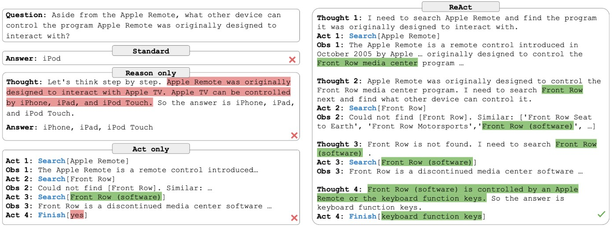
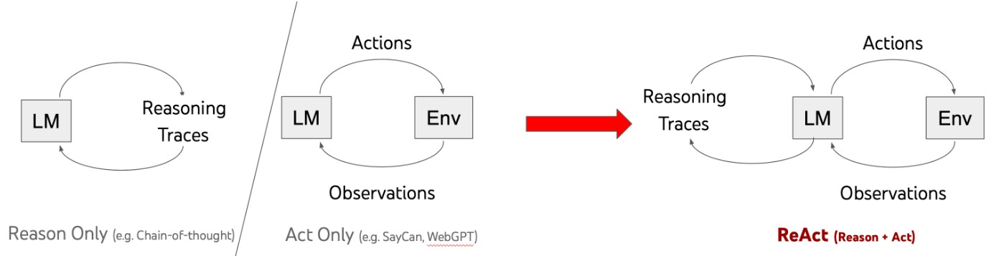

- https://langchain-ai.github.io/langgraph/concepts/agentic_concepts/
- https://www.anthropic.com/research/building-effective-agents

## ReAct（Reasoning and Acting）
- CoTなど行動計画の作成や調整等を行う推論(Reasoning)と、Web検索などを行う行動(Acting)を組み合わせて、精度を上げる手法
- 推論 → 行動 → 観察 → 推論 → 行動 → 観察 → ・・・ の流れ
- **https://react-lm.github.io/**
    
  

## MRKL（Modular Reasoning, Knowledge and Learning）
- 複数の外部モジュール/ツール（e.g. 数学の問題を解くためには計算モジュール、天気情報を取得するためにはAPIアクセスモジュール）を活用して推論・知識取得・学習を行うエージェントフレームワークの一種

## Reflection Agent
- https://www.issoh.co.jp/tech/details/4055/

## Multi Agent Pattern
- https://langchain-ai.github.io/langgraph/concepts/multi_agent/#multi-agent-architectures
- https://blog.langchain.dev/langgraph-multi-agent-workflows/

### いつMulti Agentが必要か
- https://langchain-ai.github.io/langgraph/concepts/multi_agent/#multi-agent-systems  
  > An agent is a system that uses an LLM to decide the control flow of an application. As you develop these systems, they might grow more complex over time, making them harder to manage and scale. For example, you might run into the following problems:
  > 
  > - agent has too many tools at its disposal and makes poor decisions about which tool to call next
  > - context grows too complex for a single agent to keep track of
  > - there is a need for multiple specialization areas in the system (e.g. planner, researcher, math expert, etc.)
  >
  > To tackle these, you might consider breaking your application into multiple smaller, independent agents and composing them into a **multi-agent system**. These independent agents can be as simple as a prompt and an LLM call, or as complex as a ReAct agent (and more!).
  >
  > The primary benefits of using multi-agent systems are:
  >
  > - **Modularity**: Separate agents make it easier to develop, test, and maintain agentic systems.
  > - **Specialization**: You can create expert agents focused on specific domains, which helps with the overall system performance.
  > - **Control**: You can explicitly control how agents communicate (as opposed to relying on function calling).