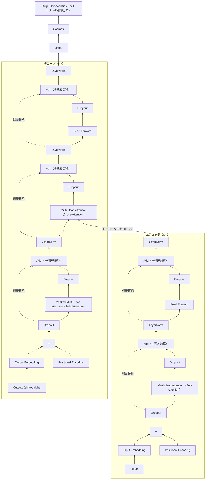
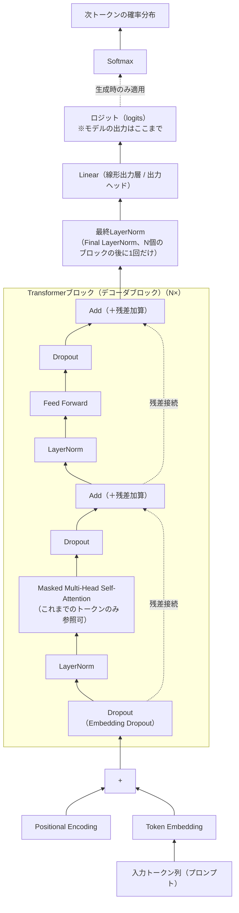
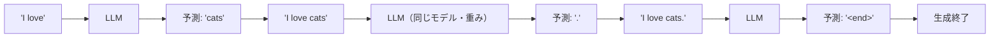

# Transformerアーキテクチャ
- 現代のほとんどのLLMはTransformerアーキテクチャを基にしている
- エンコーダとデコーダの2つの主要なコンポーネントから構成される
- エンコーダとデコーダはどちらも多層構造になっており、それらの層はSelf-Attentionメカニズムを使用している
- Self-Attentionは、入力の各部分が他の部分にどの程度関連しているかを計算するメカニズム

```
入力文: "I love cats"

[エンコーダ]
"I"    --> [ベクトル1]
"love" --> [ベクトル2]  ---> 全体の文脈を捉えたベクトル表現
"cats" --> [ベクトル3]

      ↓（エンコーダ出力）

[デコーダ]
<start>  --> "私"
"私"     --> "は"
"は"     --> "猫"
...      --> <end>
```

## Transformer全体のアーキテクチャ図
- 原論文「Attention Is All You Need」のアーキテクチャ図をベースにした全体像
- 左側がエンコーダ（N層積み重ね）、右側がデコーダ（N層積み重ね）
- **BERTは左側（エンコーダ）のみ、GPTは右側（デコーダ）のみを使用するモデル**
  - ただし、デコーダのみのモデル（GPT等）では、エンコーダ出力を参照するCross-Attentionは存在しないため、右側の「Masked Multi-Head Attention → Feed Forward」の2層構成のみが使われる



- 図中の要点
  - **Add & Norm**は1つの箱ではなく、実際には**「Dropout」→「Add（＋残差加算）」→「LayerNorm」という処理**（図中では分けて表示）
    - **Dropout**: サブレイヤー（Attention/FFN）の出力に適用（学習時のみ有効。詳細は後述の「GPT系LLM」節を参照）
    - **Add（＋残差加算）**: サブレイヤーに入る前のベクトルと、Dropoutを通したサブレイヤー出力を**そのまま足し合わせる**（`出力 = x + Dropout(サブレイヤー(x))`）
    - **LayerNorm**: 足し合わせた後のベクトルを正規化し、値のスケールを整える
  - **埋め込み直後のDropout**: Input/Output EmbeddingとPositional Encodingを足した直後にもDropoutが適用される（原論文 "Attention Is All You Need" 5.4節に明記）
  - **エンコーダのMulti-Head Attention**: 入力文自身の中での関係性を計算するSelf-Attention
  - **デコーダのMasked Multi-Head Attention**: これまで生成したトークンのみを参照できるようにマスクをかけたSelf-Attention（未来のトークンを見ないようにする）
  - **デコーダのMulti-Head Attention（Cross-Attention）**: エンコーダの出力をKey/Valueとして受け取り、デコーダのQueryと組み合わせて入力文との整合性を考慮する部分。**デコーダのみのモデル（GPT等）ではこのブロックが存在しない**
  - **Linear → Softmax**: デコーダの最終出力を語彙サイズのベクトルに変換し、確率分布として次のトークンを予測する
  - この原論文の構成は**Post-LN**（Attention/FFNの後にLayerNorm）。GPT系はこれと構成が異なる（**Pre-LN**）ので詳細は後述の「GPT系LLM（デコーダのみ）のアーキテクチャ」節を参照
  - 参考: [Attention Is All You Need（原論文）](https://arxiv.org/abs/1706.03762)

## エンコーダ
- 入力文をベクトル表現に変換する
- 処理の流れ:
  1. 入力文をトークン化し、各トークンをベクトルに変換
  2. Self-Attentionメカニズムを使用して、各トークンの文脈を考慮したベクトル表現を生成
  3. 最終的なベクトル表現を出力
- BERTはエンコーダのみを使用するモデル
- *ポジショナルエンコーディング* 
  - 入力トークンの順序情報を保持するために使用される
  - TransformerにはRNNのような順序処理能力がないため、入力に位置情報を追加する必要がある
## デコーダ
- エンコーダから得た文脈情報と、これまでに生成された出力トークンを使って、次のトークンを逐次生成する。
- 処理の流れ:
  1. エンコーダの出力（文脈ベクトル列）を受け取り、Decoder内部で保持
  2. Masked Self-Attentionを使って、デコーダ自身がこれまで生成した出力トークン間の文脈を考慮したベクトルを生成
     - 「デコーダ自身がこれまで生成した出力トークン」とは、例えば、翻訳タスクで "I love cats" を入力としたとき、出力は "私は 猫 が 好き" のようなもので、その中で、すでに生成された "私は", "猫" などを指す
  3. エンコーダ出力とのCross-Attentionを行い、入力文との整合性を考慮して次のトークンを予測
     - 「入力文」とは、元の入力のことで、上の例でいうと "I love cats" の部分
  4. トークンを1つずつ生成し、最終的な出力文を完成させる
- GPTはデコーダのみを使用するモデル

## Self-Attention
- Transformerアーキテクチャの中心的なメカニズム
- Self-Attentionは、入力の各部分が他の部分にどの程度関連しているか（「注意度（attention score）」）を計算するメカニズム
- 入力シーケンス全体を一度に処理し、各トークンが他のトークンにどのように注意を向けるかを学習する

### コンテキストベクトル（Context Vector）
- Self-Attentionの目標は、入力シーケンスの各要素に対して、他の要素との関係を考慮したコンテキストベクトルを各トークンごとに生成すること
- コンテキストベクトルは、シーケンス内の他のすべての要素からの情報を組み込んでおり、文章中の単語と単語の関係や関連性を理解する必要があるLLMにとって不可欠な要素
  - 例えば、**「彼は銀行に行った」という文において、「銀行」のコンテキストベクトルは、「彼」や「行った」といった他の単語との関係性を反映した情報を含む**
- **コンテキストベクトルは、埋め込みベクトルに重みを付けて計算される**
  - 「重み」とは、入力シーケンス内の各トークンが、他のトークンに対してどれくらい「注意を払うべきか」を示す数値のこと。各トークン間の関連性や重要度を定量化したものと考えることができる
- 強化された埋め込みベクトルと考えることができる

#### ■ コンテキストベクトルの計算
具体的には、Self-Attentionメカニズムでは、以下の3つのベクトルが各トークンに対して生成される。

1.  **クエリ（Query: Q）** 
    - DBの検索クエリーに相当するもので、文中の単語やトークンなど、モデルが注目している(理解しようとしている)現在のアイテム
    - 入力シーケンスの他の部分にどの程度注意を払うべきかを判断するために使用される
    - 現在処理しているトークンが、他のトークンに対して「何を探しているか」を表すベクトル。
2.  **キー（Key: K）**
    - 検索に使われるインデックスやキーに相当するもので、Attentionメカニズムでは、文中の単語といった入力シーケンスの各アイテムにキーが関連付けられている。**これらのキーがクエリーのマッチングに使われる**
    - 他のトークンが、クエリに対して「どのような情報を提供できるか」を表すベクトル。
3.  **バリュー（Value: V）**
    - Key,ValueペアのValueと同じで、実際のデータや情報に相当するもので、Attentionメカニズムでは、文中の単語やトークンが持つ実際の情報を表す
    - 他のトークンが実際に持つ「情報の内容」を表すベクトル。
    - **モデルは、クエリに最も関連しているキー(現在注目しているアイテムに最も関連している入力の部分)を探して、対応するバリューを取得する。**

これらのベクトルを使って、以下のステップで重みが計算される。

1.  **類似度の計算**: 現在のトークンの **クエリ（Q）** と、他のすべてのトークンの **キー（K）** との間の類似度（通常はドット積）を計算する。この類似度が高いほど、その2つのトークンは強く関連していると見なされる。
2.  **ソフトマックス関数による正規化**: 計算された類似度をソフトマックス関数に通すことで、それらの値を合計が1になるような **注意の重み（Attention Weights）** に変換する。これにより、どのトークンにどれだけの「注意」を割り当てるべきかがパーセンテージのような形で示される。

- 簡略な流れ  
  1. Attention Scoreの計算
     - 入力間のドット積としてAttentionスコアを計算
  2. Attentionの重みを計算
     - Attentionの重みはAttentionスコアを正規化したもの
  3. コンテキストベクトルの計算
     - 入力の加重和としてコンテキストベクトルを計算

#### ■ ドット積
- ドット積（内積）は、ベクトル同士の「かけ算」のようなもので、特に2つのベクトルがどれくらい同じ方向を向いているかを示す指標
  - 対応する要素をかけて全部足す
  - 結果はスカラー（単なる数）
- ドット積が大きいほど、2つのベクトルは同じ方向を向いていると解釈される
- 直交している（90度をなす）場合、値は0になる
- 逆方向を向いている場合、値は負になる
- 2つのベクトル a = (a1, a2, ..., an) と b = (b1, b2, ..., bn) のドット積は次のように計算される  
<br>

  ```math
  a・b = a1*b1 + a2*b2 + ... + an*bn
  ```  

<br>

  - コード例  
    ```python
    import torch

    # ベクトルAとBを定義（1次元のテンソル）
    a = torch.tensor([1, 2, 3])
    b = torch.tensor([4, 5, 6])

    # ドット積の計算
    dot_product = torch.dot(a, b)
    print(f"A・B のドット積は: {dot_product}")
    ```

#### ■ ソフトマックス(softmax)関数
- ソフトマックス関数は、複数の数値(リスト)（数値のベクトル）を確率分布に変換する数学関数
- Attentionメカニズムでは、生のAttentionスコアを0から1の範囲の重みに正規化し、**全ての重みの合計を1**にするために使われる
- 各値は「確率」として解釈可能（合計値が1(100%)だからこそ可能）

##### ▼Attentionでの実際の使用例
「私は猫が好きです」という文でのAttentionを考えてみる。「猫」という単語に注目するとき：

**生のAttentionスコア**：
- 私: 1.2
- は: 0.3
- 猫: 3.1
- が: 0.8
- 好き: 2.0

**ソフトマックス適用後の重み**（実際に計算した値）：
- 私: 0.09 (9%)
- は: 0.04 (4%)
- 猫: 0.61 (61%) ← 最も高い注意
- が: 0.06 (6%)
- 好き: 0.20 (20%)

##### ▼ ソフトマックスの重要な特性
1. **確率分布**： **すべての出力値は 0〜1 の間で、すべての出力値の合計は必ず1**
2. **相対的な重要度保持**：大きな値ほど大きな重みを持つ
3. **微分可能**：機械学習での学習に適している
4. **温度パラメータ**：T（温度）で割ることで分布の鋭さを調整可能

温度の効果例（スコア [2.0, 1.0, 0.1] で、実際に計算した値）：
- T=1（通常）：[0.66, 0.24, 0.10]
- T=0.5（鋭い）：[0.86, 0.12, 0.02]
- T=2（平坦）：[0.50, 0.30, 0.19]

---

# LLM（Large Language Model）の学習
- 大規模なテキストデータセットを使用して、Attentionメカニズムを利用して事前学習され、ベースモデルが構築される
  - LLMの事前学習は入力変数と目的変数のペアを用いて、テキストにおいて次に来る単語を予測するタスクで行われる
  - 入力変数: これまでの文脈（例: "I love"）
  - 目的変数: 次に来る単語（例: "cats"）
  - モデル訓練中は、目的変数の後ろにある単語をすべてマスクし、（例: "I love [MASK]"）LLMは目的変数の後ろにある単語にアクセスできない
- 事前学習済みモデル（ベースモデル）を特定のタスクに適応させるために、ファインチューニングが行われる

## GPT系LLM（デコーダのみ）のアーキテクチャ
- ChatGPTやClaude、Llamaなど、現代の主要なLLMのほとんどは[[Transformerアーキテクチャ]]の**デコーダのみ**を使用する構成
- Transformer原論文の右側（デコーダ）から、エンコーダ出力を参照する**Cross-Attentionを取り除いた**構成
- 本などでよく「**Transformerブロック**」と呼ばれるのが、下図の「Transformerブロック（デコーダブロック）」のこと（同じものを指す別名）
- 原論文のPost-LN（Attention/FFNの**後**にLayerNorm）ではなく、GPT-2以降の多くのLLMが採用する**Pre-LN**（Attention/FFNの**前**にLayerNorm）の構成で図示
  - GPT-2の実装（`transformer.wte`/`wpe` → Dropout → N×デコーダブロック（各ブロック内は`ln_1`→Attention、`ln_2`→MLP） → 最終LayerNorm）はPre-LN構成で、この点は実装・解説記事でも確認できる



- Cross-Attention（エンコーダ出力を参照するブロック）が無いため、入力自身の文脈（これまで生成した／与えられたトークン列）だけを頼りに次のトークンを予測する
- この「次のトークンを予測する」処理を1トークンずつ繰り返すことで文章全体を生成する（＝**自己回帰（Autoregressive）生成**）

### 補足：Dropoutが入る場所
- **Dropout**は学習時に一部のニューロン（値）をランダムに0にすることで過学習を防ぐ手法。**推論（生成）時は無効化**される
- 主に3箇所に入る
  1. **Embedding Dropout**: Token EmbeddingとPositional Encodingを足した直後
  2. **Attention Dropout**: Masked Self-Attentionの出力（残差加算する直前）
  3. **FFN Dropout**: Feed Forwardの出力（残差加算する直前）
- Attention内部（Attention Weight計算後）にもDropoutを入れる実装もある（本や実装によって多少構成が異なる）

### 補足：残差接続・LayerNorm・最終LayerNormについて
- **残差接続（Residual Connection）**: サブレイヤー（Self-AttentionやFeed Forward）の入力を、そのサブレイヤーの出力にそのまま足し合わせる仕組み
  - 層を深く積み重ねても勾配が消失しにくくなり、学習が安定する
- **LayerNorm（Layer Normalization）**: 各トークンのベクトルを正規化し、学習をさらに安定・高速化する
- 原論文（およびBERT等）は「Attention/FFNの**後**にLayerNorm」という**Post-LN**方式だが、GPT-2以降の多くのLLMは「Attention/FFNの**前**にLayerNorm」という**Pre-LN**方式を採用している
  - Pre-LNの方が層を深くしても学習が発散しにくいため
- **最終LayerNorm（Final LayerNorm）**: Pre-LN方式では各ブロックの出力そのものは正規化されずに残差加算だけで終わるため、**N個のTransformerブロックを全部通過した後、Linear（出力層）に渡す直前に1回だけ**LayerNormをかける
  - 本に書かれている「正規化を適用し」は、多くの場合この最終LayerNormのことを指す
- Llama系などの最近のモデルでは、LayerNormの代わりに計算がより軽量な**RMSNorm**（平均を引く処理を省略した正規化）を使うことも多い
- いずれの方式でも「残差接続＋何らかの正規化」という骨格自体はTransformer登場時から変わらず維持されている

### 補足：Linear（線形出力層）とSoftmaxの違い
- **Linear（線形出力層／出力ヘッド）**: 最終LayerNormを通したベクトルを、語彙サイズ次元の**ロジット（logits）**に変換する層。**モデルの forward 計算はここで終わり**
- **Softmax**: ロジットを0〜1の確率分布に変換する処理。**モデル自体には含まれず、生成（デコーディング）時に必要に応じて適用される別ステップ**
  - 貪欲法（Greedy）でロジットの最大値のトークンをそのまま選ぶ場合はSoftmaxすら不要（`argmax`で足りる）
  - サンプリングで次トークンを確率的に選ぶ場合や、温度・Top-k・Top-pなどを適用する場合にSoftmaxが使われる
- つまり本の「線形出力層でロジットを生成する」という記述は**Linearのみ**を指しており、図のSoftmaxはそこに含まれない

### 自己回帰（Autoregressive）生成の流れ
- 生成したトークンを毎回入力の末尾に追加し、再度モデルに入力し直すことで次のトークンを予測する、というループを`<end>`トークンが出るまで繰り返す



- 各ステップでモデルは同一（重みは共有）で、入力トークン列が1つずつ伸びていく点がポイント
- 推論時にこの繰り返しがあるため、生成が長くなるほど計算コストも増える（KVキャッシュなどはこの再計算を効率化するための工夫）

## テンソル（Tensor）
- **多次元配列**のこと
- **スカラー（0次元）**、**ベクトル（1次元）**、**行列（2次元）**、およびそれ以上の次元（高次元テンソル）を持つデータ構造
- 例  
  ```python
  import torch

  # 0次元テンソル（スカラー）
  scalar = torch.tensor(3.14)
  print(f"0次元: {scalar}")  # tensor(3.1400)

  # 1次元テンソル（ベクトル）
  vector = torch.tensor([1, 2, 3, 4, 5])
  print(f"1次元: {vector}")  # tensor([1, 2, 3, 4, 5])

  # 2次元テンソル（行列）
  matrix = torch.tensor([[1, 2, 3],
                        [4, 5, 6]])
  print(f"2次元: {matrix}")
  # tensor([[1, 2, 3],
  #         [4, 5, 6]])

  # 3次元テンソル（例：RGBカラー画像 1枚）
  # shape: (channels=3, height=2, width=3)
  image = torch.tensor([[[255, 128, 64],   # Red channel
                        [32, 16, 8]],
                       [[200, 150, 100],   # Green channel
                        [50, 25, 12]],
                       [[180, 90, 45],     # Blue channel
                        [22, 11, 5]]])

  # 4次元テンソル（例：画像のバッチ）
  # shape: (batch_size=2, channels=3, height=2, width=2)
  batch_images = torch.randn(2, 3, 2, 2)
  print(f"4次元 shape: {batch_images.shape}")  # torch.Size([2, 3, 2, 2])
  ```
- テンソルは、数値データを効率的に表現し、計算するために使用される
- 深層学習フレームワーク（例: TensorFlow, PyTorch）では、テンソルが基本的なデータ構造として広く利用されている
- PyTorchのDataLoaderは、入力データセットを繰り返し処理しながら、入力変数と目的変数をテンソルとして返す

## 埋め込み層（Embedding Layer）、重み行列（Weight Matrix）
- 埋め込み層は、離散的な入力（単語、文字、カテゴリなど）を連続値のベクトルに変換する層
- 重み行列は、ニューラルネットワークの各層において、入力から出力への変換を決定する数値の集合
- 埋め込み層は、入力の各トークンを対応するベクトルに変換するための重み行列を持っている
- **埋め込み層は、トークンIDに基づいて埋め込み層の重み行列から対象の行を取り出すLookup演算を行っている**
- 例  
  ```python
  import torch
  import torch.nn as nn

  # 埋め込み層の作成（語彙サイズ5、埋め込み次元3）
  embedding_layer = nn.Embedding(5, 3)

  # 重み行列の確認
  print("重み行列（語彙サイズ × 埋め込み次元）:")
  print(embedding_layer.weight.data)
  print()
  ## 以下は出力例
  # 重み行列（語彙サイズ × 埋め込み次元）:
  # tensor([[ 0.6724,  0.4698,  0.6228],
  #        [-0.6037,  0.4422, -1.2405],
  #        [ 2.7881, -0.0756, -0.9052],
  #        [ 0.0336,  0.9864,  0.6590],
  #        [ 0.5250,  0.5011,  0.5585]])

  # トークンIDからベクトルへの変換（Lookup演算）
  token_ids = torch.tensor([0, 2, 4])
  embedded_vectors = embedding_layer(token_ids)

  print(f"入力トークンID: {token_ids}")
  print("出力埋め込みベクトル:")
  print(embedded_vectors)
  print()
  ## 以下は出力例
  # 入力トークンID: tensor([0, 2, 4])
  # 出力埋め込みベクトル:
  #  tensor([[ 0.6724,  0.4698,  0.6228],
  #          [ 2.7881, -0.0756, -0.9052],
  #          [ 0.5250,  0.5011,  0.5585]], grad_fn=<EmbeddingBackward0>)
  # ★上の重み行列のインデックス0、インデックス2、インデックス4がそれぞれトークンID 0, 2, 4に対応する埋め込みベクトルで、変換されている

  # 手動でのLookup演算（本質的な仕組み）
  print("手動Lookup（重み行列から直接取り出し）:")
  for token_id in token_ids:
      vector = embedding_layer.weight.data[token_id]  # トークンID番目の行を取得
      print(f"ID {token_id} -> {vector}")
  ```

## 単語の位置をエンコード
- Self-Attentionメカニズムには、シーケンス内のトークンの位置や順序という概念がない
- 位置を認識する埋め込みには、大きく分けて「相対位置埋め込み」と「絶対位置埋め込み」がある
- **相対位置埋め込み**: トークン間の相対的な距離を考慮する
- **絶対位置埋め込み**: 各トークンの絶対的な位置を考慮する
- 位置埋め込みも入れた埋め込みまでの流れ
  1. Rawテキストをトークン化
  2. トークンをIDに変換
  3. IDを埋め込み層に入力し、トークンIDを埋め込みベクトルに変換
  4. 3．で求めた埋め込みベクトルに、3.の埋め込み層と同じサイズの位置埋め込みを加算
  5. LLMのメイン層の入力として利用できる入力埋め込みが得られる

## Fine-tuning（ファインチューニング）
- 事前学習済み(pre-trained)のモデルを特定のタスクに適応させるための手法
  - 事前学習済みモデルは、ラベルなしの大量のデータで学習される
  - ファインチューニングは、特定のタスクに対してラベル付きのデータでモデルを再学習させる
- 少量のデータでモデルを再学習させることで、特定のドメインや用途における性能を向上させることができる
- Fine-tuning手法として「Instruction Fine-tuning」と「Classification Fine-tuning」がある
### Instruction Fine-tuning
- モデルに対して具体的な指示を与えるための手法
- 例えば、特定の質問に対する回答を生成するために、質問と回答のペアを用いてモデルを再学習させる
- e.g. テキストを翻訳するためのクエリと正しく翻訳されたテキストのペアで構成

### Classification Fine-tuning
- モデルに対してカテゴリ分類を行うための手法
- 分類タスク自体は画像・テキストなどモデルの種類を問わず一般的な概念だが、**LLMの文脈では主にテキストの分類**に使われる
  - e.g. メール本文を「スパム」「非スパム」に分類するために、メール本文とラベルのペアで再学習させる（スパム検知）
  - e.g. レビュー文を「ポジティブ」「ネガティブ」に分類する（感情分析）
- （参考：画像分類モデルの場合は、画像を「犬」「猫」「鳥」などのカテゴリに分類するための画像とラベルのペアで構成される）

---

# ベクトル（Vector）
- 数値の配列やリストのこと
- 空間内の点や方向を表すために使用される数学的な概念
- ベクトルを通じて、複雑なデータや概念を数学的(定量的)に扱うことができる

### AIにおけるベクトルの使用例
1. **特徴ベクトル**
   - データの特徴を数値化したもの。たとえば、画像を表す際には、画像の各ピクセルの色情報がベクトルとして表される。

2. **単語ベクトル**
   - 自然言語処理において、単語や文章をベクトルとして表すことがある。この技術により、単語間の意味的な関係を計算できるようになる。
   - 例えば、文書をベクトル化する場合、各単語の出現回数などを要素とするベクトルを作成する。2つの文書が意味的に近いかどうかは、対応するベクトルの角度や距離を比較することで計算できる。

3. **状態ベクトル**
   - 機械学習のモデルが、問題を解くためのある時点での「状態」を数値で表したもの。

4. **重みベクトル**
   - 機械学習のアルゴリズムで、入力データに対してどの程度の重みを付けるかを示す数値のリスト。

---

# Token
- LLMモデルは(入力/出力)テキストをトークンという単位で分割して扱う
- 英語より日本語の方が１文字に必要なトークン数が多いといわれている
- OpenAIの場合、`tiktoken`というPythonのパッケージを使って入力/出力のトークン数を確認できる
  - https://github.com/openai/tiktoken

## Tokenizer
- Rawテキストをトークンに分割するためのツール
- トークン化の手法には、単語単位、サブワード単位、文字単位などがある
- Rawテキスト → (Tokenizerによる) トークン化 → 語彙を使って一意なIDに変換 → ベクトルに変換

### Byte pair encoding (BPE)
- トークン化の手法の一つ
- サブワード単位のトークン化を実現し、未知の単語問題を軽減する
  - 事前に定義された語彙にない単語を、より小さなサブワード単位か、場合によっては文字単位に分解する
- 語彙構築の流れ（正確には「文字→サブワード」「サブワード→単語」という2段階ではなく、以下を1つの連続した反復処理として繰り返す）
  1. まず単語を文字単位に分解し、初期語彙とする
  2. 隣接するシンボル（文字 or それまでにマージ済みのサブワード）のペアのうち、**出現頻度が最も高いペア**を探す
  3. そのペアを1つの新しいシンボル（サブワード）として語彙に追加し、テキスト中の該当箇所をマージする
  4. 目的の語彙サイズに達するまで2〜3を繰り返す（頻出パターンほど早い段階で1つのサブワード／単語にまとまっていく）
- GPTなどのモデルで広く使用されている
- 参考: [Neural Machine Translation of Rare Words with Subword Units（BPEをNLPに応用した原論文）](https://arxiv.org/abs/1508.07909)
