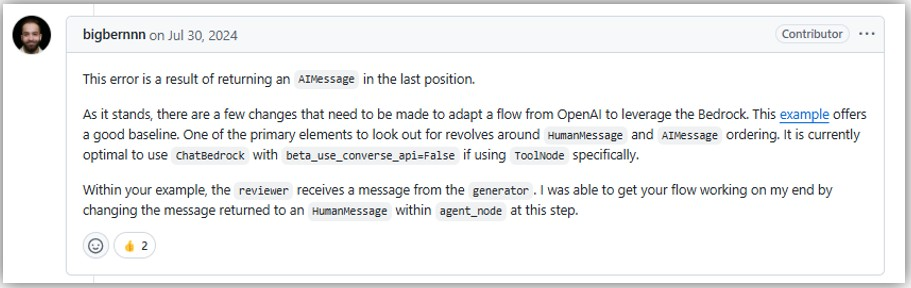

## Bedrockでは最後にAIMessageが入っているとエラーになる
- エラー内容  
  ```shell
  botocore.errorfactory.ValidationException: An error occurred (ValidationException) when calling the InvokeModel operation: Your API request included an `assistant` message in the final position, which would pre-fill the `assistant` response. When using tools, pre-filling the `assistant` response is not supported.
  ```
- https://github.com/langchain-ai/langchain-aws/issues/124  
  
  - 上記には以下のように`beta_use_converse_api=False`にすればいいみたいなことが書いてあるけど、ダメだった。  
    ```python
    llm = ChatBedrock(
        model_id="anthropic.claude-3-5-sonnet-20240620-v1:0",
        model_kwargs={"temperature": 0.1},
        beta_use_converse_api=False,
    )
    ```
- **なのでMulti AgentsやToolなどで、最後にAIMessageが入っている場合は、そのままLLMに投げるのではなくて、System PromptとHumanMessageだけ抜き取ってLLMに投げるようにする必要がある**

## Tool use
- OpenAIのFunction Callingに該当するもの
- https://docs.aws.amazon.com/bedrock/latest/userguide/tool-use.html

## Bedrock Agents
- https://speakerdeck.com/minorun365/sutatoatupuderen-gazu-rinai-sorenaraaiezientowogu-ou
- Lambda関数の実行もできる
- Knowledge Baseとの連動もできる
- 会話履歴も踏まえて回答してくれる
- SlackにてAWS ChatBotからBedrock Agentを使って直接Bedrockを呼び出すことができる
  - https://qiita.com/moritalous/items/b63d976c2c40af1c39e5