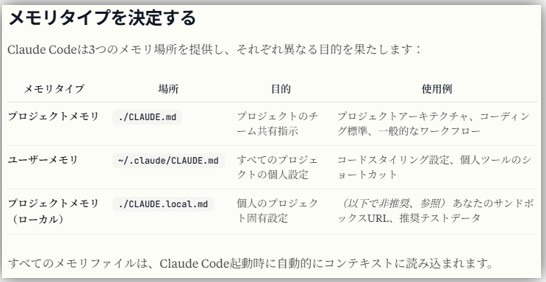
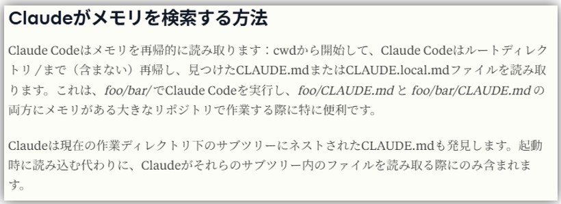
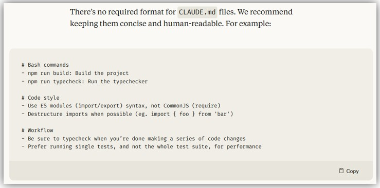

# Claude CodeのBest Practices
- https://www.anthropic.com/engineering/claude-code-best-practices

# Claude CodeのCHANGELOG
- https://github.com/anthropics/claude-code/blob/main/CHANGELOG.md

# Claude CodeのUpdate
```shell
npm update -g @anthropic-ai/claude-code
```

# Claude Code Action
- Claude CodeとGithubリポジトリを統合して、自動コードレビュー、PR管理などができる機能
- 参考URL
  - https://github.com/anthropics/claude-code-action
  - https://docs.anthropic.com/ja/docs/claude-code/github-actions
  - https://azukiazusa.dev/blog/claude-code-action-github-integration/

# Claude Code使用時注意事項
## Bedrock利用時、`AWS_REGION`環境変数とモデルのCross Region識別子(e.g. `apac`、`us`)を一致させる必要がある
- 2つが不一致すると以下のエラーが出る  
  ```shell
  API Error (apac.anthropic.claude-sonnet-4-20250514-v1:0): 400 The provided model identifier is invalid.
  ```
- https://github.com/anthropics/claude-code/issues/1434

# Claude CodeのメトリクスとログをOpenTelemetry（otlp）で連携
- Claude Codeのメトリクス（e.g. Token Usage）とログをOpenTelemetry（otlp）でバックエンドに送ることができる
- **https://docs.anthropic.com/ja/docs/claude-code/monitoring-usage**

# Claude Codeへの指示
- https://www.anthropic.com/engineering/claude-code-best-practices
- https://docs.anthropic.com/ja/docs/claude-code/memory
- `CLAUDE.md`ファイルに指示を書くことで、Claude Codeに指示を与えることができる
- `CLAUDE.md`ファイルの置き場所  
  
  
- `CLAUDE.md`のフォーマットは決まってない  
  

# Claude CodeのStructured Output
- 実行時 `--output-format json`オプションを付けることで、Claude Codeの出力をJSON形式で受け取ることができる
- jsonの構造は以下  
  ```json
  {
    "type": "result",
    "subtype": "success",
    "is_error": false,
    "duration_ms": 67599,
    "duration_api_ms": 83629,
    "num_turns": 2,
    "result": "レスポンステキスト...",
    "session_id": "0833f69c-d363-4915-9226-5c2ffc1eab64",
    "total_cost_usd": 0.19816485,
    "uuid": "1adff9f7-d4ba-4fa8-9142-e9cf9fd74550",
    "usage": {
      "input_tokens": 4,
      "cache_creation_input_tokens": 7488,
      "cache_read_input_tokens": 32393,
      "output_tokens": 809,
      "server_tool_use": {
        "web_search_requests": 0,
        "web_fetch_requests": 0
      },
      "service_tier": "standard",
      "cache_creation": { ... }
    },
    "modelUsage": {
      "claude-opus-4-5-20251101": { ... },
      "claude-haiku-4-5-20251001": { ... }
    },
    "permission_denials": [ ... ]
  }
  ```
- さらに **`--json-schema`フラグでStructured Outputとして出力されるJSONのSchemaを取得できる**
  - 以下のような`--json-schema`で投げた時の例  
  ```shell
  --output-format json --json-schema '{
          "type": "object",
          "properties": {
                  "is_related": {
                          "type": "boolean",
                          "description": "true if there is code related to the error, false otherwise"
                  },
                  "analysis": {
                          "type": "string",
                          "description": "Analysis and fix suggestions in Japanese. Empty string if is_related is false"
                  },
                  "relevant_files": {
                          "type": "array",
                          "items": { "type": "string" },
                          "description": "List of relevant file paths (optional)"
                  }
          },
          "required": ["is_related", "analysis"]
  }'
  ```

  ```json
  {
    "type": "result",
    "subtype": "success",
    "is_error": false,
    "duration_ms": 70560,
    "duration_api_ms": 58337,
    "num_turns": 3,
    "result": "テキスト形式のレスポンス（structured_outputとは別に存在）",
    "session_id": "a0c7d32c-4df6-403f-acd1-63079b12fa9e",
    "total_cost_usd": 0.23181795,
    "uuid": "442bc3ca-9e0e-4417-bd71-60c7f930d101",
    "usage": { ... },
    "modelUsage": { ... },
    "permission_denials": [],
    "structured_output": {
      "is_related": false,
      "analysis": "このリポジトリはPythonベースの...",
      "relevant_files": []
    }
  }
  ```

# Claude Code cheat sheet
> [!NOTE]  
> `claude`でClaude Codeに入ったあとに実行するコマンド

- 現在ログインしているアカウントやモデルの確認  
  `/status`

- ログイン、ログアウト  
  `/login`、`/logout`

- 利用するモデルの設定  
  `/model`