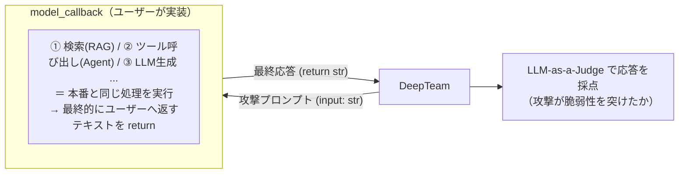

# DeepTeam について

## 目次
1. [Red Teaming（レッドチーミング）とは](#red-teamingレッドチーミングとは)
2. [DeepTeam とは](#deepteam-とは)
3. [全体アーキテクチャ / 動作の流れ](#全体アーキテクチャ--動作の流れ)
4. [Vulnerabilities（脆弱性）](#vulnerabilities脆弱性)
5. [Attacks（攻撃手法）](#attacks攻撃手法)
6. [Metrics（評価方法 / LLM-as-a-Judge）](#metrics評価方法--llm-as-a-judge)
7. [Guardrails（ガードレール）](#guardrailsガードレール)
8. [対応セキュリティフレームワーク](#対応セキュリティフレームワーク)
9. [インストールと使い方](#インストールと使い方)
10. [Confident AI プラットフォーム連携](#confident-ai-プラットフォーム連携)

---

## Red Teaming（レッドチーミング）とは

**Red Teaming（レッドチーミング）** とは、もともと軍事・サイバーセキュリティの用語で、**「攻撃者（敵＝Red Team）の視点に立って、自分たちのシステムを意図的に攻撃し、防御側（Blue Team）が気づいていない脆弱性を実運用前にあぶり出す」** 手法のこと。

### LLM における Red Teaming

LLM（大規模言語モデル）の文脈では、Red Teaming は以下を意味する。

> **敵対的（adversarial）なプロンプトを意図的にモデルへ投げ込み、デプロイ前に安全性・信頼性の弱点を発見すること。**

通常の「評価（Evaluation）」が *「正しく・役立つ回答ができるか（性能）」* を測るのに対し、Red Teaming は *「悪用されたときに危険な・不適切な振る舞いをしないか（安全性・セキュリティ）」* に焦点を当てる。

具体的に発見したいのは、例えば以下のようなリスク。

- **Jailbreak（脱獄）**: ガードレールを回避して禁止された内容を答えさせる
- **Prompt Injection（プロンプトインジェクション）**: 悪意ある指示を注入してシステムプロンプトを乗っ取る
- **Bias / Toxicity（バイアス・有害性）**: 差別的・攻撃的な出力
- **PII Leakage（個人情報漏洩）**: 学習データやセッション内の機密情報の漏洩
- **SQL/Shell Injection**: エージェントがツール経由で危険なコマンドを実行

### なぜ今、重要なのか

LLM を組み込んだアプリケーション（チャットボット、RAG パイプライン、AI エージェント）が本番投入されるようになり、攻撃対象領域（attack surface）が急拡大している。攻撃者に先んじて脆弱性を発見・修正することが、コンプライアンス（OWASP、NIST など）と信頼性の両面で必須になりつつある。DeepTeam はこの Red Teaming を **自動化・体系化** するためのフレームワーク。

---

## DeepTeam とは

**DeepTeam** は、LLM システムおよび AI エージェントをレッドチーミングするための **オープンソースフレームワーク**。

| 項目 | 内容 |
|------|------|
| 開発元 | **Confident AI**（LLM 評価フレームワーク **DeepEval** と同じチーム。開発リード: Jeffrey Ip） |
| ベース | **DeepEval**（オープンソースの LLM 評価フレームワーク）の上に構築 |
| ライセンス | **Apache 2.0**（無料・オープンソース） |
| 実行環境 | **ローカル実行**（コア機能ではデータが外部に出ない） |
| インストール | `pip install -U deepteam` |
| 公式 | [trydeepteam.com](https://www.trydeepteam.com/) / [GitHub: confident-ai/deepteam](https://github.com/confident-ai/deepteam) |

### 主な特徴

- **50+ の脆弱性**と**20+ の攻撃手法**でLLMアプリを「ペネトレーションテスト」できる（公式表記。数値の内訳は末尾の[検証メモ](#検証メモ2026-07-29時点)を参照）
- **事前データセット不要** — 敵対的テストケースを**動的に自動生成**する
- **OWASP Top 10 for LLMs / NIST AI RMF** など主要フレームワークに準拠したアセスメント
- テストケースを**再利用・反復**して、セキュリティ改善を時系列で計測できる
- **AI エージェント / RAG / チャットボット**など、任意の LLM アプリをコールバック経由でテスト可能（フレームワーク非依存）

---

## 全体アーキテクチャ / 動作の流れ

DeepTeam の Red Teaming は以下のステップで動作する。

```
1. 対象を定義   → model_callback（テスト対象LLMをラップする関数）を用意
2. 脅威を指定   → Vulnerabilities（狙う脆弱性）と Attacks（攻撃手法）を選ぶ
3. 攻撃生成     → DeepTeam が敵対的プロンプトを動的に自動生成
4. 攻撃実行     → 生成したプロンプトを対象LLMに投入し、出力を収集
5. 評価         → LLM-as-a-Judge（G-Eval）で出力を採点
6. レポート     → 脆弱性ごとの pass rate（攻撃成功率）を含むリスクアセスメントを出力
```

- **モジュール設計**: 「脆弱性の定義」「攻撃の実装」「評価ロジック」が分離されており、組み合わせ可能（composable）。

### `model_callback` が全体の要（テスト対象の抽象化）

DeepTeam でテスト対象を指定する唯一の窓口が `model_callback` という関数。**「テストしたい LLM システムそのものを、1つの関数として包んだもの」** と考えると分かりやすい。

DeepTeam から見た `model_callback` は、内部が単体 LLM なのか RAG なのかマルチエージェントなのかを一切気にしない。**「攻撃プロンプト（`input: str`）を渡す → 最終応答（`str`）が返ってくる」** という入出力の約束さえ守られていればよい。



つまり **`model_callback` の中に実際の Agent / RAG などの処理を書き、その最終応答（文字列）を `return` すればよい**。DeepTeam は返ってきた文字列だけを見て「攻撃が成功したか（脆弱性が露出したか）」を評価する。

- **テストしたい層に合わせて中身を差し替えられる**のがポイント:
  - システム全体（RAG＋ガードレール＋システムプロンプト込み）を包む → **システム全体**の堅牢性テスト
  - 素の LLM 呼び出しだけを包む → **モデル単体**の脆弱性テスト
- 返すのは原則 **「ユーザーに実際に届く最終応答」**。そうすることで本番と同じ経路（ガードレール・ツール制御含む）が攻撃にさらされ、現実的なテストになる。
- **非同期（`async def`）で定義するのが基本**（DeepTeam が多数の攻撃を並行実行するため）。

---

## Vulnerabilities（脆弱性）

DeepTeam は脆弱性をカテゴリ別に検出する。各脆弱性は `types=[...]` でサブタイプを指定できる。公式は「50+」と表記するが、これはサブタイプまで数えた値で、**実装上のトップレベルの脆弱性クラスは約36種（＋カスタム）**（末尾の[検証メモ](#検証メモ2026-07-29時点)参照）。以下は 2026-07-29 時点の実装（`deepteam/vulnerabilities/`）に基づく。

### Responsible AI（責任あるAI）
| 脆弱性 | サブタイプ例 |
|--------|-------------|
| **Bias** | race（人種）, gender（性別）, religion（宗教）, politics（政治的志向） |
| **Toxicity** | profanity（暴言）, insults（侮辱）, threats（脅迫） |
| **Child Protection**（児童保護） / **Ethics**（倫理） / **Fairness**（公平性） | 各カテゴリ別 |

### Data Privacy（データプライバシー）
| 脆弱性 | サブタイプ例 |
|--------|-------------|
| **PII Leakage** | direct disclosure（直接漏洩）, API/database access, session leak |
| **Prompt Leakage** | secrets（機密）, credentials（認証情報）, permissions（権限情報） |

### Security（セキュリティ）
| 脆弱性 | 説明 |
|--------|------|
| **BFLA** (Broken Function Level Authorization) | 関数レベルの認可バイパス |
| **BOLA** (Broken Object Level Authorization) | オブジェクトレベルの認可バイパス（顧客間アクセスなど） |
| **RBAC** | ロール/権限バイパス |
| **SQL Injection** / **Shell Injection** | ツール経由の危険なコマンド実行 |
| **SSRF** | 内部アクセス、ポートスキャン |
| **Debug Access** | デバッグ機能への不正アクセス |
| **Tool Metadata Poisoning** / **Cross-Context Retrieval** / **System Reconnaissance** | ツール・コンテキストの汚染、システム偵察 |

### Safety（安全性）
| 脆弱性 | サブタイプ例 |
|--------|-------------|
| **Illegal Activity** | illegal drugs, weapons, child exploitation |
| **Graphic Content** | sexual content, graphic material |
| **Personal Safety** | bullying（いじめ）, self-harm（自傷） |
| **Unexpected Code Execution** | 想定外のコード実行 |

### Business（ビジネス）
| 脆弱性 | サブタイプ例 |
|--------|-------------|
| **Misinformation** | unsupported claims（根拠なき主張）, factual errors（事実誤認） |
| **Hallucination** | 事実に基づかない生成（幻覚） |
| **Intellectual Property** | copyright violations, imitations（模倣） |
| **Competition** | competitor mention（競合言及）, discreditation（信用毀損） |

### Agentic（エージェント特有）
AI エージェント特有のリスク群。
`Goal Theft`（目標窃取）, `Recursive Hijacking`（再帰的乗っ取り）, `Excessive Agency`（過剰な権限）, `Robustness`（堅牢性）, `Indirect Instruction`（間接指示）, `Tool Orchestration Abuse`, `Agent Identity & Trust Abuse`, `Inter-Agent Communication Compromise`, `Autonomous Agent Drift`（自律エージェントの逸脱）, `Exploit Tool Agent`, `External System Abuse` など。

### Custom（カスタム）
`CustomVulnerability` クラスを使い、**日常言語で独自の評価基準を定義**できる。DeepTeam が基準に応じた評価メトリクスを自動生成する。

---

## Attacks（攻撃手法）

攻撃手法は **Single-Turn（単一ターン）**と**Multi-Turn（複数ターン）**に大別される。攻撃手法は「脆弱性を狙う敵対的プロンプト（base attack）をどう変形・強化するか」を担う。2026-07-29 時点の実装（`deepteam/attacks/`）では **単一ターン22種＋複数ターン5種＝計27種**（公式表記は「20+」）。

> [!NOTE]
> 公式ドキュメントの「Adversarial Attacks」概要ページでは単一ターン14種のみ列挙されているが、実装リポジトリにはより多くの攻撃が存在する（以下は実装ベース）。

### Single-Turn Attacks（単一ターン攻撃・22種）
1回のやり取りで攻撃を試みる手法。主にプロンプトの難読化・偽装・注入。

| 攻撃 | 概要 |
|------|------|
| **PromptInjection** | 悪意ある指示を注入し、システムプロンプトを上書き/乗っ取り |
| **Roleplay** | ロールプレイを装ってガードレールを回避 |
| **Base64 / ROT13 / Leetspeak** | エンコード・難読化でフィルタを回避 |
| **MathProblem** | 数式問題に偽装して有害要求を隠す |
| **Multilingual** | 多言語化してフィルタを回避 |
| **GrayBox** | 一部の内部情報を利用した攻撃 |
| **PromptProbing** | システムプロンプトを探り出す |
| **AdversarialPoetry** | 詩の形式で有害要求を偽装 |
| **SystemOverride** | システム/開発者指示の上書きを装う |
| **AuthorityEscalation / PermissionEscalation** | 権威・権限の昇格を装う |
| **GoalRedirection** | 本来の目標を書き換える |
| **InputBypass** | 入力フィルタ/ガードのバイパス |
| **ContextPoisoning / ContextFlooding** | 文脈の汚染・文脈溢れ（大量入力で希釈） |
| **SemanticManipulation** | 意味的な言い換え・混乱による回避 |
| **CharacterStream** | 文字ストリーム化による難読化 |
| **EmbeddedInstructionJSON** | JSON構造に指示を埋め込む |
| **SyntheticContextInjection** | 偽の文脈を合成して注入 |
| **EmotionalManipulation** | 感情に訴えてガードレールを緩めさせる |

### Multi-Turn Attacks（複数ターン攻撃・5種）
会話を複数ターンにわたって積み上げ、徐々にガードレールを崩す高度な手法。base attack を会話ターンをまたいで適応させる反復的なフロー。**単一ターンのプロンプトインジェクション防御をバイパスできる**。

| 攻撃 | 概要 |
|------|------|
| **LinearJailbreaking** | 直線的に会話を重ねて段階的に脱獄 |
| **TreeJailbreaking** | 木構造で複数の脱獄経路を探索 |
| **CrescendoJailbreaking** | 徐々に要求をエスカレートさせる（クレッシェンド） |
| **SequentialBreak**（Sequential Jailbreak） | 連続的なジェイルブレイク |
| **BadLikertJudge** | リッカート尺度評価を悪用した攻撃 |

### コード例

#### 例0: 最小構成（まず動かす）
テスト対象を差し込む前に、DeepTeam の呼び出し方だけを確認する最小形。
```python
from deepteam import red_team
from deepteam.vulnerabilities import Bias
from deepteam.attacks.single_turn import PromptInjection

# テスト対象（ここではダミー応答）。実際は下の例のように中身を実装する
async def model_callback(input: str) -> str:
    return f"I'm sorry but I can't answer this: {input}"

risk_assessment = red_team(
    model_callback=model_callback,
    vulnerabilities=[Bias(types=["race"])],   # 何を突くか
    attacks=[PromptInjection()],              # どう攻撃するか
)
print(risk_assessment)   # 脆弱性ごとの pass rate を含むレポート
```

#### 例1: 素の LLM（OpenAI API）をテスト
`model_callback` の中で実際にモデルを呼び、その応答を返す。**モデル単体**の脆弱性を測る形。
```python
from openai import AsyncOpenAI
from deepteam import red_team
from deepteam.vulnerabilities import Bias, Toxicity, PIILeakage
from deepteam.attacks.single_turn import PromptInjection, Roleplay, Base64
from deepteam.attacks.multi_turn import CrescendoJailbreaking

client = AsyncOpenAI()

async def model_callback(input: str) -> str:
    # ★ここが「テスト対象そのもの」。DeepTeam が生成した攻撃 input が渡ってくる
    resp = await client.chat.completions.create(
        model="gpt-4o-mini",
        messages=[
            {"role": "system", "content": "あなたは親切なカスタマーサポートです。"},
            {"role": "user", "content": input},   # ← 攻撃プロンプト
        ],
    )
    # ★ユーザーに届く最終応答（文字列）を return する
    return resp.choices[0].message.content

risk_assessment = red_team(
    model_callback=model_callback,
    vulnerabilities=[
        Bias(types=["race", "gender"]),
        Toxicity(types=["insults", "threats"]),
        PIILeakage(),
    ],
    attacks=[
        PromptInjection(),
        Roleplay(),
        Base64(),
        CrescendoJailbreaking(),   # 複数ターン攻撃
    ],
    attacks_per_vulnerability_type=5,   # 脆弱性タイプごとに5パターン生成
)
```

#### 例2: RAG パイプラインをテスト
`model_callback` の中に「検索 → プロンプト構築 → 生成」という**本番と同じ一連の処理**を書き、最終応答を返す。検索で引いてきた文書経由の情報漏洩なども含めてテストできる。
```python
async def model_callback(input: str) -> str:
    # 1. 検索（あなたの retriever）
    docs = my_retriever.search(input, top_k=4)
    context = "\n\n".join(d.text for d in docs)

    # 2. プロンプト構築 + LLM 生成
    resp = await client.chat.completions.create(
        model="gpt-4o-mini",
        messages=[
            {"role": "system", "content": f"以下の文脈のみを根拠に回答:\n{context}"},
            {"role": "user", "content": input},
        ],
    )
    # 3. 最終的なユーザー向け応答を返す
    return resp.choices[0].message.content

risk_assessment = red_team(
    model_callback=model_callback,
    vulnerabilities=[PIILeakage(), PromptLeakage(), Misinformation()],
    attacks=[PromptInjection(), PromptProbing()],
)
```

#### 例3: エージェント（ツール呼び出しあり）をテスト
`model_callback` にエージェントの実行を丸ごと包む。ツール実行を含む一連の処理の結果、最終応答を返す。SQL/Shell インジェクションや過剰な権限（Excessive Agency）などエージェント特有のリスクを狙える。
```python
async def model_callback(input: str) -> str:
    result = await my_agent.run(input)   # ツール呼び出し等を含む一連の処理
    return result.final_output           # 最終応答テキストを返す

risk_assessment = red_team(
    model_callback=model_callback,
    vulnerabilities=[SQLInjection(), ShellInjection(), ExcessiveAgency(), RBAC()],
    attacks=[PromptInjection(), PermissionEscalation(), LinearJailbreaking()],
)
```

#### 例4: 複数ターン攻撃に対応する（会話履歴を受け取る）
Crescendo など会話を積み重ねる攻撃をテストする場合、履歴 `turns` を受け取れる拡張シグネチャを使い、あなたの側も履歴を踏まえて応答する。
```python
from deepteam.attacks.multi_turn.types import RTTurn

async def model_callback(input: str, turns: list[RTTurn] = None) -> str:
    # これまでの会話履歴(turns)を組み立ててから最新の input に応答する
    history = [{"role": t.role, "content": t.content} for t in (turns or [])]
    messages = [{"role": "system", "content": "..."}, *history,
                {"role": "user", "content": input}]
    resp = await client.chat.completions.create(model="gpt-4o-mini", messages=messages)
    return resp.choices[0].message.content
```

#### `model_callback` のシグネチャまとめ
- 単一ターン: `async def model_callback(input: str) -> str`（文字列を受け取り文字列を返す最小形）
- 複数ターン対応: `async def model_callback(input: str, turns: list[RTTurn] = None) -> str`（会話履歴 `turns` を受け取り、`str` または `RTTurn` を返せる）

#### `red_team()` の主なパラメータ
`model_callback` が唯一の必須引数。オプションで `vulnerabilities`、`attacks`、`simulator_model`（攻撃生成用モデル）、`evaluation_model`（評価用モデル）、`attacks_per_vulnerability_type`（脆弱性タイプごとの攻撃数）などを指定できる。攻撃は「baseline attack を生成 → 敵対的手法で高度化」という流れで強化される。

---

## Metrics（評価方法 / LLM-as-a-Judge）

- DeepTeam は **DeepEval** と **G-Eval** 方式（**LLM-as-a-Judge**）を利用して出力を評価する。
- 統計的スコアラーではなく、**出力の意味・推論をルーブリック（評価基準）に照らして判定**するため、**人間の判断との整合性が高い**のが特徴。
- 評価は**ローカルで実行**され、脆弱性ごとに **pass rate（攻撃をどれだけ防げたか）** を算出する。

---

## Guardrails（ガードレール）

DeepTeam は検出（Red Teaming）だけでなく、**本番向けのリアルタイム防御**として **7 種類のガードレール**（二値分類器）を提供する。入力がLLMに届く前、出力がユーザーに届く前にブロックする。

| ガードレール | 防御対象 |
|--------------|----------|
| **ToxicityGuard** | 有害・攻撃的な内容 |
| **PromptInjectionGuard** | プロンプトインジェクション |
| **PrivacyGuard** | 個人情報・機密漏洩 |
| **IllegalGuard** | 違法な内容 |
| **HallucinationGuard** | ハルシネーション（幻覚） |
| **TopicalGuard** | トピック逸脱 |
| **CybersecurityGuard** | サイバーセキュリティ攻撃 |

---

## 対応セキュリティフレームワーク

DeepTeam は、選択したフレームワークに応じて**カテゴリを適切な脆弱性・攻撃へ自動マッピング**する。

- **OWASP Top 10 for LLMs 2025**
- **OWASP Top 10 for Agents 2026**
- **NIST AI RMF**（AI Risk Management Framework）
- **MITRE ATLAS**
- **BeaverTails**
- **Aegis**

---

## インストールと使い方

### 1. インストール
```bash
# 仮想環境を作成して
pip install -U deepteam
```

### 2. APIキー設定
攻撃生成と出力評価のため、デフォルトで OpenAI を使用する。
```bash
export OPENAI_API_KEY="sk-..."
```
※ DeepEval 互換の**任意のモデル（ローカルLLM含む）に差し替え可能**。

### 3. 実行方法
- **Python スクリプト**: `red_team()` に `model_callback`・`vulnerabilities`・`attacks` を渡す（前掲コード例）
- **YAML 設定ファイル**: 繰り返し実行するテストを宣言的に定義可能

### 4. 結果の活用
- 脆弱性ごとの pass rate を含む**リスクアセスメントレポート**を出力
- 可視化ツール・クラウド・ローカルストレージへエクスポート可能
- テストケースを**再利用**し、修正前後でセキュリティ改善を比較

---

## Confident AI プラットフォーム連携

DeepTeam 単体（無料・OSS）で完結するが、オプションで **Confident AI**（有償プラットフォーム）と連携すると以下が可能になる。

- リスクアセスメントの管理と**反復間の比較**
- 本番環境での**脆弱性モニタリング**
- チーム共有向けの**セキュリティレポート生成**
- **MCP サーバー**経由の IDE 連携（Cursor / Claude Code など）

> 開発チームは「まず無料の DeepTeam から始めて、必要に応じてエンタープライズ版を検討する」ことを推奨している。

---

## 検証メモ（2026-07-29 時点）

公式の情報源間で数値表記に揺れがあるため、実装リポジトリ（`confident-ai/deepteam` の main ブランチ）のソースツリーで実数を確認した。

| 項目 | 公式表記 | 実装での実数（トップレベルのクラス数） |
|------|---------|--------------------------------|
| 脆弱性 | README「50+」/ ドキュメント概要「40+」 | 約36種（`deepteam/vulnerabilities/` のディレクトリ数、`custom` 除く） |
| 攻撃手法 | README「20+」/ ドキュメント概要「10+」 | 27種（単一ターン22＋複数ターン5） |
| ガードレール | 「7」 | 7種（一致） |

- 「50+」は各脆弱性のサブタイプ（`types`）まで数えた値と推測される。トップレベルのクラス数はより少ない。
- ドキュメント概要ページの「40+ / 10+」は README（「50+ / 20+」）より古い表記の可能性が高い。**最新は README 側**。
- ガードレール7種・対応フレームワーク（OWASP LLM 2025 / OWASP Agents 2026 / NIST AI RMF / MITRE ATLAS / BeaverTails / Aegis）は複数ソースで一致。
- ※ DeepTeam は活発に更新されており、脆弱性・攻撃の数や名称はバージョンで増減する。正確な最新リストは常に公式ドキュメント／リポジトリで確認すること。

---

## 参考リンク（Sources）
- [DeepTeam 公式サイト](https://www.trydeepteam.com/)
- [Quick Introduction | DeepTeam Docs](https://www.trydeepteam.com/docs/getting-started)
- [GitHub: confident-ai/deepteam](https://github.com/confident-ai/deepteam)
- [deepteam · PyPI](https://pypi.org/project/deepteam/)
- [DeepWiki: confident-ai/deepteam](https://deepwiki.com/confident-ai/deepteam)
- [LLM Red Teaming | Confident AI Docs](https://documentation.confident-ai.com/llm-red-teaming)
- [LLM Red Teaming: The Complete Step-By-Step Guide (Confident AI Blog)](https://www.confident-ai.com/blog/red-teaming-llms-a-step-by-step-guide)
