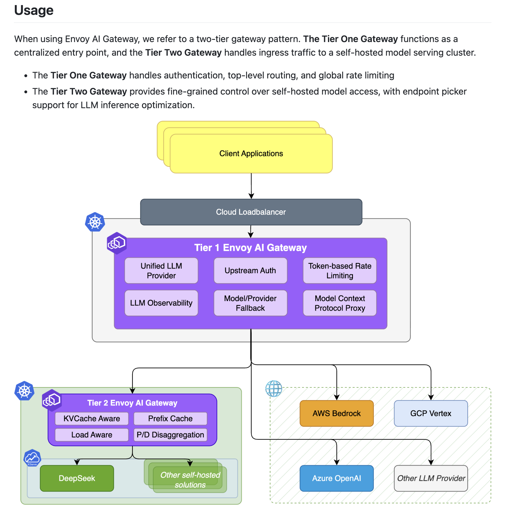
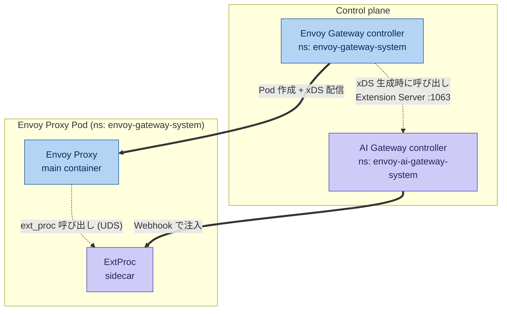
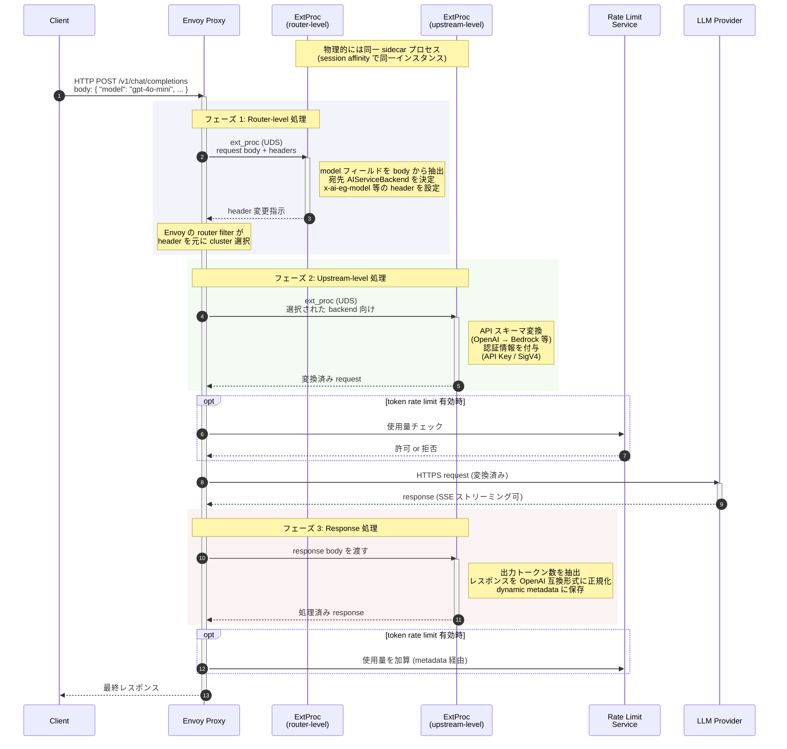
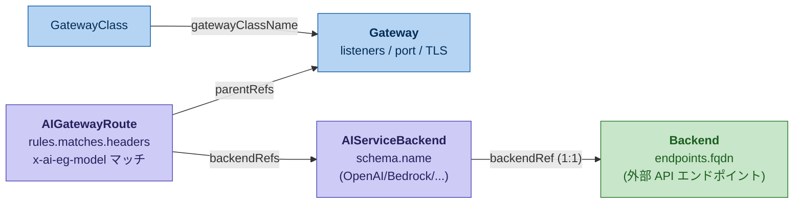
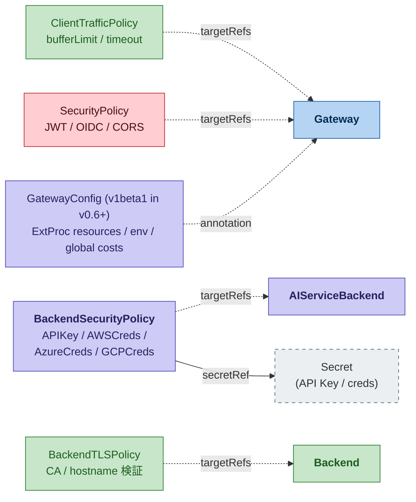
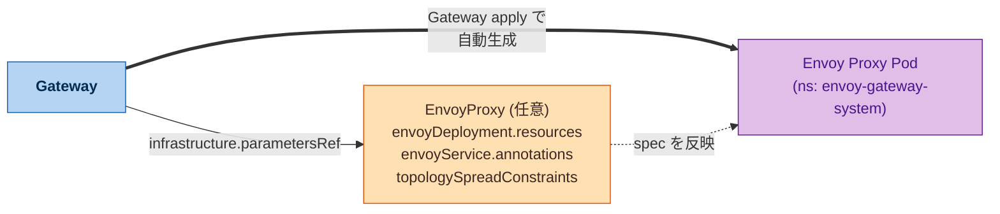

# Envoy Gateway / Envoy AI Gateway コンポーネント整理

> [!CAUTION]
> 2026年6月時点の情報なので、今後変更される可能性があります。
> - 対象バージョン: 
>   - Envoy AI Gateway v0.7.x（2026-06-06 リリース）
>   - Envoy Gateway v1.8.x+（Envoy Proxy v1.38.x）
>   - Kubernetes v1.32+
>   - Gateway API v1.5.x
>
> v0.6 → v0.7 で破壊的変更が複数あるため、まず直下の「v0.5 → v0.6 → v0.7 の主な変化（要点）」セクションを必ず確認すること。

## 全体像

Envoy AI Gateway は Envoy Gateway の上に構築された **拡張（extension）**。独立した製品ではなく、Envoy Gateway の Pod ライフサイクルに相乗りする形で動作する。

登場する Pod は 3 種類：

| レイヤ | Pod | 作成タイミング | 作成主体 |
|---|---|---|---|
| Control plane | Envoy Gateway Controller | Helm インストール時 | `gateway-helm` |
| Control plane | AI Gateway Controller | Helm インストール時 | `ai-gateway-helm` |
| Data plane | Envoy Proxy Pod（+ ExtProc サイドカー） | `Gateway` CR apply 時に動的生成 | Envoy Gateway Controller + AI Gateway Webhook |

> [!NOTE]
> `Gateway` CR が apply された瞬間に Envoy Gateway Controller が Envoy Proxy Pod を生成するが、その際に AI Gateway Controller の MutatingWebhook が割り込んで ExtProc サイドカーを注入するイメージ。以降、プロバイダ API 変換やトークンカウントはこのサイドカーが担当し、AIGatewayRoute 等による AI 固有のルーティング設定は AI Gateway Controller の Extension Server が Envoy Gateway に提供する。

- https://github.com/envoyproxy/ai-gateway



### v0.5 → v0.6 → v0.7 の主な変化（要点）

過去数ヶ月で核となる API が `v1beta1` に昇格し、いくつか破壊的変更が入った。アップグレードする際の必読項目を先にまとめる。

#### v0.6（2026-05-05 リリース）

- **コア CRD が `v1beta1` に昇格**: `AIGatewayRoute` / `AIServiceBackend` / `BackendSecurityPolicy` / `GatewayConfig` / `MCPRoute` が production-ready API として `aigateway.envoyproxy.io/v1beta1` で提供される。`v1alpha1` も併存するが deprecation 警告が出る。
- **破壊的変更 ①**: `AIGatewayRoute.spec.filterConfig` が **削除**。ExtProc のリソース・env 設定は `GatewayConfig` CRD に移行必須（v0.5 で deprecate されていたものの完全削除）。
- **破壊的変更 ②**: `VersionedAPISchema.version` を **パスプレフィックスとして使う旧挙動が削除**。`prefix` フィールドを使う必要がある（例: Gemini OpenAI 互換 API の `/v1beta/openai`、Cohere の `/compatibility/v1`）。
- **GKE Workload Identity (ADC) 対応**: GCP `BackendSecurityPolicy` で `credentialsFile` / `workloadIdentityFederationConfig` を未設定にすると、Application Default Credentials の自動検出が効くようになった。
- **`QuotaPolicy` CRD 新設**（API のみ、enforcement は v0.7 から）
- **リクエスト/レスポンス body の redaction** 機能追加（コンプライアンス用途）
- **Webhook の host network 対応**: `controller.hostNetwork: true` で GKE プライベートクラスタなど restricted ネットワーク環境に対応。`controller.mutatingWebhook.port` も指定可能に。
- **AI ExtProc 後段の Lua フィルタスロット** 追加
- **`LLMRequestCostType.ReasoningToken`** 追加（thinking トークンの個別計上）
- **MCP**: per-backend header forwarding、JWT claim forwarding、`MCPToolFilter.exclude` / `excludeRegex`、per-backend capability tracking

#### v0.7（2026-06-06 リリース）

- **ホスト名ベースルーティング**: `AIGatewayRoute.spec.hostnames` 新設。マルチテナント構成で 1 つの Gateway から hostname ごとに別モデルセットを公開できる。`/v1/models` レスポンスも hostname に応じてフィルタされる。
- **破壊的変更**: `AIGatewayRoute.spec.rules` の上限が **128 → 15** に縮小（Gateway API HTTPRoute の制約に合わせる）。超過する場合は複数の `AIGatewayRoute` に分割する。
- **`QuotaPolicy` ランタイム動作開始**: `AIServiceBackend` に attach すると backend rate limit filter が注入されるようになった（quota-aware routing の第一歩）。
- **Anthropic Messages → AWS Bedrock Converse 変換** 追加（text / images / tool use / thinking blocks / streaming すべて対応）
- **音声系エンドポイント追加**: `/v1/audio/transcriptions`、`/v1/audio/translations`
- **Azure OpenAI Responses API** 対応（`/v1/responses` を Azure バックエンドにルーティング可能に）
- **Claude Opus 4.7 reasoning** フルサポート: `display` パラメータ（`summarized` / `omitted`）、`xhigh` effort tier 対応
- **Anthropic → OpenAI 変換**で reasoning content / 画像ブロックがエンドツーエンドで通るように
- **`VersionedAPISchema.prefix`** が Anthropic schema backend にも適用可能に（`AWSAnthropic` / `GCPAnthropic` は内部上書きのため無視）
- **マルチモーダル content types**: chat completion で `audio_url` / `video_url` を扱えるように
- **MCP `tools/list` の認可フィルタ**: 認可されていないツールはリストから除外
- **`anthropic-beta` ヘッダ → AWSAnthropic への自動転送**（`anthropic_beta` body フィールドにマッピング）

> [!NOTE]
> 公式コンパチビリティマトリクス上、v0.7.x は **Envoy Gateway v1.8.x+（Envoy Proxy v1.38.x）/ Gateway API v1.5.x / Kubernetes v1.32+** が公式テスト対象。実際 v0.7.0 タグの `go.mod` も `envoyproxy/gateway v1.8.1` をピン留めしており、Envoy Gateway v1.8.1 は Envoy Proxy v1.38.1 を同梱する。
>
> 一方で v0.7.0 リリースノート末尾の "Dependency Versions" 表には Envoy Gateway v1.7.0 / Envoy Proxy v1.37 / Gateway API v1.4.1 と記載されているが、これは v0.6 のリリースノートテンプレートからコピーされたままの誤記と思われる。**コンパチビリティマトリクスと `go.mod` の v1.8.x 側を信用すること**。

#### コンポーネント間の関係性



#### 通信の流れ



## 前提知識: xDS とは

xDS = 「x Discovery Service」の総称。Envoy Proxy が設定情報を **動的に gRPC API 経由で受け取る仕組み**。静的 YAML ではなくコントロールプレーンから pull してくる形になっているため、設定変更時に Envoy の再起動が不要。

「x」は具体化して下記の API に分かれる：

| 略称 | 正式名 | 配信するもの |
|---|---|---|
| LDS | Listener Discovery Service | リスナー（待ち受けポート、プロトコル） |
| RDS | Route Discovery Service | HTTP ルーティングルール |
| CDS | Cluster Discovery Service | アップストリームクラスタ（バックエンド群）の定義 |
| EDS | Endpoint Discovery Service | 各クラスタの実エンドポイント（IP:port）一覧 |
| SDS | Secret Discovery Service | TLS 証明書・秘密鍵 |
| ADS | Aggregated Discovery Service | 上記を単一 gRPC ストリームで束ねたもの（順序保証あり） |

実運用では ADS で束ねて配信するのが一般的。

本ドキュメント内の文脈：
- **Envoy Gateway Controller** は `Gateway` / `HTTPRoute` 等の Kubernetes リソースを xDS 設定に変換し、管理下の Envoy Proxy Pod に gRPC で配信する。
- **AI Gateway Controller の Extension Server** はこの xDS 生成プロセスに割り込んで、AI 固有の設定（per-backend upstream filter 等）を追加する役割を担う。

公式仕様: https://www.envoyproxy.io/docs/envoy/latest/api-docs/xds_protocol

---

## Control Plane コンポーネント

### 1. Envoy Gateway Controller

Envoy Gateway プロジェクト本体のコントローラ。Kubernetes Gateway API の実装。

| 項目 | 内容 |
|---|---|
| Namespace | `envoy-gateway-system` |
| Helm チャート | `oci://docker.io/envoyproxy/gateway-helm` |
| 必要バージョン | **v1.8.x 以上**（AI Gateway v0.7 連携時、Envoy Proxy v1.38.x 同梱）。v0.6 を使う場合は v1.7.x+ / v0.5 は v1.6.x+ |
| 主な監視リソース | `GatewayClass`, `Gateway`, `HTTPRoute`, `GRPCRoute`, `ReferenceGrant`, `EnvoyProxy`, `ClientTrafficPolicy`, `BackendTrafficPolicy`, `SecurityPolicy`, `EnvoyExtensionPolicy`, `EnvoyPatchPolicy`, `Backend`, `BackendTLSPolicy`, `HTTPRouteFilter` |
| 主な役割 | Gateway API リソースを監視し、Envoy Proxy の Deployment / Service / ConfigMap を生成。xDS で Envoy Proxy に設定配信 |
| 設定ファイル | `EnvoyGateway` CR（通常は Helm values から生成される ConfigMap） |

#### AI Gateway 連携に必須の values 設定

AI Gateway v0.3+ では、Envoy Gateway インストール時に AI Gateway 公式の `envoy-gateway-values.yaml` を `-f` で渡すことで拡張登録を行う。

公式ファイル: `https://raw.githubusercontent.com/envoyproxy/ai-gateway/main/manifests/envoy-gateway-values.yaml`

中身の要点：

```yaml
config:
  envoyGateway:
    extensionApis:
      enableEnvoyPatchPolicy: true   # 推奨
      enableBackend: true            # 必須（AI プロバイダへの FQDN 接続用）
    extensionManager:
      hooks:
        xdsTranslator:
          translation:
            listener: {includeAll: true}
            route:    {includeAll: true}
            cluster:  {includeAll: true}
            secret:   {includeAll: true}
          post:
            - Translation
            - Cluster
            - Route
      service:
        fqdn:
          hostname: ai-gateway-controller.envoy-ai-gateway-system.svc.cluster.local
          port: 1063
```

---

### 2. AI Gateway Controller

Envoy Gateway の拡張として動作する、AI 特化機能のコントローラ。

| 項目 | 内容 |
|---|---|
| Namespace | `envoy-ai-gateway-system` |
| Helm チャート | `oci://docker.io/envoyproxy/ai-gateway-helm` |
| CRD チャート | `oci://docker.io/envoyproxy/ai-gateway-crds-helm` |
| Deployment 名 | `ai-gateway-controller` |
| Service | ポート 9443（mutating-webhook）, 1063（grpc）, 8080（http-metrics） |
| 主な監視リソース | `AIGatewayRoute`, `AIServiceBackend`, `BackendSecurityPolicy`, `GatewayConfig`, `MCPRoute`, `QuotaPolicy`（v0.7 でランタイム動作開始） |
| 主な役割 | AI 固有リソースの監視 + **MutatingWebhook による ExtProc サイドカー注入** + Envoy Gateway Controller への拡張 xDS 情報の提供（Extension Server） |
| 依存 | Envoy Gateway が先にインストール済みで、かつ AI Gateway 用の values で起動していること |

#### 2 つの重要な仕組み

1. **Extension Server**: Envoy Gateway Controller が xDS 生成時に呼び出す gRPC サービス（port 1063）。AIGatewayRoute 等を Envoy 設定に変換する。
2. **MutatingWebhook**: Envoy Proxy Pod が作られる瞬間に割り込んで、ExtProc コンテナを Pod spec に注入する。`objectSelector` は `app.kubernetes.io/managed-by: envoy-gateway` で Envoy Gateway 管理の Pod のみを対象とする。

#### 実際の values.yaml キー（ai-gateway-helm）

```yaml
controller:
  replicaCount: 1                    # デフォルト 1
  leaderElection:
    enabled: true                    # デフォルト true（複数レプリカ時の split-brain 対策）
  logLevel: info
  watch:
    namespaces: []                   # 空 = 全 namespace 監視
    cacheSyncTimeout: 2m
  serviceAccount:
    create: true
    annotations: {}                  # IRSA 等をここに
  mutatingWebhook:
    tlsCertSecretName: self-signed-cert-for-mutating-webhook
    certManager:
      enable: false                  # production では true + cert-manager 推奨
    port: 9443                       # v0.6+ で指定可能。GKE プライベートクラスタ等で衝突回避用
  hostNetwork: false                 # v0.6+。GKE プライベートクラスタなど restricted webhook ネットワークで true
  # 注: topologySpreadConstraints は v0.7 時点でも未対応（後述のハマりどころ参照）
  # スケジューリング制御は以下 4 つのみ:
  resources: {}
  nodeSelector: {}
  tolerations: []
  affinity: {}
  image:
    repository: docker.io/envoyproxy/ai-gateway-controller

extProc:
  image:
    repository: docker.io/envoyproxy/ai-gateway-extproc
  logLevel: info
  enableRedaction: false             # debug ログ時にプロンプト等をマスク（production debug 時は true）
  extraEnvVars: []

endpointConfig:
  rootPrefix: "/"                    # AI Gateway が生成するルートの共通接頭辞
  openai: ""                         # → /v1/...
  cohere: "/cohere"                  # → /cohere/v2/...
  anthropic: "/anthropic"            # → /anthropic/v1/...
```

---

## Data Plane コンポーネント

### 3. Envoy Proxy Pod（メインコンテナ）

実際にクライアントからのリクエストを受けて LLM プロバイダに転送するデータプレーン本体。

| 項目 | 内容 |
|---|---|
| Namespace | **`envoy-gateway-system`**（`envoy-ai-gateway-system` ではない） |
| 作成タイミング | `Gateway` CR が apply された瞬間 |
| 作成主体 | Envoy Gateway Controller が Deployment / Service を生成 |
| 中身 | Envoy Proxy バイナリ + xDS クライアント |
| カスタマイズ | `EnvoyProxy` CR を Gateway の `infrastructure.parametersRef` で紐付け |

> [!IMPORTANT]
> **Gateway CR をどの namespace に作っても、生成される Envoy Proxy Pod は `envoy-gateway-system` namespace に作られる**。これは Envoy Gateway のデフォルトの "Controller namespace mode" の挙動で、Controller のインストール namespace に Envoy Proxy Pod が集約される仕様。探すときは以下のラベルセレクタを使う：
> ```bash
> kubectl get pods -n envoy-gateway-system \
>   -l gateway.envoyproxy.io/owning-gateway-name=<gateway-name>
> ```

#### よく触るカスタマイズポイント

- **NLB アノテーション**: `EnvoyProxy.spec.provider.kubernetes.envoyService.annotations` に `service.beta.kubernetes.io/aws-load-balancer-*` を設定
- **リソース**: `EnvoyProxy.spec.provider.kubernetes.envoyDeployment.container.resources`
- **バッファ上限**: `ClientTrafficPolicy` の `connection.bufferLimit` でデフォルト 32KB から 50MB 程度に引き上げ（AI レスポンス用）
- **topologySpreadConstraints**: `EnvoyProxy.spec.provider.kubernetes.envoyDeployment.pod.topologySpreadConstraints` で Envoy Proxy Pod のゾーン分散が可能（Controller 側と違ってフルサポート）

#### Envoy Proxy の Service タイプ（デフォルトと変更方法）

Envoy Gateway は `Gateway` CR の apply 時に **Envoy Proxy Pod 用の Service を自動生成する**。このとき **デフォルトの Service タイプは `LoadBalancer`**。EKS / GKE / AKS であればクラウドプロバイダの LB（NLB / GCLB / ALB）が即座にプロビジョニングされる。

EKS 内部利用前提（クラスタ内からの呼び出しのみ）や、別途 Ingress / ALB Controller を前段に置く構成では、LB を生成せずに `ClusterIP` に変えたいケースが多い。**設定は 2 層あり、用途で使い分ける**。

##### 層 1: Helm values（クラスタ全体のデフォルト）

`gateway-helm` の values で **Envoy Gateway Controller 自身の Service タイプ**を制御する。AI Gateway 連携時はこれを `ClusterIP` にしておくのが定石。

```yaml
# envoy-gateway-values.yaml
service:
  type: ClusterIP                # NLB は EnvoyProxy CR / Gateway 側の annotation で個別に付ける
```

> [!NOTE]
> ここで設定するのは **Envoy Gateway Controller の Service**（xDS / extension API の窓口）であり、データプレーンの Envoy Proxy Pod の Service ではない点に注意。
> 
> ただし AI Gateway 公式の `envoy-gateway-values.yaml` には `service` キーは含まれていないため、`-f` で重ねる values 側で明示的に追記する必要がある。

##### 層 2: EnvoyProxy CR（Gateway ごとの上書き、推奨）

**データプレーン側の Service タイプを変えたい場合はこちら**。Gateway ごとに `EnvoyProxy` CR を作成し、`spec.provider.kubernetes.envoyService.type` で指定する。

```yaml
apiVersion: gateway.envoyproxy.io/v1alpha1
kind: EnvoyProxy
metadata:
  name: internal-envoy-proxy
  namespace: envoy-gateway-system
spec:
  provider:
    type: Kubernetes
    kubernetes:
      envoyService:
        type: ClusterIP            # デフォルトは LoadBalancer
        # 内部 NLB にしたい場合は annotations を併用
        # annotations:
        #   service.beta.kubernetes.io/aws-load-balancer-scheme: internal
        #   service.beta.kubernetes.io/aws-load-balancer-type: nlb
---
apiVersion: gateway.networking.k8s.io/v1
kind: Gateway
metadata:
  name: internal-ai-gateway
spec:
  gatewayClassName: envoy-gateway
  infrastructure:
    parametersRef:                 # ← ここで EnvoyProxy を紐付け
      group: gateway.envoyproxy.io
      kind: EnvoyProxy
      name: internal-envoy-proxy
  listeners:
    - name: http
      protocol: HTTP
      port: 80
```

##### 設定可能な Service タイプ

| 値 | 用途 |
|---|---|
| `LoadBalancer` | **デフォルト**。クラウド LB を自動プロビジョニング |
| `ClusterIP` | クラスタ内部のみで利用。`kubectl port-forward` や別 Ingress 経由でアクセス |
| `NodePort` | 各ノードのポートで公開。NLB を手動管理する構成等で稀に使う |

##### 使い分けの典型パターン

| パターン | Helm `service.type` | EnvoyProxy CR | 備考 |
|---|---|---|---|
| 全 Gateway を外部公開（最小構成） | デフォルト（`LoadBalancer`）| 未指定 | 簡単だが Gateway 増えると LB コスト増 |
| 全 Gateway を内部利用 | `ClusterIP` | 未指定 | 社内 AI Gateway 等 |
| Gateway ごとに公開／内部を使い分け | `ClusterIP`（保守的に）| Gateway ごとに作成して個別上書き | **推奨**。柔軟性が高い |
| ALB Ingress Controller を前段に置く | `ClusterIP` | 未指定 or `ClusterIP` | LB は ALB Controller 側で管理 |

> [!IMPORTANT]
> **Helm values 側を `ClusterIP` にしても、`EnvoyProxy` CR で `LoadBalancer` を指定すれば上書きされる**。Helm 側はあくまでデフォルト値で、CR 側が常に優先される。GitOps で運用する場合は「Helm = 安全側のデフォルト（ClusterIP）」「EnvoyProxy CR = Gateway ごとの個別判断」と整理しておくとレビューしやすい。

---

### 4. ExtProc サイドカー（AI 処理担当）

Envoy Proxy Pod に同居する、AI 固有のリクエスト/レスポンス処理を担うサイドカー。

| 項目 | 内容 |
|---|---|
| Namespace | Envoy Proxy Pod と同じ（`envoy-gateway-system`） |
| 注入方法 | AI Gateway の MutatingWebhook が Pod 作成時に挿入 |
| イメージ | `docker.io/envoyproxy/ai-gateway-extproc` |
| Envoy との通信 | **Unix Domain Socket (UDS)**（ネットワーク gRPC ではない。v0.2 以降でサイドカー + UDS 方式に変更） |
| 主な処理 | モデル名ベースのルーティング判定、プロバイダ API スキーマ変換（OpenAI ↔ Bedrock 等)、トークンカウント、プロバイダ認証情報の付与、トークン使用量のメトリクス発行 |
| リソース等の設定 | `GatewayConfig` CRD（v0.5 新規）経由で Gateway ごとに指定 |

#### GatewayConfig での ExtProc 設定例（v0.6+ で `v1beta1` 推奨）

```yaml
apiVersion: aigateway.envoyproxy.io/v1beta1
kind: GatewayConfig
metadata:
  name: my-gateway-config
spec:
  extProc:
    kubernetes:
      resources:
        requests: {cpu: 100m, memory: 128Mi}
        limits:   {cpu: 500m, memory: 512Mi}
      env:
        - name: OTEL_EXPORTER_OTLP_ENDPOINT
          value: http://otel-collector:4317
---
apiVersion: gateway.networking.k8s.io/v1
kind: Gateway
metadata:
  name: ai-gateway
  annotations:
    aigateway.envoyproxy.io/gateway-config: my-gateway-config
```

なお v0.5 で GatewayConfig CRD が導入され、**v0.6 で `AIGatewayRoute.spec.filterConfig` は完全に削除された（破壊的変更）**。v0.5 以前の `filterConfig.externalProcessor.resources` をまだ使っている場合は、アップグレード前に `GatewayConfig` 方式へ移行必須。

**v0.5 → v0.6 移行例**:

```yaml
# Before (v0.5)
apiVersion: aigateway.envoyproxy.io/v1alpha1
kind: AIGatewayRoute
metadata:
  name: my-route
spec:
  filterConfig:
    externalProcessor:
      resources:
        requests: {cpu: "100m", memory: "128Mi"}

---
# After (v0.6+)
apiVersion: aigateway.envoyproxy.io/v1beta1
kind: GatewayConfig
metadata:
  name: my-gateway-config
spec:
  extProc:
    kubernetes:
      resources:
        requests: {cpu: "100m", memory: "128Mi"}
---
apiVersion: gateway.networking.k8s.io/v1
kind: Gateway
metadata:
  name: ai-gateway
  annotations:
    aigateway.envoyproxy.io/gateway-config: my-gateway-config
```

> [!NOTE]
> 公式ドキュメント内で GatewayConfig の spec 階層に表記揺れがある：
> - `spec.extProc.kubernetes.resources`（API Reference / Release Notes が採用、本ドキュメントもこれを採用）
> - `spec.extProc.resources`（capabilities/gateway-config ページが採用）
> 
> 実際の動作確認は `kubectl explain gatewayconfig.spec.extProc` で etcd 上のスキーマを見るのが確実。

---

### 5. Rate Limit Service（オプション）

Token-based rate limiting を使う場合に必要な、独立した Data Plane コンポーネント。

| 項目 | 内容 |
|---|---|
| 用途 | プロンプト／応答のトークン数に基づくレート制限 |
| 必須度 | オプション（`BackendTrafficPolicy` の rate limit 機能を使う場合のみ） |
| 実体 | Envoy の rate limit service（Redis バックエンドが一般的） |
| 有効化 | Envoy Gateway 起動時に `examples/token_ratelimit/envoy-gateway-values-addon.yaml` を追加で `-f` で渡す |
| Envoy からの呼び出し | リクエスト処理中にクォータチェック。レスポンス処理後にトークン使用量を加算 |

トークンカウント自体は ExtProc が行い、dynamic metadata に保存した値を Envoy が Rate Limit Service に渡す構成。

---

## リクエスト処理の具体例（基本マニフェストで理解する）

公式 basic-usage のマニフェストを題材に、各 CRD の責務とリクエストフローを整理する。

公式サンプル: https://aigateway.envoyproxy.io/docs/getting-started/basic-usage

### 登場する CRD の責務分離

| Kind | API group | 責務 |
|---|---|---|
| `GatewayClass` | `gateway.networking.k8s.io` | 「Envoy Gateway Controller がこのクラスを管理する」という宣言（Pod は作らない）|
| `Gateway` | `gateway.networking.k8s.io` | リスナー（port/protocol）定義。**Envoy Proxy Pod 生成のトリガー** |
| `ClientTrafficPolicy` | `gateway.envoyproxy.io` | クライアント側のバッファ・タイムアウト等の設定 |
| `EnvoyProxy` | `gateway.envoyproxy.io` | 生成される Envoy Proxy Pod の挙動カスタマイズ |
| `AIGatewayRoute` | `aigateway.envoyproxy.io` | **AI 固有のルーティングルール**（モデル名マッチ等）|
| `AIServiceBackend` | `aigateway.envoyproxy.io` | **バックエンドの API スキーマ定義**（OpenAI / Bedrock 等）|
| `Backend` | `gateway.envoyproxy.io` | **ネットワーク宛先（FQDN）定義**。`enableBackend: true` 必須 |

**「ルーティングルール → API スキーマ → ネットワーク宛先」という 3 層の抽象**で責務が分離されているのがポイント。この分離により、同じ `AIServiceBackend` を複数の `AIGatewayRoute` から使い回したり、同じ `Backend`（FQDN）に対して複数の `AIServiceBackend`（異なる schema）を紐付けたりできる。

### `x-ai-eg-model` ヘッダーによる自動ルーティング

AI Gateway の核心的な仕組みの一つ。クライアントは **普通に OpenAI 互換の JSON body を送るだけ**で、body の `model` フィールドに基づくルーティングが効く。

```
Client → POST /v1/chat/completions
         body: {"model": "gpt-4o-mini", ...}
         ↓
ExtProc (router-level) が body の model フィールドを抽出
         ↓
Envoy の内部ヘッダーとして x-ai-eg-model: gpt-4o-mini を自動で付与
         ↓
AIGatewayRoute.rules.matches.headers でマッチング判定
         ↓
マッチしたルールの backendRefs へ転送
```

→ **ユーザーはヘッダーを自分で付ける必要はない**。OpenAI 互換クライアントのまま、モデル名に応じて異なる backend へルーティングできる。

典型的な AIGatewayRoute 記述：

```yaml
apiVersion: aigateway.envoyproxy.io/v1beta1
kind: AIGatewayRoute
metadata:
  name: multi-model-route
spec:
  parentRefs:
    - name: ai-gateway
      kind: Gateway
      group: gateway.networking.k8s.io
  rules:
    - matches:
        - headers:
            - type: Exact
              name: x-ai-eg-model         # body の "model" が自動でここに反映
              value: gpt-4o-mini
      backendRefs:
        - name: openai-backend            # OpenAI の AIServiceBackend へ
    - matches:
        - headers:
            - type: Exact
              name: x-ai-eg-model
              value: claude-3-5-sonnet
      backendRefs:
        - name: bedrock-backend           # AWS Bedrock の AIServiceBackend へ
```

### `AIServiceBackend.schema.name` によるスキーマ変換

`AIGatewayRoute` への入力は **暗黙的に OpenAI 互換形式**。これに対して `AIServiceBackend.schema.name` で宣言されたバックエンド種別が異なる場合、ExtProc が自動的に JSON body を変換する。

| `schema.name` の値 | 意味 | 変換の有無 |
|---|---|---|
| `OpenAI` | OpenAI API 互換 | 変換なし（そのまま転送） |
| `AWSBedrock` | AWS Bedrock Runtime API | OpenAI → Bedrock 形式に変換 |
| `AzureOpenAI` | Azure OpenAI | OpenAI → Azure OpenAI 形式に変換 |
| `GCPVertexAI` | GCP Vertex AI (Gemini) | OpenAI → Vertex AI 形式に変換 |
| `Anthropic` | Anthropic 本家 API | OpenAI → Anthropic Messages 形式に変換 |
| `AWSAnthropic` | Bedrock 上の Anthropic（native）| Anthropic Messages 形式のまま、Bedrock に転送 |
| `GCPAnthropic` | Vertex AI 上の Anthropic（native）| Anthropic Messages 形式のまま、Vertex AI に転送 |
| `Cohere` | Cohere API | OpenAI → Cohere 形式に変換 |

これが AI Gateway の最大の価値の一つ。**クライアントは OpenAI SDK のまま、バックエンドだけを差し替えられる**。

### モデルIDは「実際のプロバイダのモデル名」で書く

`AIGatewayRoute.rules.matches.headers.value` に書く値は、**プロバイダが実際に受け付ける正式なモデルID**である必要がある。**任意のエイリアスではない**。

**具体例**: AWS Bedrock の Llama 3.2 にルーティングする場合

```bash
curl -d '{
  "model": "us.meta.llama3-2-1b-instruct-v1:0",
  "messages": [...]
}' http://gateway/v1/chat/completions
```

処理の流れ：

1. body の `"model": "us.meta.llama3-2-1b-instruct-v1:0"` が ExtProc により `x-ai-eg-model` ヘッダーに自動付与
2. `AIGatewayRoute` が `value: us.meta.llama3-2-1b-instruct-v1:0` でマッチ → Bedrock の `AIServiceBackend` へ
3. OpenAI → Bedrock 形式にスキーマ変換時、**そのモデルIDが Bedrock の URL パスに埋め込まれる**

このため、**クライアントが送る `model` 値 = `matches.headers.value` = Bedrock の正式モデルID の三点一致が必須** になる。「my-llama」のような独自エイリアスをクライアント側で使っても、そのままだとマッチしないし、マッチしたとしても Bedrock 側でモデル不明エラーになる。

### エイリアス（クライアント向けのモデル名）を使いたい場合

クライアントには `my-llama` のようなシンプルな名前で送らせたいが、上流には `us.meta.llama3-2-1b-instruct-v1:0` を送りたい — という要件には **`modelNameOverride`** を使う。

```yaml
apiVersion: aigateway.envoyproxy.io/v1beta1
kind: AIGatewayRoute
spec:
  rules:
    - matches:
        - headers:
            - type: Exact
              name: x-ai-eg-model
              value: my-llama                       # ← クライアントが送るエイリアス
      backendRefs:
        - name: bedrock-backend
          modelNameOverride: us.meta.llama3-2-1b-instruct-v1:0  # ← 上流に送る実モデルID
```

これにより「クライアントは `my-llama`、上流は `us.meta.llama3-2-1b-instruct-v1:0`」という名前の付け替えが成立する。複数プロバイダで同じモデルを使う際の **モデル名の抽象化**（Model Name Virtualization）にも使える（例: `claude-4-sonnet` というエイリアスを AWS Bedrock では `anthropic.claude-sonnet-4-20250514-v1:0`、GCP Vertex AI では `claude-sonnet-4@20250514` にマップする等）。

> [!NOTE]
> `AIGatewayRoute.rules.modelsOwnedBy` / `modelsCreatedAt` は OpenAI 互換の `/models` エンドポイントで返す `owned_by` / `created` フィールドを制御するためのもので、モデル名変換には関係しない。名前の付け替えには必ず `modelNameOverride` を使うこと。

### ホスト名ベースのマルチテナント分離（v0.7 新機能）

v0.7 で `AIGatewayRoute.spec.hostnames` が追加され、**1 つの Gateway で hostname ごとに別のモデルセットを公開できる**ようになった。チームごと・テナントごとに異なるモデルを見せたい SaaS / 共有プラットフォーム用途を、Gateway を増やさずに実現できる。

```yaml
# Team A 用ルート（gpt-4o のみ公開）
apiVersion: aigateway.envoyproxy.io/v1beta1
kind: AIGatewayRoute
metadata:
  name: team-a-route
spec:
  parentRefs:
    - name: ai-gateway
      kind: Gateway
      group: gateway.networking.k8s.io
  hostnames:                              # ← v0.7 新フィールド
    - "team-a.ai.example.com"
  rules:
    - matches:
        - headers:
            - type: Exact
              name: x-ai-eg-model
              value: gpt-4o
      backendRefs:
        - name: openai-backend
---
# Team B 用ルート（claude-opus-4-7 のみ公開）
apiVersion: aigateway.envoyproxy.io/v1beta1
kind: AIGatewayRoute
metadata:
  name: team-b-route
spec:
  parentRefs:
    - name: ai-gateway
      kind: Gateway
      group: gateway.networking.k8s.io
  hostnames:
    - "team-b.ai.example.com"
  rules:
    - matches:
        - headers:
            - type: Exact
              name: x-ai-eg-model
              value: claude-opus-4-7
      backendRefs:
        - name: bedrock-backend
```

挙動のポイント：

- **`hostnames` を指定しないルート**は従来通り全ホストに有効。混在も可能。
- **`/v1/models` レスポンスもホスト名でスコープされる**。`team-a.ai.example.com` を叩いたクライアントには gpt-4o のみが見える。
- ワイルドカードホスト名（`*.ai.example.com`）は Gateway API のホスト名マッチセマンティクスに従う。
- DNS 側で複数の hostname を同じ Envoy Proxy Service に向けておく必要がある。NLB / ALB の場合は両方の hostname を ACM 証明書に含めて SNI で振り分ける構成。

### `AIGatewayRoute.spec.rules` の上限（v0.7 で 15 に縮小）

> [!WARNING]
> v0.7 で **1 つの `AIGatewayRoute` あたりの rules 数上限が 128 → 15 に縮小**された（Gateway API HTTPRoute の制約に合わせるため。1 スロットはコントローラ注入の catch-all 用に予約される）。
> 16 個以上のモデルを束ねたい場合は、複数の `AIGatewayRoute` を **同じ `Gateway` を parentRefs に指定して** 分割する必要がある。ホスト名ベース分離（前項）と組み合わせると分割の単位が自然に決まる。

### エージェントフレームワークからの呼び出し

LangChain / Strands Agents / Google ADK などのフレームワークで Envoy AI Gateway を利用する場合、クライアント側は **OpenAI 互換エンドポイントを叩く形で統一**できる。プロバイダ別のクラス（`ChatBedrock` / `ChatAnthropic` 等）を使い分ける必要はなく、全部 OpenAI クライアントで通す。

このとき **フレームワークの `model=` に書いた値は、そのまま HTTP body の `"model"` フィールドに載るだけ**で、フレームワーク側で正規化やエイリアス解決はされない。つまり前項で整理した三点一致（クライアントの `model` = `matches.headers.value` = 実モデルID または `modelNameOverride` で定義したエイリアス）のルールがそのまま適用される。

各フレームワークで Envoy AI Gateway を base_url に指定する方法：

**LangChain (Python)**
```python
from langchain_openai import ChatOpenAI

llm = ChatOpenAI(
    base_url="http://ai-gateway.example.com/v1",
    api_key="dummy",              # Gateway 側で認証するのでダミーでよい
    model="gpt-4o-mini",           # または AIGatewayRoute で定義したエイリアス
)
```

**Strands Agents**
```python
from strands.models.openai import OpenAIModel
from strands import Agent

model = OpenAIModel(
    client_args={
        "base_url": "http://ai-gateway.example.com/v1",
        "api_key": "dummy",
    },
    model_id="gpt-4o-mini",
)
agent = Agent(model=model)
```

**Google ADK**（LiteLLM 経由）
```python
from google.adk.agents import LlmAgent
from google.adk.models.lite_llm import LiteLlm

agent = LlmAgent(
    model=LiteLlm(
        model="openai/gpt-4o-mini",   # "openai/" プレフィックスが必要
        api_base="http://ai-gateway.example.com/v1",
        api_key="dummy",
    ),
    name="my_agent",
)
```

#### パラメータ名の対応表

`base_url` 指定は各フレームワークにあるが、**パラメータ名は統一されていない**ので注意：

| フレームワーク | クラス | base_url パラメータ |
|---|---|---|
| LangChain (Python) | `ChatOpenAI` | `base_url=` （旧: `openai_api_base=`）|
| LangChain (JS/TS) | `ChatOpenAI` | 第 2 引数 `configuration: { baseURL: ... }` |
| Strands Agents | `OpenAIModel` | `client_args={"base_url": ...}` |
| Google ADK | `LiteLlm` | `api_base=` |
| OpenAI Agents SDK | `AsyncOpenAI` | `base_url=`（クライアント注入方式）|

#### LangChainの例
```python
from langchain_openai import ChatOpenAI
from langchain_core.prompts import ChatPromptTemplate
from langchain_core.output_parsers import StrOutputParser

llm = ChatOpenAI(
    model="claude-haiku-4-5",  # AIGatewayRouteで定義したmodel名
    base_url="http://localhost:8080/v1",  # AI GatewayのListener
    api_key="dummy",  # Gateway側で認証する場合はダミーでOK、必要なら実トークン(パラメータは必須項目なので必要)
    streaming=True,
)

prompt = ChatPromptTemplate.from_messages([
    ("system", "あなたは親切なアシスタントです。日本語で回答してください。"),
    ("user", "{question}"),
])

chain = prompt | llm | StrOutputParser()

user_input = input("質問を入力してください: ")
for chunk in chain.stream({"question": user_input}):
    print(chunk, end="", flush=True)
print()
```

> [!NOTE]
> `stream()`で自動で `streaming=True`になる

#### Strands Agentの例
```python
from strands import Agent
from strands.models.openai import OpenAIModel

model = OpenAIModel(
    client_args={
        "base_url": "http://localhost:8080/v1",  # kubectl port-forward svc/envoy-... 8080:80
        "api_key": "dummy",  # OpenAI SDKの必須パラメータ。Gateway側で認証する場合は実トークンを指定
    },
    model_id="claude-haiku-4-5",  # AIGatewayRouteで定義したmodel名(modelNameOverrideのエイリアス)
)

agent = Agent(
    model=model,
    system_prompt="あなたは親切なアシスタントです。日本語で回答してください。",
)

user_input = input("質問を入力してください: ")

# stream_async は非同期ジェネレータでイベントを流してくる
import asyncio

async def main():
    async for event in agent.stream_async(user_input):
        # テキストデルタだけを取り出して表示
        if "data" in event:
            print(event["data"], end="", flush=True)
    print()

asyncio.run(main())
```

#### ADKの例
```python
import asyncio
from google.adk.agents import LlmAgent
from google.adk.agents.run_config import RunConfig, StreamingMode
from google.adk.models.lite_llm import LiteLlm
from google.adk.runners import InMemoryRunner
from google.genai import types

agent = LlmAgent(
    name="test_agent",
    model=LiteLlm(
        model="openai/claude-haiku-4-5",
        api_base="http://localhost:8080/v1",
        api_key="dummy",
    ),
    instruction="あなたは親切なアシスタントです。日本語で回答してください。",
)

async def main():
    runner = InMemoryRunner(agent=agent, app_name="test_app")
    session = await runner.session_service.create_session(
        app_name="test_app", user_id="test_user"
    )

    user_input = input("質問を入力してください: ")
    content = types.Content(role="user", parts=[types.Part(text=user_input)])

    # ストリーミングを有効化
    run_config = RunConfig(streaming_mode=StreamingMode.SSE)

    async for event in runner.run_async(
        user_id="test_user",
        session_id=session.id,
        new_message=content,
        run_config=run_config,  # ← これを追加
    ):
        if event.content and event.content.parts:
            for part in event.content.parts:
                if part.text:
                    print(part.text, end="", flush=True)
    print()

asyncio.run(main())
```

### フレームワーク経由で使う際の注意点

#### ① `/v1` の付け方に注意

`base_url` 末尾に `/v1` を含めるかは SDK により異なる：

- **OpenAI SDK 系（LangChain / Strands / OpenAI Agents SDK）**: `/v1` を **含める**のが慣習（`http://gateway/v1`）
- **LiteLLM（ADK 経由）**: `api_base` に `/v1` を **含める**(LiteLLM が内部で `/chat/completions` を append する）

間違えると `404 Not Found` になる典型的な罠。最初に curl で疎通確認するのが安全：

```bash
curl http://ai-gateway.example.com/v1/chat/completions \
  -d '{"model": "gpt-4o-mini", "messages": [{"role":"user","content":"hi"}]}'
```

これが通ってから SDK から叩くと base_url の切れ目問題でハマらずに済む。

#### ② `endpointConfig.rootPrefix` との整合性

Helm values で `endpointConfig.rootPrefix` を `/` 以外に変えている場合、クライアントの base_url も合わせる必要がある：

| Gateway 側 `rootPrefix` | クライアント `base_url` |
|---|---|
| `"/"`（デフォルト）| `http://gateway/v1` |
| `"/ai"` | `http://gateway/ai/v1` |

#### ③ LangChain `ChatOpenAI` の非 OpenAI プロバイダ対応の制約

LangChain 公式ドキュメントに明確な注意書きがある：

> "ChatOpenAI targets official OpenAI API specifications only. Non-standard response fields from third-party providers (e.g., reasoning_content, reasoning, reasoning_details) are not extracted or preserved."

つまり **Envoy AI Gateway 経由で Bedrock / Vertex AI 等の非 OpenAI プロバイダを使う場合、プロバイダ固有のレスポンスフィールド（Claude の `reasoning_content` 等）が ChatOpenAI で落とされる可能性がある**。基本的な chat completion なら問題ないが、reasoning モデルや cache 情報を取りたい場合は個別検証が必要。

#### ④ Google ADK は LiteLLM 経由が事実上の前提

ADK は以下の二重構造：
- **Google モデル（Gemini）**: `model="gemini-2.5-flash"` のように direct string
- **それ以外**: `LiteLlm(model="openai/...")` ラッパー経由

Envoy AI Gateway 経由では後者のパスを使い、`"openai/"` プレフィックスを model 文字列に付ける必要がある。

> [!NOTE]
> フレームワーク側のパラメータ名の違いはあっても、**「OpenAI 互換エンドポイントとして Envoy AI Gateway を指せる」こと自体は全主要フレームワークで共通**。「プロバイダ別クラスの使い分けを消せる」という AI Gateway の価値は、どのフレームワークを選んでも享受できる。

### `Backend` CR の位置づけ

Gateway API 標準の `backendRefs` は Kubernetes `Service` しか指定できないが、実際には外部 FQDN（例: `api.openai.com`、Bedrock endpoint）を宛先にしたいケースが多い。`Backend` CR はこのギャップを埋める。

```yaml
apiVersion: gateway.envoyproxy.io/v1alpha1
kind: Backend
metadata:
  name: openai-backend
spec:
  endpoints:
    - fqdn:
        hostname: api.openai.com
        port: 443
```

> [!NOTE]
> `Backend` CR を使うには Envoy Gateway インストール時に `config.envoyGateway.extensionApis.enableBackend: true` が必要。AI Gateway 連携時は必須。

### 全体のデータフロー

```
Client
  │ POST /v1/chat/completions
  │ body: {"model": "gpt-4o-mini", ...}
  ▼
[Envoy Proxy Pod + ExtProc サイドカー]
  │ ① ExtProc が body の "model" を抽出して x-ai-eg-model ヘッダー付与
  ▼
[AIGatewayRoute マッチング]
  │ ② headers.x-ai-eg-model == "gpt-4o-mini" → backendRefs
  ▼
[AIServiceBackend]
  │ ③ schema.name で変換要否を判定
  │    例: OpenAI → Bedrock なら body を変換
  ▼
[Backend CR]
  │ ④ fqdn で定義された外部エンドポイント
  ▼
[LLM Provider] (OpenAI / Bedrock / Azure / Vertex AI / ...)
```

### 複数プロバイダ構成でのリソース展開

4 リソースのセット（`AIServiceBackend` + `BackendSecurityPolicy` + `Backend` + `BackendTLSPolicy`）は **API エンドポイント（FQDN）単位で 1 セット** 必要になる。通常は「プロバイダ数 = セット数」と考えてほぼ合っているが、厳密には下記のルールで決まる。

| リソース | 分割の単位 |
|---|---|
| `Backend` | FQDN + port 単位 |
| `BackendTLSPolicy` | `Backend` と 1:1 |
| `AIServiceBackend` | 同じ Backend でも schema が異なれば別（例: `AWSBedrock` と `AWSAnthropic`）|
| `BackendSecurityPolicy` | 認証情報単位。`targetRefs` は配列なので複数 AIServiceBackend で共有可 |

#### 3 プロバイダ構成の典型例

AWS Bedrock + GCP Vertex AI + Azure OpenAI の 3 つを使う場合、4 × 3 = **12 リソース**。これに `AIGatewayRoute`、`Gateway`、`GatewayClass`、`EnvoyProxy`、`ClientTrafficPolicy` を加えて完成形。

```
[AWS Bedrock] 1 セット
  AIServiceBackend       (schema.name: AWSBedrock)
  BackendSecurityPolicy  (type: AWSCredentials)
  Backend                (bedrock-runtime.<region>.amazonaws.com)
  BackendTLSPolicy

[GCP Vertex AI] 1 セット
  AIServiceBackend       (schema.name: GCPVertexAI)
  BackendSecurityPolicy  (type: GCPCredentials)
  Backend                (<region>-aiplatform.googleapis.com)
  BackendTLSPolicy

[Azure OpenAI] 1 セット
  AIServiceBackend       (schema.name: AzureOpenAI)
  BackendSecurityPolicy  (type: AzureCredentials)
  Backend                (<resource-name>.openai.azure.com)
  BackendTLSPolicy
```

#### AIGatewayRoute は 1 つで全部束ねる

`AIGatewayRoute` は `rules` を複数並べられるため、**プロバイダが増えても 1 リソースのまま**。プロバイダ数分作る必要はない。

```yaml
apiVersion: aigateway.envoyproxy.io/v1beta1
kind: AIGatewayRoute
spec:
  parentRefs:
    - name: envoy-ai-gateway
      kind: Gateway
      group: gateway.networking.k8s.io
  rules:
    - matches:
        - headers:
            - type: Exact
              name: x-ai-eg-model
              value: claude-sonnet-4
      backendRefs:
        - name: envoy-ai-gateway-aws
          modelNameOverride: anthropic.claude-sonnet-4-20250514-v1:0
    - matches:
        - headers:
            - type: Exact
              name: x-ai-eg-model
              value: gemini-2.5-pro
      backendRefs:
        - name: envoy-ai-gateway-gcp
          modelNameOverride: gemini-2.5-pro
    - matches:
        - headers:
            - type: Exact
              name: x-ai-eg-model
              value: gpt-4o
      backendRefs:
        - name: envoy-ai-gateway-azure
          modelNameOverride: gpt-4o
```

#### 同一プロバイダでも複数セットが必要なケース

| ケース | 分かれる理由 |
|---|---|
| 複数リージョン（例: Bedrock の us-east-1 + us-west-2） | FQDN が異なる → Backend / BackendTLSPolicy が別 |
| 同一 Backend で複数 schema（例: `AWSBedrock` と `AWSAnthropic` 両方使う） | AIServiceBackend のみ 2 つ。Backend / BackendTLSPolicy は共有可 |
| Azure の複数リソース | リソースごとに FQDN が変わるため Backend が別 |

> [!NOTE]
> ざっくり「プロバイダ数 = 4 リソースのセット数」で大体合う。より正確には **「Backend は FQDN 単位で 1 つ」** が原則で、リージョン分割やマルチテナント展開時の設計判断はこの原則に立ち返れば迷わない。

---

## リソース間の関係図

Envoy AI Gateway 環境で登場する各 CRD が、**誰を参照し、誰に attach されるか** を整理する。登場リソースが多いため、役割別に 3 枚の図に分けた。

### 図 1: メインのリクエスト経路（コア参照関係）

クライアントリクエストが辿る主要なリソースチェーンを示す。**AIGatewayRoute → AIServiceBackend → Backend の 3 層の責務分離** が核。



**読み方**: 矢印は「参照する向き」。`AIGatewayRoute` が `Gateway` を `parentRefs` で指し、`AIServiceBackend` を `backendRefs` で指し、`AIServiceBackend` が `Backend` を `backendRef` で指す、という直列の参照チェーン。

### 図 2: Policy Attachment 群（targetRefs で attach するポリシー類）

メインチェーンの各リソースに対して、**横から attach される形のポリシー**。矢印は `targetRefs` の指す方向（実線ではなく点線で表現する慣習）。



**読み方**: 点線の矢印 = Policy Attachment（`targetRefs` または annotation で attach）。`BackendSecurityPolicy` だけは `secretRef` で `Secret` を実線参照している（直接参照）。

### 図 3: Envoy Proxy Pod のカスタマイズ（EnvoyProxy の立ち位置）

`EnvoyProxy` CR は Pod のデプロイ仕様をカスタマイズするためのリソースで、メインチェーンとは別の軸。



**読み方**: `Gateway` CR の apply をトリガーに **Envoy Proxy Pod が自動生成される**（太線）。`EnvoyProxy` CR を `parametersRef` で紐付けると、その内容が Pod のカスタマイズに反映される（点線）。`EnvoyProxy` を指定しなくても Pod は生成される（デフォルト値が使われる）ため、オプション扱い。

### 矢印スタイルの凡例

| スタイル | 意味 |
|---|---|
| `──>` 実線 | 直接参照（`backendRefs` / `backendRef` / `parentRefs` / `gatewayClassName` / `secretRef`）|
| `-.->` 点線 | Policy Attachment（`targetRefs` / `annotation`）|
| `==>` 太線 | Kubernetes のリソース生成動作（apply による副作用）|

### 参照関係の一覧（全リソース網羅）

| 参照元 | 参照フィールド | 参照先 | 備考 |
|---|---|---|---|
| `Gateway` | `gatewayClassName` | `GatewayClass` | 標準 |
| `Gateway` | `infrastructure.parametersRef` | `EnvoyProxy` | オプション |
| `AIGatewayRoute` | `parentRefs` | `Gateway` | v0.3+（旧 `targetRefs` 非推奨）|
| `AIGatewayRoute` | `rules[].backendRefs` | `AIServiceBackend` | 複数指定可 |
| `AIServiceBackend` | `backendRef` | `Backend` | 1:1 関係 |
| `BackendSecurityPolicy` | `secretRef` | `Secret` | 認証情報 |

### Policy Attachment の一覧

| ポリシー | attach 先 | 用途 |
|---|---|---|
| `BackendSecurityPolicy` | `AIServiceBackend` | アップストリーム認証 |
| `BackendTLSPolicy` | `Backend` | 上流 TLS 検証 |
| `ClientTrafficPolicy` | `Gateway` | クライアント→GW のバッファ・タイムアウト |
| `BackendTrafficPolicy` | `HTTPRoute` / `Backend` | 上流への retry / rate limit |
| `SecurityPolicy` | `Gateway` / `HTTPRoute` | JWT / OIDC / CORS 等 |
| `GatewayConfig` | `Gateway`（annotation）| ExtProc 設定（v0.5+）+ `globalLLMRequestCosts`（v0.6+）|

### 3 層の責務分離

AI Gateway の設計上、以下の 3 層に責務が明確に分離されている：

```
【ルーティングロジック層】  AIGatewayRoute
       │ backendRefs (モデル名で振り分け)
       ▼
【API スキーマ層】          AIServiceBackend
       │ backendRef (1:1)
       ▼
【ネットワーク宛先層】      Backend → 外部 FQDN
```

この分離により：

- **同じ `AIServiceBackend` を複数の `AIGatewayRoute` から使い回せる**
- **同じ `Backend`（FQDN）に対して複数の `AIServiceBackend` を紐付けられる**（schema 違いで使い分け）
- **`BackendSecurityPolicy` を差し替えるだけで認証方式を変更できる**

### 重要な注意点

1. **`BackendSecurityPolicy` は v0.3+ で `targetRefs` 方式に変更**。旧 `AIServiceBackend.backendSecurityPolicyRef` は非推奨。
2. **`AIGatewayRoute` は v0.3+ で `targetRefs` → `parentRefs` に変更**。Gateway API 標準の `HTTPRoute` と揃えるため。
3. **`EnvoyProxy` は `Gateway.spec.infrastructure.parametersRef` で紐付け**。クラス単位で揃えたいなら `GatewayClass.spec.parametersRef` も可能。
4. **`ClientTrafficPolicy` と `SecurityPolicy` はどちらも `Gateway` に attach** するが、責務が異なる：前者は **TCP/HTTP 接続制御**、後者は **アプリケーション層の認証認可**。

---

## AI プロバイダ認証（BackendSecurityPolicy）

LLM プロバイダへのアップストリーム認証は `BackendSecurityPolicy` CRD で設定する。`targetRefs` で `AIServiceBackend` を指定して紐付ける。

### サポートされる認証タイプ

v0.7 時点で `spec.type` に指定可能な値（v0.5 から追加・変更なし）：

| `type` | 対象 |
|---|---|
| `APIKey` | OpenAI、その他 OpenAI 互換 API（Mistral 等）|
| `AWSCredentials` | AWS Bedrock |
| `AzureAPIKey` | Azure OpenAI（API Key 方式）|
| `AzureCredentials` | Azure OpenAI（Entra ID 方式）|
| `GCPCredentials` | GCP Vertex AI（**v0.6 から ADC 自動検出モード対応**）|
| `AnthropicAPIKey` | Anthropic 本家 API（AWS/GCP 経由でない直接連携）|

### AWS Bedrock

```yaml
spec:
  type: AWSCredentials
  awsCredentials:
    region: us-east-1
    credentialsFile: {...}      # オプション（Static）
    oidcExchangeToken: {...}    # オプション（OIDC → STS）
```

**認証方式は実質 3 パターン**：

| # | 方式 | `credentialsFile` | `oidcExchangeToken` | 実体 |
|---|---|---|---|---|
| 1 | Static Credentials | 設定 | 空 | Secret 内の credentials ファイル |
| 2 | OIDC → STS | 空 | 設定 | 外部 OIDC → STS → 一時クレデンシャル |
| 3 | **Default Credential Chain** | 空 | 空 | AWS SDK の自動検出（下記 5 種類を順にトライ）|

**Default Credential Chain の内訳**（API Reference 原文より）:
1. 環境変数（`AWS_ACCESS_KEY_ID` 等）
2. **EKS Pod Identity**
3. **IRSA (IAM Roles for Service Accounts)**
4. EC2 IAM Instance Profile
5. ECS Task Role

> [!IMPORTANT]
> 「EKS Pod Identity、IRSA、Static Credentials の 3 つ」という分類は粗い。正確には「Static / OIDC 交換 / Default Credential Chain の 3 パターン」であり、Pod Identity と IRSA は Default Chain 内の 2 選択肢という位置関係。

**Kubernetes 環境では Default Credential Chain（Pod Identity または IRSA）が推奨**。自動ローテーションが効き、Secret 管理不要。

### Azure OpenAI

Azure は他のクラウドと異なり、`spec.type` レベルで 2 つの独立したタイプに分かれる：

| `spec.type` | 用途 |
|---|---|
| `AzureAPIKey` | API Key 方式（`api-key` ヘッダーに注入） |
| `AzureCredentials` | Entra ID 方式（Enterprise 向け） |

`AzureCredentials` の場合：

```yaml
spec:
  type: AzureCredentials
  azureCredentials:
    clientID: <Azure App Client ID>
    tenantID: <Azure AD Tenant ID>
    clientSecretRef: {...}       # 排他 A: Client Secret
    oidcExchangeToken: {...}     # 排他 B: OIDC Federation
```

**API Reference の制約**: "Only one of ClientSecretRef or OIDCExchangeToken must be specified"

| サブ方式 | 設定 | 用途 |
|---|---|---|
| Client Secret | `clientSecretRef` | Service Principal の client secret（OAuth 2.0 client credentials flow）|
| OIDC Federation | `oidcExchangeToken` | Workload Identity Federation（K8s SA token を Entra ID と federate） |

> [!WARNING]
> **AKS 専用の Workload Identity タイプは v0.7 時点でも未対応**。Azure 側だけ ADC モードが提供されていない。AKS から使う場合は `oidcExchangeToken` に AKS の OIDC issuer を指定する形で Workload Identity Federation として組むのが現実的な選択肢。GCP は v0.6 で ADC（GKE Workload Identity）対応、AWS は元から Default Credential Chain あり、という三者比較ではまだ Azure だけ取り残されている形。

### GCP Vertex AI

```yaml
spec:
  type: GCPCredentials
  gcpCredentials:
    projectName: my-project
    region: us-central1
    credentialsFile: {...}                  # 排他 A: Service Account Key
    workloadIdentityFederationConfig: {...} # 排他 B: Workload Identity Federation
    # 排他 C（v0.6+）: 両方未設定 → Application Default Credentials (ADC) 自動検出
```

認証方式は **3 択**（v0.6 で ADC モードが追加）:

| 方式 | 設定フィールド | 実体 |
|---|---|---|
| Service Account Key File (Static) | `credentialsFile.secretRef` | JSON キーファイルを Secret に保存 |
| Workload Identity Federation (Keyless) | `workloadIdentityFederationConfig` | 外部 OIDC → Google STS → SA impersonation（EKS など GKE 以外から GCP へつなぐ用途） |
| **Application Default Credentials (ADC)** ⭐ v0.6+ | **両方未設定** | GKE Workload Identity を自動検出。`gcpCredentials.projectName` / `region` だけ書けば良い |

Secret のキー名は `service_account.json`。

> [!NOTE]
> v0.6 から **GKE Workload Identity が ADC 経由でネイティブサポートされた**。GKE 上で動かす場合は `credentialsFile` も `workloadIdentityFederationConfig` も書かずに、Controller の ServiceAccount に Workload Identity を bind するだけで動く。Secret 管理が不要になるため、GKE 環境では強く推奨。

### 3 プロバイダ比較（v0.6+ 反映版）

| プロバイダ | Static | Keyless / Federation | 自動検出モード |
|---|---|---|---|
| AWS Bedrock | `credentialsFile` | `oidcExchangeToken` (OIDC → STS) | ✅ **あり**: Default Credential Chain（IRSA / Pod Identity / EC2 IMDS / ECS） |
| Azure OpenAI | `AzureAPIKey` または `clientSecretRef` | `azureCredentials.oidcExchangeToken` | ❌ なし（明示設定必須）|
| GCP Vertex AI | `credentialsFile` (SA Key JSON) | `workloadIdentityFederationConfig` | ✅ **v0.6 から**: Application Default Credentials（GKE Workload Identity 等を自動検出）|

---

## Helm チャート一覧

| チャート | 代表バージョン（2026-06） | 内容 |
|---|---|---|
| `envoyproxy/gateway-crds-helm` | v1.8.x | Envoy Gateway 用 CRD（Gateway API + Envoy Gateway 独自） |
| `envoyproxy/gateway-helm` | v1.8.x（v0.7 の要件） | Envoy Gateway Controller 本体（Envoy Proxy v1.38.x 同梱）|
| `envoyproxy/ai-gateway-crds-helm` | v0.7.0 | AI Gateway 用 CRD |
| `envoyproxy/ai-gateway-helm` | v0.7.0 | AI Gateway Controller + Webhook + ExtProc イメージ |

> [!NOTE]
> 公式 Compatibility Matrix では下記の組み合わせが officially tested。version をズラすと挙動保証外になる：
>
> | AI Gateway | Envoy Gateway | Envoy Proxy | Kubernetes | Gateway API |
> |---|---|---|---|---|
> | v0.7.x | v1.8.x+ | v1.38.x | v1.32+ | v1.5.x |
> | v0.6.x | v1.7.x+ | v1.37.x | v1.32+ | v1.4.x |
> | v0.5.x | v1.6.x+ | v1.35.x | v1.32+ | v1.4.x |
>
> 注: v0.7.0 のリリースノート末尾 "Dependency Versions" 表には Envoy Gateway v1.7.0 / Envoy Proxy v1.37 / Gateway API v1.4.1 と記載されているが、実際の `go.mod` は `envoyproxy/gateway v1.8.1` をピン留めしており、表側が古い情報のまま放置されているだけと思われる。公式サポート対象の組み合わせはコンパチマトリクス（v1.8.x+ 側）を信用すること。

### インストール手順（Helm 直接実行）

#### A. Quickstart（lab / 検証用、CRD を `gateway-helm` 同梱で済ませる）

```bash
# 1. Envoy Gateway を AI Gateway 用 values で起動（CRD も同時に install される）
helm upgrade -i eg oci://docker.io/envoyproxy/gateway-helm \
  --version v1.8.1 \
  --namespace envoy-gateway-system --create-namespace \
  -f https://raw.githubusercontent.com/envoyproxy/ai-gateway/main/manifests/envoy-gateway-values.yaml

# 2. AI Gateway CRD
helm upgrade -i aieg-crd oci://docker.io/envoyproxy/ai-gateway-crds-helm \
  --version v0.7.0 \
  --namespace envoy-ai-gateway-system --create-namespace

# 3. AI Gateway 本体
helm upgrade -i aieg oci://docker.io/envoyproxy/ai-gateway-helm \
  --version v0.7.0 \
  --namespace envoy-ai-gateway-system
```

> [!WARNING]
> v1.8.0 以降の `gateway-helm` は **内蔵サブチャート経由で `channel: experimental` の Gateway API CRDs をバンドルする**。Quickstart 路線でこれをそのまま入れると、後から「standard チャネルに揃えたい」となったときに `safe-upgrades` ValidatingAdmissionPolicy にブロックされて切り替えが非常に面倒になる。**本番運用前提なら次の B 案を選ぶこと**。詳細は後述の「Envoy Gateway v1.8 アップグレード時の CRD 衝突問題」セクション参照。

#### B. production 推奨（CRD を `gateway-crds-helm` で別管理 + Controller は `--skip-crds`）

```bash
# 1. Gateway API + Envoy Gateway CRDs（standard チャネル）
helm upgrade -i eg-crd oci://docker.io/envoyproxy/gateway-crds-helm \
  --version v1.8.1 \
  --namespace envoy-gateway-system --create-namespace \
  --set crds.gatewayAPI.enabled=true \
  --set crds.gatewayAPI.channel=standard \
  --set crds.envoyGateway.enabled=true

# 2. Envoy Gateway Controller のみ（CRDs と safe-upgrades policy はスキップ）
helm upgrade -i eg oci://docker.io/envoyproxy/gateway-helm \
  --version v1.8.1 \
  --namespace envoy-gateway-system --create-namespace \
  --skip-crds \
  --set crds.gatewayAPI.safeUpgradePolicy.enabled=false \
  -f https://raw.githubusercontent.com/envoyproxy/ai-gateway/main/manifests/envoy-gateway-values.yaml

# 3. AI Gateway CRD
helm upgrade -i aieg-crd oci://docker.io/envoyproxy/ai-gateway-crds-helm \
  --version v0.7.0 \
  --namespace envoy-ai-gateway-system --create-namespace

# 4. AI Gateway 本体
helm upgrade -i aieg oci://docker.io/envoyproxy/ai-gateway-helm \
  --version v0.7.0 \
  --namespace envoy-ai-gateway-system
```

> [!NOTE]
> **CRD と Controller を分ける理由**（v1.8.x 時点）:
> - **Helm 仕様**: `crds/` ディレクトリ内の CRD は **初回 install 時にしか apply されない**。upgrade 時に自動更新されないため、CRD バンプを安全に行うには別チャート管理が必須。
> - **大きな CRD の制約**: `gateway-crds-helm` の CRD は 2MB 超があり、client-side apply では `metadata.annotations: Too long` エラーになる。`helm template | kubectl apply --server-side` または ArgoCD の `ServerSideApply=true` が必要。
> - **チャネル制御**: v1.8.0+ では `gateway-helm` 内蔵サブチャートの CRDs が experimental 固定。standard チャネルで揃えたい場合は `gateway-crds-helm` 側で明示的に指定する必要がある（B 案）。
>
> ArgoCD で GitOps 運用する場合は、**CRD と Controller を分離した 2 Application 構成が事実上必須**（後述）。

### アドオン（必要な場合のみ）

Rate Limiting / InferencePool は別途 addon values ファイルを重ね掛けする。**B 案の構成を前提に `--skip-crds` を付ける**：

```bash
helm upgrade -i eg oci://docker.io/envoyproxy/gateway-helm \
  --version v1.8.1 \
  --namespace envoy-gateway-system --create-namespace \
  --skip-crds \
  --set crds.gatewayAPI.safeUpgradePolicy.enabled=false \
  -f https://raw.githubusercontent.com/envoyproxy/ai-gateway/main/manifests/envoy-gateway-values.yaml \
  -f https://raw.githubusercontent.com/envoyproxy/ai-gateway/main/examples/token_ratelimit/envoy-gateway-values-addon.yaml \
  -f https://raw.githubusercontent.com/envoyproxy/ai-gateway/main/examples/inference-pool/envoy-gateway-values-addon.yaml
```

### インストール手順（ArgoCD Application）

ArgoCD の Application リソースとして定義し、GitOps で管理する方式。values.yaml を Git リポジトリで管理し、OCI Helm チャートを参照する構成が一般的。

#### リポジトリ構成例

```
platform-config/                          # ArgoCD が参照する Git リポジトリ
├── apps/
│   ├── envoy-gateway-crds.yaml           # Application マニフェスト
│   ├── envoy-gateway.yaml
│   ├── ai-gateway-crds.yaml
│   └── ai-gateway.yaml
└── values/
    ├── envoy-gateway/
    │   └── values.yaml                   # AI Gateway 連携用 values + 自社カスタマイズ
    └── ai-gateway/
        └── values.yaml
```

`values/envoy-gateway/values.yaml` は AI Gateway 公式の `envoy-gateway-values.yaml` の中身をコピーして、自社のリソース設定等を追記したもの：

- https://aigateway.envoyproxy.io/docs/getting-started/prerequisites/
- https://raw.githubusercontent.com/envoyproxy/ai-gateway/main/manifests/envoy-gateway-values.yaml

```yaml
# AI Gateway 連携に必須の部分（公式 envoy-gateway-values.yaml より）
config:
  envoyGateway:
    extensionApis:
      enableEnvoyPatchPolicy: true
      enableBackend: true
    extensionManager:
      hooks:
        xdsTranslator:
          translation:
            listener: {includeAll: true}
            route:    {includeAll: true}
            cluster:  {includeAll: true}
            secret:   {includeAll: true}
          post: [Translation, Cluster, Route]
      service:
        fqdn:
          hostname: ai-gateway-controller.envoy-ai-gateway-system.svc.cluster.local
          port: 1063

# Envoy Gateway Controller 自身の Service タイプ
# デフォルトは LoadBalancer だが、Controller は xDS / Extension API の窓口で
# 外部公開する必要がないため ClusterIP に絞っておくのが安全
service:
  type: ClusterIP

deployment:
  replicas: 2
  pod:
    nodeSelector:
      karpenter.sh/nodepool: arm64-nodepool
      karpenter.sh/capacity-type: on-demand
    topologySpreadConstraints:
      - maxSkew: 1
        topologyKey: topology.kubernetes.io/zone
        whenUnsatisfiable: ScheduleAnyway
        labelSelector:
          matchLabels:
            control-plane: envoy-gateway
```

#### Application マニフェスト

**① Envoy Gateway CRDs**（sync wave 0）
- https://gateway.envoyproxy.io/docs/install/install-helm/
```yaml
apiVersion: argoproj.io/v1alpha1
kind: Application
metadata:
  name: envoy-gateway-crds
  namespace: argocd
  annotations:
    argocd.argoproj.io/sync-wave: "0"
spec:
  project: platform
  source:
    repoURL: docker.io/envoyproxy
    chart: gateway-crds-helm
    targetRevision: v1.8.1
    helm:
      parameters:
      - {name: crds.gatewayAPI.enabled,  value: "true"}
      - {name: crds.gatewayAPI.channel,  value: "standard"}
      - {name: crds.envoyGateway.enabled, value: "true"}
  destination:
    server: https://kubernetes.default.svc
    namespace: envoy-gateway-system
  syncPolicy:
    automated: {prune: true, selfHeal: true}
    syncOptions:
    - CreateNamespace=true
    - ServerSideApply=true        # CRD サイズ対策（必須）
```

**② Envoy Gateway Controller**（sync wave 1、values は Git 側を参照）

```yaml
apiVersion: argoproj.io/v1alpha1
kind: Application
metadata:
  name: envoy-gateway
  namespace: argocd
  annotations:
    argocd.argoproj.io/sync-wave: "1"
spec:
  project: platform
  sources:
  - repoURL: docker.io/envoyproxy
    chart: gateway-helm
    targetRevision: v1.8.1
    helm:
      valueFiles:
      - $values/values/envoy-gateway/values.yaml
      # gateway-helm v1.8.0 以降は内蔵サブチャート (crds/配下) で experimental チャネルの
      # Gateway API CRDs をバンドルしている。CRDs は envoy-gateway-crds Application
      # (standard チャネル) で管理しているため、こちらでは skipCrds: true でスキップする。
      # 同時に、サブチャート templates/ が重複作成しようとする safe-upgrades
      # ValidatingAdmissionPolicy も無効化する（envoy-gateway-crds 側で既にインストール済み）。
      # 詳細は「Envoy Gateway v1.8 アップグレード時の CRD 衝突問題」セクション参照。
      skipCrds: true
      parameters:
      - name: crds.gatewayAPI.safeUpgradePolicy.enabled
        value: "false"
  - repoURL: https://github.com/<org>/platform-config.git
    targetRevision: main
    ref: values
  destination:
    server: https://kubernetes.default.svc
    namespace: envoy-gateway-system
  syncPolicy:
    automated: {prune: true, selfHeal: true}
    syncOptions:
    - CreateNamespace=true
```

**③ AI Gateway CRDs**（sync wave 0）

- https://aigateway.envoyproxy.io/docs/getting-started/installation

```yaml
apiVersion: argoproj.io/v1alpha1
kind: Application
metadata:
  name: ai-gateway-crds
  namespace: argocd
  annotations:
    argocd.argoproj.io/sync-wave: "0"
spec:
  project: platform
  source:
    repoURL: docker.io/envoyproxy
    chart: ai-gateway-crds-helm
    targetRevision: v0.7.0
  destination:
    server: https://kubernetes.default.svc
    namespace: envoy-ai-gateway-system
  syncPolicy:
    automated: {prune: true, selfHeal: true}
    syncOptions:
    - CreateNamespace=true
    - ServerSideApply=true
```

**④ AI Gateway Controller**（sync wave 2）

```yaml
apiVersion: argoproj.io/v1alpha1
kind: Application
metadata:
  name: ai-gateway
  namespace: argocd
  annotations:
    argocd.argoproj.io/sync-wave: "2"
spec:
  project: platform
  sources:
  - repoURL: docker.io/envoyproxy
    chart: ai-gateway-helm
    targetRevision: v0.7.0
    helm:
      valueFiles:
      - $values/values/ai-gateway/values.yaml
  - repoURL: https://github.com/<org>/platform-config.git
    targetRevision: main
    ref: values
  destination:
    server: https://kubernetes.default.svc
    namespace: envoy-ai-gateway-system
  syncPolicy:
    automated: {prune: true, selfHeal: true}
    syncOptions:
    - CreateNamespace=true
```

#### App-of-Apps でまとめる場合

4 つの Application を個別に apply するのが面倒なら、親 Application を 1 つ作って `apps/` 配下を監視させる：

```yaml
apiVersion: argoproj.io/v1alpha1
kind: Application
metadata:
  name: envoy-ai-gateway-stack
  namespace: argocd
spec:
  project: platform
  source:
    repoURL: https://github.com/<org>/platform-config.git
    targetRevision: main
    path: apps
    directory:
      recurse: true
  destination:
    server: https://kubernetes.default.svc
    namespace: argocd
  syncPolicy:
    automated: {prune: true, selfHeal: true}
```

この親 App を一度だけ apply すれば、以降 Git の変更が自動的に反映される。

#### 運用上の注意

- **Sync wave の設計**: CRD（wave 0）→ Envoy Gateway Controller（wave 1）→ AI Gateway Controller（wave 2）の順で起動する。AI Gateway Controller は Envoy Gateway の Extension Server 登録を前提とするため、後段に置く。
- **CRD と Controller を分離する理由**: Helm の仕様で `/crds` フォルダ内の CRD は upgrade 時に自動更新されないため、ArgoCD で GitOps 運用する場合は CRD 用 Application を分離して `targetRevision` を独立管理するのが定石。`helm install` 1 コマンドでも動くが、production では非推奨。
- **ServerSideApply=true は CRD で必須**: gateway-crds-helm の CRD は 2MB を超えるため、client-side apply では `metadata.annotations: Too long` エラーで失敗する。
- **OCI リポジトリの事前登録**: `docker.io/envoyproxy` は匿名アクセス可能だが、ArgoCD によっては `argocd repo add --type helm --enable-oci` で事前登録が必要な場合がある。
- **values.yaml の同期**: Git 側の values を変更すると ArgoCD が自動で Helm テンプレートを再生成して差分適用する。Envoy Gateway の場合は ConfigMap 更新に伴い Deployment の rollout が必要なこともあるので、必要に応じて `kubectl rollout restart` で明示的に再起動する。
- **targetRevision の固定**: production では `targetRevision: v1.8.1` のように固定バージョンを指定すること。`HEAD` や branch 指定だとチャート提供側の更新に引きずられて意図しない変更が入る。

---

## Envoy Gateway v1.8 アップグレード時の CRD 衝突問題

> [!WARNING]
> **v1.7.x → v1.8.x のバンプを伴う Sync で必ず踏むトラップ**。CRD を別 Application で管理している（本ドキュメント推奨の運用方式）場合、`gateway-helm` を v1.8.0 以降に上げた瞬間に同期失敗する。

### 症状

ArgoCD で `gateway-helm` を v1.7.x → v1.8.1 に上げると、`envoy-gateway` Application の Sync が下記エラーで失敗する：

```
customresourcedefinitions.apiextensions.k8s.io "<crd-name>" is forbidden:
ValidatingAdmissionPolicy 'safe-upgrades.gateway.networking.k8s.io' with binding
'safe-upgrades.gateway.networking.k8s.io' denied request: Installing experimental
CRDs on top of standard channel CRDs is prohibited by default.
```

対象 CRD: `backendtlspolicies` / `gatewayclasses` / `gateways` / `grpcroutes` / `httproutes` / `listenersets` / `referencegrants` / `tlsroutes`

### 原因

3 つの変更が同時にぶつかって発生する：

1. **`gateway-helm` v1.8.0 から内蔵 `crds` サブチャート（依存）が追加された**（PR [envoyproxy/gateway#8283](https://github.com/envoyproxy/gateway/pull/8283)「Use sub-chart for CRDs to reduce chart size」）。バンドルされた Gateway API CRDs は **`channel: experimental` ラベル固定**。
2. CRD は `charts/gateway-helm/charts/crds/crds/` に配置されており、**Helm の `crds/` ディレクトリ仕様によりテンプレート化されず、values からチャネルを切り替える術がない**。
3. **Gateway API v1.5.0 で標準チャネルに新設された `safe-upgrades.gateway.networking.k8s.io` ValidatingAdmissionPolicy** が、「既存 standard CRD を experimental で上書きする操作」を明示的に拒否する。

CEL 判定式の挙動：

| 新マニフェスト | 既存オブジェクト | 結果 |
|---|---|---|
| `channel: standard` | 任意 | OK |
| 任意 | `channel: experimental` | OK（experimental からの脱却は許可） |
| `channel: experimental` | `channel: standard` | **拒否** ← 今回のケース |

つまり「v1.7.x → v1.8.x のバンプによって `gateway-helm` が突然 CRDs まで一緒に入れに行くようになり、しかもそれが experimental だった」というのが根本要因。CRD を別 Application（standard チャネル）で集中管理している運用と真っ向から衝突する。

### 解決方法

公式 `gateway-helm` README も同じ状況向けに **「`--skip-crds` + `crds.gatewayAPI.safeUpgradePolicy.enabled=false`」** を案内している。本ドキュメント推奨の運用方針（`envoy-gateway-crds` Application で standard チャネル CRDs を集中管理）はそのまま維持し、**`envoy-gateway` Application 側で内蔵 CRDs を抑止する**。

#### ArgoCD Application の差分

`envoy-gateway` Application に 2 箇所追加：

```yaml
  - repoURL: docker.io/envoyproxy
    chart: gateway-helm
    targetRevision: v1.8.1
    helm:
      valueFiles:
      - $values/values/envoy-gateway/values.yaml
      # gateway-helm v1.8.0 以降は内蔵サブチャート (crds/配下) で experimental チャネルの
      # Gateway API CRDs をバンドルしている。本リポジトリでは envoy-gateway-crds Application
      # (standard チャネル) で CRDs を管理しているため、こちらでは skipCrds: true でスキップする。
      # 同時に、サブチャート templates/ が重複作成しようとする safe-upgrades
      # ValidatingAdmissionPolicy も無効化する（envoy-gateway-crds 側の standard CRDs バンドルで
      # 既にインストール済みのため）。
      skipCrds: true
      parameters:
      - name: crds.gatewayAPI.safeUpgradePolicy.enabled
        value: "false"
```

#### 各設定の役割

| 設定 | スコープ | 役割 |
|---|---|---|
| `helm.skipCrds: true` | `crds/` ディレクトリ配下のリソース全般 | サブチャート同梱の experimental Gateway API CRDs および Envoy Gateway CRDs を **両方ともスキップ**。これらは `envoy-gateway-crds` Application が standard チャネルで別途インストール済み |
| `crds.gatewayAPI.safeUpgradePolicy.enabled=false` | サブチャート `templates/` 配下 | サブチャートが `templates/gatewayapi-safe-upgrade-policy.yaml` から重複生成しようとする `safe-upgrades` ValidatingAdmissionPolicy / Binding を抑止。`envoy-gateway-crds` 側（standard CRDs バンドル）が既に同名リソースを所有しているため、ArgoCD の ownership 衝突回避の意味でも必要 |

### 最終的な責務分担

| Application | 役割 | CRD チャネル |
|---|---|---|
| `envoy-gateway-crds` | Gateway API CRDs + Envoy Gateway CRDs + `safe-upgrades` policy | **standard** |
| `envoy-ai-gateway-crds` | AI Gateway CRDs | — |
| `envoy-gateway` | Envoy Gateway Controller のみ（CRDs と policy はスキップ） | — |
| `envoy-ai-gateway` | AI Gateway Controller | — |

### 検討した代替案と却下理由

| 案 | 却下理由 |
|---|---|
| `envoy-gateway-crds` Application を削除し、`gateway-helm` 同梱 CRDs に一本化 | 同梱 CRDs は **experimental 固定** で values からチャネル変更不可。既存 standard CRDs を上書きしようとして同じエラーになる。さらに `safe-upgrades` ポリシーを一旦削除する必要があり、本番運用上のリスクが大きい。副作用として `TCPRoute` / `UDPRoute` など experimental 専用 API も流入する |
| `envoy-gateway-crds` 側を experimental チャネルに変更 | 上と同じ理由（policy が standard → experimental 上書きをブロック）。ポリシーを外して入れ替える運用負荷とトレードオフが見合わない |
| `gateway-helm` を v1.7.x に rollback | AI Gateway v0.7.x のコンパチビリティ要件（Envoy Gateway v1.8.x+）を満たさなくなる |

### 横展開時の注意点

- 同じ問題は **lab 以外の環境（dev / stg / prd）の ArgoCD Application でも `gateway-helm` を v1.8.0+ に上げるタイミングで必ず発生する**。各環境の Application 定義に上記の 2 箇所を同じように入れる必要がある。
- **v1.7.x → v1.8.x のバンプを伴わない単なる Sync では発生しない**（既存クラスタの CRD 状態は変わらないため）。
- **`ai-gateway-helm` 側は v0.7.0 時点で CRD バンドルなし**（`Chart.yaml` に `dependencies` 記載なし、`crds/` ディレクトリも存在しない）ため対応不要。同じ理屈で同じ罠を踏むことはない。

---

## 主要 CRD 一覧

### Kubernetes Gateway API 標準（API group: `gateway.networking.k8s.io`）

| CRD | 役割 |
|---|---|
| `GatewayClass` | Gateway 実装（Envoy Gateway）の宣言 |
| `Gateway` | リスナー定義（port / protocol / TLS） |
| `HTTPRoute` | 標準的な HTTP ルーティング |

### Envoy Gateway 拡張（API group: `gateway.envoyproxy.io`）

| CRD | 役割 |
|---|---|
| `EnvoyProxy` | データプレーンの挙動（リソース、アノテーション、ログ等） |
| `ClientTrafficPolicy` | クライアント側のバッファ、タイムアウト、TLS |
| `BackendTrafficPolicy` | バックエンド側の接続プール、リトライ、サーキットブレーカー |
| `SecurityPolicy` | JWT / OIDC / CORS 等の認証認可 |
| `Backend` | クラスタ外 FQDN を宛先として定義（要 `enableBackend: true`） |
| `EnvoyExtensionPolicy` | Wasm / Lua 等の拡張フィルタ |
| `EnvoyPatchPolicy` | xDS を直接パッチする高度な手段 |

### Envoy AI Gateway 拡張（API group: `aigateway.envoyproxy.io`）

| CRD | API バージョン | 役割 |
|---|---|---|
| `AIGatewayRoute` | v1alpha1（非推奨）/ **v1beta1**（v0.6 から production-ready） | AI 固有ルーティング（モデル名マッチ、フェイルオーバー、トークンレート制限）。**v0.7 で `spec.hostnames` 追加**、**`spec.rules` の上限が 128 → 15 に縮小**。**v0.6 で `spec.filterConfig` 削除**（→ `GatewayConfig` へ移行） |
| `AIServiceBackend` | v1alpha1（非推奨）/ **v1beta1** | LLM プロバイダの定義（OpenAI / Bedrock / Azure / Anthropic / GCP Vertex AI 等）。**v0.6 で `VersionedAPISchema.version`-as-prefix 削除**（`prefix` を使うこと）。**v0.7 で `prefix` が Anthropic schema にも適用可能に** |
| `BackendSecurityPolicy` | v1alpha1（非推奨）/ **v1beta1** | プロバイダ認証。v0.3+ で `targetRefs` 方式。**v0.6 で GCP に ADC（GKE Workload Identity）対応追加** |
| `GatewayConfig` | v1alpha1（非推奨）/ **v1beta1** | Gateway 単位での ExtProc 設定（リソース、env 等）。**v0.6 で `spec.globalLLMRequestCosts` 追加**（フリート全体のコスト設定デフォルト）|
| `MCPRoute` | v1alpha1（非推奨）/ **v1beta1** | MCP サーバへのルーティング。**v0.6 で per-backend header forwarding、JWT claim 転送、`MCPToolFilter.exclude`/`excludeRegex` 追加**。**v0.7 で `tools/list` の認可フィルタ追加** |
| `QuotaPolicy` | v1alpha1 のみ | 推論サービス向けのトークンクォータ設定。**v0.6 で CRD 追加（API のみ）→ v0.7 でランタイム動作開始**（`AIServiceBackend` attach で backend rate limit filter が注入される）|

**API バージョン整理（v0.6 で v1beta1 昇格）**: コア CRD は `aigateway.envoyproxy.io/v1beta1` が production-ready API として提供される。`v1alpha1` も併存するが deprecation 警告が出る。`QuotaPolicy` のみ v1alpha1 のまま。

**ストレージバージョン移行**: 既存リソースの etcd 上のストレージバージョンは **自動移行されない**。CRD アップグレード後も古いリソースは v1alpha1 storage のまま etcd に残り、API server が両 version で serve する状態になる。明示的に移行するには `kubectl apply` で再適用するか、Kubernetes の storage migration API を使う。

---

## Gateway CR apply 時のライフサイクル

```
[ユーザー] kubectl apply -f gateway.yaml
    │
    ▼
[Envoy Gateway Controller]
    ├─ Gateway CR を検知
    └─ Envoy Proxy Deployment / Service / ConfigMap を生成
         │
         ▼
[Kubernetes API Server]
    └─ Pod 作成前に MutatingWebhook を呼び出し
         │
         ▼
[AI Gateway MutatingWebhook]
    └─ Pod spec に ExtProc サイドカーを注入
         │
         ▼
[Envoy Proxy Pod 起動]
    ├─ Envoy が xDS で Envoy Gateway Controller から設定取得
    │   （このとき Envoy Gateway は Extension Server:1063 経由で AI Gateway に問い合わせて xDS を加工）
    └─ Envoy と ExtProc が Unix Domain Socket で接続

――― 以降、AIGatewayRoute apply 時 ―――

[ユーザー] kubectl apply -f ai-route.yaml
    │
    ▼
[AI Gateway Controller]
    ├─ AIGatewayRoute を検知
    └─ 内部的に HTTPRoute + HTTPRouteFilter を生成（ai-eg-host-rewrite-*）
         │
         ▼
[Envoy Gateway Controller]
    └─ 上記 HTTPRoute を Envoy 設定に変換する過程で Extension Server を呼び出し
         │
         ▼
[AI Gateway Controller (Extension Server)]
    └─ AI 固有設定（per-backend upstream filter 等）を xDS に追加して返す
         │
         ▼
[Envoy Proxy] 最終 xDS を受領して配信開始
```

---

## 運用上のハマりどころ

### ① Envoy Proxy Pod が存在しないと焦る

Helm インストール直後に `kubectl get pods -n envoy-gateway-system` すると Envoy Gateway Controller Pod しかいない。正常動作。`Gateway` CR を apply して初めてデータプレーン Pod が起動する。

### ② Webhook 証明書の失効で Pod が起動しなくなる

ExtProc 注入は MutatingWebhook 経由のため、AI Gateway の webhook TLS 証明書が壊れると **新規 Envoy Proxy Pod が一切起動できなくなる**（既存 Pod は動き続ける）。

公式チャートには自己署名証明書が埋め込まれているが production 非推奨。`controller.mutatingWebhook.certManager.enable: true` で cert-manager 連携を有効化するのが望ましい。

### ③ ExtProc ログは別 namespace に見えるがそこにない

AI Gateway Controller は `envoy-ai-gateway-system` namespace にあるが、ExtProc サイドカーは Envoy Proxy Pod（`envoy-gateway-system`）に同居している。

```bash
# Envoy Proxy Pod を探す
kubectl get pods -n envoy-gateway-system -l gateway.envoyproxy.io/owning-gateway-name=<gateway-name>

# サイドカーのログを取得（コンテナ名は kubectl describe で要確認）
kubectl describe pod -n envoy-gateway-system <envoy-proxy-pod>
kubectl logs -n envoy-gateway-system <envoy-proxy-pod> -c <extproc-container-name>
```

### ④ ClientTrafficPolicy のバッファ上限

デフォルトの 32KB では AI のレスポンス（大きな出力や画像入力）に不十分。50MB 程度への引き上げが公式サンプルの推奨値。

```yaml
apiVersion: gateway.envoyproxy.io/v1alpha1
kind: ClientTrafficPolicy
metadata:
  name: ai-buffer
spec:
  targetRefs:
  - group: gateway.networking.k8s.io
    kind: Gateway
    name: ai-gw
  connection:
    bufferLimit: 50Mi
```

### ⑤ `v0.0.0-latest` タグは production 非推奨

公式ドキュメントは `--version v0.0.0-latest` を例示しているが、このタグは継続的に上書きされるため予期せぬ変更を被る。production では必ず `v0.7.0` のような固定バージョンを指定する。

### ⑥ v0.2 以前からのアップグレード

CRD 所有権の移管のため `--take-ownership` フラグが必要：

```bash
helm upgrade -i aieg-crd oci://docker.io/envoyproxy/ai-gateway-crds-helm \
  --version v0.7.0 --namespace envoy-ai-gateway-system --take-ownership
helm upgrade -i aieg oci://docker.io/envoyproxy/ai-gateway-helm \
  --version v0.7.0 --namespace envoy-ai-gateway-system
```

また、v0.1-v0.2 時代の `envoy-gateway-config/redis.yaml` + `config.yaml` を手動適用していた場合は、v0.3+ では不要なので整理すること。

### ⑦ Envoy Gateway Observability 設定のドリフト問題

OTel sink や Prometheus metrics の有効化手順は ConfigMap を直接編集する形で案内されている箇所があるが、Helm values に対応パラメータがないため、ArgoCD / Flux で管理すると Helm upgrade のたびにドリフトが発生する可能性がある。運用方針を事前に決めておく。

### ⑧ ai-gateway-helm は topologySpreadConstraints 未対応

`gateway-helm` (Envoy Gateway 本体) は `deployment.pod.topologySpreadConstraints` で AI Gateway Controller Pod のゾーン分散が可能だが、**`ai-gateway-helm` の values では `topologySpreadConstraints` キーが未対応**（v0.7 時点でも未対応のまま）。

公式 values.yaml で提供されているスケジューリング系オプションは以下の 4 つのみ：

```yaml
controller:
  resources: {}
  nodeSelector: {}
  tolerations: []
  affinity: {}
  # ← topologySpreadConstraints は未対応
```

**回避策**:

1. **`controller.affinity` で `podAntiAffinity` を使う**（推奨、2 レプリカ程度なら十分）
   ```yaml
   controller:
     replicaCount: 2
     affinity:
       podAntiAffinity:
         preferredDuringSchedulingIgnoredDuringExecution:
         - weight: 100
           podAffinityTerm:
             labelSelector:
               matchLabels:
                 app.kubernetes.io/name: ai-gateway-controller  # 要確認
             topologyKey: topology.kubernetes.io/zone
   ```
   `weight` は他のルールとの相対的な重み付け。単独ルールしかない場合は絶対値に意味はなく、慣習的に `100` と書く。
   
   `labelSelector.matchLabels` の値は **実際の Deployment の selector と合わせる必要がある**ので、`kubectl describe deployment ai-gateway-controller -n envoy-ai-gateway-system` で確認して合わせること。

2. **absolutely に分散させたいなら `required` を使う**（2 ゾーン以上確実にあるクラスタ前提）
   ```yaml
   affinity:
     podAntiAffinity:
       requiredDuringSchedulingIgnoredDuringExecution:
       - labelSelector:
           matchLabels:
             app.kubernetes.io/name: ai-gateway-controller
         topologyKey: topology.kubernetes.io/zone
   ```
   ただしゾーン数 < レプリカ数のとき Pending になる点に注意。

3. **Upstream に PR / Issue**: `gateway-helm` と同じ template パターンをコピーする PR で通る可能性が高い。

なお **Data Plane 側（Envoy Proxy Pod）は `EnvoyProxy.spec.provider.kubernetes.envoyDeployment.pod.topologySpreadConstraints` でフルサポート**。実運用上のインパクトは Data Plane 側の方が大きいので、そちらを優先する。

### ⑨ ストリーミング（SSE）は対応、WebSocket は非対応

Envoy AI Gateway は **LLM の SSE ストリーミングに完全対応** している。OpenAI / Bedrock / Anthropic / Vertex AI / Gemini すべての chat completion の **`{"stream": true}`** リクエストは追加設定なしで動く。`ClientTrafficPolicy.connection.bufferLimit` を 50Mi 程度に上げておけば、長いレスポンスでも途中で切れない。

- curlの例  
  ```bash
  curl -N \
  -H "Authorization: Bearer sk-rca-agent-xxx" \
  -H "Content-Type: application/json" \
  -d '{
    "model": "claude-sonnet-4-6",
    "messages": [
      {"role": "user", "content": "東京の観光名所を5つ教えて"}
    ],
    "stream": true
  }' \
  http://<ai-gateway>/v1/chat/completions
  ```

### ⑩ 対応 API エンドポイント一覧

**✅ 対応済み（v0.7 時点）**

| エンドポイント | 用途 | 備考 |
|---|---|---|
| `/v1/chat/completions` | チャット完了（同期・SSE 両対応）| メイン機能。**v0.7 で `audio_url` / `video_url` content type サポート追加**（マルチモーダル入力）|
| `/v1/completions` | レガシー補完 | |
| `/v1/embeddings` | エンベディング生成 | **v0.6 で AWS Bedrock Titan embeddings / Gemini embeddings 対応追加** |
| `/v1/images/generations` | 画像生成 | v0.4+ |
| `/v1/audio/speech` | テキスト → 音声合成 | **v0.6 新規** |
| `/v1/audio/transcriptions` | 音声 → テキスト（Whisper）| **v0.7 新規**。`multipart/form-data` 対応 |
| `/v1/audio/translations` | 音声翻訳（Whisper translation） | **v0.7 新規** |
| `/cohere/v2/rerank` | Rerank | |
| `/anthropic/v1/messages` | Anthropic Messages API | v0.4+。**v0.6 で OpenAI 互換 backend にも対応**。**v0.7 で AWS Bedrock Converse へのネイティブ変換追加**（text / images / tool use / thinking blocks / streaming すべて対応）|
| `/v1/responses` | OpenAI Responses API | v0.5+ で部分対応。**v0.6 で context management と streaming 改善**、**v0.7 で Azure OpenAI backend 対応追加** |

**❌ 非対応**

| エンドポイント | 用途 | 代替案 |
|---|---|---|
| `/v1/batches` | OpenAI Batch API | SDK 直接 |
| `/v1/files` | OpenAI Files（Batch 前提）| SDK 直接 |
| Bedrock `CreateModelInvocationJob` | Bedrock バッチ推論 | boto3 直接 |
| `/v1/messages/batches` | Anthropic Message Batches | SDK 直接 |
| Realtime API | WebSocket | Gateway 範囲外 |

**判断基準**: 「同期 HTTP リクエスト＋レスポンス」の形になる API は対応、「ジョブ登録 → 非同期処理 → 結果取得」型は非対応。

### ⑪ Reasoning（thinking）モデル対応（v0.6 / v0.7 で大幅拡張）

v0.6 で **`reasoning_effort` パラメータが Anthropic / OpenAI / Gemini で統一**された。クライアント側は OpenAI スタイルの `reasoning_effort: low|medium|high|xhigh` を 1 つ書くだけで、Anthropic の thinking budget と Gemini 3 の thinking control にも自動でマップされる。

v0.7 で **Claude Opus 4.7 / Claude Mythos Preview の reasoning** がフルサポートされ、以下の機能が追加：

| 機能 | 値 | 説明 |
|---|---|---|
| `display` パラメータ | `summarized` / `omitted` | thinking content の可視性制御。**Claude Opus 4.7 はデフォルト `omitted`**（従来モデルは `summarized` がデフォルト）|
| `xhigh` effort tier | `reasoning_effort: xhigh` | 長時間のエージェント/コーディングタスク向け。最も深い思考 |

```bash
# Claude Opus 4.7 で summarized thinking を受け取りたい場合
curl -d '{
  "model": "claude-opus-4-7",
  "messages": [...],
  "reasoning_effort": "xhigh",
  "display": "summarized"
}' http://<ai-gateway>/v1/chat/completions
```

> [!IMPORTANT]
> v0.7 で **Anthropic → OpenAI 変換時に reasoning content / 画像ブロックがエンドツーエンドで通る**ようになった。それ以前は thinking blocks や image blocks が silently drop されていた。マルチターン会話で思考過程を保持したい場合はこの変換パスを通すこと。

### ⑫ クォータ認識ルーティング（v0.7 で初期実装）

`QuotaPolicy` CRD は v0.6 で API のみ追加されていたが、**v0.7 でランタイム動作開始**。`AIServiceBackend` に attach すると backend rate limit filter が注入され、upstream プロバイダのクォータに基づくスロットリングが効くようになる。

```yaml
apiVersion: aigateway.envoyproxy.io/v1alpha1
kind: QuotaPolicy
metadata:
  name: bedrock-claude-quota
spec:
  targetRefs:
    - group: aigateway.envoyproxy.io
      kind: AIServiceBackend
      name: bedrock-backend
  # モデル単位のクォータ（modelName は AIGatewayRoute の modelNameOverride と一致させる）
  perModelQuotas:
    - modelName: "claude-opus-4-7"
      quota:
        mode: Shared
        defaultBucket:
          limit: 1000000          # 1h あたりのトークン上限
          duration: "1h"
  # 全モデル横断のサービス全体クォータ（任意）
  # serviceQuota:
  #   costExpression: "input_tokens + output_tokens * 3"
  #   quota:
  #     limit: 5000000
  #     duration: "1h"
```

仕様のポイント（v0.7 タグ時点の `api/v1alpha1/quota_policy.go` より）:

- **burndown の単位はトークン数**。`costExpression`（CEL 式）未指定時は `total_tokens` が burndown 対象になる。
- **`duration` は enum**: `1s` / `1m` / `1h` / `1d` のいずれか。任意秒数は指定不可。
- **別途 Rate Limit Service Deployment が必要**。`CONFIG_TYPE=GRPC_XDS_SOTW` で AI Gateway Controller の port 18002 から QuotaPolicy 設定を受け取り、Redis をバックエンドとしてカウンタを保持する（公式 e2e サンプル `tests/e2e/testdata/backend_quota_ratelimit.yaml` 参照）。
- **`AIGatewayRoute.spec.llmRequestCosts`** で `InputToken` / `OutputToken` / `TotalToken` を dynamic metadata key にマッピングしておくこと（ExtProc が抽出したトークン数を Rate Limit Service に渡すため）。
- **`mode` は v0.7 時点で `Shared` のみ**。コード上 `Exclusive` モードは TODO として残っているが未実装。

> [!NOTE]
> v0.7 時点ではあくまで **単一 backend に対するレート制限の注入**のみ。「クォータ枯渇時に別 backend へ自動フェイルオーバー」という本来の quota-aware routing は v0.8 以降の予定。

### ⑬ Envoy Gateway v1.7.x → v1.8.x アップグレード時の CRD 衝突

`gateway-helm` を v1.8.0 以降に上げた瞬間、ArgoCD で CRD を別 Application 管理している場合に `safe-upgrades.gateway.networking.k8s.io` ValidatingAdmissionPolicy によって Sync が拒否される。v1.8.0 から内蔵サブチャートが experimental チャネルの Gateway API CRDs をバンドルするようになったことが原因。

対処は `envoy-gateway` Application に `helm.skipCrds: true` と `crds.gatewayAPI.safeUpgradePolicy.enabled=false` を追加する。詳細・ArgoCD diff・代替案検討は **「Envoy Gateway v1.8 アップグレード時の CRD 衝突問題」** セクション参照。

### ⑭ MCP（Model Context Protocol）対応の拡張

MCPRoute は v0.4 で追加されたが、v0.6 / v0.7 で大幅に拡張された。

**v0.6 で追加**:
- `MCPRouteBackendRef.forwardHeaders`: 受信ヘッダーを backend ごとに転送（リネーム可）
- `MCPRouteOAuth.claimToHeaders`: 検証済み JWT claim を outbound header に投影
- `MCPToolFilter.exclude` / `excludeRegex`: include だけでなく deny パターンも書ける
- per-backend capability tracking（`tools` / `prompts` / `resources` / `logging` / `completions`）

**v0.7 で追加**:
- `tools/list` レスポンスの認可フィルタ: 認可されていないツールを一覧から除外（権限を持たない呼び出し元にツール名すら見せない）

---

## 参考リンク（公式一次ソース）

- Envoy AI Gateway Docs (latest): https://aigateway.envoyproxy.io/docs/
- Envoy AI Gateway API Reference: https://aigateway.envoyproxy.io/docs/api/
- Envoy AI Gateway v0.7 Installation: https://aigateway.envoyproxy.io/docs/getting-started/installation
- Envoy AI Gateway Compatibility Matrix: https://aigateway.envoyproxy.io/docs/compatibility
- Envoy AI Gateway Release Notes: https://aigateway.envoyproxy.io/release-notes/
- Envoy AI Gateway v0.7 Release Notes: https://github.com/envoyproxy/ai-gateway/releases/tag/v0.7.0
- Envoy AI Gateway v0.6 Release Notes: https://github.com/envoyproxy/ai-gateway/releases/tag/v0.6.0
- Envoy AI Gateway Upstream Auth: https://aigateway.envoyproxy.io/docs/capabilities/security/upstream-auth/
- Envoy AI Gateway Connecting to AI Providers: https://aigateway.envoyproxy.io/docs/capabilities/llm-integrations/connect-providers/
- Envoy Gateway Docs: https://gateway.envoyproxy.io/
- Envoy Gateway Install Helm: https://gateway.envoyproxy.io/docs/install/install-helm/
- Envoy Gateway Helm values 全リファレンス: https://github.com/envoyproxy/gateway/blob/main/charts/gateway-helm/values.tmpl.yaml
- Envoy AI Gateway Helm values 全リファレンス: https://github.com/envoyproxy/ai-gateway/blob/main/manifests/charts/ai-gateway-helm/values.yaml
- AI Gateway 用 Envoy Gateway values（公式）: https://github.com/envoyproxy/ai-gateway/blob/main/manifests/envoy-gateway-values.yaml