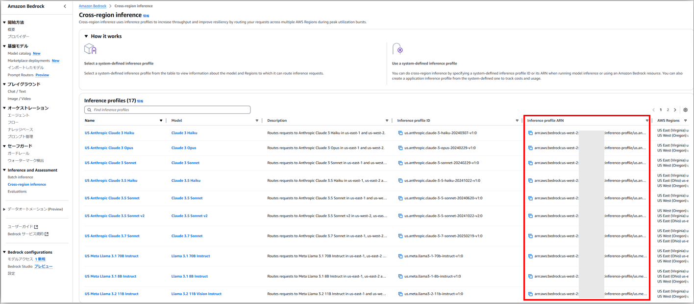

# Cross region inference（クロスリージョン推論）
- https://docs.aws.amazon.com/ja_jp/bedrock/latest/userguide/cross-region-inference.html
  > When running model inference in on-demand mode, your requests might be restricted by service quotas or during peak usage times. Cross-region inference enables you to seamlessly manage unplanned traffic bursts by utilizing compute across different AWS Regions. With cross-region inference, you can distribute traffic across multiple AWS Regions, enabling higher throughput.

# LangChainでCross region inferenceを使う方法
1. まずCross region inferenceのProfile ARNを確認する
   - 「Inference and Assessment」の「Cross-region inference」から確認可能  
    
2. `ChatBedrock`などでインスタンスを初期化するときに`model_id`に1.で確認したProfile ARNを指定し、`provider`に`"anthropic"`を、`region_name`に対象対象リージョンを指定する  
   ```python
   llm = ChatBedrock(
       model_id="arn:aws:bedrock:us-west-2:1234567890:inference-profile/us.anthropic.claude-3-7-sonnet-20250219-v1:0",
       region_name="us-west-2",
       provider="anthropic",
       model_kwargs={"temperature": 0.1}
   )
   ```