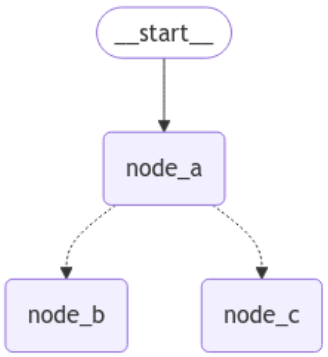

# コンポーネント
## ステート
- LangGraphのワークフローで実行される各ノードによって更新された値を保存するための仕組み
- 各ノードは、このステートに保存されているデータを読み書きしながら処理を進めていく
- ステートのデータ構造はPydanticのBaseModelクラスを用いて定義する
## ノード
- 各ノードが特定の処理や判断を担当

## エッジ
- 各ノードの処理間のつながりや関係性を表現

# LangGraphの特徴
## 1. 明示的なステート管理
- ステート(状態)を明示的に定義し、管理することができる
- ステートは、会話履歴・収集した情報・中間結果などを含む構造化されたデータとして表現される
- 各ノードはステートを入力として受け取り、処理を行ったあと、ステートを更新
- これで各ステップ間の情報の受け渡しと更新ができる
## 2. 条件分岐とループの自然な表現
- グラフ構造を用いることで、条件分岐やループ処理を直観的に表現できる
## 3. 段階的な拡張性
- 新しい機能を追加したい場合、既存のグラフ構造に新しいノードを追加し、適切なエッジで接続するだけで済む
## 4. デバックとテストの容易さ
- 各ノードを独立してテストできるため、デバックとテストが容易になる
- LangSmithとの連携も可能
## 5. チェックポイントとリカバリ
- ステートのチェックポイントを作成し、保存する機能がある
- これにより、長時間実行されるタスクを中断し、あとで再開したり、エラーが発生した場合に特定のポイントから処理を再開したりすることが可能

---

# `Command`
- 参考URL
  - https://zenn.dev/pharmax/articles/d91085d904657d
  - https://blog.langchain.dev/command-a-new-tool-for-multi-agent-architectures-in-langgraph/
  - https://langchain-ai.github.io/langgraph/concepts/low_level/#command
  - https://langchain-ai.github.io/langgraph/reference/types/#langgraph.types.Command
  - https://changelog.langchain.com/announcements/command-in-langgraph-to-build-edgeless-multi-agent-workflows
## 概要
- **状態を更新すると同時に、次に実行するNodeを指定する機能**
  - **https://langchain-ai.github.io/langgraph/how-tos/command/**  
    > It can be useful to combine control flow (edges) and state updates (nodes). For example, you might want to BOTH perform state updates AND decide which node to go to next in the SAME node. LangGraph provides a way to do so by returning a `Command` object from node functions
- `Command`の`goto`は自動的に`add_conditional_edges`してくれる  
  **`Command`に`Literal[]`は必須！ ちゃんと返す候補のNodeを指定すること！ 以下の例だと`Command[Literal["node_b", "node_c"]]`**  

> [!IMPORTANT]
> You might have noticed that we used `Command` as a return type annotation, e.g. `Command[Literal["node_b", "node_c"]]`. This is necessary for the graph rendering and tells LangGraph that `node_a` can navigate to `node_b` and `node_c`.  

  - 以下の例でもnode Aとnode B・Cを`add_conditional_edges()`でつなげてないけど、Commandで指定しているため、グラフ上は以下のようにつながっている  
    ```python
    import random
    from typing_extensions import TypedDict, Literal

    from langgraph.graph import StateGraph, START
    from langgraph.types import Command

    # Define graph state
    class State(TypedDict):
        foo: str

    # Define the nodes
    def node_a(state: State) -> Command[Literal["node_b", "node_c"]]:
        print("Called A")
        value = random.choice(["a", "b"])
        # this is a replacement for a conditional edge function
        if value == "a":
            goto = "node_b"
        else:
            goto = "node_c"

        # note how Command allows you to BOTH update the graph state AND route to the next node
        return Command(
            # this is the state update
            update={"foo": value},
            # this is a replacement for an edge
            goto=goto,
        )

    def node_b(state: State):
        print("Called B")
        return {"foo": state["foo"] + "b"}

    def node_c(state: State):
        print("Called C")
        return {"foo": state["foo"] + "c"}

    builder = StateGraph(State)
    builder.add_edge(START, "node_a")
    builder.add_node(node_a)
    builder.add_node(node_b)
    builder.add_node(node_c)
    # NOTE: there are no edges between nodes A, B and C!

    graph = builder.compile()
    ```  
      

  - **逆に`conditional_edges`ではなく、`edge`を追加したい場合は、`Command`の`goto`に`None`を指定し、`add_edge`で明示的に実線でつなげる必要がある。**  
    - 例  
      ```python
      def alert_status_check_node(state: State) -> Command: # Literalを指定しない
          result = alert_status_check_agent.invoke(state)
          return Command(
              update={
                  "messages": [
                      HumanMessage(content=result["messages"][-1].content, name="alert_status_check_agent")
                  ]
              },
              goto=None, # Noneを指定
          )

      aws_personol_health_dashboard_check_agent = create_react_agent(llm, tools=[aws_personol_health_dashboard_check])

      def aws_personol_health_dashboard_check_node(state: State) -> Command: # Literalを指定しない
          result = aws_personol_health_dashboard_check_agent.invoke(state)
          return Command(
              update={
                  "messages": [
                      HumanMessage(content=result["messages"][-1].content, name="aws_personol_health_dashboard_check")
                  ]
              },
              goto=None, # Noneを指定
          )

      builder = StateGraph(State)
      builder.add_node("supervisor", supervisor_node)
      builder.add_node("rag_analysis", rag_analysis_node)
      builder.add_node("alert_status_check", alert_status_check_node)
      builder.add_node("aws_personol_health_dashboard_check", aws_personol_health_dashboard_check_node)
      builder.add_edge(START, "rag_analysis")
      
      ## 明示的に`add_edge`で指定 
      builder.add_edge("aws_personol_health_dashboard_check", "supervisor")
      builder.add_edge("alert_status_check", "supervisor")
      
      graph = builder.compile()
      ```

# `ToolNode`
- 参考URL
  - https://langchain-ai.github.io/langgraph/how-tos/tool-calling/
  - https://langchain-ai.github.io/langgraph/reference/prebuilt/#langgraph.prebuilt.chat_agent_executor.create_react_agent

# `create_react_agent`関数
- *参考URL*
  - https://langchain-ai.github.io/langgraph/how-tos/create-react-agent/
  - https://python.langchain.com/api_reference/langchain/agents/langchain.agents.react.agent.create_react_agent.html
  - https://zenn.dev/mah/scraps/bb122058647649
## 概要
- **`create_react_agent`はReActエージェントを作成してくれる関数**
  - scratchからReActエージェントを作る方法
    - https://langchain-ai.github.io/langgraph/how-tos/react-agent-from-scratch/
- **ソースコード**
  - https://github.com/langchain-ai/langgraph/blob/main/libs/langgraph/langgraph/prebuilt/chat_agent_executor.py#L237
- **関数内で`ToolNode`でToolをNode化したり、`bind_tools`でmodelとtoolをバインドしたり、`add_node`・`add_edge`した後、`CompiledStateGraph`型を返す。**
## 戻り値
- 戻り値の型は **`CompiledStateGraph`**
  - https://github.com/langchain-ai/langgraph/blob/main/libs/langgraph/langgraph/graph/state.py#L597
- [create_react_agent](https://github.com/langchain-ai/langgraph/blob/main/libs/langgraph/langgraph/prebuilt/chat_agent_executor.py#L782C16-L782C26)内で`workflow = StateGraph(state_schema or AgentState)`した後に、以下を返している。  
  ```python
  return workflow.compile(
      checkpointer=checkpointer,
      store=store,
      interrupt_before=interrupt_before,
      interrupt_after=interrupt_after,
      debug=debug,
  )
  ```  
  で、`StateGraph`の[`compile()`](https://github.com/langchain-ai/langgraph/blob/main/libs/langgraph/langgraph/graph/state.py#L555C1-L574C10)関数で以下のように``を返している。  
  ```python
  compiled = CompiledStateGraph(
      builder=self,
      config_type=self.config_schema,
      nodes={},
      channels={
          **self.channels,
          **self.managed,
          START: EphemeralValue(self.input),
      },
      input_channels=START,
      stream_mode="updates",
      output_channels=output_channels,
      stream_channels=stream_channels,
      checkpointer=checkpointer,
      interrupt_before_nodes=interrupt_before,
      interrupt_after_nodes=interrupt_after,
      auto_validate=False,
      debug=debug,
      store=store,
  )

  return compiled.validate()
  ```  
  - `validate`メソッドはベースClassの[`Pregel`](https://github.com/langchain-ai/langgraph/blob/main/libs/langgraph/langgraph/pregel/__init__.py#L199C7-L199C13)にあって、[`Self`を返している](https://github.com/langchain-ai/langgraph/blob/main/libs/langgraph/langgraph/pregel/__init__.py#L304)ので、`CompiledStateGraph`クラスのまま。

# `MessagesState`
- 

# `with_structured_output`
- 

# `bind_tools`
- 参考URL
  - https://python.langchain.com/docs/concepts/tool_calling/
- 上記URLに以下の通り記載されている通り、(tool callingをサポートする)LLM ModelにToolの存在を認識させて、Toolに必要なinputスキーマを理解させるために、ToolとLLM Modelを紐づける必要がある。  
  > **The tool needs to be connected to a model that supports tool calling. This gives the model awareness of the tool and the associated input schema required by the tool.**
- ソースコード（以下で本当に合っているか要確認）
  - https://github.com/langchain-ai/langchain/blob/master/libs/langchain/langchain/chat_models/base.py#L870
- 使い方
  - 基本的な使い方はToolを定義し、Chatモデルに`bind_tools()`で紐づけるだけ  
    ```python
    @tool
    def python_repl_tool(
        code: Annotated[str, "The python code to execute to generate your chart."],
    ) -> str:
        """Use this to execute python code and do math. If you want to see the output of a value,
        you should print it out with `print(...)`. This is visible to the user."""
        try:
            result = repl.run(code)
        except BaseException as e:
            return f"Failed to execute. Error: {repr(e)}"
        result_str = f"Successfully executed:\n\`\`\`python\n{code}\n\`\`\`\nStdout: {result}"
        return result_str

    @tool
    def shell_tool(
        command: Annotated[str, "The shell command to execute."],
    ) -> str:
        """Use this to execute shell commands. This is visible to the user."""
        try:
            result = subprocess.run(
                command, shell=True, stdout=subprocess.PIPE, stderr=subprocess.PIPE
            )
        except BaseException as e:
            return f"Failed to execute. Error: {repr(e)}"
        result_str = f"Successfully executed:\n\`\`\`shell\n{command}\n\`\`\`\nStdout: {result.stdout}\nStderr: {result.stderr}"
        return result_str

    # Define available tools
    tools = [python_repl_tool, shell_tool]

    llm = ChatBedrock(
        model_id="anthropic.claude-3-5-sonnet-20240620-v1:0",
        model_kwargs={
            "temperature": 0.1,
            "max_tokens": 8000,
        }
    ).bind_tools(tools)
    ```

# LangGraphとLangfuseの連携
- https://langfuse.com/docs/integrations/langchain/example-python-langgraph