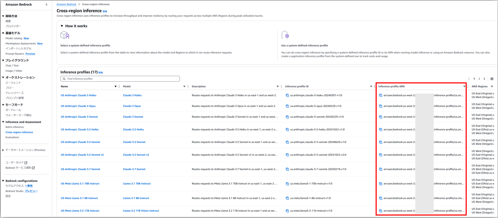

# Cross-region inference使用方法について
## Cross region inference（クロスリージョン推論）
- https://docs.aws.amazon.com/ja_jp/bedrock/latest/userguide/cross-region-inference.html
  > When running model inference in on-demand mode, your requests might be restricted by service quotas or during peak usage times. Cross-region inference enables you to seamlessly manage unplanned traffic bursts by utilizing compute across different AWS Regions. With cross-region inference, you can distribute traffic across multiple AWS Regions, enabling higher throughput.

## LangChainでCross region inferenceを使う方法
1. まずCross region inferenceのProfile ARNを確認する
   - 「Inference and Assessment」の「Cross-region inference」から確認可能  
    
2. `ChatBedrock`などでインスタンスを初期化するときに`model_id`に1.で確認したProfile ARNを指定し、`provider`に`"anthropic"`を、`region_name`に対象対象リージョンを指定する  
   ```python
   llm = ChatBedrock(
       model_id="arn:aws:bedrock:us-west-2:1234567890:inference-profile/us.anthropic.claude-3-7-sonnet-20250219-v1:0",
       region_name="us-west-2",
       provider="anthropic",
       model_kwargs={"temperature": 0.1}
   )
   ```

# BedrockのConfig設定方法
- `ChatBedrock`初期化時に`config`に`Config(<Key>=<Value>)`形式で指定する  
  ```python
  from langchain_aws import ChatBedrock
  from botocore.config import Config

  llm_with_tools = ChatBedrock(
      model_id=model_id,
      region_name=llm_region,
      provider="anthropic",
      model_kwargs={"temperature": 0.1},
      max_tokens=4096, # default: 1024
      config=Config(read_timeout=60)
  ).bind_tools(tools)
  ```
  - `max_tokens`はLLMが出力するoutputの最大Token数（inputとは関係ない）
- `config`に指定するのは`botocore.config.Config`のインスタンス
  - https://botocore.amazonaws.com/v1/documentation/api/latest/reference/config.html

# `Input is too long for requested model`エラーについて
- エラーメッセージ  
  ```shell
  Error processing messages: An error occurred (ValidationException) when calling the InvokeModel operation: Input is too long for requested model.
  ```
- TokenがLLM ModelのLimitを超えたため出るエラー
- **LangGraphでReact Agentを使っていて、Total Tokenで処理を分岐(制御)したい場合の設定方法**  
  ```python
  def force_respond(state: State):
      system_prompt = """
  You are a helpful assistant that specializes in system troubleshooting and root cause analysis. You analyze conversation histories to identify the underlying causes of technical issues and provide clear, actionable solutions.
  """

      if state["messages"][-1].tool_calls:
          history_messages = state["messages"][:-1] # 最後のメッセージはLLMがtool callを行いたいというメッセージの場合、エラーになるため最後のメッセージを除外
      else:
          history_messages = state["messages"]

      response = llm_with_structured_output.invoke(
          [SystemMessage(content=system_prompt)] + history_messages + [HumanMessage(content="Based on the conversation history, generate the root cause of the alert in `analysis_results` and the command to resolve the issue in `final_command`.")]
      )

      return {"final_response": response}

  def should_continue(state: State) -> Literal["command_run_tools", "respond", "respond_forcibly", "__end__"]:
      messages = state['messages']
      last_message = messages[-1]

      if state["force_respond"] or last_message.usage_metadata["total_tokens"] > 180000: ## Claude3.7とClaude4の最大token数は200000なので、outputのToken(max_tokens=4096)と1回のLLM処理で1万くらいのTokenを使う可能性とかも考えて180000を超えたら強制的に回答を出すようにする
          return "respond_forcibly"
      elif last_message.tool_calls:
          return "command_run_tools"
  ```
- 参考URL
  - https://repost.aws/questions/QUshd0uzCZRAy1TbudkUKhww/claude-on-bedrock-giving-input-is-too-long-for-requested-model-for-10k-token-inputs-edit-broken-in-eu-central-1-working-in-other-regions

# `input length and `max_tokens` exceed context limit` エラーについて
- エラーメッセージ  
  ```shell
  ValidationException('An error occurred (ValidationException) when calling the InvokeModel operation: input length and `max_tokens` exceed context limit: 201850 + 4096 > 204698, decrease input length or `max_tokens` and try again')Traceback (most recent call last):
  ```
- TokenがLLM ModelのLimitを超えたため出るエラー
- 対処方法は`Input is too long for requested model`エラーの時の場合を参照