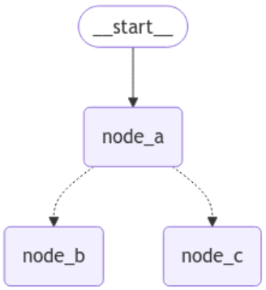

# コンポーネント
## ステート
- LangGraphのワークフローで実行される各ノードによって更新された値を保存するための仕組み
- 各ノードは、このステートに保存されているデータを読み書きしながら処理を進めていく
- ステートのデータ構造はPydanticのBaseModelクラスを用いて定義する
- 各ノードの処理の前にステートが渡され、各ノードはこのステートを参照して処理を行い、処理結果によってステートを更新し、処理を終える（更新されたステートは次のノードに渡される）
- ステートの各フィールドで、更新時のオペレーションを`typing.Annotated`で明示的に指定することができる  
  defaultでは`set`オペレーションが使用され、値が上書きされる。  
  リストや辞書などで、上書きではなく要素を追加していきたい場合は`add`オペレーションを指定する  
  ```python
  import operator
  from typing import Annotated
  from pydantic import BaseModel, Field

  class State(BaseModel):
      query: str = Field(..., description="ユーザーからの質問")
      current_role: str = Field(
          default="", description="選定された回答ロール"
      )
      messages: Annotated[list[str], operator.add] = Field(
          default=[], description="回答履歴"
      )
      current_judge: bool = Field(
          default=False, description="品質チェックの結果"
      )
      judgement_reason: str = Field(
          default="", description="品質チェックの判定理由"
      )
  ```

## ノード
- 各ノードが特定の処理や判断を担当

## エッジ
- 各ノードの処理間のつながりや関係性を表現

# LangGraphの特徴
## 1. 明示的なステート管理
- ステート(状態)を明示的に定義し、管理することができる
- ステートは、会話履歴・収集した情報・中間結果などを含む構造化されたデータとして表現される
- 各ノードはステートを入力として受け取り、処理を行ったあと、ステートを更新
- これで各ステップ間の情報の受け渡しと更新ができる
## 2. 条件分岐とループの自然な表現
- グラフ構造を用いることで、条件分岐やループ処理を直観的に表現できる
## 3. 段階的な拡張性
- 新しい機能を追加したい場合、既存のグラフ構造に新しいノードを追加し、適切なエッジで接続するだけで済む
## 4. デバックとテストの容易さ
- 各ノードを独立してテストできるため、デバックとテストが容易になる
- LangSmithとの連携も可能
## 5. チェックポイントとリカバリ
- ステートのチェックポイントを作成し、保存する機能がある
- これにより、長時間実行されるタスクを中断し、あとで再開したり、エラーが発生した場合に特定のポイントから処理を再開したりすることが可能

---

# `Command`
- 参考URL
  - https://zenn.dev/pharmax/articles/d91085d904657d
  - https://blog.langchain.dev/command-a-new-tool-for-multi-agent-architectures-in-langgraph/
  - https://langchain-ai.github.io/langgraph/concepts/low_level/#command
  - https://langchain-ai.github.io/langgraph/reference/types/#langgraph.types.Command
  - https://changelog.langchain.com/announcements/command-in-langgraph-to-build-edgeless-multi-agent-workflows
## 概要
- **状態を更新すると同時に、次に実行するNodeを指定する機能**
  - **https://langchain-ai.github.io/langgraph/how-tos/command/**  
    > It can be useful to combine control flow (edges) and state updates (nodes). For example, you might want to BOTH perform state updates AND decide which node to go to next in the SAME node. LangGraph provides a way to do so by returning a `Command` object from node functions
- `Command`の`goto`は自動的に`add_conditional_edges`してくれる  
  **`Command`に`Literal[]`は必須！ ちゃんと返す候補のNodeを指定すること！ 以下の例だと`Command[Literal["node_b", "node_c"]]`**  

> [!IMPORTANT]
> You might have noticed that we used `Command` as a return type annotation, e.g. `Command[Literal["node_b", "node_c"]]`. This is necessary for the graph rendering and tells LangGraph that `node_a` can navigate to `node_b` and `node_c`.  

  - 以下の例でもnode Aとnode B・Cを`add_conditional_edges()`でつなげてないけど、Commandで指定しているため、グラフ上は以下のようにつながっている  
    ```python
    import random
    from typing_extensions import TypedDict, Literal

    from langgraph.graph import StateGraph, START
    from langgraph.types import Command

    # Define graph state
    class State(TypedDict):
        foo: str

    # Define the nodes
    def node_a(state: State) -> Command[Literal["node_b", "node_c"]]:
        print("Called A")
        value = random.choice(["a", "b"])
        # this is a replacement for a conditional edge function
        if value == "a":
            goto = "node_b"
        else:
            goto = "node_c"

        # note how Command allows you to BOTH update the graph state AND route to the next node
        return Command(
            # this is the state update
            update={"foo": value},
            # this is a replacement for an edge
            goto=goto,
        )

    def node_b(state: State):
        print("Called B")
        return {"foo": state["foo"] + "b"}

    def node_c(state: State):
        print("Called C")
        return {"foo": state["foo"] + "c"}

    builder = StateGraph(State)
    builder.add_edge(START, "node_a")
    builder.add_node(node_a)
    builder.add_node(node_b)
    builder.add_node(node_c)
    # NOTE: there are no edges between nodes A, B and C!

    graph = builder.compile()
    ```  
      

  - **逆に`conditional_edges`ではなく、`edge`を追加したい場合は、`Command`の`goto`に`None`を指定し、`add_edge`で明示的に実線でつなげる必要がある。**  
    - 例  
      ```python
      def alert_status_check_node(state: State) -> Command: # Literalを指定しない
          result = alert_status_check_agent.invoke(state)
          return Command(
              update={
                  "messages": [
                      HumanMessage(content=result["messages"][-1].content, name="alert_status_check_agent")
                  ]
              },
              goto=None, # Noneを指定
          )

      aws_personol_health_dashboard_check_agent = create_react_agent(llm, tools=[aws_personol_health_dashboard_check])

      def aws_personol_health_dashboard_check_node(state: State) -> Command: # Literalを指定しない
          result = aws_personol_health_dashboard_check_agent.invoke(state)
          return Command(
              update={
                  "messages": [
                      HumanMessage(content=result["messages"][-1].content, name="aws_personol_health_dashboard_check")
                  ]
              },
              goto=None, # Noneを指定
          )

      builder = StateGraph(State)
      builder.add_node("supervisor", supervisor_node)
      builder.add_node("rag_analysis", rag_analysis_node)
      builder.add_node("alert_status_check", alert_status_check_node)
      builder.add_node("aws_personol_health_dashboard_check", aws_personol_health_dashboard_check_node)
      builder.add_edge(START, "rag_analysis")
      
      ## 明示的に`add_edge`で指定 
      builder.add_edge("aws_personol_health_dashboard_check", "supervisor")
      builder.add_edge("alert_status_check", "supervisor")
      
      graph = builder.compile()
      ```

# Tool
## `tool`
- https://python.langchain.com/docs/concepts/tools/
- `@tool`デコレーターを付けることでToolを作ることができる
  - Automatically infer the tool's **name**, **description** and **expected arguments**, while also supporting customization.
- The key attributes that correspond to the tool's schema:
  - **name**: The name of the tool.
  - **description**: A description of what the tool does.
  - **args**: Property that returns the JSON schema for the tool's arguments.
- tool自体も`invoke()`メソッドを持つ  
  ```python
  from langchain_core.tools import tool

  @tool
  def multiply(a: int, b: int) -> int:
     """Multiply two numbers."""
     return a * b
  
  res = multiply.invoke({"a": 2, "b": 3})
  print(res) # 6
  ```
- その後、`bind_tools`したLLMモデルのインスタンスから`invoke()`すると、(1)AIがToolの使用が必要と判断した時は以下のように`content`の部分が空になっていて、代わりに`additional_kwargs`に`tool_calls`が入る。(2)それから`tool_calls.name`と`args`を使ってToolを`invoke()`する。(3)最後に`HumanMessage`、`tool_calls`する`AIMessage`、`ToolMessage`のリストを与えて`bind_tools`したLLMモデルを`invoke()`するとTool実行結果を踏まえてLLMが回答を生成する  
  ```python
  from langchain_core.tools import tool
  from langchain_aws import ChatBedrock
  from typing import Sequence
  from langchain_core.messages import AnyMessage, HumanMessage

  @tool
  def multiply(a: int, b: int) -> int:
     """Multiply two numbers."""
     return a * b

  message_list: Sequence[AnyMessage] = [HumanMessage("what is 3 multiply 5?")]

  llm_with_tools = ChatBedrock(
      model_id="anthropic.claude-3-5-sonnet-20240620-v1:0",
      model_kwargs={"temperature": 0.1}
  ).bind_tools([multiply])

  AIMessage = llm_with_tools.invoke(message_list) # (1)
  message_list.append(AIMessage)
  print(AIMessage)
  # content='' additional_kwargs={'usage': {'prompt_tokens': 373, 'completion_tokens': 99, 'total_tokens': 472}, 'stop_reason': 'tool_use', 'model_id': 'anthropic.claude-3-5-sonnet-20240620-v1:0'} response_metadata={'usage': {'prompt_tokens': 373, 'completion_tokens': 99, 'total_tokens': 472}, 'stop_reason': 'tool_use', 'model_id': 'anthropic.claude-3-5-sonnet-20240620-v1:0'} id='run-d4663813-1b02-4ffd-9d1e-b76a52dab39c-0' tool_calls=[{'name': 'multiply', 'args': {'a': 3, 'b': 5}, 'id': 'toolu_bdrk_01HZjRLgnB2K2RsituWbBpDS', 'type': 'tool_call'}] usage_metadata={'input_tokens': 373, 'output_tokens': 99, 'total_tokens': 472}
  ## → AIMessage

  print(AIMessage.tool_calls)
  # [{'name': 'multiply', 'args': {'a': 3, 'b': 5}, 'id': 'toolu_bdrk_01HZjRLgnB2K2RsituWbBpDS', 'type': 'tool_call'}]

  ToolMessage = multiply.invoke(AIMessage.tool_calls[0]) # (2)
  message_list.append(ToolMessage)
  print(ToolMessage)
  # content='15' name='multiply' tool_call_id='toolu_bdrk_01HZjRLgnB2K2RsituWbBpDS'
  ## → ToolMessage

  AIMessage = llm_with_tools.invoke(message_list) # (3)
  message_list.append(AIMessage)
  print(AIMessage)
  # content='The result of multiplying 3 by 5 is 15.\n\nTo break it down:\n1. We used the "multiply" function, which takes two parameters: "a" and "b".\n2. We set "a" to 3 and "b" to 5.\n3. The function returned the result 15.\n\nSo, 3 multiplied by 5 equals 15.' additional_kwargs={'usage': {'prompt_tokens': 454, 'completion_tokens': 96, 'total_tokens': 550}, 'stop_reason': 'end_turn', 'model_id': 'anthropic.claude-3-5-sonnet-20240620-v1:0'} response_metadata={'usage': {'prompt_tokens': 454, 'completion_tokens': 96, 'total_tokens': 550}, 'stop_reason': 'end_turn', 'model_id': 'anthropic.claude-3-5-sonnet-20240620-v1:0'} id='run-2923ab44-888f-4b8c-834a-b21cfcf1db7e-0' usage_metadata={'input_tokens': 454, 'output_tokens': 96, 'total_tokens': 550}
  ## → AIMessage

  print(message_list)
  # [HumanMessage(content='what is 3 multiply 5?', additional_kwargs={}, response_metadata={}), AIMessage(content='', additional_kwargs={'usage': {'prompt_tokens': 373, 'completion_tokens': 99, 'total_tokens': 472}, 'stop_reason': 'tool_use', 'model_id': 'anthropic.claude-3-5-sonnet-20240620-v1:0'}, response_metadata={'usage': {'prompt_tokens': 373, 'completion_tokens': 99, 'total_tokens': 472}, 'stop_reason': 'tool_use', 'model_id': 'anthropic.claude-3-5-sonnet-20240620-v1:0'}, id='run-d4663813-1b02-4ffd-9d1e-b76a52dab39c-0', tool_calls=[{'name': 'multiply', 'args': {'a': 3, 'b': 5}, 'id': 'toolu_bdrk_01HZjRLgnB2K2RsituWbBpDS', 'type': 'tool_call'}], usage_metadata={'input_tokens': 373, 'output_tokens': 99, 'total_tokens': 472}), ToolMessage(content='15', name='multiply', tool_call_id='toolu_bdrk_01HZjRLgnB2K2RsituWbBpDS'), AIMessage(content='The result of multiplying 3 by 5 is 15.\n\nTo break it down:\n1. We used the "multiply" function, which takes two parameters: "a" and "b".\n2. We set "a" to 3 and "b" to 5.\n3. The function returned the result 15.\n\nSo, 3 multiplied by 5 equals 15.', additional_kwargs={'usage': {'prompt_tokens': 454, 'completion_tokens': 96, 'total_tokens': 550}, 'stop_reason': 'end_turn', 'model_id': 'anthropic.claude-3-5-sonnet-20240620-v1:0'}, response_metadata={'usage': {'prompt_tokens': 454, 'completion_tokens': 96, 'total_tokens': 550}, 'stop_reason': 'end_turn', 'model_id': 'anthropic.claude-3-5-sonnet-20240620-v1:0'}, id='run-2923ab44-888f-4b8c-834a-b21cfcf1db7e-0', usage_metadata={'input_tokens': 454, 'output_tokens': 96, 'total_tokens': 550})]
  ```

## `bind_tools`
- 参考URL
  - https://python.langchain.com/docs/concepts/tool_calling/
- 上記URLに以下の通り記載されている通り、(tool callingをサポートする)LLM ModelにToolの存在を認識させて、Toolに必要なinputスキーマを理解させるために、ToolとLLM Modelを紐づける必要がある。  
  > **The tool needs to be connected to a model that supports tool calling. This gives the model awareness of the tool and the associated input schema required by the tool.**
- ソースコード（以下で本当に合っているか要確認）
  - https://github.com/langchain-ai/langchain/blob/master/libs/langchain/langchain/chat_models/base.py#L870
- 使い方
  - 基本的な使い方はToolを定義し、Chatモデルに`bind_tools()`で紐づけるだけ  
    ```python
    @tool
    def python_repl_tool(
        code: Annotated[str, "The python code to execute to generate your chart."],
    ) -> str:
        """Use this to execute python code and do math. If you want to see the output of a value,
        you should print it out with `print(...)`. This is visible to the user."""
        try:
            result = repl.run(code)
        except BaseException as e:
            return f"Failed to execute. Error: {repr(e)}"
        result_str = f"Successfully executed:\n\`\`\`python\n{code}\n\`\`\`\nStdout: {result}"
        return result_str

    @tool
    def shell_tool(
        command: Annotated[str, "The shell command to execute."],
    ) -> str:
        """Use this to execute shell commands. This is visible to the user."""
        try:
            result = subprocess.run(
                command, shell=True, stdout=subprocess.PIPE, stderr=subprocess.PIPE
            )
        except BaseException as e:
            return f"Failed to execute. Error: {repr(e)}"
        result_str = f"Successfully executed:\n\`\`\`shell\n{command}\n\`\`\`\nStdout: {result.stdout}\nStderr: {result.stderr}"
        return result_str

    # Define available tools
    tools = [python_repl_tool, shell_tool]

    llm = ChatBedrock(
        model_id="anthropic.claude-3-5-sonnet-20240620-v1:0",
        model_kwargs={
            "temperature": 0.1,
            "max_tokens": 8000,
        }
    ).bind_tools(tools)
    ```

## `ToolNode`
- 参考URL
  - https://langchain-ai.github.io/langgraph/how-tos/tool-calling/
  - https://langchain-ai.github.io/langgraph/reference/prebuilt/#langgraph.prebuilt.chat_agent_executor.create_react_agent

## tool callingするagentにstructured outputさせる方法
- **https://langchain-ai.github.io/langgraph/how-tos/react-agent-structured-output/**
- LLMモデルとtoolを紐づける`bind_tools`メソッドと、LLMに構造化されたoutputを強制する`with_structured_output`メソッドを併用することはできない。
- なのでtoolを使うagentに構造化されたoutputを出させるためには別のやり方が必要。詳細は上記URLを参照！

## 複数のToolを並列で実行させる方法
- 要確認（https://python.langchain.com/docs/how_to/tool_calling_parallel/）

# `create_react_agent`関数
- *参考URL*
  - https://langchain-ai.github.io/langgraph/how-tos/create-react-agent/
  - https://langchain-ai.github.io/langgraph/reference/prebuilt/#langgraph.prebuilt.chat_agent_executor.create_react_agent
  - https://zenn.dev/mah/scraps/bb122058647649

## 概要
- **`create_react_agent`はReActエージェントを作成してくれる関数**
  - scratchからReActエージェントを作る方法
    - https://langchain-ai.github.io/langgraph/how-tos/react-agent-from-scratch/
- **ソースコード**
  - https://github.com/langchain-ai/langgraph/blob/main/libs/langgraph/langgraph/prebuilt/chat_agent_executor.py#L237
- **関数内で`ToolNode`でToolをNode化したり、`bind_tools`でmodelとtoolをバインドしたり、`add_node`・`add_edge`した後、`CompiledStateGraph`型を返す。**

## `create_react_agent`関数の引数
- https://langchain-ai.github.io/langgraph/reference/prebuilt/#langgraph.prebuilt.chat_agent_executor.create_react_agent

### `response_format`
- An optional schema for the final agent output.
If provided, output will be formatted to match the given schema and returned in the `structured_response` state key. If not provided, `structured_response` will not be present in the output state. Can be passed in as:  
  ```
  - an OpenAI function/tool schema,
  - a JSON Schema,
  - a TypedDict class,
  - or a Pydantic class.
  - a tuple (prompt, schema), where schema is one of the above.
      The prompt will be used together with the model that is being used to generate the structured response.
  ```

> [!IMPORTANT]
> `response_format` requires the model to support `.with_structured_output`

- BedrockとOpenAIはStructured outputをサポートしている
  - https://python.langchain.com/docs/integrations/chat/

##### `.with_structured_output()` method
- the easiest and most reliable way to get structured outputs.
- https://python.langchain.com/docs/how_to/structured_output/#the-with_structured_output-method
- Bedrockの例  
  ```python
  from langchain_aws import ChatBedrock

  llm = ChatBedrock(model="anthropic.claude-3-5-sonnet-20240620-v1:0",
      beta_use_converse_api=True)

  from typing import Optional
  from pydantic import BaseModel, Field

  # Pydantic
  class Joke(BaseModel):
      """Joke to tell user."""

      setup: str = Field(description="The setup of the joke")
      punchline: str = Field(description="The punchline to the joke")
      rating: Optional[int] = Field(
          default=None, description="How funny the joke is, from 1 to 10"
      )

  structured_llm = llm.with_structured_output(Joke)
  structured_llm.invoke("Tell me a joke about cats")
  ```  
  - output  
    ```
    Joke(setup='Why was the cat sitting on the computer?', punchline='Because it wanted to keep an eye on the mouse!', rating=7)
    ```

### `prompt`
- An optional prompt for the LLM. Can take a few different forms:  
  - str: This is converted to a SystemMessage and added to the beginning of the list of messages in state["messages"].
  - SystemMessage: this is added to the beginning of the list of messages in state["messages"].
  - Callable: This function should take in full graph state and the output is then passed to the language model.
  - Runnable: This runnable should take in full graph state and the output is then passed to the language model.
- **例1** (Add a system prompt for the LLM)  
  ```python
  >>> system_prompt = "You are a helpful bot named Fred."
  >>> graph = create_react_agent(model, tools, prompt=system_prompt)
  >>> inputs = {"messages": [("user", "What's your name? And what's the weather in SF?")]}
  >>> for s in graph.stream(inputs, stream_mode="values"):
  ...     message = s["messages"][-1]
  ...     if isinstance(message, tuple):
  ...         print(message)
  ...     else:
  ...         message.pretty_print()
  ('user', "What's your name? And what's the weather in SF?")
  ================================== Ai Message ==================================
  Hi, my name is Fred. Let me check the weather in San Francisco for you.
  Tool Calls:
  check_weather (call_lqhj4O0hXYkW9eknB4S41EXk)
  Call ID: call_lqhj4O0hXYkW9eknB4S41EXk
  Args:
      location: San Francisco
  ================================= Tool Message =================================
  Name: check_weather
  It's always sunny in San Francisco
  ================================== Ai Message ==================================
  The weather in San Francisco is currently sunny. If you need any more details or have other questions, feel free to ask!
  ```
- **例2**（Add a more complex prompt for the LLM）  
  ```python
  >>> from langchain_core.prompts import ChatPromptTemplate
  >>> prompt = ChatPromptTemplate.from_messages([
  ...     ("system", "You are a helpful bot named Fred."),
  ...     ("placeholder", "{messages}"),
  ...     ("user", "Remember, always be polite!"),
  ... ])
  >>>
  >>> graph = create_react_agent(model, tools, prompt=prompt)
  >>> inputs = {"messages": [("user", "What's your name? And what's the weather in SF?")]}
  >>> for s in graph.stream(inputs, stream_mode="values"):
  ...     message = s["messages"][-1]
  ...     if isinstance(message, tuple):
  ...         print(message)
  ...     else:
  ...         message.pretty_print()
  ```
- **例3**（Add complex prompt with custom graph state）  
  ```python
  >>> from typing_extensions import TypedDict
  >>>
  >>> from langgraph.managed import IsLastStep
  >>> prompt = ChatPromptTemplate.from_messages(
  ...     [
  ...         ("system", "Today is {today}"),
  ...         ("placeholder", "{messages}"),
  ...     ]
  ... )
  >>>
  >>> class CustomState(TypedDict):
  ...     today: str
  ...     messages: Annotated[list[BaseMessage], add_messages]
  ...     is_last_step: IsLastStep
  >>>
  >>> graph = create_react_agent(model, tools, state_schema=CustomState, prompt=prompt)
  >>> inputs = {"messages": [("user", "What's today's date? And what's the weather in SF?")], "today": "July 16, 2004"}
  >>> for s in graph.stream(inputs, stream_mode="values"):
  ...     message = s["messages"][-1]
  ...     if isinstance(message, tuple):
  ...         print(message)
  ...     else:
  ...         message.pretty_print()
  ``` 

### `state_schema`
- An optional state schema that defines graph state. **Must have `messages` and `is_last_step` keys.** Defaults to `AgentState` that defines those two keys.
- 指定しないとデフォルトで以下の`AgentState`が適用される  
  ```python
  from langchain_core.messages import AIMessage, BaseMessage, SystemMessage, ToolMessage
  from langgraph.graph.message import add_messages
  from langgraph.managed import IsLastStep, RemainingSteps
  from pydantic import BaseModel

  StructuredResponse = Union[dict, BaseModel]

  class AgentState(TypedDict):
      """The state of the agent."""

      messages: Annotated[Sequence[BaseMessage], add_messages]
      is_last_step: IsLastStep
      remaining_steps: RemainingSteps
      structured_response: StructuredResponse
  ```

## 戻り値
- 戻り値の型は **`CompiledStateGraph`**
  - https://github.com/langchain-ai/langgraph/blob/main/libs/langgraph/langgraph/graph/state.py#L597
- [create_react_agent](https://github.com/langchain-ai/langgraph/blob/main/libs/langgraph/langgraph/prebuilt/chat_agent_executor.py#L782C16-L782C26)内で`workflow = StateGraph(state_schema or AgentState)`した後に、以下を返している。  
  ```python
  return workflow.compile(
      checkpointer=checkpointer,
      store=store,
      interrupt_before=interrupt_before,
      interrupt_after=interrupt_after,
      debug=debug,
  )
  ```  
  で、`StateGraph`の[`compile()`](https://github.com/langchain-ai/langgraph/blob/main/libs/langgraph/langgraph/graph/state.py#L555C1-L574C10)関数で以下のように``を返している。  
  ```python
  compiled = CompiledStateGraph(
      builder=self,
      config_type=self.config_schema,
      nodes={},
      channels={
          **self.channels,
          **self.managed,
          START: EphemeralValue(self.input),
      },
      input_channels=START,
      stream_mode="updates",
      output_channels=output_channels,
      stream_channels=stream_channels,
      checkpointer=checkpointer,
      interrupt_before_nodes=interrupt_before,
      interrupt_after_nodes=interrupt_after,
      auto_validate=False,
      debug=debug,
      store=store,
  )

  return compiled.validate()
  ```  
  - `validate`メソッドはベースClassの[`Pregel`](https://github.com/langchain-ai/langgraph/blob/main/libs/langgraph/langgraph/pregel/__init__.py#L199C7-L199C13)にあって、[`Self`を返している](https://github.com/langchain-ai/langgraph/blob/main/libs/langgraph/langgraph/pregel/__init__.py#L304)ので、`CompiledStateGraph`クラスのまま。

# `MessagesState`
- https://langchain-ai.github.io/langgraph/concepts/low_level/#messagesstate
- Since having a list of messages in your state is so common, there exists a prebuilt state called `MessagesState` which makes it easy to use messages. `MessagesState` is defined with a single `messages` key which is a list of `AnyMessage` objects and uses the `add_messages` reducer. Typically, there is more state to track than just messages, so we see people subclass this state and add more fields, like:  
  ```python
  from langgraph.graph import MessagesState

  class State(MessagesState):
      documents: list[str]
  ```

## `Reducers`
- https://langchain-ai.github.io/langgraph/concepts/low_level/#reducers
- Reducers are key to understanding how updates from nodes are applied to the `State`. Each key in the `State` has its own independent reducer function. If no reducer function is explicitly specified then it is assumed that all updates to that key should override it. There are a few different types of reducers, starting with the default type of reducer:
- 現在の State とアクションを受け取り、新しい State を返す関数
- `from langgraph.graph.message import add_messages`の`add_messages`もReducerの１つ

### `add_messages` Reducer
- https://langchain-ai.github.io/langgraph/reference/graphs/#langgraph.graph.message.add_messages
- https://langchain-ai.github.io/langgraph/concepts/low_level/#using-messages-in-your-graph
- In addition to keeping track of message IDs, the `add_messages` function will also try to deserialize messages into LangChain `Message` objects whenever a state update is received on the `messages` channel.  
  This allows sending graph inputs / state updates in the following format:  
  ```python
  # this is supported
  {"messages": [HumanMessage(content="message")]}

  # and this is also supported
  {"messages": [{"type": "human", "content": "message"}]}
  ```  

  Since the state updates are always deserialized into LangChain `Messages` when using `add_messages`, **you should use dot notation to access message attributes, like `state["messages"][-1].content`.**  
  Below is an example of a graph that uses `add_messages` as it's reducer function.  
  ```python
  from langchain_core.messages import AnyMessage
  from langgraph.graph.message import add_messages
  from typing import Annotated
  from typing_extensions import TypedDict

  class GraphState(TypedDict):
      messages: Annotated[list[AnyMessage], add_messages]
  ```

# `state.update()`メソッド
- Stateの更新を行うメソッドで、引数には辞書や `(key, value)` のペアのイテラブルが必要

# 各Nodeでの`return`について
- Nodeで`return`した値は`content`に入る
- **以下の例で、toolの中の`return {"stdout": result.stdout, "stderr": result.stderr}`で、`ToolMessage`の`content`にその値が入る**  
  ```python
  @tool
  def shell_tool(
      command: Annotated[str, "The shell command to execute."],
  ) -> dict[str, str]:
      """Use this to execute AWS CLI, Python, shell scripts, and other shell commands."""
      try:
          result = subprocess.run(
              command,
              shell=True,
              stdout=subprocess.PIPE,
              stderr=subprocess.PIPE,
              text=True,
              encoding="utf-8"
          )
      except BaseException as e:
          return {
              "stdout": "",
              "stderr": f"Failed to execute. Error: {repr(e)}"
          }

      result_str = f"""Successfully executed:\n  ```shell\n{command}\n```\nStdout:\n  {result.stdout}\nStderr:\n  {result.stderr}"""
      print(f"\nresult_str in shell_tool:\n------------------------\n{result_str}")

      return {
          "stdout": result.stdout,
          "stderr": result.stderr
      }

  # Define available tools
  tools = [shell_tool]
  tool_node = ToolNode(tools)
  llm = ChatBedrock(
      model_id="anthropic.claude-3-5-sonnet-20240620-v1:0",
      model_kwargs={"temperature": 0.1}
  ).bind_tools(tools)
  ```  
  

  ```json
  {'messages': [HumanMessage(content='aws s3api get-bucket-policy --bucket ai-1-bucket', additional_kwargs={}, response_metadata={}, id='cee2be20-dd27-4d26-91c6-7fcbbb67870d'), AIMessage(content='', additional_kwargs={'usage': {'prompt_tokens': 505, 'completion_tokens': 124, 'total_tokens': 629}, 'stop_reason': 'tool_use', 'model_id': 'anthropic.claude-3-5-sonnet-20240620-v1:0'}, response_metadata={'usage': {'prompt_tokens': 505, 'completion_tokens': 124, 'total_tokens': 629}, 'stop_reason': 'tool_use', 'model_id': 'anthropic.claude-3-5-sonnet-20240620-v1:0'}, id='run-63c6cbcb-6f87-4eae-98d7-73bc537f4711-0', tool_calls=[{'name': 'shell_tool', 'args': {'command': 'aws s3api get-bucket-policy --bucket ai-1-bucket'}, 'id': 'toolu_bdrk_01E3eqNam9zFWUGPs8VBBRcy', 'type': 'tool_call'}], usage_metadata={'input_tokens': 505, 'output_tokens': 124, 'total_tokens': 629}), ToolMessage(content='{"stdout": "", "stderr": "\\nAn error occurred (AccessDenied) when calling the GetBucketPolicy operation: Access Denied\\n"}', name='shell_tool', id='4cf79f46-9c0d-44d7-8c89-e37cfe622c25', tool_call_id='toolu_bdrk_01E3eqNam9zFWUGPs8VBBRcy'), AIMessage(content='申し訳ありませんが、コマンドの実行中にエラーが発生しました。エラーメッセージは以下の通りです：\n\n```\nAn error occurred (AccessDenied) when calling the GetBucketPolicy operation: Access Denied\n```\n\nこのエラーは、「アクセス拒否」を意味しています。つまり、現在のAWS認証情報では、指定されたS3バケット「ai-1-bucket」のバケットポリシーを取得する権限がないようです。\n\nこの問題を解決するためには、以下のような対策が考えられます：\n\n1. AWS認証情報が正しく設定されているか確認する。\n2. 使用しているIAMユーザーまたはロールに、S3バケットポリシーを読み取る権限があるか確認する。\n3. バケット名が正しいか確認する。「ai-1-bucket」が実際に存在し、アクセス可能なバケットであることを確認してください。\n\n権限が適切に設定されていることを確認した後、再度コマンドを実行してみてください。それでも問題が解決しない場合は、AWS管理者に連絡して、必要な権限の付与を依頼することをお勧めします。', additional_kwargs={'usage': {'prompt_tokens': 620, 'completion_tokens': 361, 'total_tokens': 981}, 'stop_reason': 'end_turn', 'model_id': 'anthropic.claude-3-5-sonnet-20240620-v1:0'}, response_metadata={'usage': {'prompt_tokens': 620, 'completion_tokens': 361, 'total_tokens': 981}, 'stop_reason': 'end_turn', 'model_id': 'anthropic.claude-3-5-sonnet-20240620-v1:0'}, id='run-b3f22253-a33e-4b4e-aafd-a34ef397df2e-0', usage_metadata={'input_tokens': 620, 'output_tokens': 361, 'total_tokens': 981})]}
  ```

# LangGraphとLangfuseの連携
- https://langfuse.com/docs/integrations/langchain/example-python-langgraph