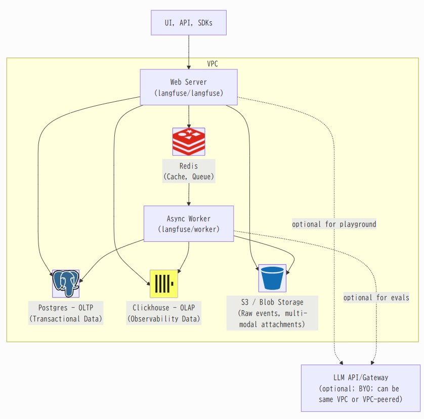

# Langfuseのアーキテクチャ
- https://langfuse.com/self-hosting  



# Install（Self Hosting）
## Docker Compose
- https://langfuse.com/self-hosting/docker-compose

## Helm（k8s）
- https://github.com/langfuse/langfuse-k8s
- `langfuse.nextauth.secret.value`には`openssl rand -hex 32`で生成された値を入れる  
  ```shell
  helm install langfuse langfuse/langfuse -n langfuse -f values.yaml
  ```

# Redisについて
- Redisが再起動されてもeventが消失されることはないらしい（以下LangfuseのAsk AIの回答）
  > Redis/Valkey serves as a caching layer and queue in Langfuse's architecture [(1)](https://langfuse.com/self-hosting/infrastructure/cache). It has several key roles:
  >
  > 1. Event Processing:
  >     - Accepts new events quickly on the API [(1)](https://langfuse.com/self-hosting/infrastructure/cache)
  >     - Defers processing and insertion of these events [(1)](https://langfuse.com/self-hosting/infrastructure/cache)
  >     - Helps handle request peaks gracefully [(1)](https://langfuse.com/self-hosting/infrastructure/cache)
  >
  > 2. Performance Optimization:
  >     - Caches API keys in-memory to reduce database load [(2)](https://langfuse.com/self-hosting)
  >     - Provides caching for prompts, allowing fast retrieval without hitting the database [(2)](https://langfuse.com/self-hosting)
  >     - Acts as a read-through cache for prompts [(2)](https://langfuse.com/self-hosting)
  >
  > 3. Queue Management:
  >     - Used for queuing event metadata for worker processing [(3)](https://github.com/orgs/langfuse/discussions/5924)
  >
  > Regarding cache loss during restart:
Langfuse is designed to handle this scenario safely. The system uses S3/Blob Storage to persist all incoming events first, and only after successful processing are they written to the database [(2)](https://langfuse.com/self-hosting). This ensures that even if Redis becomes temporarily unavailable, events are not lost and can be processed later [(2)](https://langfuse.com/self-hosting).
  >
  > For optimal operation, Redis should be configured with `maxmemory-policy=noeviction` to ensure queue jobs are not evicted from the cache [(1)](https://langfuse.com/self-hosting/infrastructure/cache). 

# LangGraphとLangfuseの連携
- https://langfuse.com/docs/integrations/langchain/example-python-langgraph

# Trace IDの設定
- UUIDを使って利用者側でTraceIDを指定することもできる
  - これを使えば連続しない処理も同じTraceIDを指定することでトレースを連結させることができる
- https://langfuse.com/docs/tracing-features/trace-ids
