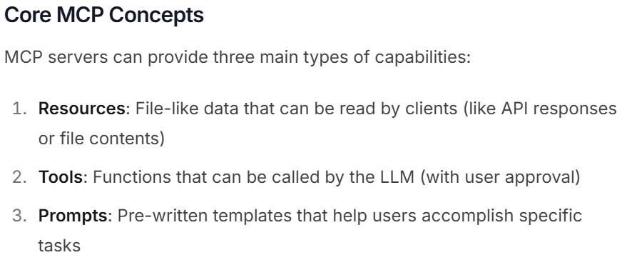

# MCP（Model Context Protocol）
- https://modelcontextprotocol.io/introduction  
  
  
- App/AgentはMCP ClientとServer両方になれる

## MCP Server
- https://modelcontextprotocol.io/quickstart/server

- __*SSE（Server Sent Events）* を通じてMCP Serverを遠隔起動させる（Run remotely via SSE）こともできる__
- Dockerコンテナとして動かすこともできる

## MCP Client
- MCP ClientはMCP Hostの内部に存在する
- MCP ClientとMCP Serverは１対１の関係
  - １つのMCP Clientで複数のMCP Serverとやりとりすることはできない