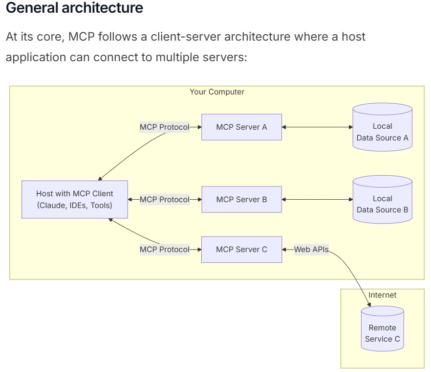
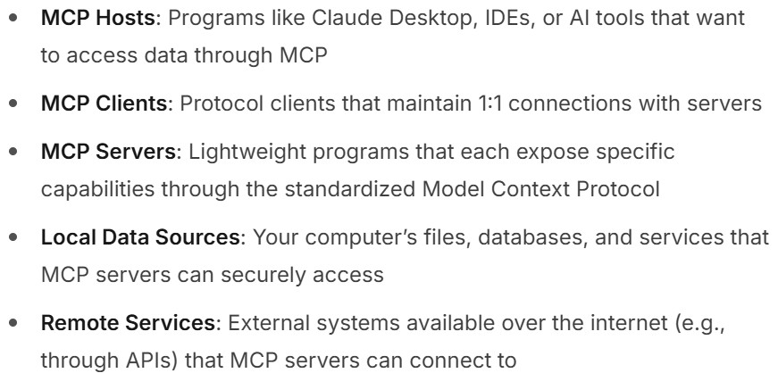

# MCP（Model Context Protocol）
- https://modelcontextprotocol.io/introduction  
  
  

## MCP Server
- https://modelcontextprotocol.io/quickstart/server

## MCP Client
- MCP ClientはMCP Hostの内部に存在する
- MCP ClientとMCP Serverは１対１の関係
  - １つのMCP Clientで複数のMCP Serverとやりとりすることはできない