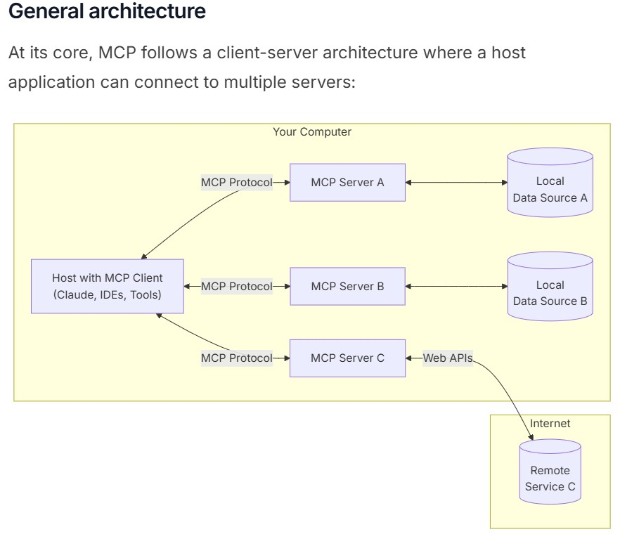
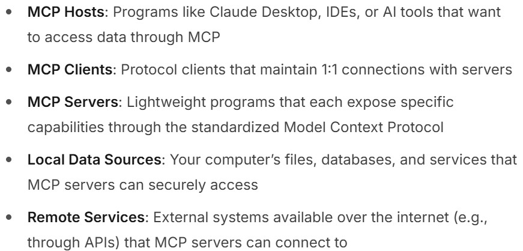
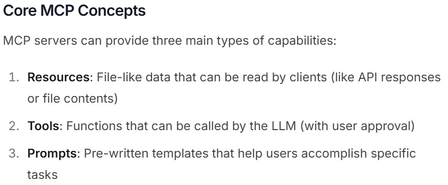

# MCP（Model Context Protocol）
- https://modelcontextprotocol.io/introduction  
  
  
- App/AgentはMCP ClientとServer両方になれる

## MCPの仕様
- https://modelcontextprotocol.io/specification/

## Tool Call
- MCPでは、ツールの引数は常にJSON bodyとして送信される。LLMがツールを呼び出す際、引数はJSON Schemaに基づいたJSONオブジェクトとして渡される。

## tools/listの取得タイミング
- 基本的には**接続・初期化時に1回のみ取得**する
- サーバー側のツール一覧が変化した場合は `notifications/tools/list_changed` 通知を送ることができ、Clientはそれを受けてtools/listを再取得する

## 非同期通信（async）
- MCP自体は非同期通信のみを前提として設計されている（明記されている）わけではなさそうだが、LangChain MCP AdaptersやMCP公式のPython SDKなどは非同期通信を前提としている
  - LangChain MCP Adapters
    - https://github.com/langchain-ai/langchain-mcp-adapters
    - https://langchain-ai.github.io/langgraph/agents/mcp/
  - MCP公式のPython SDK
    - https://github.com/modelcontextprotocol/python-sdk
- https://www.issoh.co.jp/tech/details/5984/

---

# MCP Server
- https://modelcontextprotocol.io/quickstart/server

- MCP ServerはClientと同じマシン上（ローカル）で動かすことも、リモートマシン（Clientと異なるマシン）上で動かす（Run remotely via SSE）こともできる
- ClientとServerとの通信方式はStdIOとSSEの2つのタイプがある
  - https://medium.com/@vkrishnan9074/mcp-clients-stdio-vs-sse-a53843d9aabb
- Dockerコンテナとして動かすこともできる

## stdio
- MCP Serverがローカル（Host/Clientと同じマシン上）で動いている場合のClientとServerとの通信方式
- 標準入力/出力を通じて通信

## SSE（Server Sent Events）
- MCP Serverがリモート（Host/Clientと異なるマシン上）で動いている場合のClientとServerとの通信方式
- HTTPベースの一方向通信を使用

> [!CAUTION]
> SSEはMCP仕様バージョン **2025-03-26** をもって正式に **Deprecated** となり、**Streamable HTTP** に置き換えられた。後方互換性のためSSEは引き続きサポートされるが、新規実装ではStreamable HTTPを使うことが推奨される

## Streamable HTTP
- SSEに代わるリモート通信方式（MCP仕様 2025-03-26以降の標準）
- 単一エンドポイント（例：`/mcp`）でPOSTとGETの両方をサポート
- SSEと異なり2つのエンドポイントが不要でシンプル
- サーバー側の必要に応じて通常のHTTPレスポンスとSSEストリームを動的に使い分けられる
- ステートレスな実装も可能

---

# MCP Client
- MCP ClientはMCP Hostの内部に存在する
- MCP Serverと1対1の接続を行うプロトコルクライアント
  - **1つのMCP Clientは1つのMCP Serverと1対1で接続する**
  - ただし、**Host（アプリケーション）は複数のMCP Clientを持てる**ため、結果的に複数のMCP Serverと通信できる
    - LangChainの `MultiServerMCPClient` はその典型例（内部で各Serverに対してClientを作成する）

---

# MCP ServerとMCP Clientの通信
- https://modelcontextprotocol.io/docs/concepts/transports

## Server-Sent Events (SSE)
- MCP仕様 2025-03-26 をもってDeprecated。Streamable HTTPに置き換えられた（後方互換性のためサポートは継続）

## Standard Input/Output (stdio)
- MCP Client(Host)とMCP Serverが同じサーバ上にある場合の通信方式

# `llms.txt`、`llms-full.txt`について
- https://llmstxt.org/
- langchain-ai.github.io/langgraph/llms-txt-overview/
## 概要
- A standard file which is designed to help LLMs and AI agents to better understand and process web site content.
- These files allow large language models (LLMs) and agents to access programming documentation and APIs, particularly useful within integrated development environments (IDEs).
- `llms.txt` is a website index for LLMs, providing background information, guidance, and links to detailed markdown files. IDEs like Cursor and Windsurf or apps like Claude Code/Desktop can use `llms.txt` to retrieve context for tasks.
- このファイルは一般的にWebサイトのルートディレクトリに配置されるケースが多い(らしい)
  - provides a concise summary of the site's most important content and structure in a machine readable markdown format.
  - It will improve the AI accuracy when extracting the information from the website.

## mcpdoc
- https://github.com/langchain-ai/mcpdoc