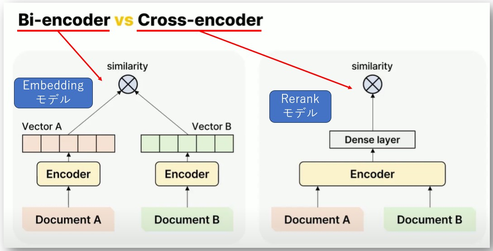

- 参考URL
  - https://python.langchain.com/docs/how_to/hybrid/
  - https://dalab.jp/archives/journal/hybrid-search/
  - https://qiita.com/isanakamishiro2/items/4eb175bb2bc80d7225cb
  - https://qiita.com/jw-automation/items/045917be7b558509fdf2#1-%E3%83%8F%E3%82%A4%E3%83%96%E3%83%AA%E3%83%83%E3%83%89%E3%82%B5%E3%83%BC%E3%83%81

## セマンティック検索（Semantic Search）とは
- クエリの単語に文字通り一致する内容ではなく、単純なキーワード一致ではなく「意味的に関連する情報」を探す検索手法の総称
  - その代表的な実装が **「ベクトル検索」** で、**テキストを埋め込みベクトルに変換し、コサイン類似度や内積などで近いものを探す。**
- 参考URL
  - **https://www.elastic.co/jp/what-is/semantic-search**
  - https://boramorka.github.io/LLM-Book/CHAPTER-2/2.5%20Semantic%20Search.%20Advanced%20Retrieval%20Strategies/
  - https://aws.amazon.com/jp/blogs/news/knowledge-bases-for-amazon-bedrock-now-supports-hybrid-search/
  - https://aws.amazon.com/jp/blogs/news/amazon-opensearch-services-vector-database-capabilities-explained/
- **「ベクトル検索」は「セマンティック検索」の一種（ベクトル検索 ⊂ セマンティック検索）**
  - https://www.elastic.co/jp/what-is/vector-search  
    > ベクトル検索は、セマンティック検索や類似性検索に威力を発揮します。意味とコンテキストが埋め込み内に取り込まれるため、ベクトル検索ではキーワードの完全一致を必要とせずにユーザーの意味する内容を検索できます。テキストデータ（ドキュメント）、画像、音声の処理が可能です。クエリに類似または関連する製品を簡単かつ迅速に見つけることができます。
  - https://www.elastic.co/jp/what-is/semantic-search  
    > セマンティック検索は [ベクトル検索](https://www.elastic.co/jp/what-is/vector-search) を活用しており、コンテクストや検索意図の関連性に基づいて、コンテンツをランク付けして供給することができます。ベクトル検索は、検索可能な情報の詳細を関連する用語や項目のフィールド、あるいは複数のベクトルにエンコードし、次に各ベクトルを比較してどれが最もよく似ているかを判定します。
    > 
    > ベクトル検索対応のセマンティック検索では、クエリパイプラインの両端で同時に作動して結果を出します。クエリが発せられたら、検索エンジンはそのクエリを埋め込みに変換（ベクトル化）します。すなわちデータと関連するコンテクストの数値表現に変換するのです。この値はベクトルで保管されます。次に [kNNアルゴリズム（またはk近傍法）](https://www.elastic.co/jp/what-is/knn) を使って、既存文書（セマンティック検索が関与するテキスト）のベクトルを、クエリのベクトルと照合します。次にセマンティック検索は結果を生成し、概念的な関連性に基づいてその結果をランク付けします。
    > 
    > １. クエリが発せられたら、検索エンジンはそのクエリを埋め込みに変換（ベクトル化）します。すなわちデータと関連するコンテクストの数値表現に変換するのです。この値はベクトルで保管されます。
    >
    > ２. 次にkNNアルゴリズム（またはk近傍法）を使って、既存文書（セマンティック検索が関与するテキスト）のベクトルを、クエリのベクトルと照合します。
    >
    > ３. 次にセマンティック検索は結果を生成し、概念的な関連性に基づいてその結果をランク付けします。

---

## Hybrid Searchとは
- 基本的にはベクトル類似度により、ベクトルストアから検索（ベクトル検索）が行われるけど、ベクトル類似度検索と他の検索手法（全文検索、BM25、キーワード検索など）を組み合わせて、より高度な検索を行う方式を**Hybrid Search**という
  - ハイブリッド検索の方法はベクトルストアによって異なる
- 複数の検索方式によって取得したデータを組み合わせて最も適合性の高い結果を返す
  - BM25スコアとベクトル類似度スコアを統合したり、片方で候補を絞ってもう片方で再ランキングしたり
- AWSのKnowledge BasesでのHybrid Searchは「キーワード検索」と「セマンティック検索」の組み合わせ
  - https://aws.amazon.com/jp/blogs/news/knowledge-bases-for-amazon-bedrock-now-supports-hybrid-search/

### 全文検索とBM25
- 全文検索とBM25は同義語ではなく、BM25は、全文検索の中でよく使われる「スコアリング手法（ランキングアルゴリズム）」の一つ
  - つまり「全文検索」 ⊃ 「BM25」

### BM25
- 「Best Matching 25」の略で、検索エンジンが「どの文書が検索クエリに最も関連しているか」を数値で評価するためのアルゴリズム
- **TF（単語の出現回数）**、**IDF（単語の逆文書頻度）**、**文書の長さの正規化**を組み合わせて計算する。
- 例えば、単語Aが含まれる文書を探しつつ、「出現頻度が多い」,「文書が短い」などの要素でスコアを計算し、関連度の高い順にランキングする。
- 現代の全文検索エンジン（Elasticsearch、OpenSearch、Luceneなど）でデフォルト採用されていることが多い。

#### ★BM25の内部処理の流れ
1. **クエリとドキュメントをトークンに分割（トークナイズ）**
   - まず検索対象ドキュメントとクエリーの両方を単語単位に分割（＝トークナイズ）
   - 普通はスペースで分割されるが、日本語の場合はスペースがないので、形態素解析器（MeCab、Sudachiなど）を使って分割する必要がある
   ```graphql
   ドキュメント: "私は猫が好きです"
   クエリ: "猫 好き"
   ↓
   Doc tokens: ["私", "は", "猫", "が", "好き", "です"]
   Query tokens: ["猫", "好き"]
   ```
2. **インデックス作成（Inverted Index）**
   - ドキュメント側の単語ごとにインデックスを作成（「逆引きインデックス（Inverted Index）」と呼ばれる）

> [!TIP]  
> **逆引きインデックス（Inverted Index）** とは、**「単語 → その単語を含むドキュメントの一覧」** を対応付けたデータ構造。
> 普通のインデックス（正引きインデックス, Forward Index）が「ドキュメント → 含まれる単語」であるのに対し、
> 転置インデックス（Inverted Index）は「単語 → 含まれるドキュメント」を記録する。
> 例えば、以下のようなドキュメントがあった場合：
> ```vbnet
> Doc1: "猫 が 猫 を 追いかける"
> Doc2: "犬 が 猫 を 見る"
> Doc3: "猫 が 魚 を 食べる 猫"
> ```
> まず、トークナイズ（単語に分割）を行う
> | ドキュメント | トークン                 |
> | ------ | -------------------- |
> | Doc1   | [猫, が, 猫, を, 追いかける]  |
> | Doc2   | [犬, が, 猫, を, 見る]     |
> | Doc3   | [猫, が, 魚, を, 食べる, 猫] |
> 
> その後、転置インデックス（Inverted Index）を作成する。
> 
> | 単語  | 出現ドキュメント  | 出現回数（TF）| 出現位置（pos）|
> | ----- | --------------------------- | ---------------------- | -------------------------------- |
> | 猫     | {Doc1: 2, Doc2: 1, Doc3: 2} | Doc1:2, Doc2:1, Doc3:2 | Doc1:[1,3], Doc2:[3], Doc3:[1,6] |
> | が     | {Doc1: 1, Doc2: 1, Doc3: 1} | Doc1:1, Doc2:1, Doc3:1 | Doc1:[2], Doc2:[2], Doc3:[2]     |
> | を     | {Doc1: 1, Doc2: 1, Doc3: 1} | Doc1:1, Doc2:1, Doc3:1 | Doc1:[4], Doc2:[4], Doc3:[4]     |
> | 追いかける | {Doc1: 1}                   | 1                      | Doc1:[5]                         |
> | 犬     | {Doc2: 1}                   | 1                      | Doc2:[1]                         |
> | 見る    | {Doc2: 1}                   | 1                      | Doc2:[5]                         |
> | 魚     | {Doc3: 1}                   | 1                      | Doc3:[3]                         |
> | 食べる   | {Doc3: 1}                   | 1                      | Doc3:[5]                         |
>
> 次に以下のようにスコア計算を行う
> クエリ：「猫 を」
> 1. 転置インデックスから単語「猫」と「を」を含むドキュメントを探す
>    - 「猫」→ Doc1, Doc2, Doc3
>    - 「を」→ Doc1, Doc2, Doc3
>     → 両方に含まれる → Doc1, Doc2, Doc3
>
> 2. 各ドキュメントについて「猫」と「を」の出現回数を参照してスコアを計算
>    - Doc1：猫=2, を=1
>    - Doc2：猫=1, を=1
>    - Doc3：猫=2, を=1
> BM25やTF-IDFは、「猫」の出現回数が多いDoc1とDoc3を高く評価する傾向がある
> ※BM25やTF-IDFなどのスコアリングでは、単語の出現回数がスコアに影響する（同じクエリ語が複数回登場するドキュメントは、その語に関してより関連性が高いとみなされる）
> ただ、BM25では「出現回数が多すぎる場合は飽和」するように設計されていて、単純にTFが多いほどスコアが無限に上がることはない

3. **スコア計算**
   - 各ドキュメントに対して、インデックスを使った検索時にクエリ内の各単語のTF（単語の出現頻度）とIDF（単語の逆文書頻度）を計算し、文書の長さで正規化して、最終的なBM25スコアを算出
   - **単語ごとの寄与を合計して、ドキュメント全体に対するスコアを算出する（単語単位でスコアリング → ドキュメント単位で合計）**。例えば： 
     ```
     クエリ「機械学習 Python」の場合：

     Doc1について：
       「機械学習」のスコア: 2.5
       「Python」のスコア:   1.8
       ────────────────────
       Doc1の総スコア:      4.3

     Doc2について：
       「機械学習」のスコア: 0.5
       「Python」のスコア:   3.2
       ────────────────────
       Doc2の総スコア:      3.7
     ```

4. **ランキング（結果の取得）**
   - スコアが高い順にドキュメントを並べ替え、上位N件を返す
   - BM25は「クエリと似ている単語を含む文書」を「スコア的に近い」と判断する仕組み

#### LangChainでのBM25Retriever
- 参考URL
  - https://python.langchain.com/docs/integrations/retrievers/bm25/
  - https://python.langchain.com/api_reference/community/retrievers/langchain_community.retrievers.bm25.BM25Retriever.html

> [!NOTE]  
> BM25はキーワード検索の一種なので、**VectorStore上のドキュメントと、ユーザからのクエリーの両方をトークン単位に分割（トークナイズ）** する必要がある。
> `BM25Retriever`はデフォルトで、文章をスペースでトークン化して処理する。英語はこれでトークン化できるが、日本語はできないので、`sudachi`、`MeCab`など日本語の形態素解析器を使ってトークン化する必要がある。

> [!WARNING]  
> BM25は「全文検索（統計的スコアリング）」を行うアルゴリズムで、Embeddingベースの検索とは違い、前処理済みのインデックス構造を持たない限り、全ドキュメントを一度ロードしてスコア計算を行う必要がある。
> LangChainのBM25Retrieverはインデックスを永続化しない（都度作り直す）ため、現状では「VectorStore内にあるドキュメントを都度取得 → BM25スコアリングを実行」という仕組みとなっており、**大量のドキュメントを扱う場合、毎回全ドキュメントをメモリにロードする必要があり、メモリ使用量と検索パフォーマンスの面で悪影響が出る可能性がある。**
> 
> **pickleでBM25インデックスを永続化して、都度ロードするようにカスタマイズすることも可能。**
> - https://zenn.dev/oroshi/articles/langchain-bm25-persist

### LangChainでのHybrid Search
- `EnsembleRetriever`クラスを使えば、複数のRetrieverを組み合わせてHybrid Searchが可能
- 参考URL
  - https://python.langchain.com/api_reference/langchain/retrievers/langchain.retrievers.ensemble.EnsembleRetriever.html
  - https://python.langchain.com/docs/how_to/ensemble_retriever/

---

## Rerank
- Hybrid Searchでは、キーワード検索とベクトル検索の両方を使って候補を取得し、**その後にRerank modelを使って、並び直す手法がよく使われる。**
- LLMはTransformerのDecoder部分で構成されているが、EmbeddingモデルとRerankモデルはTransformerのEncoder部分で構成されている。
- RerankモデルとEmbeddingモデルはEncoder部分で構成されているのは共通しているが、訓練方法や目的が異なる。
- Embeddingモデルは、クエリとドキュメントを別々のEncoderに通してベクトル化し、そのベクトル間の類似度を計算するように訓練されている。  
  一方、Rerankモデルは、クエリとドキュメントを1つのEncoderに同時に入力し、両者のトークン間の相互作用を通じて関連度スコアを直接出すように訓練されている。
  