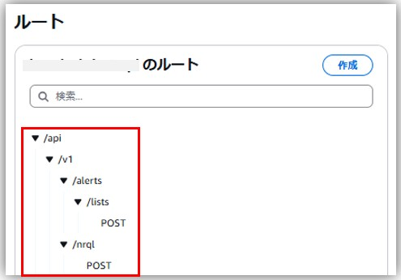

# aws-lambda-go-api-proxy
- GinなどのGoのフレームワークをLambda上で動かして、API Gateway＋Lambda構成で使えるようにするためのライブラリ
- https://github.com/awslabs/aws-lambda-go-api-proxy
  > aws-lambda-go-api-proxy makes it easy to run Go APIs written with frameworks such as Gin with AWS Lambda and Amazon API Gateway.

# 使い方（Gin）
## Lambda
- `Run`メソッドの代わりにaws-lambda-go-api-proxyの`NewV2`で生成されたインスタンスから、`ProxyWithContext`メソッドを使ってリクエストを処理
- `Handler`関数の`events.APIGatewayV2HTTPRequest`引数にAPI GatewayからのURLパスやHTTPメソッドなどの情報が入っている
- コード例  
  ```go
  package main

  import (
  	"context"
  	"log"

  	"github.com/aws/aws-lambda-go/events"
  	"github.com/aws/aws-lambda-go/lambda"
  	ginadapter "github.com/awslabs/aws-lambda-go-api-proxy/gin"
  	"github.com/gin-gonic/gin"
  )

  var ginLambda *ginadapter.GinLambdaV2

  func init() {
  	// stdout and stderr are sent to AWS CloudWatch Logs
  	log.Printf("Gin cold start")
  	r := gin.Default()
  	v1 := r.Group("/api/v1")
  	{
  		nrql := v1.Group("/nrql")
  		{
  			nrql.POST("", RunNRQL)
  		}

  		alerts := v1.Group("/alerts")
  		{
  			alerts.POST("/lists", AlertsList)
  		}

  	}
  	// r.Run(":8080")
  	ginLambda = ginadapter.NewV2(r)
  }

  // Lambda関数ハンドラー
  func Handler(ctx context.Context, req events.APIGatewayV2HTTPRequest) (events.APIGatewayV2HTTPResponse, error) {
  	log.Printf("Received request: Path=%s, Method=%s, Body=%s", req.RawPath, req.RequestContext.HTTP.Method, req.Body)

  	// If no name is provided in the HTTP request body, throw an error
  	// ginadapterを使用してリクエストを処理
  	return ginLambda.ProxyWithContext(ctx, req)
  }

  func main() {
  	// Lambda関数を起動
  	lambda.Start(Handler)
  }
  ```

### Dockerfile
```
FROM golang:1.23.6 as build

WORKDIR /app

COPY go.mod go.sum* ./
RUN go mod download

COPY *.go ./

## -tags lambda.norpcは、AWS Lambda向けにビルドする際に使用するビルドタグ
## Lambda環境で不要なRPC関連のコードが除外され、バイナリサイズが小さくなり、起動時間が速くなる
RUN GOOS=linux GOARCH=amd64 go build -tags lambda.norpc -o main

# 最終的なランタイムイメージを作成
FROM public.ecr.aws/lambda/provided:al2023

# バイナリをコピー
COPY --from=build /app/main /var/runtime/bootstrap

RUN chmod 755 /var/runtime/bootstrap

CMD [ "bootstrap" ]
```

## API Gateway
- Gin側のURLパスとHTTPメソッドに合わせて、API Gatewayのルートとメソッドを作成し、Ginを動かしているLambdaと統合するだけ
