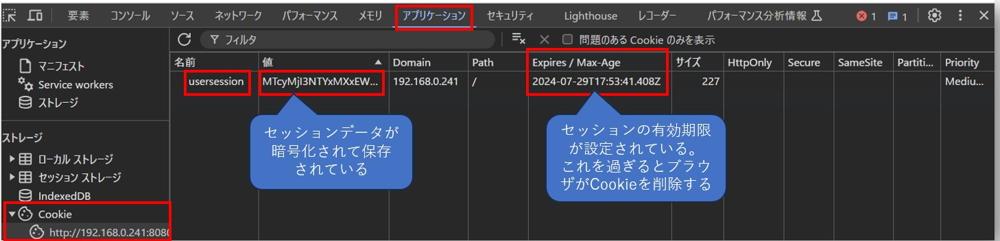

- Ginでは`github.com/gin-contrib/sessions`を使ってセッション管理ができる

## 利用の流れ
- `cookie.NewStore()` (Cookie方式の場合) もしくは`redis.NewStore()` (Redisでセッション管理する場合) で、暗号化キーを指定してセッションストアを設定
- `router.Use(sessions.Sessions("<Cookie名>", <セッションストア>))`でリクエストごとにセッション管理を行うようにミドルウェアを設定
- `session.Set("<セッションKey>", <セッションValue>)`でセッションを設定後、`session.Save()`で保存
- `sessions.Default(*gin.Context)`で全体のセッションデータを取得
- `session.Get("<セッション名>")`で特定のセッションデータを取得
- セッションをクリアする時は`session.Delete("<セッション名>")`で削除し、`session.Save()`で保存

## ブラウザのCookieにセッションデータを暗号化して管理する方法
- `github.com/gin-contrib/sessions/cookie`パッケージを使う
- この方式ではRedisなど外部のセッションストアを使わない
- コード例  
  - `usersession`という名前でブラウザのCookieにセッションデータが暗号化されて保存される。
    - (`session.Set()`で設定する)セッションデータが複数ある場合でも、すべて`usersession`のCookieに暗号化されて保存される
  - `sessions.Default(*gin.Context)`でセッションデータが複合化されて取得される
  - 暗号化する時に使われる暗号化キーが`cookie.NewStore([]byte("<暗号化キー>"))`で指定している文字列
    - なので暗号化キーの部分は直書き＋Git管理はNG。外部Secret管理ツールを使うか環境変数から取得する
  - セッションの有効期限は`redis.NewStore`後、`store.Options()`メソッドで設定できる
    - `MaxAge`がセッションの有効期限(秒)で、`Path`がcookieが有効なURLパス (`"/"`はすべてのURLパスで有効という意味)
    - Cookie方式の場合、`MaxAge`の値でCookieの`Expire/Max-Age`が設定され、それを過ぎるとCookieが削除される（ただ、Cookieなのでユーザが編集できる）

  ```go
  package routers

  import (
    "github.com/gin-contrib/sessions"
    "github.com/gin-contrib/sessions/cookie"
    "github.com/gin-gonic/gin"
  )

  func SetupRouter(router *gin.Engine) {

    store := cookie.NewStore([]byte(os.Getenv("COOKIE_SECRET_KEY")))
    store.Options(sessions.Options{
      MaxAge: 3600, // セッションの有効期限(秒)
      Path:   "/",  // クッキーが有効なパス("/"は全URLパス対象)
    })
    router.Use(sessions.Sessions("usersession", store))

    router.GET("/", func(c *gin.Context) {
      session := sessions.Default(c)
      username := session.Get("username")
      c.HTML(http.StatusOK, "index.tpl", gin.H{
        "IsLoggedIn": username != nil,
        "Username":   username,
      })
    })

    router.GET("/login", func(c *gin.Context) {
      c.HTML(http.StatusOK, "signinup.tpl", gin.H{
        "title": "Login",
      })
    })

    router.POST("/login", func(c *gin.Context) {
      session := sessions.Default(c)
      username := c.PostForm("username")
      plainPassword := c.PostForm("password")
      userExistCheckResult := services.UserExistCheck(username, db)
      hashedPassword := services.GetUserPassword(username, db)
      passwordUnmatchErr := controllers.ComparePassword(hashedPassword, plainPassword)
      if userExistCheckResult && passwordUnmatchErr == nil {
        session.Set("username", username)
        session.Set("password", plainPassword)
        session.Save()
        c.Redirect(http.StatusFound, "/")
      } else {
        c.HTML(http.StatusUnauthorized, "signinup.tpl", gin.H{
          "title":  "Login",
          "status": "loginfailed",
        })
      }
    })
    router.GET("/logout", func(c *gin.Context) {
      session := sessions.Default(c)
      session.Delete("username")
      session.Save()
      c.Redirect(http.StatusFound, "/")
    })
  }
  ```

## Redisなど外部セッションストアを使って管理する方法
- Redisの場合、`github.com/gin-contrib/sessions/redis`パッケージを使う
- コード例  
  - 外部セッションストアを使う場合は、Cookie(以下の例では`usersession`)のValueとしてセッションIDが保存され、そのセッションIDを持って外部セッションストアにセッションが存在するか確認する
  ```go

  ```