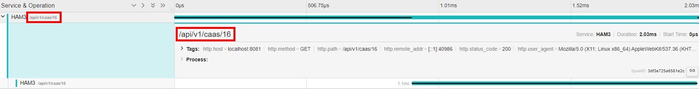
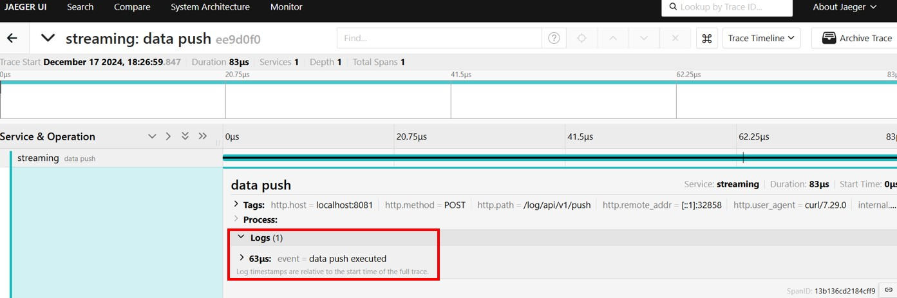

# 目次
<!-- TOC -->

- [目次](#目次)
- [Trace](#trace)
  - [設定の流れ](#設定の流れ)
  - [■ `NewTracerProvider`について](#-newtracerproviderについて)
  - [■ `SetTracerProvider`について](#-settracerproviderについて)
    - [`TracerProvider`の構成オプション](#tracerproviderの構成オプション)
    - [`TracerProvider`の主なメソッド](#tracerproviderの主なメソッド)
  - [■ `otel.Tracer`について](#-oteltracerについて)
    - [`Tracer`の具体的な役割](#tracerの具体的な役割)
    - [`otel.Tracer`の使用例](#oteltracerの使用例)
  - [■ `otel.SetTextMapPropagator`について](#-otelsettextmappropagatorについて)
    - [プロパゲータの種類](#プロパゲータの種類)
    - [`otel.SetTextMapPropagator`の使用方法](#otelsettextmappropagatorの使用方法)
  - [gRPCでのトレース連携](#grpcでのトレース連携)
    - [Server側](#server側)
    - [Client側](#client側)
- [Metric](#metric)
  - [設定の流れ](#設定の流れ-1)
    - [設定例](#設定例)
  - [exemplars](#exemplars)
- [Log](#log)

<!-- /TOC -->の種類](#プロパゲータの種類)
    - [`otel.SetTextMapPropagator`の使用方法](#otelsettextmappropagatorの使用方法)
  - [gRPCでのトレース連携](#grpcでのトレース連携)
    - [Server側](#server側)
    - [Client側](#client側)
- [Metric](#metric)
  - [設定の流れ](#設定の流れ-1)
    - [設定例](#設定例)
  - [exemplars](#exemplars)
- [Log](#log)

<!-- /TOC -->
# Trace
## 設定の流れ
1. `otlptracehttp.New`もしくは`otlptracegrpc.New`でexporter(トレースの送り先)を設定し、接続を確立する  
   - debug/開発環境でバックエンドにトレースを送らずに標準出力にトレース情報を出力する`"go.opentelemetry.io/otel/exporters/stdout/stdouttrace"`もある
2. `NewTracerProvider`で作成したexporterとSevice名などを渡してTraceProviderを設定する
3. `otel.SetTracerProvider`でアプリ全体でTracerProviderを使用するようにする
   - `Shutdown()`メソッド（`defer tp.Shutdown()`）でプログラム終了時に適切にリソースを解放する
4. `otel.SetTextMapPropagator`でコンテキストのフォーマットを設定
5. `otel.Tracer`でtracerを取得
6. `tracer.Start`でspanを開始
   - `tracer.Start`の第2引数がspanのタイトルとなる  
     
   - `tracer.Start`メソッドの２つ目の戻り値(`span`)のメソッドでSpanに属性(attribute)を追加(`span.SetAttributes()`メソッド)したり、`End()`でSpanを終了させる  
     - `span.SpanContext().TraceID().String()`と`span.SpanContext().SpanID().String()`でTraceIDとSpanIDを確認できる  
       ```go
		fmt.Println("trace-id:", span.SpanContext().TraceID().String())
		fmt.Println("span-id:", span.SpanContext().SpanID().String())
       ```
     - `span.AddEvent()`メソッドで以下のようなLog(GrafanaではEventとして出る)を追加することができる  
       ```go
       ctx, span := tr.Start(context.Background(), "data streaming started")
       span.AddEvent("data push executed")
       ```
       
     - `span`のメソッド  
       ```go
       type Span interface {
       	// Users of the interface can ignore this. This embedded type is only used
       	// by implementations of this interface. See the "API Implementations"
       	// section of the package documentation for more information.
       	embedded.Span

       	// End completes the Span. The Span is considered complete and ready to be
       	// delivered through the rest of the telemetry pipeline after this method
       	// is called. Therefore, updates to the Span are not allowed after this
       	// method has been called.
       	End(options ...SpanEndOption)

       	// AddEvent adds an event with the provided name and options.
       	AddEvent(name string, options ...EventOption)

       	// AddLink adds a link.
       	// Adding links at span creation using WithLinks is preferred to calling AddLink
       	// later, for contexts that are available during span creation, because head
       	// sampling decisions can only consider information present during span creation.
       	AddLink(link Link)

       	// IsRecording returns the recording state of the Span. It will return
       	// true if the Span is active and events can be recorded.
       	IsRecording() bool

       	// RecordError will record err as an exception span event for this span. An
       	// additional call to SetStatus is required if the Status of the Span should
       	// be set to Error, as this method does not change the Span status. If this
       	// span is not being recorded or err is nil then this method does nothing.
       	RecordError(err error, options ...EventOption)

       	// SpanContext returns the SpanContext of the Span. The returned SpanContext
       	// is usable even after the End method has been called for the Span.
       	SpanContext() SpanContext

       	// SetStatus sets the status of the Span in the form of a code and a
       	// description, provided the status hasn't already been set to a higher
       	// value before (OK > Error > Unset). The description is only included in a
       	// status when the code is for an error.
       	SetStatus(code codes.Code, description string)

       	// SetName sets the Span name.
       	SetName(name string)

       	// SetAttributes sets kv as attributes of the Span. If a key from kv
       	// already exists for an attribute of the Span it will be overwritten with
       	// the value contained in kv.
       	SetAttributes(kv ...attribute.KeyValue)

       	// TracerProvider returns a TracerProvider that can be used to generate
       	// additional Spans on the same telemetry pipeline as the current Span.
       	TracerProvider() TracerProvider
       }
       ```
7. `span.SetAttributes`でspanにattribute(付加情報)を追加（*Optional*）  
   ```go
   import (
      "go.opentelemetry.io/otel"
      "go.opentelemetry.io/otel/exporters/otlp/otlptrace/otlptracehttp"
      "go.opentelemetry.io/otel/propagation"
      "go.opentelemetry.io/otel/sdk/resource"
      "go.opentelemetry.io/otel/sdk/trace"
      "go.opentelemetry.io/otel/attribute"
      semconv "go.opentelemetry.io/otel/semconv/v1.4.0"   
   )

   func main() {
      // OTLPエクスポーターの設定 (Start establishes a connection to the receiving endpoint.)
      // 第１引数がcontextで第２引数がoptions(2つ目のパラメータからスライスとなる)
      exporter, err := otlptracehttp.New(context.Background(),
         otlptracehttp.WithEndpoint("<traceを受け付けるツール(e.g. jaeger, otel collector)のアドレス>:<traceを受け付けるポート(e.g. 4318)>"),
         otlptracehttp.WithInsecure(), // TLSを無効にする場合に指定
      )

      //// Tracerの設定
      // NewTracerProvider returns a new and configured TracerProvider.
      //
      // By default the returned TracerProvider is configured with:
      //   - a ParentBased(AlwaysSample) Sampler
      //   - a random number IDGenerator
      //   - the resource.Default() Resource
      //   - the default SpanLimits.
      //
      // The passed opts are used to override these default values and configure the
      // returned TracerProvider appropriately.
      tp := trace.NewTracerProvider(
         trace.WithBatcher(exporter),
         trace.WithResource(resource.NewWithAttributes(
            semconv.SchemaURL,                     // SchemaURL is the schema URL used to generate the trace ID. Must be set to an absolute URL.
            semconv.ServiceNameKey.String("HAM3"), // ServiceNameKey is the key used to identify the service name in a Resource.
         )),
      )
      // プログラム終了時に適切にリソースを解放
      defer tp.Shutdown(context.Background())

      // SetTracerProvider registers `tp` as the global trace provider.
      otel.SetTracerProvider(tp)
      otel.SetTextMapPropagator(propagation.TraceContext{})

      // ####################################################################################
   //    // Tracer is the creator of Spans.
   //    //
   //    // Warning: Methods may be added to this interface in minor releases. See
   //    // package documentation on API implementation for information on how to set
   //    // default behavior for unimplemented methods.
   //    type Tracer interface {
   //    	// Users of the interface can ignore this. This embedded type is only used
   //    	// by implementations of this interface. See the "API Implementations"
   //    	// section of the package documentation for more information.
   //    	embedded.Tracer

   //    	// Start creates a span and a context.Context containing the newly-created span.
   //    	//
   //    	// If the context.Context provided in `ctx` contains a Span then the newly-created
   //    	// Span will be a child of that span, otherwise it will be a root span. This behavior
   //    	// can be overridden by providing `WithNewRoot()` as a SpanOption, causing the
   //    	// newly-created Span to be a root span even if `ctx` contains a Span.
   //    	//
   //    	// When creating a Span it is recommended to provide all known span attributes using
   //    	// the `WithAttributes()` SpanOption as samplers will only have access to the
   //    	// attributes provided when a Span is created.
   //    	//
   //    	// Any Span that is created MUST also be ended. This is the responsibility of the user.
   //    	// Implementations of this API may leak memory or other resources if Spans are not ended.
   //    	Start(ctx context.Context, spanName string, opts ...SpanStartOption) (context.Context, Span)
   //    }
      // ####################################################################################
      tr := otel.Tracer("ham3")                      // spanのotel.library.name semantic conventionsに入る値
      ctx, span := tr.Start(ctx, "somethins started") // (新しい)spanの開始
      defer span.End()                               // spanの終了

      // Add attributes to the span
      span.SetAttributes(
         attribute.String("http.method", c.Request.Method),
         attribute.String("http.path", c.Request.URL.Path),
         attribute.String("http.host", c.Request.Host),
         attribute.Int("http.status_code", statusCode),
         attribute.String("http.user_agent", c.Request.UserAgent()),
         attribute.String("http.remote_addr", c.Request.RemoteAddr),
      )
   }
   ```

## ■ `NewTracerProvider`について
- OpenTelemetry Go SDKの`trace.NewTracerProvider`は、traceを生成および管理するための `TracerProvider` を作成する(返す)
- `NewTracerProvider`の引数の`trace.WithResource`で指定するResourceは`resource.New()`メソッドと`resource.NewWithAttributes()`メソッド２つの設定方法がある
  - `resource.New()`メソッド  
    ※**`resource.New()`はエラーを返すためエラーハンドリングが必要**
    ```go
    import (
      "go.opentelemetry.io/otel/sdk/resource"
    )

    func main() {
      resource, err := resource.New(context.Background(),
         resource.WithSchemaURL(semconv.SchemaURL),
         resource.WithAttributes(
            semconv.ServiceNameKey.String("streaming"),
            semconv.ServiceVersionKey.String("1.0.0"),
         ),
      )
      if err != nil {
         fmt.Errorf("failed to create resource: %w", err)
      }

      tp := trace.NewTracerProvider(
         trace.WithBatcher(exporter,
         trace.WithBatchTimeout(1*time.Second),
         trace.WithMaxExportBatchSize(128),
      ),
         trace.WithSampler(trace.AlwaysSample()), // すべてのトレースをサンプリング
         trace.WithResource(resource),
      )
    }
    ```
  - `resource.NewWithAttributes()`メソッド  
    ※**`resource.NewWithAttributes()`はエラーを返さない**  
    ```go
    import (
      "go.opentelemetry.io/otel/sdk/resource"
    )

    func main() {
	   resource := resource.NewWithAttributes(
         semconv.SchemaURL,                          // SchemaURL is the schema URL used to generate the trace ID. Must be set to an absolute URL.
         semconv.ServiceNameKey.String("streaming"), // ServiceNameKey is the key used to identify the service name in a Resource.
         semconv.ServiceVersionKey.String("1.0.0"),
      )

      tp := trace.NewTracerProvider(
         trace.WithBatcher(exporter,
      	   trace.WithBatchTimeout(1*time.Second),
      	   trace.WithMaxExportBatchSize(128),
         ),
         trace.WithSampler(trace.AlwaysSample()), // すべてのトレースをサンプリング
         trace.WithResource(resource),
      )
    }
    ```

## ■ `SetTracerProvider`について
- **`SetTracerProvider`はグローバルな`TracerProvider`を設定するための関数であり、この設定によって`otel.Tracer`を通じて取得される`Tracer`が自動的にその`TracerProvider`に紐づく**
  - `otel.SetTracerProvider(tp)`が呼ばれると[global.SetTracerProvider(tp)](https://github.com/open-telemetry/opentelemetry-go/blob/main/trace.go)が実行され、`global.SetTracerProvider(tp)`メソッド内の`globalTracer.Store(tracerProviderHolder{tp: tp})`でグローバル変数`globalTracer`に`TracerProvider`が保持される。  
    その後、`otel.Tracer()`の内部で`GetTracerProvider()`が呼ばれ、さらに`GetTracerProvider()`から`global.TracerProvider()`が呼ばれ、`global.TracerProvider()`内の`globalTracer.Load().(tracerProviderHolder).tp`で上で格納した`TracerProvider`が返される。
    返されたグローバルな`TracerProvider`から`Tracer`メソッドでTracerを取得し、`Start()`メソッドでSpanを開始する流れ
- **`otel.SetTracerProvider`で生成される`TracerProvider`は同一プロセス内で動作するGoコード全体、つまりアプリケーション全体で共有される**
  - ここでいう「アプリケーション全体」とは、基本的に以下を意味する
    - **1. 同じGoランタイム上で実行されている**
    - **2. 同じバイナリとしてコンパイルされ、同一のmain関数（およびその呼び出し範囲）内で実行されているコード全てを指す**

### `TracerProvider`の構成オプション
- **`trace.WithBatcher`**
  - トレースをバッチでエクスポートするexporterを指定
  - バッチExporterは効率的にトレースデータを収集し、一定の間隔でまとめて送信する

- **`trace.WithSimpleSpanProcessor`**
  - シンプルなスパンプロセッサを使用
  - 各スパンを直ちにエクスポートする

- **`trace.WithResource`**
  - トレースデータに付加情報（例: サービス名、バージョンなど）を追加するためのリソースを指定

### `TracerProvider`の主なメソッド
- **`Tracer(name string, opts ...trace.TracerOption) trace.Tracer`**:
  - 指定された名前とオプションで`Tracer`を取得する。`Tracer`は、Spanの作成やTraceの開始に使用される。

- **`Shutdown(ctx context.Context) error`**:
  - `TracerProvider`をシャットダウンし、すべてのスパンをエクスポートする。アプリケーション終了時に呼び出して、未送信のトレースデータを確実にエクスポートするために使用する。

## ■ `otel.Tracer`について
- `otel.Tracer`は、指定された名前とオプションのバージョンを持つ`Tracer`を返す。この`Tracer`は、Spanを開始し、それらのSpanを終了するためのメソッドを提供する。`Tracer`は、`TracerProvider`によって管理されるインスタンスであり、トレースの開始点となる。

### `Tracer`の具体的な役割
1. **Spanの作成**:
   - `Tracer`は、アプリケーション内でSpanを作成するためのメソッドを提供する。Spanは、`Tracer`の一部を構成する個々の操作やイベントを表す。

2. **Context管理**:
   - `Tracer`は、SpanのContextを管理し、Span間の関係性を追跡する。これにより、分散システム内でのリクエストフローを理解するのが容易になる。

3. **メタデータの付加**:
   - `Tracer`は、Spanに属性、イベント、およびステータスなどのメタデータを追加するためのメソッドを提供する。

### `otel.Tracer`の使用例
```go
import (
    "context"
    "go.opentelemetry.io/otel"
    "go.opentelemetry.io/otel/exporters/trace/jaeger"
    "go.opentelemetry.io/otel/sdk/resource"
    "go.opentelemetry.io/otel/sdk/trace"
    semconv "go.opentelemetry.io/otel/semconv/v1.7.0"
)

func main() {
    // Jaegerエクスポータを作成
    exp, err := jaeger.New(jaeger.WithCollectorEndpoint("http://localhost:14268/api/traces"))
    if err != nil {
        panic(err)
    }

    // リソースを定義
    res := resource.NewWithAttributes(
        semconv.SchemaURL,
        semconv.ServiceNameKey.String("example-service"),
        semconv.ServiceVersionKey.String("v0.1.0"),
    )

    // トレーサープロバイダーを作成
    tp := trace.NewTracerProvider(
        trace.WithBatcher(exp),   // バッチプロセッサを使用
        trace.WithResource(res),  // リソースを設定
    )

    // グローバルなトレーサープロバイダーを設定
    otel.SetTracerProvider(tp)

    // トレーサーを取得
    tracer := otel.Tracer("example.com/trace")

    // トレースの開始
    ctx := context.Background()
    ctx, span := tracer.Start(ctx, "operation")
    defer span.End()

    // スパン内で行う操作
    doWork(ctx)

    // トレーサーを使用した別のスパンの開始
    ctx, span2 := tracer.Start(ctx, "another operation")
    defer span2.End()

    // 別のスパン内で行う操作
    doMoreWork(ctx)
}

func doWork(ctx context.Context) {
    // ここでトレースする操作を実行
}

func doMoreWork(ctx context.Context) {
    // ここでトレースする別の操作を実行
}
```

## ■ `otel.SetTextMapPropagator`について
- `otel.SetTextMapPropagator`は、グローバルなテキストマッププロパゲータを設定するために使用される。
- プロパゲータは、トレースコンテキスト（スパンコンテキストやバゲージなど）をHTTPヘッダやメッセージのプロパティとしてエンコードおよびデコードする役割を担う。伝播されるコンテキストのフォーマットを決定し、アプリケーション全体でそのフォーマットを使用するように設定するためのもの。

### プロパゲータの種類
1. **W3C Trace Context (`tracecontext`)**:
   - W3Cによって標準化されたトレースコンテキストのフォーマット
   
2. **Baggage (`baggage`)**:
   - 複数のサービス間でカスタムのキーと値のペアを伝播させるために使用される

3. **Composite Propagator**:
   - 複数のプロパゲータを組み合わせて使用することができる

### `otel.SetTextMapPropagator`の使用方法
```go
import (
    "go.opentelemetry.io/otel"
    "go.opentelemetry.io/otel/propagation"
    "go.opentelemetry.io/otel/trace"
    "go.opentelemetry.io/otel/exporters/trace/jaeger"
    "go.opentelemetry.io/otel/sdk/resource"
    "go.opentelemetry.io/otel/sdk/trace"
    semconv "go.opentelemetry.io/otel/semconv/v1.7.0"
)

func main() {
    // Jaegerエクスポータを作成
    exp, err := jaeger.New(jaeger.WithCollectorEndpoint("http://localhost:14268/api/traces"))
    if err != nil {
        panic(err)
    }

    // リソースを定義
    res := resource.NewWithAttributes(
        semconv.SchemaURL,
        semconv.ServiceNameKey.String("example-service"),
        semconv.ServiceVersionKey.String("v0.1.0"),
    )

    // トレーサープロバイダーを作成
    tp := trace.NewTracerProvider(
        trace.WithBatcher(exp),   // バッチプロセッサを使用
        trace.WithResource(res),  // リソースを設定
    )

    // グローバルなトレーサープロバイダーを設定
    otel.SetTracerProvider(tp)

    // W3C Trace ContextとBaggageのプロパゲータを設定
    propagator := propagation.NewCompositeTextMapPropagator(
        propagation.TraceContext{},  // W3C Trace Context
        propagation.Baggage{},       // Baggage
    )

    // グローバルなプロパゲータを設定
    otel.SetTextMapPropagator(propagator)

    // トレーサーを取得
    tracer := otel.Tracer("example.com/trace")

    // トレースの開始
    ctx, span := tracer.Start(ctx, "operation")
    defer span.End()

    // ここにトレースしたいコードを追加
}
```

## gRPCでのトレース連携
- **コンテキストを伝播するためには、Server側では`grpc.NewServer()`で、Client側では`grpc.Dial()`で、両方でInterceptorを設定する必要がある**
- **Client側でメソッドを呼び出す時に`tr.Start()`で生成された`context`を引数で渡して、Server側で`tr.Start()`メソッドの引数にその`context`を指定することでトレースが繋がる**
### Server側
- `grpc.NewServer()`の引数として`grpc.UnaryInterceptor(otelgrpc.UnaryServerInterceptor())`と`grpc.StreamInterceptor(otelgrpc.StreamServerInterceptor())`を指定
- 例  
  ```go
  package main

  import (
  	"context"
  	"fmt"
  	"log"
  	"net"
  	"protobuf/pb"
  	"time"

  	"go.opentelemetry.io/contrib/instrumentation/google.golang.org/grpc/otelgrpc"
  	"go.opentelemetry.io/otel"
  	"go.opentelemetry.io/otel/exporters/otlp/otlptrace/otlptracegrpc"
  	"go.opentelemetry.io/otel/propagation"
  	"go.opentelemetry.io/otel/sdk/resource"
  	"go.opentelemetry.io/otel/sdk/trace"
  	semconv "go.opentelemetry.io/otel/semconv/v1.4.0"
  	"google.golang.org/grpc"
  )

  type server struct {
  	pb.UnimplementedStreamServiceServer
  }

  func (*server) Upload(ctx context.Context, req *pb.StreamRequest) (*pb.StreamResponse, error) {
  	// ここではグローバルなTracerProviderを用いてSpanを開始
  	tr := otel.Tracer("uploader")
  	_, span := tr.Start(ctx, "uploader started")
  	defer span.End()

  	span.AddEvent("upload executed")
  	fmt.Println("trace-id:", span.SpanContext().TraceID().String())
  	fmt.Println("span-id:", span.SpanContext().SpanID().String())

  	fmt.Printf("Received request: %v\n", req)

  	dataSize := len([]byte(req.GetData()))
  	return &pb.StreamResponse{Size: int32(dataSize)}, nil
  }

  func main() {
  	ctxInit := context.Background()
  	exporter, err := otlptracegrpc.New(ctxInit,
  		otlptracegrpc.WithEndpoint("10.111.1.179:4317"),
  		otlptracegrpc.WithInsecure(),
  	)
  	if err != nil {
  		log.Fatalln("Failed to set exporter for otlp/grpc:", err)
  	}

  	resource := resource.NewWithAttributes(
  		semconv.SchemaURL,
  		semconv.ServiceNameKey.String("uploader"),
  		semconv.ServiceVersionKey.String("1.0.1"),
  	)

  	tp := trace.NewTracerProvider(
  		trace.WithBatcher(exporter,
  			trace.WithBatchTimeout(1*time.Second),
  			trace.WithMaxExportBatchSize(128),
  		),
  		trace.WithSampler(trace.AlwaysSample()),
  		trace.WithResource(resource),
  	)
  	defer tp.Shutdown(ctxInit)

  	otel.SetTracerProvider(tp)
  	otel.SetTextMapPropagator(propagation.TraceContext{})

  	lis, err := net.Listen("tcp", "localhost:50051")
  	if err != nil {
  		log.Fatalf("Failed to listen: %v", err)
  	}

  	s := grpc.NewServer(
  		grpc.UnaryInterceptor(otelgrpc.UnaryServerInterceptor()),
  		grpc.StreamInterceptor(otelgrpc.StreamServerInterceptor()),
  	)
  	pb.RegisterStreamServiceServer(s, &server{})

  	fmt.Println("server is running...")
  	if err := s.Serve(lis); err != nil {
  		log.Fatalf("Failed to serve: %v", err)
  	}
  }
  ```

### Client側
- `grpc.Dial()`の引数として`grpc.WithUnaryInterceptor(otelgrpc.UnaryClientInterceptor())`と`grpc.WithStreamInterceptor(otelgrpc.StreamClientInterceptor())`を指定
- 例  
  ```go
  package main

  import (
  	"context"
  	"fmt"
  	"log"
  	"protobuf/pb"
  	"time"

  	"github.com/gin-gonic/gin"
  	"go.opentelemetry.io/contrib/instrumentation/google.golang.org/grpc/otelgrpc"
  	"go.opentelemetry.io/otel"
  	"go.opentelemetry.io/otel/attribute"
  	"go.opentelemetry.io/otel/exporters/otlp/otlpmetric/otlpmetricgrpc"
  	"go.opentelemetry.io/otel/exporters/otlp/otlptrace/otlptracegrpc"
  	"go.opentelemetry.io/otel/metric"
  	"go.opentelemetry.io/otel/propagation"
  	sdkmetric "go.opentelemetry.io/otel/sdk/metric"
  	"go.opentelemetry.io/otel/sdk/resource"
  	"go.opentelemetry.io/otel/sdk/trace"
  	semconv "go.opentelemetry.io/otel/semconv/v1.4.0"
  	"google.golang.org/grpc"
  )

  func callUpload(ctx context.Context, client pb.StreamServiceClient, tenant string, data string) {
  	req := &pb.StreamRequest{
  		Tenant: tenant,
  		Data:   data,
  	}
  	res, err := client.Upload(ctx, req)
  	if err != nil {
  		log.Fatalf("request to gRPC server failed: %v", err)
  	}

  	fmt.Println("data size:", res.GetSize())
  }

  func main() {
  	r := gin.Default()
  	streaming := r.Group("log/api/v1")
  	streaming.Use(TenantidCheck())

  	// gRPC
  	conn, err := grpc.Dial("localhost:50051",
  		grpc.WithInsecure(),
  		grpc.WithUnaryInterceptor(otelgrpc.UnaryClientInterceptor()),
  		grpc.WithStreamInterceptor(otelgrpc.StreamClientInterceptor()),
  	)
  	if err != nil {
  		log.Fatalf("Failed to connect: %v", err)
  	}
  	defer conn.Close()

  	client := pb.NewStreamServiceClient(conn)

  	// #### Trace関連設定
  	/// otlp/gRPC
  	exporter, err := otlptracegrpc.New(context.Background(),
  		otlptracegrpc.WithEndpoint("10.111.1.179:4317"),
  		otlptracegrpc.WithInsecure(), // TLSを無効にする場合に指定
  	)
  	if err != nil {
  		log.Fatalln("Failed to set exporter for otlp/grpc")
  	}

  	resource := resource.NewWithAttributes(
  		semconv.SchemaURL,                         // SchemaURL is the schema URL used to generate the trace ID. Must be set to an absolute URL.
  		semconv.ServiceNameKey.String("receiver"), // ServiceNameKey is the key used to identify the service name in a Resource.
  		semconv.ServiceVersionKey.String("1.0.1"),
  	)

  	tp := trace.NewTracerProvider(
  		trace.WithBatcher(exporter,
  			trace.WithBatchTimeout(1*time.Second),
  			trace.WithMaxExportBatchSize(128),
  		),
  		trace.WithSampler(trace.AlwaysSample()), // すべてのトレースをサンプリング
  		trace.WithResource(resource),
  	)
  	// プログラム終了時に適切にリソースを解放
  	defer tp.Shutdown(context.Background())

  	// SetTracerProvider registers `tp` as the global trace provider.
  	otel.SetTracerProvider(tp)
  	otel.SetTextMapPropagator(propagation.TraceContext{})

  	tr := otel.Tracer("streaming")

  	streaming.POST("/push", func(c *gin.Context) {
  		ctx, span := tr.Start(context.Background(), "data streaming started")
  		defer span.End()

  		// Add attributes to the span
  		span.SetAttributes(
  			attribute.String("http.method", c.Request.Method),
  			attribute.String("http.path", c.Request.URL.Path),
  			attribute.String("http.host", c.Request.Host),
  			attribute.String("http.user_agent", c.Request.UserAgent()),
  			attribute.String("http.remote_addr", c.Request.RemoteAddr),
  		)
  		span.AddEvent("data push executed")

  		// あとで実際のデータ連携処理を実装
  		fmt.Println("Data Push!")
  		callUpload(ctx, client, c.GetHeader("Tenant-id"), "test data")

  		fmt.Println("trace-id:", span.SpanContext().TraceID().String())
  		fmt.Println("span-id:", span.SpanContext().SpanID().String())
  	})

  	r.Run(":8081")
  }
  ```

# Metric
- 参考URL
  - https://opentelemetry.io/docs/languages/go/instrumentation/#metrics  
      > you’ll need to have an initialized `MeterProvider` that lets you create a `Meter`. Meters let you create instruments that you can use to create different kinds of metrics.
  - https://mackerel.io/ja/blog/entry/2023/12/21/192203
## 設定の流れ
- 基本的にTraceの時と同じ
1. `otlpmetrichttp.New`もしくは`otlpmetricgrpc.New`でexporter(メトリクスの送り先)を設定し、接続を確立する  
   - Otel Collectorの`otlp`レシーバーのエンドポイントに連携
   - debug/開発環境でバックエンドにメトリクスを送らずに標準出力にメトリクス情報を出力する`"go.opentelemetry.io/otel/exporters/stdout/stdoutmetric"`もある
2. `NewMeterProvider`で作成したexporterとSevice名などのリソースを渡して`MeterProvider`を設定する
   - NewMeterProvider設定時に`sdkmetric.WithReader()`の`sdkmetric.NewPeriodicReader()`の中で`sdkmetric.WithInterval()`でOtel Collectorにメトリクスを送信する間隔(defaultは1m)を設定できる
3. `otel.SetMeterProvider`でアプリ全体でMeterProviderを使用するようにする
   - `Shutdown()`メソッド（`defer mp.Shutdown()`）でプログラム終了時に適切にリソースを解放する
4. `otel.Meter`でMeterを取得
5. 取得したMeterからメトリクスを初期化
   - メトリクスのDataタイプごとにメソッドが異なる
6. 初期化したメトリクスのメソッドでメトリクスを生成
   - メトリクス生成時`metric.WithAttributes()`の中で`attribute.String`や`attribute.Int`などでメトリクスにラベルを追加することができる
### 設定例
```go
import (
   "context"
   "fmt"
   "log"
   "time"

   "github.com/gin-gonic/gin"
   "go.opentelemetry.io/otel"
   "go.opentelemetry.io/otel/attribute"
   "go.opentelemetry.io/otel/exporters/otlp/otlpmetric/otlpmetricgrpc"
   "go.opentelemetry.io/otel/metric"
   sdkmetric "go.opentelemetry.io/otel/sdk/metric"
   "go.opentelemetry.io/otel/sdk/resource"
)

func main() {
   r := gin.Default()

   ctxmetric := context.Background()
   promExporter, err := otlpmetricgrpc.New(ctxmetric,
      otlpmetricgrpc.WithInsecure(),
      otlpmetricgrpc.WithEndpoint("localhost:4317"),
   )

   meterProvider := sdkmetric.NewMeterProvider(
      sdkmetric.WithResource(resource),
      sdkmetric.WithReader(sdkmetric.NewPeriodicReader(promExporter,
         // Default is 1m
         sdkmetric.WithInterval(3*time.Second))),
   )
   defer func() {
      if err := meterProvider.Shutdown(context.Background()); err != nil {
         log.Printf("Failed to shutdown meter provider: %v", err)
      }
   }()

   otel.SetMeterProvider(meterProvider)
   meter := otel.Meter("streaming")
   // ヒストグラムの作成
   histogram, err := meter.Float64Histogram(
      "request_duration_seconds",
      metric.WithDescription("Request duration in seconds"),
      metric.WithUnit("s"),
   )
   if err != nil {
      log.Fatal(err)
   }


   r.POST("/push", func(c *gin.Context) {
      // 処理時間の計測
      startTime := time.Now()

      fmt.Println("Test Push!")
      duration := time.Since(startTime).Seconds()

      // トレースIDとスパンIDを属性として追加
      histogram.Record(ctxmetric, duration,
         metric.WithAttributes(
            attribute.String("service", "streaming"),
         )
      )
   })

   r.Run(":8081")
}
```
- **Counter**の例  
   ```go
   meter := otel.Meter("streaming")
   counter := meter.Int64Counter("counter")

   counter.Add(context.Background(), 1, metric.WithAttributes(
      attribute.String("attr1", "value1"),
      attribute.Int("attr2", 200),
   ))
   ```
## exemplars
- **実装できるか確認**
- https://pkg.go.dev/go.opentelemetry.io/otel/sdk/metric/exemplar

# Log
- 参照URL
  - https://opentelemetry.io/docs/languages/go/instrumentation/#logs