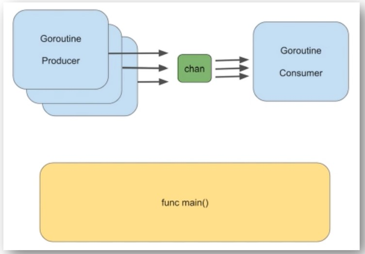

- 1つのChannelを利用し、Producerが値をChannelに入れてConsumerがChannelから値を取り出して利用する構成

- ProducerだけではChannelに1つ目の値が入った後にChannelがブロッキングされ、Consumerがいないので処理が進まない (2つ目の値がChannelに入らない)
  - Producerがすべての値をChannelに入れてからConsumerが取り出すのでははく、以下のような流れ  
    *Producerが1つ目の値を入れる → Consumerが1つ目の値を取り出す → Producerが2つ目の値を入れる → Consumerが2つ目の値を取り出す → ・・・*
- Goroutineの中で`for range <Channel>`でChannelから値を取り出す場合、Channelからすべての値を取り出した後もChannelに値が入るのは待つため、`close(<Channel>)`で明示的にChannelを閉じる必要がある
  - Goroutineの中ではないところ(ex. func main()内)で`for range <Channel>`でとる場合は、Channelの中の値をすべて取り出した後さらに取り出そうとするとエラーになる
- `sync.WaitGroup`と組み合わせて実装する場合、Consumer側でConsumer処理がうまくいかなかった場合でも`wg.Done()`をするようにInner関数を使って`defer wg.Done()`にする
  - 以下のSample Code(1)の`func consumer`のところを参照
  - `defer`は関数内で最後に必ず実行されるものなのでInner関数じゃないとできない
  - [promtail](https://github.com/grafana/loki/blob/80ea621ff3c7be677502d404c1bb89d1435b20ed/clients/pkg/promtail/client/multi.go)のソースコードからも確認できる
- Sample Code(1)
  ~~~go
  package main

  import (
      "fmt"
      "sync"
      "time"
  )

  func producer(ch chan int, i int) {
      // Something
      ch <- i * 2
  }

  func consumer(ch chan int, wg *sync.WaitGroup) {
      for i := range ch {
          func() {
              defer wg.Done()
              fmt.Println("process", i*1000)
          }()
      }
      fmt.Println("###################")
  }

  func main() {
      var wg sync.WaitGroup
      ch := make(chan int)

      // Producer
      for i := 0; i < 10; i++ {
          wg.Add(1)
          go producer(ch, i)
      }

      // Consumer
      go consumer(ch, &wg)
      wg.Wait()
      close(ch) →→→→→→→→→→→→→→→→→→→→→ これがないとconsumerはChannelに値が入ってくるのを待ち、consumer内の`fmt.Println("###################")`が実行されず"Done"が出力されてプログラムが終了する
      time.Sleep(2 * time.Second)
      fmt.Println("Done")
  }
  ~~~

- Sample Code(2)
  ~~~go
  package main

  import (
      "fmt"
      "math/rand"
      "time"

      "github.com/fatih/color"
  )

  const NumberOfPizzas = 10

  var pizzasMade, pizzasFailed, total int

  // Producer is a type for structs that holds two channels: one for pizzas, with all
  // information for a given pizza order including whether it was made
  // successfully, and another to handle end of processing (when we quit the channel)
  type Producer struct {
      data chan PizzaOrder
      quit chan chan error
  }

  // PizzaOrder is a type for structs that describes a given pizza order. It has the order
  // number, a message indicating what happened to the order, and a boolean
  // indicating if the order was successfully completed.
  type PizzaOrder struct {
      pizzaNumber int
      message     string
      success     bool
  }

  // Close is simply a method of closing the channel when we are done with it (i.e.
  // something is pushed to the quit channel)
  func (p *Producer) Close() error {
      ch := make(chan error)
      p.quit <- ch
      return <-ch
  }

  // makePizza attempts to make a pizza. We generate a random number from 1-12,
  // and put in two cases where we can't make the pizza in time. Otherwise,
  // we make the pizza without issue. To make things interesting, each pizza
  // will take a different length of time to produce (some pizzas are harder than others).
  func makePizza(pizzaNumber int) *PizzaOrder {
      pizzaNumber++
      if pizzaNumber <= NumberOfPizzas {
          delay := rand.Intn(5) + 1
          fmt.Printf("Received order #%d!\n", pizzaNumber)

          rnd := rand.Intn(12) + 1
          msg := ""
          success := false

          if rnd < 5 {
              pizzasFailed++
          } else {
              pizzasMade++
          }
          total++

          fmt.Printf("Making pizza #%d. It will take %d seconds....\n", pizzaNumber, delay)
          // delay for a bit
          time.Sleep(time.Duration(delay) * time.Second)

          if rnd <=2 {
              msg = fmt.Sprintf("*** We ran out of ingredients for pizza #%d!", pizzaNumber)
          } else if rnd <= 4 {
              msg = fmt.Sprintf("*** The cook quit while making pizza #%d!", pizzaNumber)
          } else {
              success = true
              msg = fmt.Sprintf("Pizza order #%d is ready!", pizzaNumber)
          }

          p := PizzaOrder{
              pizzaNumber: pizzaNumber,
              message: msg,
              success: success,
          }

          return &p

      }

      return &PizzaOrder{
          pizzaNumber: pizzaNumber,
      }
  }

  // pizzeria is a goroutine that runs in the background and
  // calls makePizza to try to make one order each time it iterates through
  // the for loop. It executes until it receives something on the quit
  // channel. The quit channel does not receive anything until the consumer
  // sends it (when the number of orders is greater than or equal to the
  // constant NumberOfPizzas).
  func pizzeria(pizzaMaker *Producer) {
      // keep track of which pizza we are making
      var i = 0

      // this loop will continue to execute, trying to make pizzas,
      // until the quit channel receives something.
      for {
          currentPizza := makePizza(i)
          if currentPizza != nil {
              i = currentPizza.pizzaNumber
              select {
              // we tried to make a pizza (we send something to the data channel -- a chan PizzaOrder)
              case pizzaMaker.data <- *currentPizza:

              // we want to quit, so send pizzMaker.quit to the quitChan (a chan error)
              case quitChan := <-pizzaMaker.quit:
                  // close channels
                  close(pizzaMaker.data)
                  close(quitChan)
                  return →→→→→→→→→→→→→→→→→ Channelのすべての値を取り出してquitが入ったら`close`でChannelを閉じてから`return`でGoroutineを終了させる
              }
          }
      }
  }

  func main() {
      // seed the random number generator
      rand.Seed(time.Now().UnixNano())

      // print out a message
      color.Cyan("The Pizzeria is open for business!")
      color.Cyan("----------------------------------")

      // create a producer
      pizzaJob := &Producer{
          data: make(chan PizzaOrder),
          quit: make(chan chan error),
      }

      // run the producer in the background
      go pizzeria(pizzaJob)

      // create and run consumer
      for i := range pizzaJob.data {
          if i.pizzaNumber <= NumberOfPizzas {
              if i.success {
                  color.Green(i.message)
                  color.Green("Order #%d is out for delivery!", i.pizzaNumber)
              } else {
                  color.Red(i.message)
                  color.Red("The customer is really mad!")
              }
          } else {
              color.Cyan("Done making pizzas...")
              err := pizzaJob.Close()
              if err != nil {
                  color.Red("*** Error closing channel!", err)
              }
          }
      }
  }
  ~~~